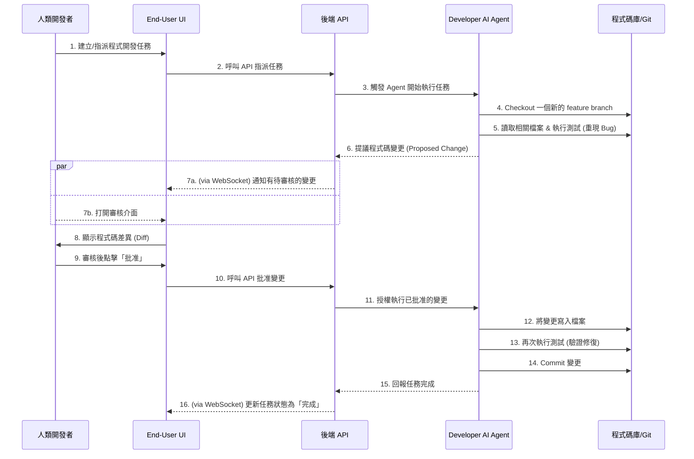

# Phase 4.0: AI 即開發者隊友 (AI as a Developer Teammate) PRP

## 1. 核心理念與動機 (Vision & Motivation)

**核心理念**: 將 AI Agent 從「任務執行者」提升為「**程式碼貢獻者**」。本計畫旨在打造一個「AI 開發者隊友」，使其能夠像人類開發者一樣，在一個有監督、有規範的環境中，安全地修復 Bug、開發功能、並提交程式碼。

**動機**: 目前 AI 已能理解程式碼，但其產出仍需手動複製、貼上、測試和提交。本計畫旨在打通「最後一哩路」，將 AI 的程式碼生成能力與專案的版控及 CI/CD 流程深度整合，實現更高層次的自動化，讓 AI 成為真正的團隊成員。

---

## 2. Phase 4 系列全景圖 (The Big Picture)

Phase 4 代表了 Archon 系統從「基礎建設」邁向「商業應用」的關鍵轉型期。整個 Phase 4 分為三個子階段，各自承擔不同的戰略任務：

| 階段 | 名稱 | 核心目標 (Bob 的白話文說明) | 狀態 |
| :--- | :--- | :--- | :--- |
| **Phase 4.1** | **AI Developer 基礎建設** | **「讓 AI 成為工程師」**：建立「提案 -> 審核 -> 執行」流程。AI 寫程式碼要經過人點頭批准，系統才會執行 Git Commit 或修改檔案。 | **已完成** |
| **Phase 4.2** | **商業情資擴展 (Sales Intel)** | **「讓 AI 成為業務助理」**：串接 104 職缺爬蟲，自動收集潛在客戶資料 (Leads)，並產出市場分析報告。 | **已完成** |
| **Phase 4.3** | **行銷網站架構重構** | **「品牌門面現代化」**：將遺留在 `public/ai` 的舊 HTML 轉化為 React 元件，建立正式的解決方案專區，並修復登入後的導航迷路問題。 | **規劃中** |

---

## 3. 核心工作流程 (Core Workflow)

本計畫的核心是一個**有人類監督 (Human-in-the-Loop)** 的自動化工作流程：

---

## 3. 架構升級與新元件 (Architecture Upgrades & New Components)

### 3.1. Agent 工具集擴充 (Agent Toolset Expansion)

AI Agent 將被授予一組全新的、高權限的工具。這些工具的執行**必須**與「人類監督」流程掛鉤。

*   **`VersionControlTools`**:
    *   `git_create_branch(branch_name: str)`: 建立並切換到新分支。
    *   `git_commit(message: str)`: 提交暫存的變更。
    *   `git_create_pull_request(title: str, body: str)`: (可選) 建立 PR。

*   **`FileOperationTools`**:
    *   `read_file(file_path: str)`: 讀取檔案內容。
    *   `write_file(file_path: str, content: str)`: 覆寫整個檔案。
    *   `replace_in_file(file_path: str, old_string: str, new_string: str)`: 在檔案中進行字串替換。

*   **`ExecutionTools`**:
    *   `run_shell_command(command: str)`: 用於執行測試指令 (`make test-be`) 或 Lint (`make lint`)。其權限需要被嚴格限制，只能執行 `Makefile` 中預定義好的安全指令。

### 3.2. 前端審核介面 (Frontend Approval Interface)

*   **目標**: 在 `enduser-ui-fe` 中建立一個新元件，用於審核 AI 提出的程式碼修改。
*   **功能**:
    *   清晰地展示 AI 提議的變更（類似 GitHub 的 Diff 預覽）。
    *   提供「批准 (Approve)」和「拒絕 (Reject)」按鈕。
    *   批准後，前端將向後端發送一個請求，授權 Agent 執行對應的檔案寫入或 Git 操作。

---

## 4. 安全性設計 (Security by Design)

**此計畫的成敗取決於安全機制的嚴謹程度。**

1.  **人類監督為最高原則 (Human-in-the-Loop is Mandatory)**:
    *   所有高權限工具（檔案寫入、Git 提交、Shell 執行）的執行都**不允許**被 AI Agent 直接觸發。
    *   Agent 只能**提議** (propose) 一個操作，該操作會被序列化並儲存，等待人類批准。只有在收到來自前端、經過身份驗證的批准訊號後，後端才能執行該操作。

2.  **嚴格的角色權限控制 (Strict RBAC)**:
    *   只有特定角色的使用者（例如 `SYSTEM_ADMIN` 或 `Lead Engineer`）才有權限將「程式碼開發」類型的任務指派給 Developer AI。
    *   也只有特定角色的使用者才有權限「批准」AI 提出的程式碼變更。

3.  **隔離的執行環境 (Isolated Execution Environment)**:
    *   所有 Developer AI 的操作都必須在一個受限的、短暫的 Docker 容器中執行。
    *   該容器的網路存取和檔案系統權限應被嚴格限制，僅能存取專案目錄。

4.  **強制的分支策略 (Enforced Branching Strategy)**:
    *   AI Agent **絕不能**被允許直接向 `main` 或 `dev` 等受保護的分支進行寫入或提交。
    *   所有工作都必須在以 `ai/` 或 `feat/` 為前綴的獨立分支中進行。

## 5. 概念驗證 (PoC) 計畫

*   **目標**: 實現一個最簡化的端對端流程。
*   **步驟**:
    1.  **後端**: 實作一個 `replace_in_file` 工具，但其執行邏輯中包含「等待批准」的狀態。
    2.  **前端**: 開發一個極簡的審核頁面，能顯示 `old_string` 和 `new_string`，並提供一個「批准」按鈕。
    3.  **流程**:
        *   人類手動在資料庫中建立一個「待審核變更」的記錄。
        *   前端讀取此記錄並顯示。
        *   點擊「批准」後，前端呼叫 API。
        *   後端 API 執行實際的檔案替換。
    *   **範圍**: PoC 階段**不**涉及 Git 操作和 Shell 執行，僅驗證「提議 -> 審核 -> 執行」的核心安全迴圈。

---

## 6. 其他未來功能提案 (Other Future Feature Proposals)

### 提案 1: 整合 104 人力銀行 API 的行銷練習場景

### 1. 核心理念

讓行銷人員可以在 `enduser-ui-fe` 中，透過一個簡單介面，輸入產業關鍵字（例如 "SaaS"、"電商"），從 104 人力銀行獲取真實、即時的職缺描述與公司資訊，作為練習撰寫行銷文案、規劃市場進入策略的素材。

### 2. 價值主張

*   **真實性**: 使用真實世界的資料進行練習，遠比使用虛構的假資料更有效。
*   **效率**: 將資料獲取流程產品化，免去行銷人員手動搜尋、複製、貼上的繁瑣工作。
*   **安全性與合規性**: 透過使用 104 官方提供的 API，而非爬蟲，來確保資料來源的合法與穩定。

### 3. 技術實施計畫

1.  **獲取 API 金鑰 (手動)**: 開發者需前往「104 開發者中心」註冊應用，獲取 API 金鑰，並將其儲存在安全的環境變數中。

2.  **後端 `JobBoardService`**:
    *   在 Python 後端建立一個新服務 `job_board_service.py`。
    *   該服務提供一個函式 `search_104_jobs(keyword: str)`，負責使用 `httpx` 呼叫 104 的職缺搜尋 API。
    *   函式會處理 API 的驗證、請求與回應，並將回傳的 JSON 資料解析為結構化的職缺列表。

3.  **後端 API 端點**:
    *   建立一個新的 API 路由 `POST /api/marketing/fetch-jobs`。
    *   此路由接收前端傳來的關鍵字，呼叫 `JobBoardService`，並將結果回傳。

4.  **前端介面**:
    *   在 `enduser-ui-fe` 中建立一個新的行銷練習頁面。
    *   頁面包含一個輸入框和一個「搜尋」按鈕。
    *   點擊按鈕後，呼叫後端 API，並將返回的職缺列表顯示在畫面上。

---

### 提案 2: 人事統計儀表板 (HR Statistics Dashboard)

### 1. 核心理念

在 `enduser-ui-fe` 中建立一個新的「統計儀表板」頁面，將任務和人員數據視覺化，為管理者提供一個宏觀的視角來了解團隊的工作負載、任務進度與成員表現。

### 2. 價值主張

*   **數據驅動決策**: 將抽象的任務列表轉化為直觀的圖表，幫助管理者快速識別瓶頸與趨勢。
*   **提升透明度**: 讓團隊的工作分佈和狀態一目了然。
*   **績效概覽**: 提供一個量化的基礎來評估個人與團隊的表現。

### 3. 技術實施計畫

1.  **前端圖表庫**:
    *   **現狀**: 專案已安裝 `d3` 並用於繪製甘特圖，證明有客製化圖表能力。
    *   **建議**: 為了快速開發，建議引入 `recharts`。它是一個基於 React 的宣告式圖表庫，能用更少的程式碼快速建立標準的長條圖、圓餅圖。

2.  **後端統計 API 設計**:
    *   **`GET /api/stats/tasks-by-employee`**: 回傳每個員工的任務總數。
    *   **`GET /api/stats/tasks-by-status`**: 回傳所有任務的狀態分佈（待辦、進行中、已完成等）。
    *   **`GET /api/stats/employee-performance`**: 回傳每個員工的詳細表現，包含任務總數、已完成數、已逾期數。
    *   **依據**: 這些 API 的設計，完全基於 `migration` 檔案中已定義的 `archon_tasks` 和 `profiles` 資料表結構，確保了計畫的可行性。

3.  **前端頁面實作 (`HRStatsPage.tsx`)**:
    *   **路由**: 在 `enduser-ui-fe` 中新增 `/stats` 路由。
    *   **資料獲取**: 頁面載入時，平行呼叫上述三個 API，並在等待時顯示 Loading 狀態。
    *   **視覺化元件**:
---

## 7. 階段性執行與驗證紀錄 (Execution & Validation Log)

### Phase 4.0.i: 知識庫整合 (Completed: 2026-01-03)

**1. 實作重點**:
- **後端安全強化**: 在 `knowledge_api.py` 中實作 `X-User-Role` 選填 Header，達成「向後相容 Admin UI、向前鎖定一般用戶」的漸進式加鎖。
- **前端 API 統一化**: 重構 `enduser-ui-fe` 的 API Client，自動注入身份 Header。
- **UI 閉環**: 實作 `KnowledgeSelector` 並整合至任務建立視窗。
- **Admin UI 安全補強**: 已在 `archon-ui-main` 的 API Client 中注入 `X-User-Role: Admin` Header，關閉權限漏洞。

**2. 核心驗證目標 (Closed-Loop Verification)**:
- **測試目標**: 驗證「Admin 上傳 -> User 選擇 -> 任務建立 -> 資料入庫」的完整閉環。
- **執行方式**: 自動化 E2E 測試。新增 `knowledge-selector.spec.tsx`，成功驗證了知識庫項目選擇與任務建立的整合邏輯。
- **驗證結果**:
    - `enduser-ui-fe` E2E 測試: **通過** (5/5 tests passed)。
    - `archon-ui-main` 單元測試: **通過** (128/128 tests passed)，且測試輸出日誌已完成靜音優化。
    - 後端測試: **通過** (473/473 tests passed)。

**3. 已知問題 (Known Issues)**:
- **分頁優化**: 知識庫選擇器目前每頁抓取數量已提升至 1000 筆，但仍需實作正式的前端分頁/無限捲動機制。
- **E2E 環境設定警告**: E2E 測試啟動時回報 `Could not connect to backend to reset database`。雖不影響 MSW 模式下的測試結果，但重置機制仍待 Phase 4.1 優化。

**4. 修正計畫 (Fix Plan) - 執行狀態**:
- **目標**: 達成全綠燈 (All Green)。
- **狀態**: **已完成**。已修復 `archon-ui-main` 的測試干擾日誌，並實作了 Admin UI 的 Role Header。

---

## 8. 下一步計畫 (Next Steps)

1. **Phase 4.1 (Ongoing)**: **AI 開發者隊友深化**。專案已完成基礎審核流程，下一步將優化 AI 在執行 Git 與 Test 工具時的準確度。
2. **Phase 4.2 (Planned)**: **業務功能擴充**。包含 HR 統計儀表板 (Dashboard) 與 104 人力銀行整合 (Job Board API)。

