## Goal (目標)

**Feature Goal (功能目標)**: To transform the "technical prototype" into a "business-ready solution" by filling the gaps in Sales Workflow, Management Tools, and AI Collaboration Architecture. (將「技術原型」轉化為「商業就緒解決方案」，透過填補銷售流程、管理工具與 AI 協作架構的缺口。)

**Deliverable (交付成果)**:
1.  **Project ECITON (遊蟻計畫)**: A complete rebranding execution plan involving dynamic SVG generation by **DevBot**, full UI replacement (3737 & 5173), and a handover workflow to Marketing. (一個完整的品牌重塑執行計畫，包含由 Agent 動態生成 SVG、雙端 UI 替換，以及移交給行銷部門的工作流。)
2.  **Sales Nexus (銷售連結)**: A seamless workflow connecting 104 Leads to existing Vendors and Projects, backed by **MarketBot** email generation and **Librarian** auto-archiving. (一個連接 104 線索、既有廠商與專案的無縫工作流，由 MarketBot 信件生成與 Librarian 自動歸檔支援。)
3.  **Real RBAC Management (真實權限管理)**: Empowering Managers (Charlie) to manage teams, AI budgets, and Marketers (Bob) to manage brand assets. (賦予經理管理團隊與 AI 預算的權限，以及行銷人員管理品牌資產的權限。)
4.  **AI Factory Architecture (AI 工廠架構)**: A structured integration of Jules and AutoGen via specialized adapters, plus **POBot** for task refinement. (Jules 與 AutoGen 的結構化整合，並加入 POBot 進行任務優化。)

**Success Definition (成功定義)**:
- **Charlie** can use **POBot** to refine a one-line task into a full spec, and assign it to **DevBot** for execution.
- **Alice** can click "Generate Intro Email" (**MarketBot**), and the result is automatically indexed by **Librarian**.
- **Bob** can log in and see a "Branding" settings page to tweak the logo later.
- **Verification**: All integration tests pass using **Vitest + MSW**.

## All Needed Context (所有需要的上下文)

### Documentation & References (文件與參考資料)

```yaml
- file: PRPs/Phase_4.2_Business_Feature_Expansion_Plan.md
  why: Reference for the initial Sales Intel design.
- file: python/src/server/auth/permissions.py
  why: Source of truth for current role permissions.
- file: enduser-ui-fe/src/components/layout/MainLayout.tsx
  why: Target for 5173 logo refactoring.
- file: migration/000_unified_schema.sql
  why: Confirmed existence of 'vendors' table (Lines 627-633).
- file: PRPs/ai_docs/RBAC_Collaboration_Matrix.md
  why: DEFINITIVE SOURCE for Role-Machine collaboration logic.
```

### AI Architecture Analysis: Current vs. New (AI 架構差異分析)

| Feature | Current Archon Agents (Phase 4.0) | New AI Factory (Phase 4.4 - Jules/AutoGen) | Difference (差異點) |
| :--- | :--- | :--- | :--- |
| **Role (角色)** | **Executor (執行者)** | **Specialist (專家)** | 現有 Agent 像是通才，Jules/AutoGen 是專才。 |
| **Framework (框架)** | PydanticAI (Single Agent) | Google Vertex AI / MS AutoGen (Multi-Agent) | 從單一代理人轉向多代理人協作系統。 |
| **Trigger (觸發)** | User Manual Click (使用者點擊) | Event-Driven (CI/Webhook/API) | Jules 由程式碼提交觸發；AutoGen 由複雜規劃請求觸發。 |
| **Integration** | MCP Tools (Internal) | **Adapter & CLI Wrapper** | Jules 透過 CLI 工具整合；AutoGen 需要 Docker 沙盒執行。 |

---

## 2. Q&A and Proposed Solutions (詳細 Q&A 與解決方案)

> 此章節記錄了針對用戶回饋的深度分析與解決方案，確保所有決策皆有跡可循。

### Q1: 管理與權限 (Management & RBAC)
**Question**: 只有開單沒有結案日，如何評估效率？Charlie 也要管理 User Management 吧？
**Solution**:
1.  **Time Tracking**: 在 `tasks` 表中新增 `estimated_hours` 與 `actual_hours`，並在 Dashboard 實作燃盡圖。
2.  **Team Management Panel**: 打造專屬的 `TeamManagementPage`，開放給 `manager` 角色使用。允許管理同一部門 (`department`) 的員工帳號，但隔離 System Admin 的敏感設定。

### Q2: 銷售與爬蟲 (Sales & Crawler)
**Question**: Alice 如何收集資料？資料庫缺欄位，如何跟進？104 爬蟲重複資料怎麼辦？
**Solution**:
1.  **Schema Expansion**: 擴充 `leads` 表，新增 `contact_name`, `contact_email`, `contact_phone`, `next_followup_date`。
2.  **Crawler Uniqueness**: 在 `leads.source_job_url` 建立 UNIQUE 索引。
3.  **Human-in-the-loop**: 定義流程：MarketBot 廣撒網 -> 系統存入 `leads` -> Alice 人工補全聯絡人資料 -> 系統排程跟進。

### Q3: 測試與品質 (Testing & Quality)
**Question**: Phase 4.3 還在 debug，測試不完全。
**Solution**:
1.  **Stop & Fix**: 暫停新功能開發，優先修復 E2E 測試。
2.  **Automated Scenarios**: 將「建立任務 -> 指派給 Alice -> Alice 完成任務」的完整路徑寫入 `tests/e2e`，確保核心業務邏輯不再回歸。

### Q4: 任務指派 (Task Assignment)
**Question**: Task 可以指定的 Agent 只有兩個？可以指定的人員名單呢？
**Solution**:
1.  **UI Fix**: 修正 `TaskModal.tsx`，使其呼叫正確的 API 端點 (`/api/assignable-users` + `/api/agents/assignable`) 並合併顯示。
2.  **UX Improvement**: 在下拉選單中加入圖示區分 🤖 (Bot) 與 👤 (Human)。
3.  **Assignee Logic**: 採用單一分組選單，但內容根據角色動態過濾 (Manager 看團隊 + Agents，Member 看自己 + 相關 Agent)。

### Q5: 內容更新 (Content Updates)
**Question**: Blog 內容改了種子檔，但網頁還是舊的？
**Solution**:
1.  **UPSERT Logic**: 修改 `seed_blog_posts.sql`，將 `ON CONFLICT DO NOTHING` 改為 `ON CONFLICT (id) DO UPDATE SET ...`。這確保了每次 `make db-init` 後，資料庫內容絕對與檔案同步。

### Q6: AI 協作 (AI Collaboration)
**Question**: 如何利用 Jules (100 credits) + AutoGen？
**Solution**:
1.  **Jules (The Janitor)**: 負責高頻低腦力的 Lint fix 與 Unit Test 補全。透過 CLI Wrapper 整合。
2.  **AutoGen (The Architect)**: 負責複雜 Schema 設計與 refactoring。透過 Docker-in-Docker 執行。
3.  **Metrics**: 建立「AI 貢獻儀表板」追蹤 Jules 的產出量與通過率。

---

## Implementation Blueprint (實作藍圖)

### Phase 4.4.1: Project ECITON - The Living Brand (遊蟻計畫 - 活體品牌)
*Focus: End-to-End rebranding with DevBot integration and RBAC handover.*

**Core Concept**: Logo is a data-driven SVG asset generated by **DevBot**.

**Sequence Diagram (時序圖)**:

```mermaid
sequenceDiagram
    participant Charlie as Manager (Charlie)
    participant UI_5173 as EndUser UI (5173)
    participant UI_3737 as Admin UI (3737)
    participant Backend as Archon Server
    participant DevBot as DevBot (Agent)

    Note over Charlie, DevBot: Step 1: 任務啟動 (Task Injection)
    Charlie->>UI_5173: 查看 "Rebrand: Project Eciton" 任務卡
    Charlie->>Backend: 點擊 "Trigger DevBot" (Assign & Run)

    Note over Backend, DevBot: Step 2: 動態生成 (Agent Execution)
    Backend->>DevBot: 請求生成 "Geometric Ant Node-Link Style"
    DevBot->>DevBot: 運算 SVG 路徑 (Nodes + Links)
    DevBot-->>Backend: 回傳 SVG Code (Payload)

    Note over Backend, UI_3737: Step 3: 資產部署 (Deployment)
    Backend->>Backend: 寫入 public/logo-eciton.svg (Shared Asset)
    Backend-->>UI_5173: 通知 "Asset Ready"
    
    Note over UI_5173, UI_3737: Step 4: 全面替換 (Refactor & Replace)
    UI_5173->>UI_5173: <BrandLogo /> 元件熱重載 (顯示新 Logo)
    UI_3737->>UI_3737: <Navigation /> 元件更新 (顯示新 Logo)
```



**Task Card Example (卡片說明範例)**:
*   **Title**: `[REBRAND] Implement Project Eciton Identity`
*   **Description**: 
    > **Visual Specs**:
    > *   **Style**: Geometric Node-Link Diagram (Visualizing "Collective Intelligence").
    > *   **Palette**: Gradient from Cyan (`#00f2ff`) to Purple (`#a855f7`).
    > *   **Animation**: Pulse effect on nodes (SVG `<animate>` tag).
    >
    > **Technical Constraints**:
    > *   **Format**: SVG (Vector).
    > *   **File Name**: `logo-eciton.svg`.
    > *   **Storage**: `public/` directory (accessible by both UIs).
    >
    > **Action**:
    > *   Call **DevBot** (via `logo_tool`) to generate asset based on specs.
*   **Assignee**: **DevBot** (Agent)
*   **Status**: `TODO`

**Refined Blueprint (實作細節)**:

1.  **Backend (Agent API)**:
    *   **檔案**: `python/src/mcp_server/features/design/logo_tool.py` (New)
    *   **Agent**: Registered to **DevBot**.
    *   **邏輯**: Returns animate-capable SVG string based on geometric math.

2.  **Frontend (Shared Component)**:
    *   **檔案**: `enduser-ui-fe/src/components/BrandLogo.tsx`
    *   **檔案**: `archon-ui-main/src/features/shared/components/BrandLogo.tsx`
    *   **邏輯**: Loads SVG from `/api/assets/logo` or local public folder.

3.  **Database (Task Injection)**:
    *   **SQL**:
        ```sql
        INSERT INTO archon_tasks (title, description, assignee, status, project_id) 
        VALUES ('[REBRAND] Implement Project Eciton Identity', 'Visual Specs: ...', 'DevBot', 'todo', 'proj-123');
        ```

4.  **Admin UI (3737) Update**:
    *   **檔案**: `archon-ui-main/src/components/layout/Navigation.tsx`
    *   **行動**: 替換 `` 為 `<BrandLogo />`。

5.  **Quality Assurance (Integration Test)**:
    *   **檔案**: `enduser-ui-fe/tests/e2e/brand-identity.spec.tsx`
    *   **工具**: **Vitest + MSW**.
    *   **測試場景**:
        1.  **Visual Check**: 確認 Header 存在 `<BrandLogo />`。
        2.  **Asset Load**: 攔截 `/logo-eciton.svg` 回傳 200 OK。
        3.  **Agent Flow**: 模擬點擊 -> 等待任務完成 -> 驗證資產更新。

### Phase 4.4.2: Sales Nexus - Closing the Loop (銷售連結 - 閉環修復)
*Focus: Enhancing existing tables and empowering Alice with MarketBot & Librarian.*

**Workflow & Agent Role**:
1.  **MarketBot (Scout)**: Automatically crawls 104 data and populates `leads`.
2.  **MarketBot (Enricher)**: Analyzes company profile and generates draft emails.
3.  **Librarian (Archiver)**: **New Feature** - Automatically indexes generated emails and successful pitches into the Knowledge Base.
4.  **Alice (Sales)**: Claims Leads, reviews generated emails, and promotes to Vendors.
5.  **System (Follow-up)**: Uses `next_followup_date` to alert Alice (Dashboard Notification).

**Refined Blueprint (實作細節)**:

1.  **Database (Unified Enhancement)**:
    *   **檔案**: `migration/008_system_correction_phase44.sql` (New)
    *   **行動**: 
        *   `ALTER TABLE vendors` ADD `pain_points`, `owner_id`, `status`, `contact_info`.
        *   `ALTER TABLE archon_tasks` ADD `estimated_hours`, `actual_hours`.
        *   `ALTER TABLE leads` ADD `linked_project_id`.
        *   `CREATE UNIQUE INDEX idx_leads_source_url ON leads(source_job_url)`.

2.  **Backend Integration**:
    *   **Service**: Enhance `JobBoardService` to include `generate_sales_email(lead_id)` using **MarketBot**.
    *   **Service**: Hook `Librarian.archive()` into `generate_sales_email` success callback.

3.  **Frontend Integration**:
    *   **UI**: `MarketingPage.tsx` gets a "Promotion & Enrichment" toolbar for each card.
    *   **Indicator**: Add "Knowledge Indexed" badge when Librarian completes archiving.

### Phase 4.4.3: The Hive - Management (蜂巢 - 管理)
*Focus: Addressing Q1 (Admin Panel) & Q4 (Assignment) with POBot support.*

**Management Context Logic**:
*   **Single Grouped Assignee Menu**: Filtered by role (e.g., Alice sees only `MarketBot` and `Self`).
*   **Team Management Panel**: Charlie manages `Sales`/`Marketing` team passwords/roles and monitors AI cost.

**Refined Blueprint (實作細節)**:

1.  **Backend RBAC Fixes**:
    *   **檔案**: `python/src/server/auth/permissions.py` (Add `USER_MANAGE_TEAM`, `BRAND_ASSET_MANAGE`).
    *   **檔案**: `python/src/server/services/rbac_service.py` (Implement context-based assignee filtering).

2.  **Team Management Panel**:
    *   **元件**: `TeamManagementPage.tsx` (Charlie only).
    *   **新增**: AI Cost Dashboard (Token tracking per user).

3.  **POBot Integration (The Spec Writer)**:
    *   **UI**: Add "✨ Refine with AI" button in `TaskModal.tsx`.
    *   **Backend**: Add endpoint `/api/tasks/refine-description` using **POBot**.
    *   **Logic**: Convert short input to structured User Stories.

## Validation Loop (驗證迴圈)

### Level 1: Schema & RBAC Update
- [ ] **SQL**: `make db-init`.
- [ ] **Matrix**: Verify `BRAND_ASSET_MANAGE` works for Bob in integration tests.

### Level 2: Integration Tests (Vitest + MSW)
- [ ] **Run**: `npx vitest run enduser-ui-fe/tests/e2e/brand-identity.spec.tsx`
- [ ] **Run**: `npx vitest run enduser-ui-fe/tests/e2e/sales-workflow.spec.tsx`

### Level 3: Business Scenarios (Manual)
- [ ] **Alice (Sales)**: 可以生成開發信，並看到 Librarian 自動歸檔的標記。
- [ ] **Charlie (Manager)**: 可以使用 POBot 優化任務描述，並指派給 DevBot。
- [ ] **Bob (Marketing)**: 看到 Blog 更新且能管理品牌資產。

---

## Appendix A: AI Factory & Cost Governance
*Detailed architecture moved here to focus on business value.*

**Governance**: Charlie allocates token budgets to Alice/Bob.
**Jules (CLI Wrapper)**: Automated maintenance and bug fixing.
**AutoGen (DIND Sandbox)**: Multi-agent architectural planning.
