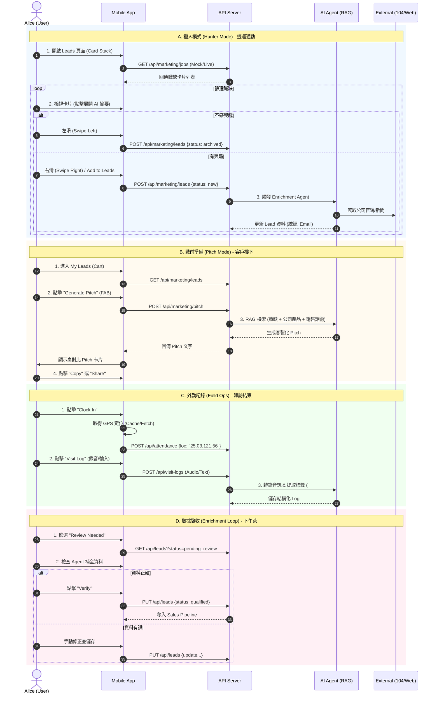

# Phase 4.6.1: Alice (Sales Rep) Persona Workflows & Validation

> **文件狀態**: 應用場景完整化 (已實作核心代碼與 UX 改善，待細節討論)
> **目標角色**: Alice (王牌業務員)
> **情境核心**: 行動優先 (Mobile-First)、單手操作、業務戰鬥力。

---

## 1. 角色檔案 (Persona Profile)
*   **使用者**: Alice
*   **主要裝置**: 手機 (iOS/Android)
*   **使用場景**: 捷運通勤、客戶樓下、拜訪結束後、咖啡廳空檔。

---

## 2. 完整應用場景 (Application Scenarios)

### A. 早晨通勤：捷運上的「獵人模式」 (Hunter Mode)
*   **情境**: 捷運人潮擁擠，Alice 只能用一隻手握住扶手，另一隻手操作手機。
*   **流程**:
    1.  **滑動篩選 (Card Stack)**: 打開 App 進入 "Leads" 頁面。系統展示像 Tinder 一樣的卡片疊。
    2.  **快速決策**: 
        *   **左滑 (Archive)**: 沒興趣或不匹配的職缺。
        *   **右滑 (Add to Cart)**: 有潛力的案子，加入「業務購物車」。
    3.  **職缺洞察**: 點擊職缺卡片，直接在下方展開 AI 摘要（例如：「急徵 AI 工程師，可能正在轉型」），取代傳統的跳轉外部連結。
    4.  **一鍵轉換**: 按下 "Add to Leads"，系統自動啟動背景 Agent 開始補全該公司詳細資料。

### B. 抵達客戶樓下：戰前準備 (Pitch Mode)
*   **情境**: 站在客戶大樓門口，陽光刺眼，Alice 需要在 1 分鐘內理出等等開會的切入點。
*   **流程**:
    1.  **進入購物車**: 查看 "My Selected Leads"。
    2.  **秒生話術 (One-Tap Pitch)**: 點擊目標客戶卡片的 FAB (懸浮按鈕)，選擇 "Generate Pitch"。
    3.  **高對比顯示**: 畫面跳出全螢幕、大字體、高對比的話術文字（針對戶外陽光優化）。
    4.  **快速分享**: 按下 "Copy" 或 "Share to Line"，將針對該公司職缺客製化的開發信發給窗口。

### C. 拜訪結束：光速紀錄 (Field Ops)
*   **情境**: 剛走出客戶辦公室，趁著印象深刻且還沒上捷運前完成紀錄。
*   **流程**:
    1.  **GPS 打卡**: 打開 Dashboard，點擊 "Clock In" 紀錄拜訪位置。
    2.  **語音日誌 (Voice Log)**: 按下 "Visit Log" 的麥克風圖示。
    3.  **口述紀錄**: 「剛跟陳經理聊完，預算可能卡在 Q4，但他對 RAG 整合很有興趣，下週二要補報價單。」
    4.  **AI 處理**: 系統透過 Gemini 自動轉成文字並標記重點標籤 (`#BudgetIssue`, `#FollowUp`)，存入資料庫。

### D. 下午茶時間：數據驗收 (Enrichment Loop)
*   **情境**: 在咖啡廳休息，檢查今天系統自動幫她處理了哪些雜事。
*   **流程**:
    1.  **審核補全資料**: 查看狀態為 `Review Needed` 的 Leads。
    2.  **驗收成果**: AI Agent 已自動從 104 與官網抓取了統編、聯絡信箱、與近期新聞。
    3.  **一鍵轉入流水線**: Alice 點擊 "Verify"，該 Lead 正式進入 Sales Pipeline。

---

## 3. 待討論功能與潛在問題 (Issues for Discussion)

雖然代碼已就緒且 UX 已改善，但以下點仍需進一步對齊：

1.  **語音日誌精準度**: 在吵雜的街邊（如車聲、風聲），Gemini Audio 對專有名詞（如 API 名稱）的識別率是否達標？
2.  **自動歸檔邏輯 (Auto-Prune)**: 目前設定 3 天無法補全即歸檔是否太嚴苛？ Alice 是否需要「救回」功能？
3.  **GPS 隱私與耗電**: 高頻率的 GPS 紀錄是否會導致手機發熱或電力消耗過快？是否改為僅在 Clock-in 時抓取一次？
4.  **手勢誤觸**: 在擁擠的捷運上，滑動 (Swipe) 是否容易產生誤觸？是否需要增加「撤銷上一滑」的功能？
5.  **歸檔測試參數 (Pruning Threshold)**: 開發與測試階段，如何將 Leads 的「3天保留期」暫時改為「10分鐘」以便快速驗證自動剔除邏輯？驗證時如何確認資料是「剔除」還是「保留到客戶名單」？

---

## 4. 驗證腳本 (Test Scripts)
*   **後端**: `python/tests/integration/features/test_phase46_mobile_ops.py`
*   **後端**: `python/tests/integration/services/test_enrichment_service.py`
*   **前端 E2E**: `enduser-ui-fe/tests/e2e/sales-intelligence.spec.tsx`

---

## 5. 議題分析與發現 (Issue Analysis & Findings - 2025-01-31)

### 1. Gemini LLM 支援度 (Gemini LLM Support)
*   **議題**: 使用者回報 `gemini-1.5-flash` 不被支援，導致 `Refine with AI` 功能失敗。
*   **發現**:
    *   `provider_discovery_service.py` 明確列出了 `gemini-1.5-flash` 為支援模型。
    *   `projects_api.py` 實作了 `/tasks/refine-description`，並呼叫 `TaskService.refine_task_description`。
    *   **根本原因**: 極可能是 `TaskService` 內有嚴格的模型驗證邏輯，或是前端送出了錯誤的模型字串。需要深入排查 `TaskService`。

### 2. 自動歸檔邏輯 (Auto-Archiving Logic)
*   **議題**: 需要明確定義歸檔邏輯，並能將 3 天期限暫時改為 10 分鐘以利測試。
*   **發現**:
    *   邏輯位於 `enrichment_service.py` -> `prune_stale_leads`。
    *   `timedelta(days=3)` 數值目前是寫死的 (Hardcoded)。
    *   **行動**: 重構代碼，引入 `settings.PRUNING_THRESHOLD_MINUTES` (環境變數)，允許在測試時覆蓋此設定。

### 3. 打卡邏輯 (Clock-in Logic)
*   **議題**: 使用者希望是「單次」抓取，而非持續追蹤。
*   **發現**:
    *   `ClockInWidget.tsx` 在元件掛載 (Mount) 時使用 `useEffect` 呼叫 `getCurrentPosition`。
    *   目前**沒有**持續追蹤 (未呼叫 `watchPosition`)，但每次元件渲染 (頁面刷新/導航) 都會重新抓取。
    *   **行動**: 將位置快取於 `localStorage` 或 Context 中以供本次會話使用，或者改為僅在物理點擊 "Clock In" 按鈕時才抓取。

### 4. 撤銷最後一次滑動 (Undo Last Swipe)
*   **議題**: 缺少撤銷誤觸滑動的功能。
*   **發現**:
    *   `LeadsCardStack.tsx` 目前沒有實作撤銷堆疊 (Undo stack)。
    *   **行動**: 在元件中實作簡單的 `history` 狀態，允許與使用者回復上一次的索引變更。

### 5. 行動版話術功能 (Mobile Pitch Feature)
*   **議題**: 分隔線的可點擊性不明確。
*   **發現**:
    *   `LeadsCardStack.tsx` 中的 `PitchDrawer` 使用了標準 UI，但可能缺乏視覺提示。
    *   **行動**: 改進 UI 樣式 (增加把手條 Handle bar 或更清晰的分隔線)。

### 6. 卡片內容權重 (行動版) & 桌面儀表板 (Card Content Weight & Desktop Dashboard)
*   **議題**: 行動版內容權重不正確；桌面版儀表板的任務卡片過於簡陋。
*   **發現**:
    *   桌面版 `DashboardPage.tsx` 使用 `ListView`，目前僅顯示 標題/狀態/日期。
    *   **行動**: 強化 `ListView`，加入描述摘要、優先級徽章 (Badge)、以及指派者詳情，使其資訊量接近行動版或看板視圖。

### 7. 找工作 (桌面版) (Find Job - Desktop)
*   **議題**: 資訊細節比行動版少，「行動呼籲」(Pitch) 的可見度有問題。
*   **發現**:
    *   搜尋功能由 `MarketingPage.tsx` 實作。
    *   "Pitch" 按鈕 (`SparklesIcon`) 存在，但在卡片內可能視覺上不夠明顯。
    *   完整描述需要點擊卡片 ("Tap to collapse") 才會展開。
    *   **行動**: 讓「展開」功能更直觀，並將 "Generate Pitch" 升級為桌面版的主要按鈕。

### 8. 「下午茶時間」 (Enrichment Loop)
*   **議題**: 使用者在桌面版找不到此工作流。
*   **發現**:
    *   此功能 ("Review Needed" -> "Verify") 目前僅為 PRP 中的概念，並未在 `SalesCartPage` 或 `Dashboard` 中實作為特定的 "Tea Time" 視圖。
    *   **行動**: 在 Leads Dashboard 中加入 "Review Queue" 篩選器，明確呈現這些待審核項目。

---

## 6. Alice 使用者工作流 UML (Alice User Workflows)

> **圖例說明**:
> *   `User` (Alice): 業務代表角色
> *   `App` (Archon): 前端應用程式
> *   `Backend`: Archon API Server
> *   `AI Agent`: 背景運行的 Agent 服務 (Gemini/RAG)

