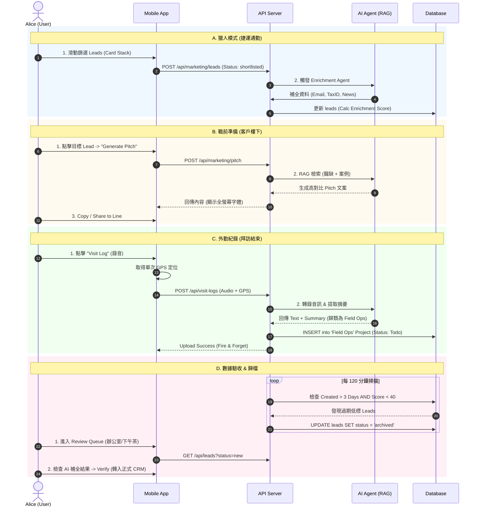

# Phase 4.6.1: Alice (Sales Rep) Persona Workflows & Validation

> **文件狀態**: ✅ 規格定案 (Policies Finalized) - 2026-02-02
> **目標角色**: Alice (王牌業務員)
> **情境核心**: 行動優先 (Mobile-First)、單手操作、業務戰鬥力。

---

## 1. 角色檔案 (Persona Profile)
*   **使用者**: Alice
*   **主要裝置**: 手機 (iOS/Android)
*   **使用場景**: 捷運通勤、客戶樓下、拜訪結束後、咖啡廳空檔。

---

## 2. 完整應用場景 (Application Scenarios)

### A. 早晨通勤：捷運上的「獵人模式」 (Hunter Mode)
*   **情境**: 捷運人潮擁擠，Alice 只能用一隻手握住扶手，另一隻手操作手機。
*   **流程**:
    1.  **滑動篩選 (Card Stack)**: 打開 App 進入 "Leads" 頁面。系統展示像 Tinder 一樣的卡片疊。
    2.  **快速決策**: 
        *   **左滑 (Archive)**: 沒興趣或不匹配的職缺（**政策**: 速度優先，無確認視窗，誤滑可用 Undo）。
        *   **右滑 (Add to Cart)**: 有潛力的案子，加入「業務購物車」。
    3.  **職缺洞察**: 點擊職缺卡片，直接在下方展開 AI 摘要（例如：「急徵 AI 工程師，可能正在轉型」），取代傳統的跳轉外部連結。
    4.  **一鍵轉換**: 按下 "Add to Leads"，系統自動啟動背景 Agent 開始補全該公司詳細資料。

### B. 抵達客戶樓下：戰前準備 (Pitch Mode)
*   **情境**: 站在客戶大樓門口，陽光刺眼，Alice 需要在 1 分鐘內理出等等開會的切入點。
*   **流程**:
    1.  **進入購物車**: 查看 "My Selected Leads"。
    2.  **秒生話術 (One-Tap Pitch)**: 點擊目標客戶卡片的 FAB (懸浮按鈕)，選擇 "Generate Pitch"。
    3.  **高對比顯示**: 畫面跳出全螢幕、大字體、高對比的話術文字（針對戶外陽光優化）。
    4.  **快速分享**: 按下 "Copy" 或 "Share to Line"，將針對該公司職缺客製化的開發信發給窗口。

### C. 拜訪結束：語音即任務 (Field Ops / Voice-to-Task)
*   **情境**: 剛走出客戶辦公室，趁著印象深刻且還沒上捷運前完成紀錄。
*   **流程**:
    1.  **一鍵啟動**: 點擊 "Visit Log" 錄音按鈕。
    2.  **GPS 打卡**: 系統在**錄音當下**抓取一次經緯度 (On-Demand) 以節省電力。
    3.  **口述紀錄**: 「剛跟陳經理聊完...下週二要補報價單。」
    4.  **自動歸檔 (Inbox)**: 
        *   系統將錄音轉文字 + AI 摘要 + GPS 資訊。
        *   自動建立一張新任務卡片，存入預設專案 **`Field Ops`**。
        *   狀態設為 **`Todo`**，標籤 `#ReviewNeeded`。
    5.  **後續處理**: Alice 回辦公室後，將該任務拖曳至正式客戶專案中。

### D. 下午茶時間：數據驗收 (Enrichment Loop)
*   **情境**: 在咖啡廳休息，檢查今天系統自動幫她處理了哪些雜事。
*   **流程**:
    1.  **Review Queue**: 點擊 "Review Queue" 過濾器，只看狀態為 `new` 的項目。
    2.  **回收站檢查**: 若發現 Leads 變少，切換至 **"Archived"** 視圖找回被系統誤刪的資料。
    3.  **一鍵轉入**: 檢查 AI 抓取的統編與 Email，點擊 "Verify" 正式轉入 Sales Pipeline。

---

## 3. 定案政策與規範 (Finalized Policies)

以下規則已於 2026-02-02 確認，作為開發驗收標準：

### P1. 語音日誌精準度與流程 (GAP-009)
*   **策略**: **說完就走 (Fire and Forget)**。
*   **實作**: 不在手機端進行繁瑣的文字校對。所有語音筆記自動轉為 **`Field Ops`** 專案中的 `Todo` 任務。
*   **修正**: Alice 回到辦公室（桌面環境）再對 AI 轉錄的文字進行編輯或修正。

### P2. GPS 與電力隱私 (GAP-010)
*   **策略**: **按需取值 (On-Demand)**。
*   **實作**: 禁止 App 在背景持續追蹤位置。僅在 Alice 主動觸發「打卡」或「錄音」的瞬間，呼叫一次 GPS API。

### P3. 自動歸檔邏輯 (GAP-011)
*   **策略**: **溫和模式 (Recycle Bin)**。
*   **門檻**: 建立超過 **3 天** (或 `.env` 設定值) **且** `enrichment_score` < **40 分**。
*   **動作**: 將狀態改為 `archived`。
*   **可見性**: 不會物理刪除。Alice 可透過 "Archived" 篩選器找回。
*   **評分標準 (Enrichment Score)**:
    *   Email (+40)
    *   Tax ID (+30)
    *   AI Insight > 50 words (+30)

### P4. Token 成本控制
*   **限制**: 歸檔掃描 (Pruning) 僅執行 SQL 查詢，不呼叫 LLM。
*   **預算**: Alice 每日預估消耗 ~12.8 萬 Tokens (僅佔 Gemini 免費額度 < 0.01%)，成本風險極低。

---

## 4. Alice 使用者工作流 UML (Full Lifecycle)

