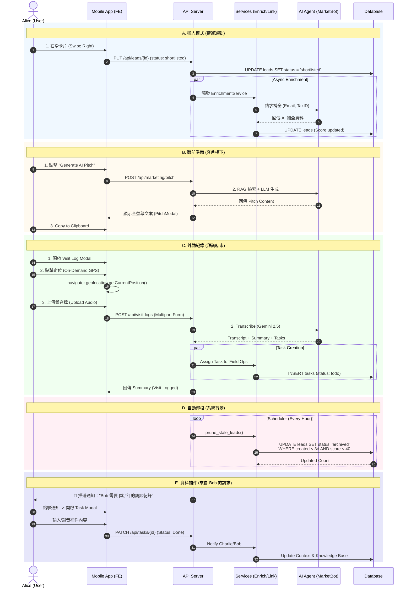

# Phase 4.6.1: Alice (Sales Rep) Persona Workflows & Validation

> **文件狀態**: ✅ 規格定案 (Policies Finalized) - 2026-02-07 (Updated)
> **目標角色**: Alice (王牌業務員)
> **情境核心**: 行動優先 (Mobile-First)、單手操作、業務戰鬥力。

---

## 1. 角色檔案 (Persona Profile)
*   **使用者**: Alice
*   **主要裝置**: 手機 (iOS/Android)
*   **使用場景**: 捷運通勤、客戶樓下、拜訪結束後、咖啡廳空檔。

---

## 2. 完整應用場景 (Application Scenarios)

### A. 早晨通勤：捷運上的「獵人模式」 (Hunter Mode)
*   **情境**: 捷運人潮擁擠，Alice 只能用一隻手握住扶手，另一隻手操作手機。
*   **流程**:
    1.  **滑動篩選 (Card Stack)**: 打開 App 進入 "Leads" 頁面。系統展示像 Tinder 一樣的卡片疊。
    2.  **快速決策**: 
        *   **左滑 (Archive)**: 沒興趣的 Leads，狀態更新為 `archived`。
        *   **右滑 (Shortlist)**: 有潛力的案子，狀態更新為 `shortlisted`，並進入 "Sales Cart"。
    3.  **職缺洞察**: 卡片顯示 "AI Insight" 黃色摘要區塊，快速了解客戶痛點。
    4.  **一鍵轉換**: 系統自動在背景對 `shortlisted` 的 Leads 進行資料補全 (Enrichment)。

### B. 抵達客戶樓下：戰前準備 (Pitch Mode)
*   **情境**: 站在客戶大樓門口，陽光刺眼，Alice 需要在 1 分鐘內理出等等開會的切入點。
*   **流程**:
    1.  **進入購物車**: 進入 "Sales Cart" 頁面。
    2.  **秒生話術 (One-Tap Pitch)**: 點擊 "Generate AI Pitch"。
    3.  **高對比顯示**: 全螢幕彈出 RAG 生成的針對性話術，支援 "Hook", "Value Prop", "CTA" 結構。
    4.  **快速分享**: 點擊 "Copy" 複製到剪貼簿，發送給客戶窗口。

### C. 拜訪結束：語音即任務 (Field Ops / Visit Log)
*   **情境**: 剛走出客戶辦公室，趁著印象深刻且還沒上捷運前完成紀錄。
*   **流程**:
    1.  **開啟紀錄**: 點擊右下角 FAB 按鈕 (Map Pin Icon) 開啟 "New Visit Log"。
    2.  **GPS 打卡**: 點擊定位按鈕，瀏覽器觸發 `navigator.geolocation.getCurrentPosition` (On-Demand)，僅在當下抓取經緯度。
    3.  **語音上傳**: 選擇 "Upload Audio Recording" (支援 iOS/Android 原生錄音檔上傳) 或輸入文字筆記。
    4.  **AI 處理**: 
        *   後端透過 Google Gemini 2.5 Flash 模型進行轉錄與摘要。
        *   自動建立歸類為 `Field Ops` 專案的 `Todo` 任務。

### D. 下午茶時間：數據驗收 (Enrichment & Pruning Loop)
*   **情境**: 系統自動維護資料庫健康度，Alice 閒暇時只需檢視高品質名單。
*   **流程**:
    1.  **自動歸檔 (Pruning)**: Backend `SchedulerService` 定期掃描。
        *   條件: 建立 > 3 天 (可配置 `PRUNING_THRESHOLD_MINUTES`) **且** `enrichment_score` < 40。
        *   動作: 自動將狀態標記為 `archived` (Reason: `stale_low_quality`)。
    2.  **Review Queue**: 在 Marketing 頁面切換至 "Review Queue" 視圖，僅顯示 AI 篩選過的高潛力 Leads。

---

## 3. 定案政策與規範 (Finalized Policies)

以下規則已於 2026-02-07 根據實作確認：

### P1. 語音日誌精準度與流程 (GAP-009)
*   **策略**: **上傳優先 (Upload First)**。
*   **實作**: 支援行動裝置原生錄音檔案上傳。轉錄後自動生成任務，不強制即時校對。

### P2. GPS 與電力隱私 (GAP-010)
*   **策略**: **按需取值 (On-Demand)**。
*   **實作**: 前端僅在使用者明確點擊定位按鈕或送出表單時請求一次 GPS 權限，後端只接收座標，不進行背景追蹤。

### P3. 自動歸檔邏輯 (GAP-011)
*   **策略**: **溫和模式 (Recycle Bin)**。
*   **實作**: `EnrichmentService.prune_stale_leads` 處理歸檔。狀態變更為 `archived`，資料保留在資料庫中，可隨時復原。

### P4. Token 成本控制
*   **限制**: 歸檔與篩選優先使用 SQL 條件，僅對高價值 (Shortlisted) 目標調用 LLM 進行深度分析。

---

## 4. Alice 使用者工作流 UML (Full Lifecycle)

