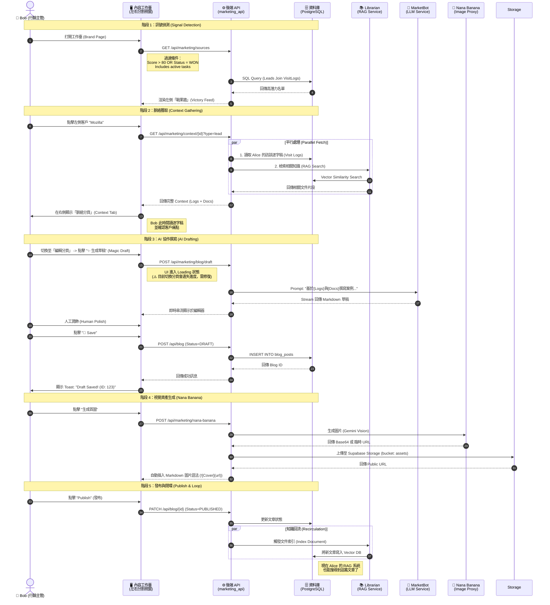

# Phase 4.6.2 實作細節：Bob 的內容生產工作臺 (Content Workbench)

> **狀態**: 已完成 (DONE)
> **目標角色**: Bob (內容行銷主管)
> **核心目標**: 將 Bob 的工作流從「被動看報表」轉型為「主動生產內容」，透過 **三代理人協作模型 (3-Agent Collaboration Model)** 打造一個高效率的內容工作臺。

## 1. 核心哲學：工作臺 (The Workbench)
Bob 不需要更多圓餅圖。他需要的是一個 **內容 IDE (Integrated Development Environment)**。
*   **舊觀點**: 卡片與圖表 (資訊密度低，好看但難用)。
*   **新觀點 (工作臺)**: 
    *   **左側面板 (Pane A)**: `Victory Feed` (戰果牆) — 顯示高密度的潛在題材列表。
    *   **右側面板 (Pane B)**: `Context & Editor` (脈絡與編輯) — 整合「研究」與「創作」的分頁介面。

---

## 2. 三代理人協作模型 (The 3-Agent Model)

這三位 Agent 不是背景運作的黑盒子，而是 Bob 在工作臺上隨手可用的「工具人」。

### Agent 1: Librarian (圖書館員 - 研究助手)
*   **職責**: 提供脈絡 (Context Provider)。
*   **觸發**: 當 Bob 在左側列表點擊某個潛在客戶 (Lead) 時。
*   **任務**: 「找出我們已知的一切。」
    1.  **內部**: 撈取 Alice 的 `visit_logs` (訪談逐字稿)。
    2.  **外部**: 從向量資料庫檢索與該客戶痛點匹配的 `knowledge_items` (如白皮書、過往案例)。
*   **產出**: 在右側「脈絡分頁」顯示一份整理好的 **參考素材包**。

### Agent 2: MarketBot (主筆 - 撰稿助手)
*   **職責**: 編織故事 (Content Weaver)。
*   **觸發**: 當 Bob 在編輯器點擊「✨ 生成草稿」時。
*   **任務**: 「將素材轉化為文章。」
    *   **輸入**: `訪談摘要` + `圖書館員提供的參考資料` + `Bob 的提示詞`。
    *   **模型**: Gemini 1.5 Pro (擅長長文本與邏輯)。
*   **產出**: 一篇結構完整的 Markdown 草稿 (含標題、內文、Call-to-Action)。

### Agent 3: Nana Banana (美術 - 視覺助手)
*   **職責**: 視覺化 (Asset Creator)。
*   **觸發**: 當 Bob 點擊「生成首圖」時。
*   **任務**: 「將概念具象化。」
    *   **輸入**: 草稿的標題與關鍵字。
    *   **模型**: Gemini Flash (Image Gen) 或 SVG Tool。
*   **產出**: 一張圖片 URL (或 SVG 代碼)，直接插入文章頭部。

---

## 3. 詳細工作流程 UML (Sequence Diagram)



---

## 4. 後端實作細節 (Backend Implementation)

**原則**: 不新增 Python 檔案，僅擴充 `marketing_api.py` 的邏輯。

### 4.1 擴充 `marketing_api.py`

#### Endpoint: `GET /api/marketing/sources` (戰果牆)
*   **邏輯**: 聚合查詢 `leads` 與 `archon_tasks` 資料表。
*   **過濾**: 
    1. Leads: `status='WON'` OR (`status='NEGOTIATION'` AND `score >= 80`)
    2. Tasks: Assigned to Bob & Status != DONE
*   **回傳**: 統一格式列表 (ID, Type, Title, Score, Summary, Date)，供左側列表使用。

#### Endpoint: `GET /api/marketing/context/{source_id}` (脈絡聚合)
*   **New Endpoint**: 專為工作臺設計的通用聚合接口。
*   **參數**: `source_type` (default: 'lead')
*   **邏輯**:
    1.  根據 type 讀取 Lead 或 Task 詳細資料。
    2.  讀取關聯的 `visit_logs` (若為 Lead)。
    3.  呼叫 `RAGService.perform_rag_query` 獲取 Librarian 的建議。
*   **回傳結構**:
    ```json
    {
      "lead": {"company": "Mozilla", "pain_points": "..."},
      "visit_logs": [{"transcript": "...", "summary": "...", "created_at": "..."}],
      "rag_refs": [{"content": "...", "source": "Security Whitepaper", "score": 0.89}]
    }
    ```

#### Endpoint: `POST /api/marketing/blog/draft` (草稿生成)
*   **參數**: `topic`, `keywords`, `context_source_id`, `context_type`。
*   **邏輯**: 若有提供 `context_source_id`，後端會自動從 DB 撈取該來源的結構化資料 (Logs/Description)，並結合 RAG 檢索結果，注入到 `BLOG_DRAFT_SYSTEM_PROMPT`。

---

## 5. 前端實作細節 (Frontend Implementation)

### 5.1 `BrandPage.tsx` 版面重構
*   **佈局**: 放棄目前的 Card Grid，改用 **雙欄式佈局 (Split Pane)**。
    *   參考 Tailwind Class: `grid grid-cols-12 h-[calc(100vh-64px)]`
    *   **左側 (col-span-3)**: `<VictoryFeedList />` (可滾動列表)。
    *   **右側 (col-span-9)**: `<WorkbenchArea />` (包含 Tabs: Context | Editor)。

### 5.2 關鍵元件
*   **`VictoryFeedList`**: 參考 Admin UI 的 Data Table，顯示高密度的資訊 (Score, Company, Last Activity)。
*   **`ContextViewer`**: 
    *   **Visit Log 區塊**: 唯讀的文字區，支援關鍵字高亮 (Highlight)。
    *   **RAG 區塊**: 卡片式顯示 Librarian 推薦的文件。
*   **`MarkdownEditor`**: 複用現有編輯器，但在 Toolbar 增加 "Magic Draft" 按鈕。

---

## 6. 執行檢查清單 (Actionable Checklist)

1.  [x] **Backend**: 在 `marketing_api.py` 新增 `lead-context` 端點。
2.  [x] **Backend**: 更新 `drafts` 端點，支援 `context_lead_id` 注入。
3.  [x] **Frontend**: 建立 `VictoryFeed` 元件 (先用 Mock Data 確認樣式)。
4.  [x] **Frontend**: 在 `BrandPage.tsx` 實作左右分割佈局。
5.  [x] **Frontend**: 串接 API，實現「點擊左側 -> 載入右側 Context」的連動。