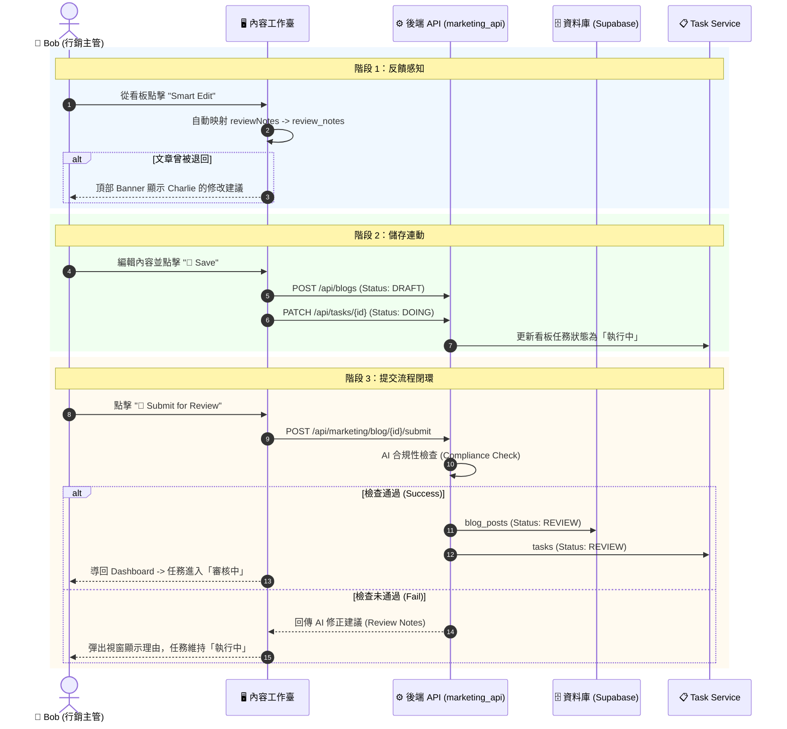

# Phase 4.6.2 實作細節：Bob 的內容生產工作臺 (Content Workbench)

> **狀態**: 已完成 (DONE) - 2026/02/11 (Revised for Accuracy)
> **目標角色**: Bob (內容行銷主管)
> **核心目標**: 將 Bob 的工作流從「被動看報表」轉型為「主動生產內容」，透過 **三代理人協作模型 (3-Agent Collaboration Model)** 打造一個具備任務連動能力的內容工作臺。
> **技術核心**: 
> 1.  **混合模型策略**: 文字生成採用 `gemini-2.0-flash` 正式版；圖片生成採用 `gemini-2.0-flash-exp` (Imagen)。
> 2.  **數據映射 (GAP-023)**: 支援 Pydantic Alias 映射（API: `reviewNotes` -> UI: `review_notes`）。
> 3.  **條件式任務同步**: 提交審核時，僅在通過 AI 自動合規性檢查 (Compliance Check) 後，任務狀態才會流轉至 `Review`。

## 1. 核心哲學：工作臺 (The Workbench)
Bob 不需要更多圓餅圖。他需要的是一個 **內容 IDE (Integrated Development Environment)**。
*   **佈局設計**: 
    *   **左側面板 (Pane A)**: `Victory Feed` (戰果牆) — 顯示高密度的線索列表與關聯任務。
    *   **右側面板 (Pane B)**: `Workbench` — 30/70 分割比例，整合 RAG 脈絡、AI 配置器與 Markdown 編輯器。

---

## 2. 三代理人協作模型 (The 3-Agent Model)

### Agent 1: Librarian (圖書館員 - 研究助手)
*   **職責**: 提供脈絡 (Context Provider)。
*   **任務**: 透過向量檢索 (RAG) 撈取 Alice 的 `visit_logs` 與案例，自動整理為 **參考素材包**。

### Agent 2: MarketBot (主筆 - 撰稿助手)
*   **職責**: 編織故事 (Content Weaver)。
*   **高級配置**: 支援 `Industry`, `Style`, `Length`, `Charts` 多維度參數調節。
*   **透明化**: 支援 `used_prompt` 回傳，前端可點擊 "View AI Prompt" 檢視完整上下文。

### Agent 3: Nana Banana (美術 - 視覺助手)
*   **職責**: 視覺化 (Asset Creator)。
*   **模型**: 預設 `gemini-2.0-flash-exp`。若遇 429/403 錯誤，自動降級至 `picsum.photos` 動態種子。

---

## 3. 詳細工作流程 UML (Sequence Diagram)

---

## 4. 定案政策與規範 (Finalized Policies)

### P6. 跨角色狀態連動 (Task Sync)
*   **儲存連動**: `Save` 操作強制觸發 `TaskStatus.DOING`。
*   **提交連動**: `Submit` 操作成功後（通過 AI 檢查）觸發 `TaskStatus.REVIEW`。

### P7. 反饋感知透明化 (Feedback Transparency)
*   **映射規範**: 必須優先處理 API 返回的 `reviewNotes` (camelCase) 並將其賦值給 UI 渲染所需的 `review_notes`。

### P8. 視覺資產一致性
*   **圖片插入**: AI 生成圖以 `` 插入正文首行。Charlie 端需具備 regex 提取能力以實現 WYSIWYG 預覽。

---

## 5. 執行檢查清單 (Actionable Checklist)

1.  [x] **UI**: 實作 30/70 分割視窗與雙重收合側邊欄。
2.  [x] **Sync**: 實作 `Save` 與 `Submit` 對關聯 Task ID 的狀態更新。
3.  [x] **Logic**: 修正 `reviewNotes` API 別名映射問題，恢復理由顯示。
4.  [x] **AI**: 實作 `marketing_api` 的自動合規性審查邏輯 (Mocked)。
5.  [x] **Visual**: 實作 Prompt Inspector 彈窗。
6.  [x] **Data**: 補全 `BlogPost` 介面中的 `authorName` 與 `publishDate`。