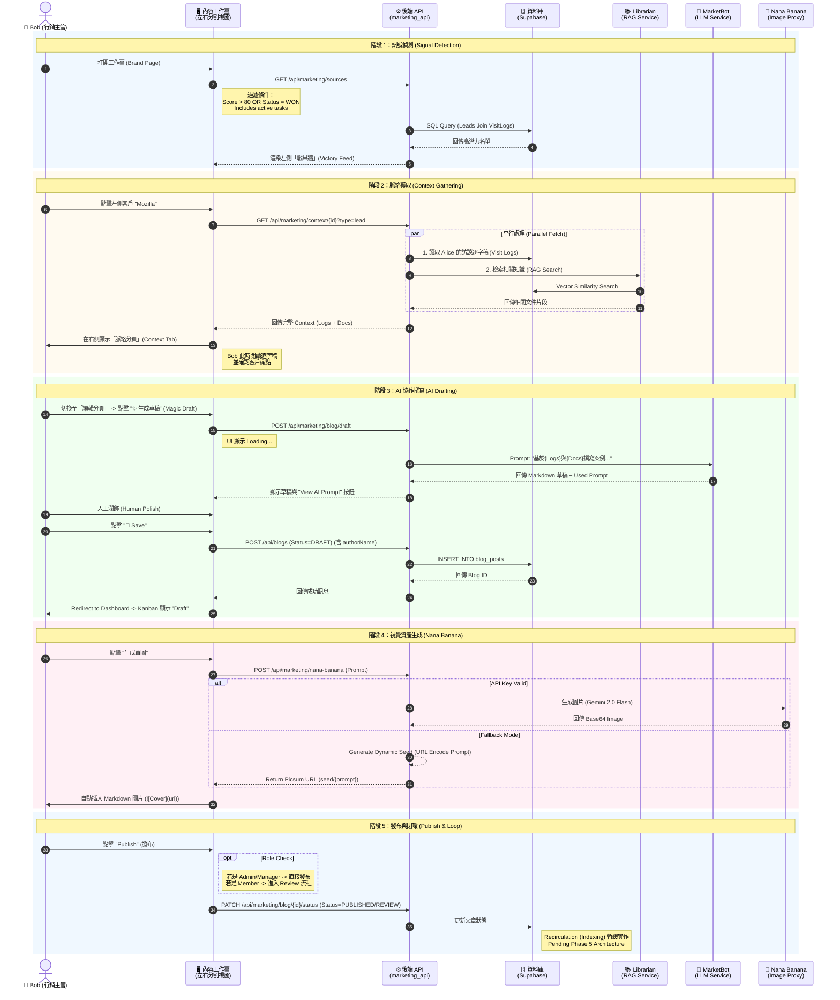

# Phase 4.6.2 實作細節：Bob 的內容生產工作臺 (Content Workbench)

> **狀態**: 已完成 (DONE) - 2026/02/05
> **目標角色**: Bob (內容行銷主管)
> **核心目標**: 將 Bob 的工作流從「被動看報表」轉型為「主動生產內容」，透過 **三代理人協作模型 (3-Agent Collaboration Model)** 打造一個高效率的內容工作臺。
> **最新更新**: 
> 1.  **AI 模型升級**: 全面採用 `gemini-2.0-flash-exp` 作為主力，`gemini-1.5-pro` 作為備援。
> 2.  **透明化機制**: 新增 Prompt Inspector，Bob 可檢視 AI 使用的原始提示詞。
> 3.  **動態資產**: 圖片生成支援 `picsum.photos` 動態種子 Fallback，解決無 API Key 時的演示中斷。

## 1. 核心哲學：工作臺 (The Workbench)
Bob 不需要更多圓餅圖。他需要的是一個 **內容 IDE (Integrated Development Environment)**。
*   **舊觀點**: 卡片與圖表 (資訊密度低，好看但難用)。
*   **新觀點 (工作臺)**: 
    *   **左側面板 (Pane A)**: `Victory Feed` (戰果牆) — 顯示高密度的潛在題材列表。
    *   **右側面板 (Pane B)**: `Context & Editor` (脈絡與編輯) — 整合「研究」與「創作」的分頁介面。

---

## 2. 三代理人協作模型 (The 3-Agent Model)

這三位 Agent 不是背景運作的黑盒子，而是 Bob 在工作臺上隨手可用的「工具人」。

### Agent 1: Librarian (圖書館員 - 研究助手)
*   **職責**: 提供脈絡 (Context Provider)。
*   **觸發**: 當 Bob 在左側列表點擊某個潛在客戶 (Lead) 時。
*   **任務**: 「找出我們已知的一切。」
    1.  **內部**: 撈取 Alice 的 `visit_logs` (訪談逐字稿)。
    2.  **外部**: 從向量資料庫檢索與該客戶痛點匹配的 `knowledge_items` (如白皮書、過往案例)。
*   **產出**: 在右側「脈絡分頁」顯示一份整理好的 **參考素材包**。

### Agent 2: MarketBot (主筆 - 撰稿助手)
*   **職責**: 編織故事 (Content Weaver)。
*   **觸發**: 當 Bob 在編輯器點擊「✨ 生成草稿」時。
*   **透明化**: 支援 `used_prompt` 回傳，前端可點擊 "View AI Prompt" 檢視完整上下文。
*   **任務**: 「將素材轉化為文章。」
    *   **輸入**: `訪談摘要` + `圖書館員提供的參考資料` + `Bob 的提示詞`。
    *   **模型**: `gemini-2.0-flash-exp` (快) -> `gemini-1.5-pro` (穩, Fallback)。
*   **產出**: 一篇結構完整的 Markdown 草稿 (含標題、內文、Call-to-Action)。

### Agent 3: Nana Banana (美術 - 視覺助手)
*   **職責**: 視覺化 (Asset Creator)。
*   **觸發**: 當 Bob 點擊「生成首圖」時。
*   **任務**: 「將概念具象化。」
    *   **輸入**: 草稿的標題與關鍵字。
    *   **模型**: `gemini-2.0-flash-exp` (Image Mode) 或 `picsum.photos` (Dynamic Fallback)。
    *   **Fallback 策略**: 若無 API Key 或權限不足，使用 `picsum.photos/seed/{prompt_prefix}/...` 生成穩定且相關的隨機圖。
*   **產出**: 一張圖片 URL (或 SVG 代碼)，直接插入文章頭部。

---

## 3. 詳細工作流程 UML (Sequence Diagram)

---

## 4. 後端實作細節 (Backend Implementation)

**原則**: 不新增 Python 檔案，僅擴充 `marketing_api.py` 的邏輯。

### 4.1 擴充 `marketing_api.py` (v2 Updated)

#### Payload Updates
*   `CreateBlogPostRequest`: 新增 `author_name` 欄位，確保前台傳入的作者資訊能被正確儲存 (解決 Review 列表作者空白問題)。
*   `DraftBlogResponse`: 新增 `used_prompt` 欄位，提供 AI 透明度。

#### Fallback Strategies (Resilience)
1.  **LLM Fallback**: 若 `marketing_model` (Gemini 2.0) 失敗 (404/429)，自動降級至 `gemini-1.5-pro` 並使用 Backup Key。
2.  **Image Fallback**: 若因 Free Tier (403) 或配置錯誤導致失敗，回傳與 Prompt 相關聯的 `picsum.photos` 動態連結，而非死板的 Placeholder。

---

## 5. 前端實作細節 (Frontend Implementation)

### 5.1 `BrandPage.tsx` 狀態管理
*   **Save Action**: 修正了 `handleSave` 僅在 LocalStorage 運作的 Bug。現在會呼叫 `api.createBlogPost` 正式寫入 DB，並將使用者導回 Dashboard 查看 Kanban。
*   **Prompt Inspector**: 在 `ContentWorkbench` 新增 `usedPrompt` 狀態與對應 UI，允许使用者展開查看上次生成的完整 Prompt。

### 5.2 關鍵元件
*   **`VictoryFeedList`**: 顯示高密度的資訊 (Score, Company, Last Activity)，已串接 Real API。
*   **`ContextViewer`**: 支援 Visit Log 與 RAG Refs 的雙欄顯示。
*   **`MarkdownEditor`**: 
    *   新增 `authorName` 傳遞邏輯。
    *   新增 Image Markdown 自動插入功能。

---

## 6. 執行檢查清單 (Actionable Checklist)

1.  [x] **Backend**: 在 `marketing_api.py` 新增 `lead-context` 端點。
2.  [x] **Backend**: 更新 `drafts` 端點，支援 `context_lead_id` 注入與 `used_prompt` 回傳。
3.  [x] **Frontend**: 建立 `VictoryFeed` 元件。
4.  [x] **Frontend**: 在 `BrandPage.tsx` 實作左右分割佈局。
5.  [x] **Frontend**: 串接 API，實現「點擊左側 -> 載入右側 Context」的連動。
6.  [x] **BugFix**: 修正 `gpt-2.5` 命名錯誤 (Gemini 2.0)。
7.  [x] **BugFix**: 修正 Save 按鈕無效問題 (DB Persistence)。
8.  [x] **BugFix**: 修正 Review 作者空白問題 (Author Name Propagation)。