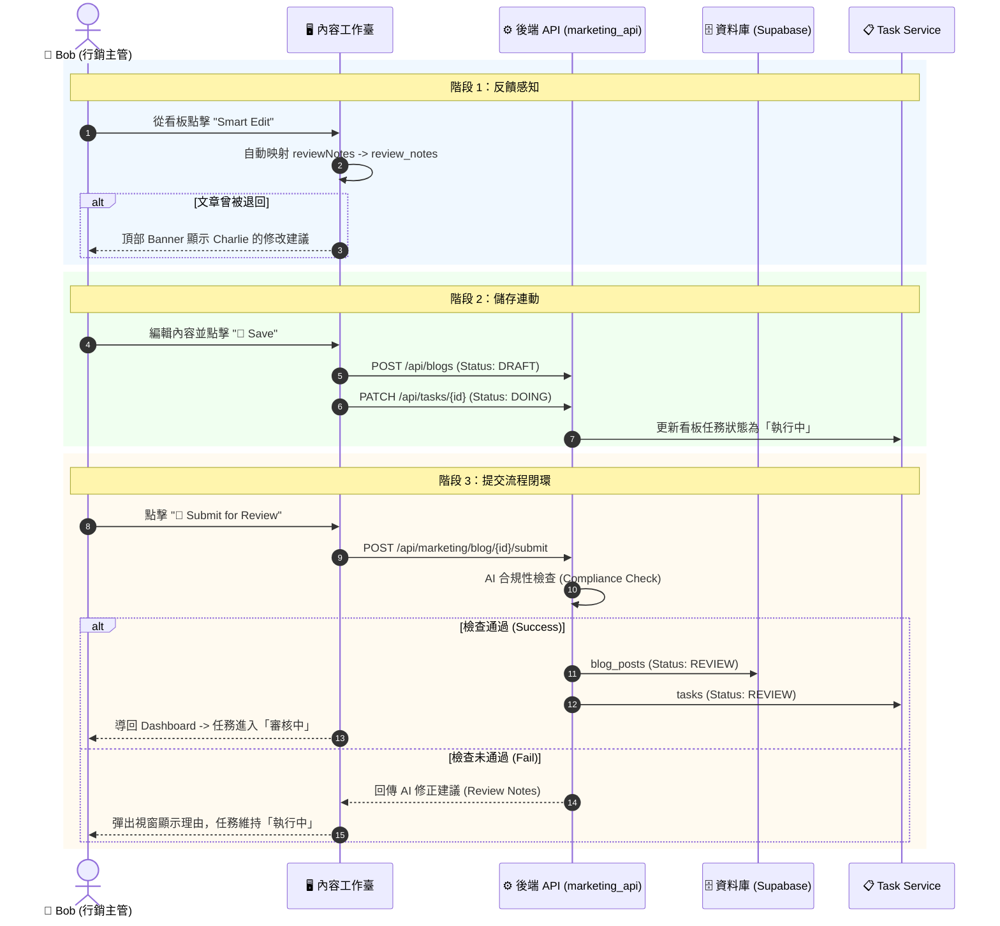

# Phase 4.6.2 實作細節：Bob 的內容生產工作臺 (Content Workbench)

> **狀態**: 已完成 (DONE) - 2026/02/11 (Revised for Accuracy)
> **目標角色**: Bob (內容行銷主管)
> **核心目標**: 將 Bob 的工作流從「被動看報表」轉型為「主動生產內容」，透過 **三代理人協作模型 (3-Agent Collaboration Model)** 打造一個具備任務連動能力的內容工作臺。
> **技術核心**: 
> 1.  **混合模型策略**: 文字生成採用 `gemini-2.0-flash`；視覺資產採用 **MCP SVG Generator** (本地幾何運算，免 Token 成本)。
> 2.  **數據映射 (GAP-023)**: 支援 Pydantic Alias 映射（API: `reviewNotes` -> UI: `review_notes`）。
> 3.  **條件式任務同步**: 提交審核時，僅在通過 AI 自動合規性檢查 (Compliance Check) 後，任務狀態才會流轉至 `Review`。

## 1. 核心哲學：工作臺 (The Workbench)
Bob 不需要更多圓餅圖。他需要的是一個 **內容 IDE (Integrated Development Environment)**。
*   **佈局設計**: 
    *   **左側面板 (Pane A)**: `Victory Feed` (戰果牆) — 顯示高密度的線索列表與關聯任務。
    *   **右側面板 (Pane B)**: `Workbench` — 30/70 分割比例，整合 RAG 脈絡、AI 配置器與 Markdown 編輯器。

---

## 2. 三代理人協作模型 (The 3-Agent Model)

### Agent 1: Librarian (圖書館員 - 研究助手)
*   **職責**: 提供脈絡 (Context Provider)。
*   **任務**: 透過向量檢索 (RAG) 撈取 Alice 的 `visit_logs` 與案例，自動整理為 **參考素材包**。

### Agent 2: MarketBot (主筆 - 撰稿助手)
*   **職責**: 編織故事 (Content Weaver)。
*   **高級配置**: 支援 `Industry`, `Style`, `Length`, `Charts` 多維度參數調節。
*   **透明化**: 支援 `used_prompt` 回傳，前端可點擊 "View AI Prompt" 檢視完整上下文。

### Agent 3: Nana Banana (美術 - 視覺助手)
*   **職責**: 視覺資產 (Vector Asset Creator)。
*   **物理實現**: 定位為「系統外掛工具」，不涉及雲端圖像計費。
*   **核心引擎**: 透過 `logo_tool.py` 物理生成幾何 SVG 向量圖，支援 `Project ECITON` 動態品牌識別。
*   **降級機制**: 具備 Scout 自動化腳本 (`twin_scout_gemini_auth.py`) 與外部 Pollinations 連結之雙軌防禦。

---

## 3. 詳細工作流程 UML (Sequence Diagram)

---

## 4. 定案政策與規範 (Finalized Policies)

### P6. 內容完整性與清理 (Smart Polish)
*   **圖片分離**: 為了保持文章內文純淨，系統在儲存時會自動執行 `cleanAIImageReference`。這會從 Markdown 中移除圖片語法，僅將 URL 保存在元數據的 `imageUrl` 欄位中，避免內容重複渲染或語法污染。

### P7. 介面佈局規範
*   **高度鎖定**: `/brand` 頁面強制使用 `h-screen overflow-hidden` 佈局。這能消除導覽列、側邊欄與編輯器之間的多重捲動條，提供 IDE 般的沈浸式體驗。

### P8. 跨角色狀態連動 (Task Sync)
*   **儲存連動**: `Save` 操作強制觸發 `TaskStatus.DOING`。
*   **提交連動**: `Submit` 操作成功後觸發 `TaskStatus.REVIEW`。
*   **2026-04-30 物理對齊 (Phase 4.6.47 L2 Decoupling)**: 
    *   **落地實作**: 撰稿與審核功能已完全從龐大的 `MarketingService` 拆分。目前 `marketing_service.py` 作為輕量外觀 (Facade)，將 `draft_blog` 與 `submit_blog` 物理委派給專職的 `ContentHandler`。自動化市場情報則由 `business.py` 每日排程自動觸發 `AgentUUIDs.MARKET_BOT` 生成。
    *   **外掛說明**: Nana Banana 繪圖功能定位為「系統外掛/工具」，採用 MCP 幾何生成 (logo_tool.py)，不涉及 LLM 計費模型呼叫，故其繪圖行為不計入 AI Token 成本。

### P9. 反饋感知透明化 (Feedback Transparency)
*   **映射規範**: 必須優先處理 API 返回的 `reviewNotes` (camelCase) 並將其賦值給 UI 渲染所需的 `review_notes`。

---

## 5. 執行檢查清單 (Actionable Checklist)

1.  [x] **UI**: 實作 30/70 分割視窗、雙重收合側邊欄與 `h-screen` 佈局。
2.  [x] **Sync**: 實作 `Save` 與 `Submit` 對關聯 Task ID 的狀態更新。
3.  [x] **Logic**: 實作 `cleanAIImageReference` 內容清理邏輯。
4.  [x] **Resilience**: 完成 `marketing_api` 的三層圖資降級防禦。
5.  [x] **Visual**: 實作 Prompt Inspector 彈窗與視覺化退件反饋橫幅。
6.  [x] **Data**: 補全 `BlogPost` 介面中的 `authorName` 與 `publishDate`。

---

## 6. 物理公證實錄 (2026-04-30 Physical Evidence)

根據實體程式碼的深入檢視（特別是 `marketing_service.py`、`business.py` 排程器與 `seed_mock_data.sql`），以下是 Bob（行銷人員）與其對應之 AI 代理（MarketBot）在系統中的實際工作流與產出對比。

### 6.1 主被動工作流拆解
*   **🧑‍💼 Bob 的主動工作流 (前端介面與 API 操作)**
    *   **商機情報 (Intelligence HUD 2.0)**: Bob 每日檢視 `list_leads()`，系統透過 `_calculate_lead_score` 自動評分（例如 VP 等級得高分）。
    *   **內容創作 (Brand Hub)**: 主動發起 `draft_blog`、生成客製化提案 `generate_pitch`，並使用 `generate_visual_asset` 生成視覺配圖。
    *   **審核提交**: 文章完成後透過 `submit_blog` 送交主管 (Charlie) 進行 `process_approval`。

*   **🤖 MarketBot 的自動工作流 (排程器與 Agent Service)**
    *   **每日市場報告自動化**: `business.py` 每天自動撈取過去 24 小時的新 Leads，指派任務給 MarketBot。
    *   **自動草擬 (Agent Task)**: MarketBot 自動生成一篇 600 字繁體中文「每日市場情報」部落格草稿，儲存為 DRAFT 狀態。
    *   **哨兵監控 (Sentinel)**: `run_business_sentinel()` 幫 Bob 自動監控超過 14 天未互動的休眠商機 (Dormant)，以及卡關超過 48 小時的內容瓶頸 (Content Bottleneck)。

### 6.2 預期實際產出 (產出數據對齊)

| 週期 | 執行者 | 產出項目 (Physical Output) | 來源 / 依據 | 預估產出數量 |
| :--- | :--- | :--- | :--- | :--- |
| **每天** | 🤖 MarketBot | **市場情報部落格 (Draft)** | `business.py -> run_daily_market_report()` 撈取前 24h 爬蟲資料指派生成任務 | 每天 **1 篇** (600字繁體中文草稿) |
| **每天** | 🧑‍💼 Bob | **高分商機標記與提案生成** | `LeadHandler -> calculate_lead_score` / `generate_pitch` | 每日處理約 **10-20 筆** 高分商機 |
| **每天** | ⚙️ 系統哨兵 | **資源與卡關警報 (Alerts)** | `business.py -> run_business_sentinel()` | 每天監控並發出 **N 筆** 休眠商機與內容瓶頸警報 |
| **每週** | 🧑‍💼 Bob | **已發布的官方部落格 (Published)** | Bob 將 MarketBot 的草稿精修後，提交給 Charlie 審核 (`submit_blog`) | 每週約 **3-5 篇** 正式發布文章 |
| **每月** | 🧑‍💼 Bob | **品牌轉換率與行銷趨勢報告** | `AnalyticsHandler -> get_marketing_trends()` (四階段流失率漏斗) | 每月 **1 份** 即時戰情儀表板數據 |