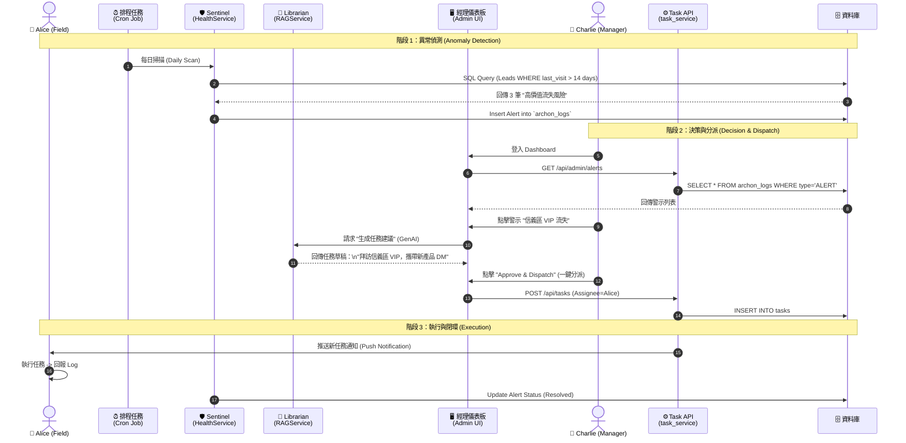
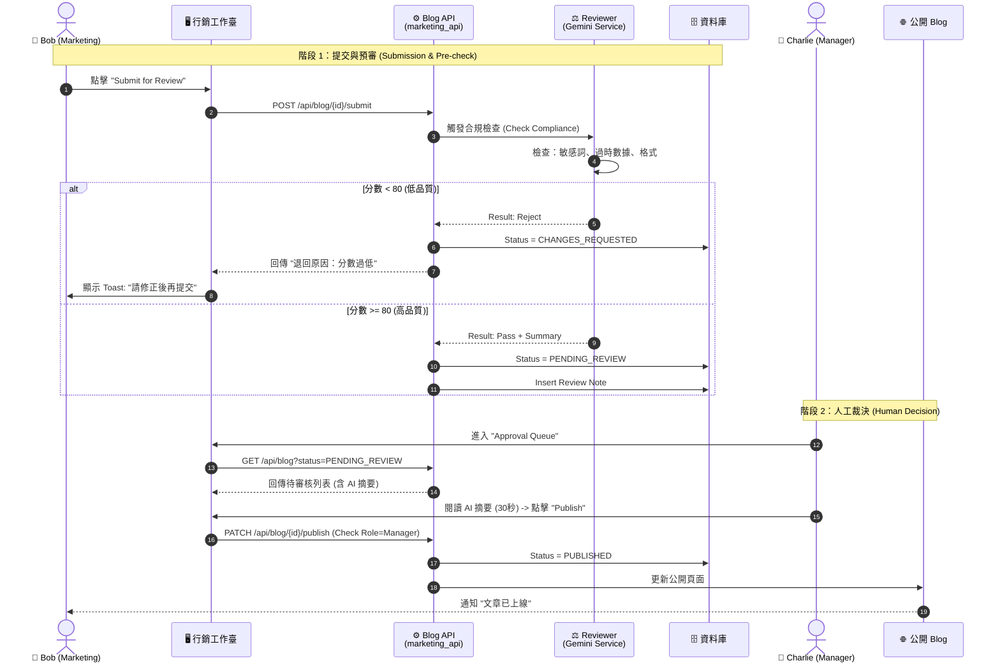
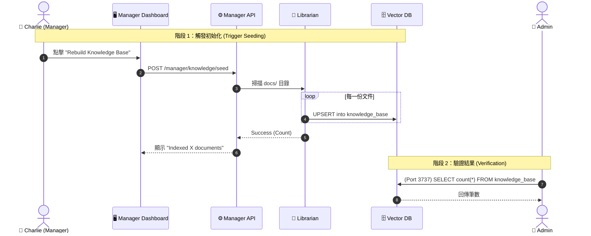

# Phase 4.6.3 Charlie Persona: The Orchestrator (指揮官工作流)

> **Status**: Implemented (2026-02-05)
> **Role**: Manager / Admin
> **Motto**: "Management by Exception" (只處理例外，不陷入細節)
> **Goal**: 連結前線 (Alice) 與市場 (Bob)，確保組織依據數據行動。

---

## 1. 角色定位與團隊視角 (Role Definition)

Charlie 是 Archon 系統的神經中樞。他不生產原始數據，也不撰寫最終內容。他的工作是 **「決策 (Decide)」** 與 **「分派 (Dispatch)」**。

### 團隊如何看待 Charlie？

| 角色 | 視角 (Perspective) | 交互方式 (Interaction) |
| :--- | :--- | :--- |
| **Alice (前線)** | "Charlie 是我的後盾。他不會盯著我的每一步，但當我遇到搞不定的客戶，或者漏掉了重要商機，他會派發精準的任務 (Task) 給我。" | **被動接收**: Alice 透過 App 接收 Charlie 指派的高價值任務。 |
| **Bob (行銷)** | "Charlie 是我的總編輯。他確保我寫的文章符合公司戰略，並幫我擋下可能損害品牌形象的內容。" | **主動提交**: Bob 提交草稿，等待 Charlie 的批准 (Approval)。 |
| **AI Agents** | "Charlie 是最終裁決者。我們先過濾掉 80% 的雜訊，只把剩下 20% 需要人類智慧判斷的選項交給他。" | **輔助決策**: AI 準備好選項 (A/B)，Charlie 做選擇。 |

---

## 2. 核心 AI 助手矩陣 (The Agent Toolkit)

Charlie 的時間最昂貴，因此他只使用經過 **RBAC 權限過濾** 的高效率 Bot。我們不新增任何獨立的 Agent 實體，而是複用現有的後端服務。

| Agent 名稱 | 職責 (Role) | 核心能力 (Capability) | 如何節省 Charlie 工時 (Efficiency) |
| :--- | :--- | :--- | :--- |
| **🛡️ Sentinel (哨兵)** | **異常偵測** (監控 `visit_logs` 與 `system_health`) | **不需主動查表**。只有當「Alice 業績掉 30%」或「API 紅燈」時才發通知。 |
| **🧠 Librarian (參謀)** | **戰略分析** (跨表查詢 `logs` + `leads` + `blog`) | **不需手寫 SQL/報表**。Charlie 問：「本週競品趨勢為何？」，它直接給摘要。 |
| **⚖️ Reviewer (門神)** | **品質審核** (檢查 `blog_posts` 的合規性) | **不需糾錯字/格式**。Bob 提交的草稿必須先通過它的 80 分門檻，才會出現在 Charlie 桌上。 |

---

## 3. 詳細工作流程 UML (Sequence Diagram)

### Workflow A: 戰略指派 (Insight to Action)
> **場景**: Alice 在前線忙碌，可能會漏掉某些長期沒經營的客戶。Charlie 負責補位。

### Workflow B: 出版審核 (The Approval Gate)
> **場景**: Bob 寫了一篇新文章，需要 Charlie 批准才能上線。

---

### Workflow C: 知識庫初始化 (Knowledge Initialization UI)
> **場景**: 系統初次部署或需要重置知識庫時，Charlie (Manager) 點擊儀表板按鈕觸發初始化，Admin 可透過 3737 Port 驗證結果。

---

## 4. 實作計畫 (Implementation Gap Analysis)

為了落地上述流程，Phase 4.6.3 需補足以下缺口：

| 模組 | 現狀 (As-Is) | 缺口 (Gap) | 實作行動 (Action Item) | 狀態 |
| :--- | :--- | :--- | :--- | :--- |
| **RBAC** | 角色有分，但 API 無強制擋權。 | Bob 可以直接 Publish，繞過 Charlie。 | **API Enforcer**: 在 `/approvals` 與 `/dispatch` 端點強制檢查 `user.role == 'manager'`。 | ✅ Done |
| **UI** | 只有個人的 Dashboard。 | Charlie 沒有綜觀全域的 **"Team Dashboard"**。 | **New View**: 實作 `ManagerDashboard.tsx`，包含 Alerts Feed, Sentinel Trigger。 | ✅ Done |
| **Agent** | 只有單一 Chat 介面。 | 缺乏 **"背景執行"** 的 Sentinel 與 Reviewer。 | **Sentinel Service**: 實作 `scheduler_service.py` 定期掃描 stale leads。 | ✅ Done |
| **Data** | Task 只能手動建立。 | 無法由 AI 自動生成 Task 草稿。 | **Smart Dispatch**: 在 `task_service.py` 整合 RAG + LLM (`gemini-1.5-pro`) 自動生成任務。 | ✅ Done |
| **SOP** | 需手動 SSH 進伺服器執行 CLI。| Charlie 不會用 Terminal，無法自行重置 RAG。 | **System Maintenance UI**: 在 Dashboard 新增 "Rebuild Knowledge Base" 按鈕與 API。 | ✅ Done |

---

## 5. 結論

Charlie 的存在不是為了增加管理成本，而是為了**結構化** Alice 與 Bob 的產出。
透過 **Sentinel (監控)**、**Librarian (建議)** 與 **Reviewer (把關)**，Charlie 能夠用最少的時間，維持系統最高的運作效率。

> **對於 Alice 而言**：Charlie 是一個「只在關鍵時刻出現，指引方向的指揮官」。
> **對於 Bob 而言**：Charlie 是一個「確保工作成果被認可與安全發布的守門員」。