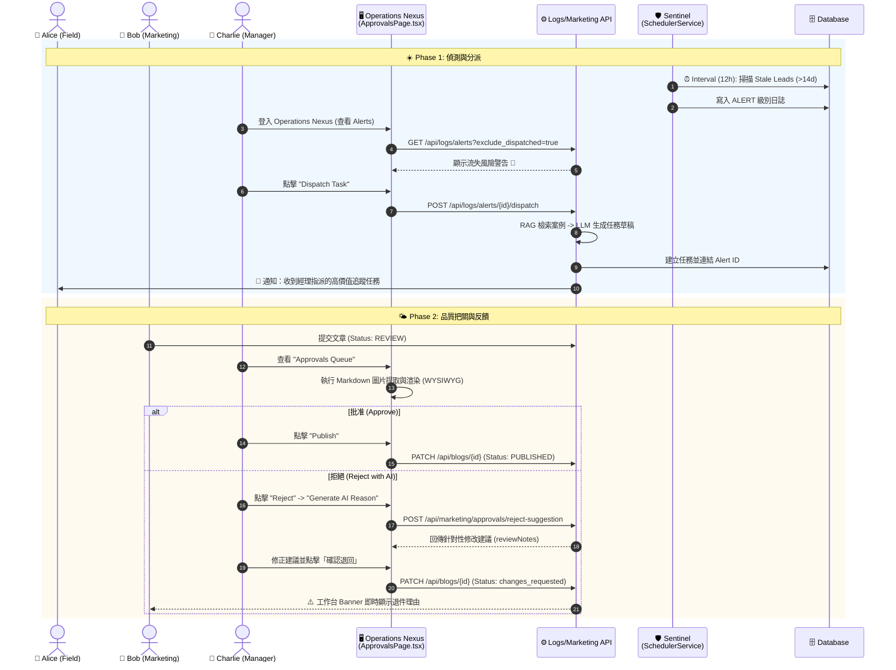

# Phase 4.6.3 Charlie Persona: The Orchestr Orchestrator (指揮官工作流)

> **Status**: Implemented (2026-02-11)
> **Role**: Manager / Admin
> **Motto**: "Management by Exception" (只處理例外，不陷入細節)
> **Goal**: 連結前線 (Alice) 與市場 (Bob)，透過自動化哨兵機制維護組織數位體質。

---

## 1. 角色定位與團隊視角 (Role Definition)

Charlie 是 Archon 系統的神經中樞。他不生產原始數據，也不撰寫最終內容。他的工作是 **「決策 (Decide)」** 與 **「分派 (Dispatch)」**。

---

## 2. 核心 AI 助手矩陣 (The Agent Toolkit)

| Agent 名稱 | 職責 (Role) | 核心能力 (Capability) | 如何節省 Charlie 工時 (Efficiency) |
| :--- | :--- | :--- | :--- |
| **🛡️ Sentinel (哨兵)** | **異常偵測** (自動監控 Stale Leads) | **不需主動查表**。`SchedulerService` 每 12 小時掃描一次滯留 14 天以上的客戶，並自動產生 Alert 日誌。 |
| **🧠 Librarian (參謀)** | **戰略分析** (智慧任務生成) | **不需手寫任務內容**。整合 RAG 案例庫，根據線索歷史自動生成繁體中文追蹤任務草稿。 |
| **⚖️ Reviewer (門神)** | **品質審核** (WYSIWYG 預覽) | **不需切換視窗**。在 `ApprovalsPage` 實現 Markdown 與 AI 生成圖的 1:1 即時渲染，支援 AI 輔助生成退件理由。 |

---

## 3. 詳細工作流程 UML (Day in the Life of Charlie)

---

## 4. 實作計畫 (Implementation Gap Analysis)

| 模組 | 現狀 (As-Is) | 實作行動 (Action Item) | 狀態 |
| :--- | :--- | :--- | :--- |
| **RBAC** | API 已強制擋權。 | 實作 `/approvals` 與 `/dispatch` 的權限檢查。 | ✅ Done |
| **Alerts** | 實作於 `/api/logs`。 | 支援 `exclude_dispatched` 過濾，實現狀態閉環。 | ✅ Done |
| **Dispatch** | 智慧化任務生成。 | 在 `TaskService` 整合 RAG+LLM 生成繁中任務。 | ✅ Done |
| **UI** | 100% 遷移至 5173。 | 解鎖審核預覽高度，加固 Markdown 圖片識別。 | ✅ Done |
| **Audit** | 具備搜尋功能。 | 實作 `DocumentVersionsLog` 的多維度即時過濾。 | ✅ Done |

---

## 5. 結論

Charlie Persona 已達成 **100% 落地**。
透過 **Sentinel (偵測)** 與 **Operations Nexus (執行)**，Charlie 真正實現了 "Management by Exception"，將原本繁瑣的行政檢查轉化為 AI 驅動的「指揮官」模式。所有的變更均受 **Audit Trail** 監控，確保系統演進過程可追溯、可信賴。
