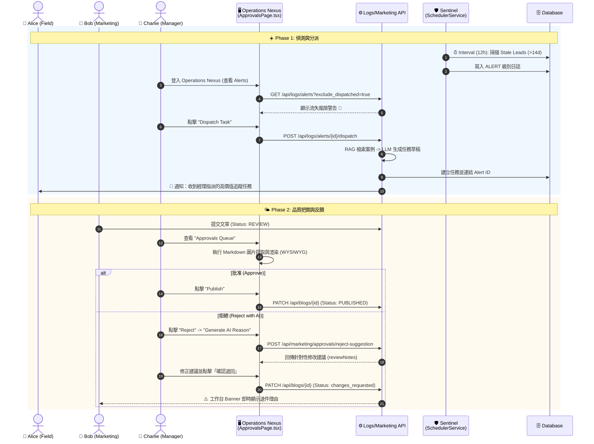

# Phase 4.6.3 Charlie Persona: The Orchestr Orchestrator (指揮官工作流)

> **Status**: Implemented (2026-02-11)
> **Role**: Manager / Admin
> **Motto**: "Management by Exception" (只處理例外，不陷入細節)
> **Goal**: 連結前線 (Alice) 與市場 (Bob)，透過自動化哨兵機制維護組織數位體質。

---

## 1. 角色定位與團隊視角 (Role Definition)

Charlie 是 Archon 系統的神經中樞。他不生產原始數據，也不撰寫最終內容。他的工作是 **「決策 (Decide)」** 與 **「分派 (Dispatch)」**。

---

## 2. 核心 AI 助手矩陣 (The Agent Toolkit)

| Agent 名稱 | 職責 (Role) | 核心能力 (Capability) | 治理機制 (Governance - New) |
| :--- | :--- | :--- | :--- |
| **🛡️ DevBot (開發)** | **系統修復** | **L2+ 自動修復** | **XP 等級鎖定**。必須達到 Level 1 (500 XP) 才能獲得物理寫入權限，降低破壞風險。 |
| **🛡️ Sentinel (哨兵)** | **異常偵測** (自動監控 Stale Leads) | **不需主動查表**。`SchedulerService` 每 12 小時掃描一次滯留 14 天以上的客戶，並自動產生 Alert 日誌。 |
| **🧠 Librarian (參謀)** | **戰略分析** (智慧任務生成) | **不需手寫任務內容**。整合 RAG 案例庫，根據線索歷史自動生成繁體中文追蹤任務草稿。 |
| **⚖️ Reviewer (門神)** | **品質審核** (WYSIWYG 預覽) | **不需切換視窗**。在 `ApprovalsPage` 實現 Markdown 與 AI 生成圖的 1:1 即時渲染，支援 AI 輔助生成退件理由。 |

---

## 3. 詳細工作流程 UML (Day in the Life of Charlie)

---

## 4. 戰略觀察中樞 (Nexus Command)

Charlie 透過 **Nexus Command**（原戰情室）觀察組織的數位體質指標。

### 4.1 全量生產速率 (Multi-dimensional Velocity)
*   **數據邏輯**: 不再僅限於部落格產出。Velocity 指標現在聚合了「部落格生成」、「任務結案 (SLA)」與「業務線索轉換」的平均週期。
*   **決策降噪**: 實作了 **168 小時 (7 天)** 的離群值保護門檻 (Outlier Shield)。這能防止偶發的長期滯留任務扭曲整體的效率趨勢，確保 Charlie 看到的數據具備真實決策參考價值。

### 4.2 跨團隊全局視野 (RBAC Visibility)
*   **物理權限**: Charlie 具備「全局可見性」。在 `Team Management` 面板中，Charlie 可以無差別檢視 Alice 的外勤任務、Bob 的行銷進度以及系統 Agent 的修復日誌，打破跨部門的資訊孤島。

### 4.3 AI 經濟治理 (XP & Token Traceability)
*   **2026-03-20 物理對齊 (Phase 4.6.15)**: 
    *   **ROI 透明化**: 戰情室已注入「Token 成本追蹤」。Charlie 可直接看到每個任務的實體美金開支，實現 AI 產出的 ROI 量化管理。
    *   **資歷化管理**: 實作基於 XP (Experience Points) 的等級體系。Agent 的權限不再是靜態設定，而是隨其「成功貢獻」動態提升，強化系統自癒的安全性。

---

## 5. 實作計畫 (Implementation Gap Analysis)

| 模組 | 現狀 (As-Is) | 實作行動 (Action Item) | 狀態 |
| :--- | :--- | :--- | :--- |
| **RBAC** | API 已強制擋權。 | 實作全局任務可見性與 `/approvals` 權限。 | ✅ Done |
| **Alerts** | 實作於 `/api/logs`。 | 支援 `exclude_dispatched` 過濾，實現狀態閉環。 | ✅ Done |
| **Dispatch** | 智慧化任務生成。 | 在 `TaskService` 整合 RAG+LLM 生成繁中任務。 | ✅ Done |
| **Nexus** | 數據真實化。 | 落地聚合 Velocity 計算並實作 168h CAP。 | ✅ Done |
| **Audit** | 具備搜尋功能。 | 實作 `DocumentVersionsLog` 的多維度即時過濾。 | ✅ Done |

---

## 6. 結論

Charlie Persona 已達成 **100% 落地**。
透過 **Sentinel (偵測)** 與 **Operations Nexus (執行)**，Charlie 真正實現了 "Management by Exception"，將原本繁瑣的行政檢查轉化為 AI 驅動的「指揮官」模式。所有的變更均受 **Audit Trail** 監控，確保系統演進過程可追溯、可信賴。

---

## 7. 物理公證實錄 (2026-04-30 Physical Evidence)

根據實體程式碼的深入檢視（包含 `marketing/content_handler.py` 的審核機制、`changes_api.py` 以及排程器邏輯），以下是 Charlie（主管）在系統中的實際跨角色互動與預期產出數據。

### 7.1 跨角色實體互動 (Cross-Persona Interactions)
*   **👩 Alice (Sales) <-> 👨 Charlie (前線調度)**: 
    *   Sentinel 會自動幫 Charlie 抓出超過 14 天未互動的閒置客戶並拋出 Alert。Charlie 點擊「指派任務」後，系統會啟動 RAG 檢索過去的訪談紀錄，自動草擬高價值的追蹤任務，並推送給 Alice。
*   **👨 Charlie <-> 👤 Bob (Marketing) (品質把關與 AI 學習)**: 
    *   Bob 送出的文章會進入 Charlie 的 `/approvals` 佇列。
    *   **AI 學習介入 (`content_handler.py:193`)**: 當 Charlie 退回文章並寫下理由時，`LibrarianService.archive_style_critique()` 會自動啟動，將退件理由寫入知識庫。未來 AI 幫 Bob 寫文章時會自動避開 Charlie 討厭的風格。
*   **👨 Charlie <-> 👨‍💻 David (Admin) (業務與系統邊界)**: 
    *   David 負責維護伺服器資源，但涉及核心 Prompt 變更時，底層的 `changes_api.py` 確保只有管理職（Managers & Admins）能進行最終核准。
*   **👨 Charlie <-> 🤖 POBot (產品經理 Agent)**: 
    *   面對大型專案，Charlie 只要給出一句話，POBot 就會自動擴寫成具有 User Story 規格的完整任務清單，省下行政作業時間。

### 7.2 預期實際產出 (產出數據對齊)

| 週期 | 執行者 | 產出項目 (Physical Output) | 來源 / 依據 | 預估產出數量 |
| :--- | :--- | :--- | :--- | :--- |
| **每天** | 👨 Charlie | **派發高價值追蹤任務** | 讀取 Sentinel 拋出的 Alert 日誌，觸發 RAG 轉譯後指派給 Alice 執行。 | 每日 **N 筆** 異常任務分派 |
| **每天** | 👨 Charlie | **內容與提案審批 (Approvals)** | 呼叫 `process_approval` 審核 Bob 或 MarketBot 送交的文章。 | 每日審核 **1-3 篇** 內容 |
| **每天** | 🤖 Librarian | **動態風格指南更新** | 攔截 Charlie 的退件理由 (`archive_style_critique`) 並自動寫入 RAG 向量知識庫。 | 每次退件自動產生 **1 筆** 學習記憶 |
| **每週** | 🤖 POBot | **優化後的工作規格書** | 透過 Charlie 提供的簡短指令草稿，自動擴充 User Story 與執行步驟。 | 依專案進度，每週約 **3-5 份** |
| **每月** | 👨 Charlie | **多維度產能指標 (Velocity)** | 檢視 Nexus Command 中聚合了「生成」、「審批」與「轉換」週期的趨勢報表，防禦離群值 (168h CAP)。 | 每月產出 **1 份** 決策盤點 |
