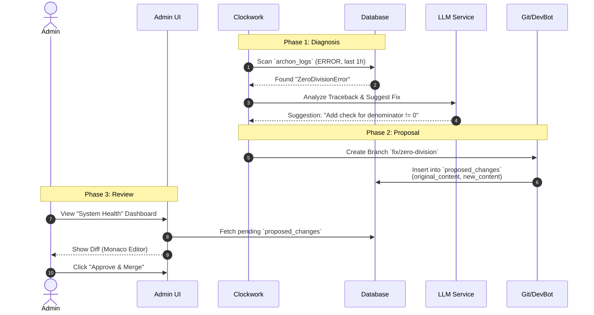

# Phase 4.6.4 Admin Persona: The Architect (系統架構師)

> **Status**: Draft
> **Role**: System Admin / CTO / SRE
> **Motto**: "Stable Core, Evolving Soul" (穩固核心，進化靈魂)
> **Goal**: 確保系統的安全性、穩定性與自我進化能力，維護 Archon 的「數位體質」。

---

## 1. 角色定位與權限優勢 (Role Definition)

Admin 是 Archon 系統的創造者與守護者。他擁有上帝視角 (God Mode)，但不應介入日常業務細節（那是 Charlie 的工作）。他的核心職責是維護 **「基礎設施 (Infrastructure)」** 與 **「認知架構 (Cognitive Architecture)」**。

### 角色責任區分 (Admin vs Manager)

| 特徵 | 👨 Charlie (Manager) | 🛠️ Admin (Architect) |
| :--- | :--- | :--- |
| **關注點** | **Business Health** (業績、轉換率) | **System Health** (API 延遲、錯誤率、Token 消耗) |
| **介入時機** | Alice 業績未達標時 | API 出現 500 Error 或 Agent 陷入死迴圈時 |
| **權限邊界** | 僅能看到自己部門的資料 | 可看到所有資料 (`override_ownership`)，但受稽核紀錄監控 |
| **核心工具** | Team Dashboard, Approval Queue | System Dashboard, Clockwork Patrol, Prompt Tuner |

---

## 2. 核心 Agent 協作矩陣 (The Agent Collaboration)

Admin 的 Agent 團隊不是用來處理業務，是用來「修系統」的。

| Agent 名稱 | 職責 (Role) | 核心能力 (Capability) | 如何節省 Admin 工時 (Efficiency) |
| :--- | :--- | :--- | :--- |
| **Clockwork (巡邏員)** | **主動巡邏 (L5)** (分析 `archon_logs` ERROR) | **不需手動查 Log**。每小時自動掃描錯誤，使用 `LLMProviderService` 分析 Traceback，區分是「偶發網路問題」還是「代碼邏輯錯誤」。 |
| **DevBot (工匠)** | **自癒執行 (L2)** (生成 Hotfix Branch) | **不需手寫修復代碼**。接收 Clockwork 的診斷，透過 `ProposeChangeService` 建立 `proposed_changes` 紀錄 (Diff)，供 Admin 一鍵批准。 |
| **Sentinel (哨兵)** | **安全監控** (API Key & RBAC 審計) | **不需手動檢查設定**。透過 `CredentialService` 定期檢查 API Key 額度，並監控 `auth.users` 異常權限變更。 |
| **Librarian (圖書館員)** | **知識管理** (RAG & Versioning) | **不需手動整理文件**。透過 `RAGService` 將 `VisitLogs` 與 `ArchonTasks` 轉化為與時俱進的參考資料。 |

---

## 3. 核心工作流程 (Admin Workflows)

### Workflow A: 系統自癒循環 (The Immune System)
> **場景**: 系統深夜發生未預期的 500 Error，Admin 起床後處理。

### Workflow B: RBAC 表格管理 (RBAC Table Management)
> **場景**: Admin 需要直接管理 `auth.users` 與 `public.profiles` 的權限矩陣，或處理特殊的權限升級要求。

1.  **Table Management Tool (UI)**:
    *   在 Admin Dashboard 新增 **"Identity Matrix"** 分頁。
    *   提供類似 Airtable/Supabase 的表格視圖，直接操作 `users` 與 `roles`。
    *   **Features**:
        *   **Role Promotion**: 下拉選單快速變更 Role (Member -> Manager)。
        *   **Permission Override**: 針對特定使用者開啟/關閉權限 (e.g., `can_delete_blog`).
        *   **Audit Trail**: 所有的變更都會被記錄在 `archon_logs` (Who changed Whom)。

### Workflow C: 資料庫活化與管理 (Database Activation)
> **核心概念**: 資料庫不只是倉庫 (Storage)，而是工廠 (Factory)。Admin 需確保資料「流動」並產生價值。

1.  **Leads 活化 (Job Board -> Leads)**:
    *   監控 `JobBoardService` 的自動抓取頻率。
    *   檢查 `leads` 表中 `enrichment_score > 80` 的轉換率。
    *   **Action**: 若轉換率低，調整 `JobBoardService.search_jobs` 的關鍵字參數。
2.  **Log 轉知識 (Visit Logs -> RAG)**:
    *   `VisitLogs` (Alice 的語音紀錄) 是死資料。
    *   **Action**: 觸發 `LibrarianService` 將 Log 摘要寫入 `knowledge_base` (或 RAG 索引)，讓 Bob 寫文章時能引用。
3.  **效能維護**:
    *   定期檢查 `pg_stat_statements` 找出慢查詢 (Slow Queries)。
    *   檢查 `archon_tasks` 與 `notifications` 的肥大化情況，執行 `VACUUM` 或歸檔舊資料。

### Workflow C: Prompt 管理與認知優化 (Prompt Tuner)
> **現狀**: Prompt 散落在 `python/src/server/prompts/*.py` (Hardcoded)。
> **目標**: 透過 `system_prompts` 表進行動態管理。

1.  **版本控制**:
    *   每個核心 Prompt (e.g., `BLOG_DRAFT`, `SALES_PITCH`) 在 `system_prompts` 表中應有 `version` 欄位。
    *   Admin 可透過 UI 比較 v1.0 與 v1.1 的差異。
2.  **A/B Testing**:
    *   設定 `marketing_api.py` 隨機使用 v1 或 v2 Prompt。
    *   分析兩者的 `User Correction Rate` (使用者修改 AI 產出的比例)。
    *   **Winner Take All**: 將表現好的版本升級為 Default。

### Workflow D: 文件版本控制 (Document Versioning)
> **問題**: RAG 知識庫中的文件過時會導致 AI 產生幻覺 (Hallucination)。

1.  **源頭追蹤**:
    *   所有 RAG 文件 (`knowledge_base`) 必須有 `source_ref` (e.g., `lead:123`, `file:policy.pdf:v2`)。
2.  **過期淘汰**:
    *   設定 TTL (Time To Live)。例如「市場趨勢」類文件 TTL = 3 個月。
    *   Librarian 定期標記過期文件 (`is_active = false`)，避免被 RAG 檢索。

---

## 4. 模型與 Token 現況比對 (Reality Check)

> **同步日期**: 2026-02-03
> **目的**: 確保文件與 `config.py` 及實際程式碼一致。

| 功能模組 | 理想狀態 (Plan) | 實際現況 (Reality) | 修正行動 (Action) |
| :--- | :--- | :--- | :--- |
| **LLM Backend** | 穩定架構 + Token 管理 | ✅ 實作於 `LLMProviderService`。已支援 Dynamic Routing。 | **維持現狀 (No New Providers)**。重點轉向 **Token 監控與配額管理 (Quota Management)**。 |
| **RAG Strategy** | Hybrid Search + Reranking | ⚠️ `RAGService` 邏輯完整，但 `RAGStrategyConfig` 尚未完全與前端 UI 連動。 | 將 `use_hybrid_search` 開關暴露給 Admin UI。 |
| **Image Gen** | **Google Imagen (Only)** | 🚧 **MOCKED**。`marketing_api.py` 目前回傳 Placehold.co 圖片。 | **僅串接 Google Imagen API**。使用與 Gemini 相同的 API Key 架構，不需額外架設 MCP Server，保持架構單純 (`marketing_api` 直接呼叫)。 |
| **Prompt Storage** | DB Driven (`system_prompts`) | ⚠️ **Hybrid**。代碼多使用 `prompts/*.py` 常數，DB 僅為備用/覆蓋用。 | 逐步將 Python 常數改為 DB Default Value。 |
| **Token Cost** | 即時監控儀表板 | ❌ 未實作。無法看到當日消耗金額。 | 實作 `TokenUsageService`，將每筆 Request 的 Usage 寫入 DB 並視覺化。 |

---

## 5. 落地實作缺口 (Implementation Gap Analysis)

要讓 Admin 真正運作，Phase 4.6.4 (Admin Persona) 需補足以下功能：

| 模組 | 現狀 (As-Is) | 缺口 (Gap) | 實作行動 (Action Item) | 優先級 |
| :--- | :--- | :--- | :--- | :--- |
| **UI** | 基礎 CRUD。 | 缺乏 **RBAC Matrix** 與 **System Dashboard**。 | 實作 `RbacTableManager.tsx` 與 `SystemHealthDashboard.tsx`。 | **High** |
| **Clockwork** | 僅能建 Task。 | 無法主動分析 Error Log 並呼叫 DevBot。 | 擴充 `scheduler_service.py`，新增 `log_patrol_job`。 | **High** |
| **DevBot** | 只能被動接單。 | 無法自動建立 Branch 與 PR (Proposal)。 | 強化 `DevBot` 整合 `git_tools.create_branch` 與 `proposed_changes` 表。 | **High** |
| **Token Ops** | 無法監控成本。 | 缺乏可視化的 Token 消耗報表。 | 實作 `TokenUsageChart` 整合 Recharts 顯示每日消耗。 | **Medium** |

---

## 6. 結論

Admin 的工作流是一個 **「閉環的免疫系統」**。
不同於 Charlie 關注「人的效率」，Admin 關注 **「機器的健康」** 與 **「成本的控制」**。

> **Admin 的成功指標**：
> 1. **MTTR (Mean Time To Repair)**: 從錯誤發生到修復的時間 < 1 小時。
> 2. **Prompt Efficiency**: 使用者修改 AI 產出的比例 < 20%。
> 3. **Token Governance**: 透過配額與監控，確保 API 成本在預算範圍內 (不超支)。
