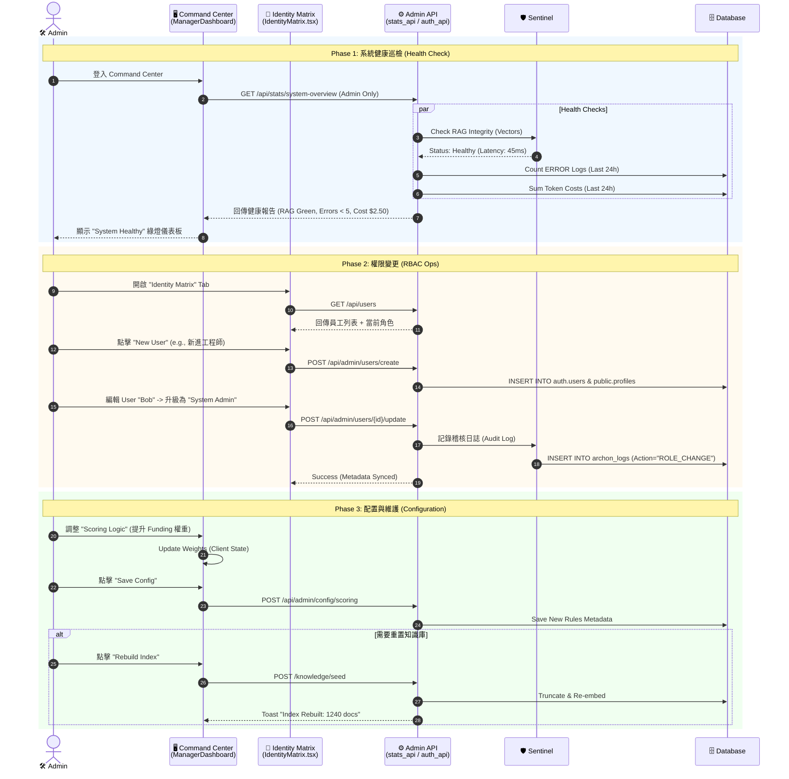

# Phase 4.6.4 Admin Persona: The Architect (系統架構師)

> **Status**: Implemented (2026-02-06)
> **Role**: System Admin / CTO / SRE
> **Motto**: "Stable Core, Evolving Soul" (穩固核心，進化靈魂)
> **Goal**: 確保系統的安全性、穩定性與自我進化能力，維護 Archon 的「數位體質」。

---

## 1. 角色定位與權限優勢 (Role Definition)

Admin 是 Archon 系統的創造者與守護者。他擁有上帝視角 (God Mode)，但不應介入日常業務細節（那是 Charlie 的工作）。他的核心職責是維護 **「基礎設施 (Infrastructure)」** 與 **「認知架構 (Cognitive Architecture)」**。

### 角色責任區分 (Admin vs Manager)

| 特徵 | 👨 Charlie (Manager) | 🛠️ Admin (Architect) |
| :--- | :--- | :--- |
| **關注點** | **Business Health** (業績、轉換率) | **System Health** (API 延遲、錯誤率、Token 消耗) |
| **介入時機** | Alice 業績未達標時 | API 出現 500 Error 或 Agent 陷入死迴圈時 |
| **權限邊界** | 僅能看到自己部門的資料 | 可看到所有資料 (`override_ownership`)，但受稽核紀錄監控 |
| **核心工具** | Operations Nexus, Approvals | Command Center, Identity Matrix, Config Grid |

---

## 2. 核心 Agent 協作矩陣 (The Agent Collaboration)

Admin 的 Agent 團隊不是用來處理業務，是用來「修系統」的。

| Agent 名稱 | 職責 (Rol) | 核心能力 (Capability) | 如何節省 Admin 工時 (Efficiency) |
| :--- | :--- | :--- | :--- |
| **Clockwork (巡邏員)** | **主動巡邏 (L5)** (分析 `archon_logs`) | **不需手動查 Log**。每小時自動掃描錯誤，使用 `LLMProviderService` 分析 Traceback，區分是「偶發網路問題」還是「代碼邏輯錯誤」。 |
| **DevBot (工匠)** | **自癒執行 (L2)** (生成 Hotfix) | **不需手寫修復代碼**。接收 Clockwork 的診斷，可透過 `ProposeChangeService` 建立 `proposed_changes` 紀錄 (Diff)。 |
| **Sentinel (哨兵)** | **安全監控** (API Key & RBAC 審計) | **不需手動檢查設定**。定期檢查 API Key 額度，並監控 `auth.users` 異常權限變更。 |
| **Librarian (圖書館員)** | **知識管理** (RAG Indexing) | **不需手動整理文件**。Admin 可透過 **"Rebuild Index"** 按鈕強制 Librarian 掃描所有文件並更新向量資料庫。 |

---

## 3. 詳細工作流程 UML (Day in the Life of Admin)

> **場景**: Admin 登入系統，首先確認系統健康度，處理權限變更要求，並監控 Token 成本。

---

## 4. 實作計畫 (Implementation Gap Analysis)

| 模組 | 現狀 (As-Is) | 缺口 (Gap) | 實作行動 (Action Item) | 狀態 |
| :--- | :--- | :--- | :--- | :--- |
| **System Health** | `ManagerDashboard.tsx` 內建 Admin 視圖。 | 功能完整，包含 RAG/Error/Agent 監控。 | **Dashboard Integration**: Admin 登入時自動顯示 Health Cards。 | ✅ Done |
| **RBAC** | `IdentityMatrix.tsx` 支援 CRUD 與角色升級。 | 無法針對單一權限 (Permission) 進行細粒度覆寫 (Override)。 | **Permission Override**: 目前權限表寫死於前端 (`ROLE_PERMISSIONS_MAP`)，需改為後端動態提供。 | ⚠️ Gap (Backend) |
| **Token Ops** | `stats_api.py` 有 `get_ai_usage`。 | 支援真實成本計算 (`cost_usd`) 與 Hybrid 統計。 | **Cost Visualization**: 在 Dashboard 顯示每日成本與預算百分比。 | ✅ Done |
| **Config** | `Scoring Logic` 這是前端 State。 | 規則設定尚未持久化到後端 DB。 | **Config Persistence**: 實作 `system_configs` 表來儲存動態規則。 | ⚠️ Gap (Persistence) |
| **Audit** | 後端有 Log，前端無專屬介面。 | Admin 無法在 UI 上直接搜尋稽核紀錄。 | **Audit Log Viewer**: 在 `IdentityMatrix` 或 Dashboard 新增 Log 查詢介面。 | ⚠️ Gap (UI) |

---

## 5. 結論

Admin Persona (`Phase 4.6.4`) 的基礎架構已完成 **80%**：
1.  **可視化 (Visibility)**: 透過 **Command Center**，系統健康度與成本一目了然。
2.  **可控制 (Control)**: **Identity Matrix** 讓人員管理變得直觀且簡單。
3.  **待優化 (Optimization)**: 下一步應專注於「配置持久化」與「權限細粒度管理」，以滿足更複雜的企業需求。
