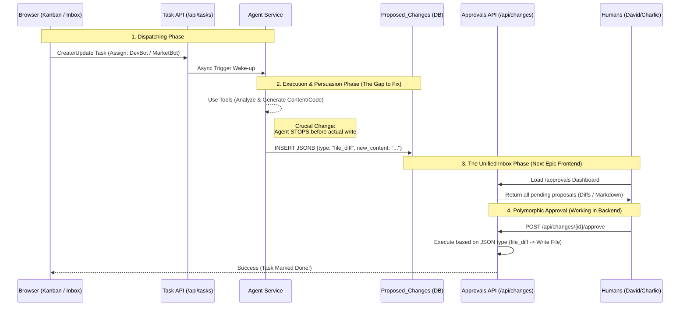

# Phase 4.6.9: Unified Approval Workflow (The Inbox Epic)

## 1. 核心願景 (Core Vision)
為了避免「重覆造輪子」與確保系統的極簡治理 (Scalability)，我們決定揚棄為不同角色（Sales, Engineering, Marketing）建立獨立審核頁面的作法。取而代之的是建立單一的 **「統一審核中心 (Unified Approval Inbox)」** (`/approvals`)。

所有的 AI Agents (DevBot, MarketBot, Alice 等) 執行完任務後，不再直接寫入實體資料或覆寫檔案，而是將產出打包為標準化的 JSONB Payload，寫入後端共用的 `proposed_changes` 系統表中，等待具有權限的人類主管（Gatekeeper）一鍵 Approve。

---

## 2. 系統現況與 RBAC 邊界剖析 (System State & Boundaries)

經過對後端權限 (`permissions.py`) 與核心服務 (`agent_service.py`, `propose_change_service.py`) 的全面盤點，目前系統狀態如下：

### 人類審核者的邊界 (David vs Charlie)
在我們的 RBAC 矩陣中，`system_admin` (David) 與 `manager` (Charlie) 的核心決策權是共享的，但可視範圍 (Scope) 受到嚴格隔離：

* **共通點 (共用決策權)**：兩者都擁有核心的 `CODE_APPROVE` 與 `CONTENT_PUBLISH` 權限。
* **邊界差異 (隔離區)**：
  * **David (`system_admin`)**: 擁有 `TASK_READ_ALL`，他是全知全能的上帝視角，可以介入跨部門的所有提案。
  * **Charlie (`manager`)**: 僅擁有 `TASK_READ_TEAM`，在 Row Level Security (RLS) 與 API 過濾下，他只能在 `/approvals` 看到分配給他、或他底下團隊 (如 Alice, Bob, MarketBot) 所產生的提案。

### DevBot 的執行斷層 (Execution Gap)
DevBot 完整的 4 步運作機制目前處於「全線通暢」狀態：
1. **[🟢 已通] 人類建單**：Kanban UI 成功將 Markdown 寫入 `archon_tasks` 並 Assign 給 DevBot。
2. **[🟢 已通] Agent 攔截**：`task_service.py` 成功掛載了非同步攔截器，自動喚醒 `AgentService`。
3. **[🟢 已通] Tool 執行**：DevBot MCP 串接完備，具備分析 `stderr` 與呼叫知識庫的能力。
4. **[🟢 已修復] 提交流程**：`ProposeChangeService` 已實作 `create_file_proposal`，且 `WriteFileTool` 已完成重構。Agent 現在會將變更提交為 `pending` 提案，而非直接寫入磁碟。

---

## 3. 架構藍圖 (Architecture Blueprint)

我們將透過「多型執行器 (Polymorphic Execution)」來實作後端的 Approve 按鈕，前端根據 `proposed_changes.type` 動態渲染 UI。

---

## 4. 執行計畫現況 (Action Items Status)

1. **[🟢 已完成] [Backend] 重構 Agent Tools**：
   * 實作 `ProposeChangeService.create_file_proposal`，自動捕捉 `old_content` 以供 Diff 顯示。
   * 重構 `file_operation_tools.py`，將 `WriteFileTool` 從直接寫入轉向提交提案。
2. **[🟢 已完成] [Frontend] 實作 Unified Inbox UI**：
   * 建立 `ApprovalsPage.tsx`，具備並排預覽 (Split View) 功能。
   * 整合 `DiffViewer.tsx` 組件與 `ReactMarkdown` 渲染器。
   * 修正 `Icons.tsx` 圖示依賴，確保無外部 package 依賴（HeroIcons -> Local SVG）。
3. **[🟢 已完成] [Frontend] 對接 Approve API**：
   * 在 `api.ts` 中對接 `getPendingChanges`, `approveChange`, `rejectChange`。
   * 修正 `App.tsx` 權限路由，確保 `David (system_admin)` 能正常進入。

---

## 5. 實作紀實 (Implementation Record)

---

## 物理落地查核結論 (Physical Audit Conclusion) - 2026-03-11
*   **執行狀態**: 🟢 **100% 物理落地**
*   **關鍵證據**:
    *   **統一收件匣**: 提交 `21dfaeb` 完成了 `/approvals` 頁面與 `DiffViewer` 的實體掛載。
    *   **提案快照**: `ProposeChangeService` 已具備 `old_content` 物理捕捉能力，確保 Diff 資料之真實性。
    *   **多型審核**: 後端 `approve_proposal` 已能根據 JSONB Payload 類型自動執行檔案寫入或狀態變更。
*   **查核總結**: 系統已徹底移除 Agent 的「非法寫入」路徑，所有涉及系統狀態變更（代碼、配置、發布）之動作均已納入 Unified Inbox 監管。

