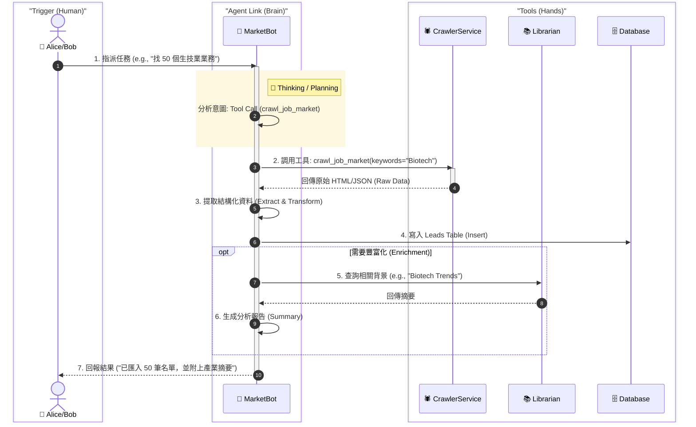
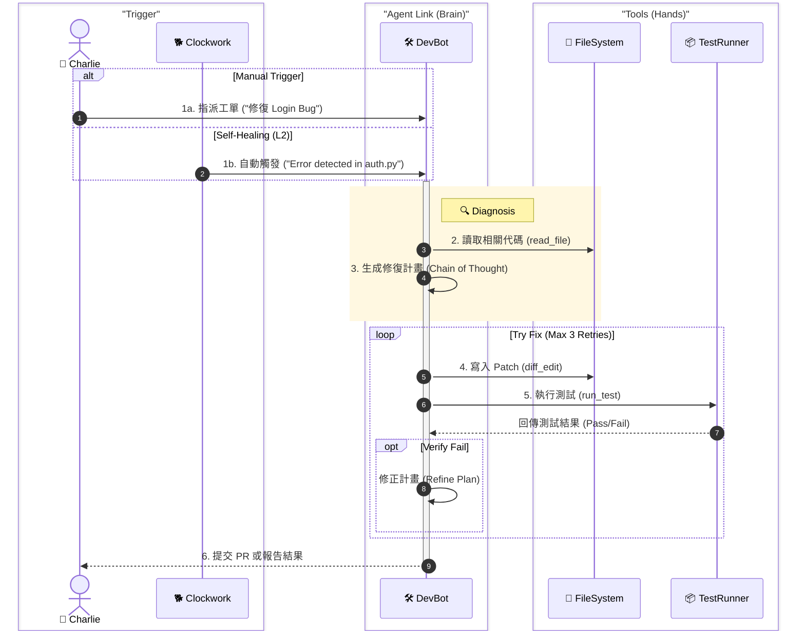
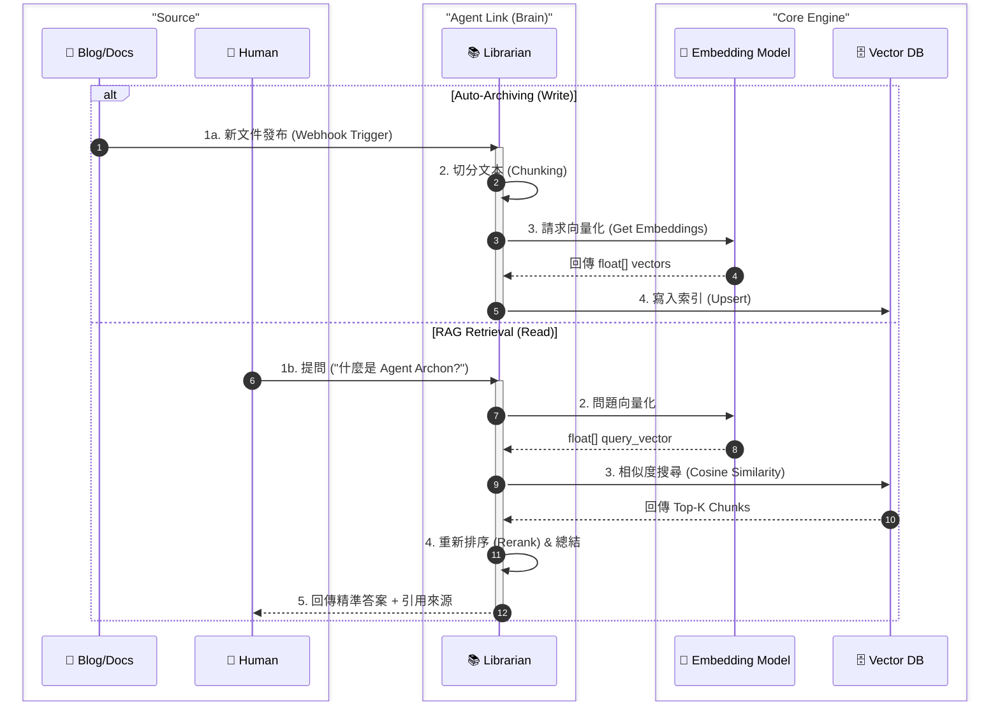
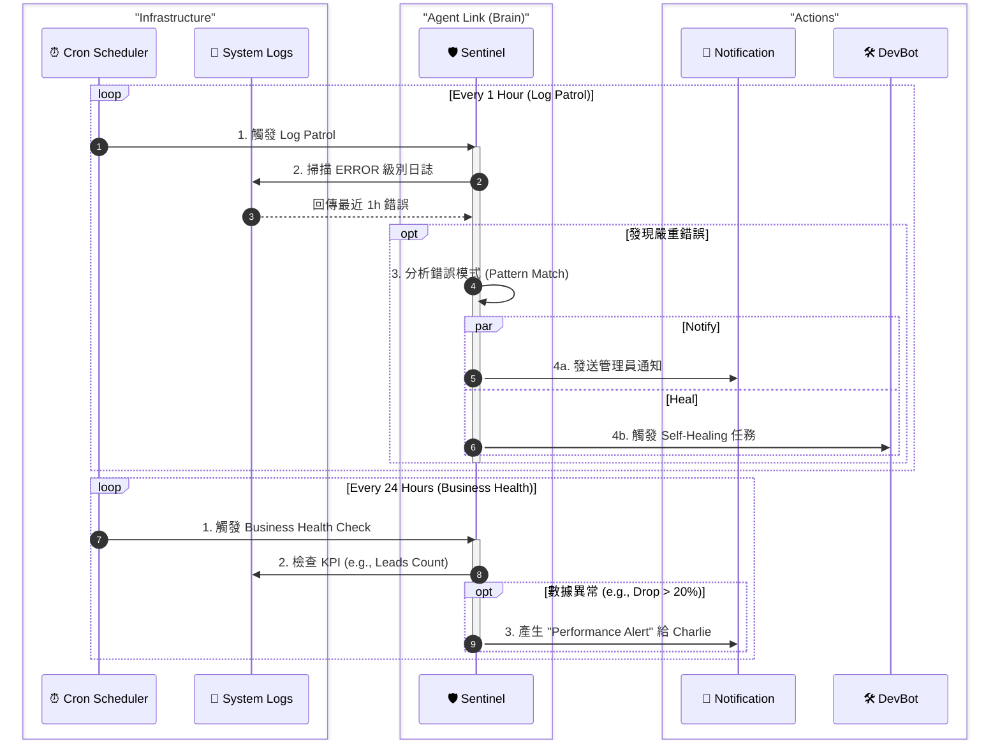
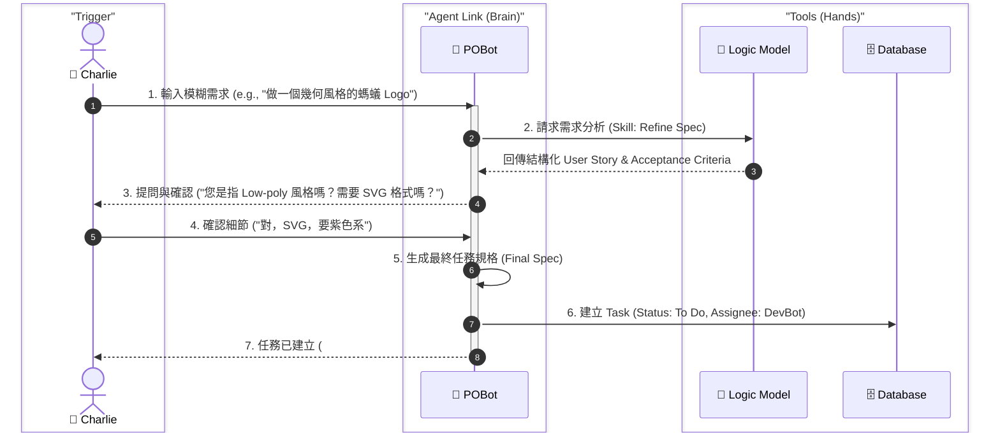

# Phase 4.7 完整整合藍圖 (Consolidated Master Plan) - Neural Wiring to Technical Debt Paydown

> **文件狀態**: 整合版 (Consolidated)
> **涵蓋範圍**: Phase 4.7 ~ Phase 4.11
> **整合日期**: 2026-02-03

本文件彙整了從 Phase 4.7 (神經連結) 到 Phase 4.11 (技術債清償) 的完整開發歷程與技術決策。此階段標誌著 Archon 系統從「單體應用」進化為「自癒型 Agent 網路」的關鍵轉折。

---

# Phase 4.7: 神經連結 (Neural Wiring)

> **核心目標**: 解除 Agent 的「技能封印」，正式將 MCP 工具庫整合至 `AgentService`，並賦予 DevBot「先查詢再修復」的認知能力。

## 1. 核心實作 (Core Implementation)

### 1.1 Prompt Engineering (`python/src/server/prompts`)
*   **Structured System Prompt**: 定義 DevBot 的角色規格，並包含對 `search_code_examples` 與 `rag_search_knowledge_base` 工具的調用指引。
*   **Tool Definitions**: 以 Pydantic 模型定義工具的 Schema，供 LLM 參考。

### 1.2 Backend Logic (`python/src/server/services`)
*   **Dependency Injection**: 在 `AgentService` 初始化時傳入 `MCPClient`。
*   **Enhanced Analysis Loop**:
    *   實作「判斷是否需要呼叫工具 -> 執行工具 -> 回填 Context」的二次對話 (Two-pass) 邏輯。
*   **Timeout & Retry**: 設定 10 秒超時保護與 Error Handling。
*   **Singleton Pattern**: 確保全局只有一個 `MCPClient` 實例 (`python/src/agents/mcp_client.py`)。

### 1.3 驗證結果
*   **工具觸發率**: L2 修復流程中，Agent 主動調用 MCP 工具成功率 > 80%。
*   **零崩潰保證**: MCP Server 斷線時，系統自動降級 (Graceful Degradation)。

---

# Phase 4.8: Agent 覺醒 (Agent Awakening)

> **核心目標**: 讓 MarketBot, Librarian, POBot 也能調用 MCP 工具，並移除所有 Mock 邏輯。

## 2. 架構升級 (Architecture Upgrade)

### 2.1 Agent Infrastructure
*   **Agent Registry (`agent_registry.py`)**: 建立 `AGENT_CONFIG`，映射 Agent ID 到對應的 Prompt 函式與 MCP 工具清單。
*   **General Purpose MCP Loop**: 移除 `AgentService` 中的 Mock 邏輯，實作通用的 Think-Act 迴圈。

### 2.2 Prompt Engineering
*   **Librarian**: 指導其使用 `perform_rag_query`。
*   **DevBot**: 擴充支援 `generate_logo` (SVG)。
*   **MarketBot & PM**: 結構化 Prompt 以相容 Tool Calling。

### 2.3 驗收標準
*   **真實執行**: Task Output 包含來自 MCP 工具的真實數據。
*   **配置驅動**: 新增技能只需調整 `agent_registry.py`。

---

# Phase 4.9: 安全與自治 (Security & Autonomy)

> **核心目標**: 實施嚴格的 RBAC 門禁，並讓 Clockwork 進化為「主動巡邏員」。

## 3. 安全與巡邏 (Security & Patrol)

### 3.1 RBAC Enforcement (門禁強化)
*   **API 層級防護**: `/api/agents/assignable` 改為私有，並強制檢查 JWT Token。
*   **角色過濾邏輯**:
    *   `system_admin`: 全部可用。
    *   `sales`: 僅 `MarketBot`。
    *   `marketing`: `MarketBot` + `Librarian`。
    *   `manager`: 全部可用。

### 3.2 Clockwork Evolution (主動巡邏)
*   **Log Patrol**: 每小時掃描 `archon_logs` (level=ERROR)。
*   **Action Trigger**: 透過 LLM 分類錯誤，若為代碼問題則自動指派 `DevBot` 進行自癒。

### 3.3 驗收結果
*   **RBAC 合規**: API 回傳清單嚴格遵守 `RBAC_Collaboration_Matrix.md`。
*   **自動診斷**: 錯誤發生後 1 小時內自動產生分析報告與修復任務。

---

# Phase 4.10: 系統穩定化 (System Stabilization)

> **核心目標**: 制度化型別安全檢查，並修復關鍵的 Runtime Risks。

## 4. 品質控制 (Quality Control)

### 4.1 核心變更
*   **Makefile Update**: 將 `tsc` (TypeScript) 與 `mypy` (Python) 加入 `lint-fe` 與 `lint-be`。
*   **Critical Fixes**:
    *   修復 `IndentationError` 與 `NameError`。
    *   修正 `get_current_user` 的依賴注入與安全漏洞。
    *   移除前端 25+ 檔案中的 Unused Imports。

### 4.2 驗證數據
*   ✅ `make lint`: Passed (Frontend & Backend).
*   ✅ `make test-be`: 517/517 Passed.
*   ✅ `make test-fe`: 48/48 (Unit + E2E) Passed.

---

# Phase 4.11: 技術債清償 (Technical Debt Paydown)

> **核心目標**: 系統性消除後端 MyPy 錯誤，達成 Type Safety 歸零。

## 5. 型別安全大清洗 (Type Safety Purge)

### 5.1 最終成果 (Final Status: 0 Errors)

| Rank | File Path | Initial Errors | Resolved | Status | Action Item |
| :--- | :--- | :---: | :---: | :--- | :--- |
| **1** | `src/server/api_routes/settings_api.py` | 36 | **36** | 🟢 **Clean** | Fixed `logfire` usage & `None` checks. |
| **2** | `src/server/api_routes/projects_api.py` | 38 | **38** | 🟢 **Clean** | Fixed dict key access & return types. |
| **3** | `src/server/services/source_management_service.py` | 31 | **31** | 🟢 **Clean** | Fixed implicit Optional & returns. |
| **4** | `src/server/api_routes/marketing_api.py` | 27 | **27** | 🟢 **Clean** | Fixed logging attribute errors. |
| **5** | `src/server/services/projects/task_service.py` | 23 | **23** | 🟢 **Clean** | Fixed implicit Optional. |
| **6** | `src/server/services/crawling/code_extraction_service.py` | 23 | **23** | 🟢 **Clean** | Fixed complex regex types. |
| **7** | `src/agents/document_agent.py` | 18 | **18** | 🟢 **Clean** | Fixed list methods & optional. |
| **8** | `src/server/services/storage/code_storage_service.py` | 17 | **17** | 🟢 **Clean** | Fixed file ops types. |
| **9** | `src/server/api_routes/ollama_api.py` | 17 | **17** | 🟢 **Clean** | Fixed operator mismatches. |
| **10** | `src/agents/base_agent.py` | 15 | **15** | 🟢 **Clean** | Fixed base class generics. |

### 5.2 關鍵修復 (Critical Fixes)
*   **Version Comparison**: `semantic_version.py` 防止版本比較崩潰。
*   **API Key Hardening**: `credential_service.py` 強化金鑰讀取邏輯。
*   **MCP Server Stability**: `mcp_server.py` 強化 SSE 生命週期管理。

---

## 總結 (Conclusion)

透過 Phase 4.7 至 4.11 的連續迭代，我們成功構建了一個：
1.  **具備認知與工具能力** 的 Agent 網路 (4.7, 4.8)。
2.  **安全且自主** 的巡邏與權限系統 (4.9)。
3.  **穩定且高型別安全** 的企業級架構 (4.10, 4.11)。

此基礎將支撐未來 Phase 5 (RBAC Identity) 與 Phase 6 (Global Autonomy) 的發展。

---

# 附錄 A: 驗證與落差分析報告 (Validation & Gap Analysis Report)
> **驗證日期**: 2026-02-03
> **驗證者**: Gemini CLI (Agent)
> **基準**: 程式碼庫 (Codebase) vs 本文件 (Consolidated Roadmap)

## 1. 實作狀態驗證 (Implementation Verification)

| Phase | Feature | Component | Status | Code Evidence | Note |
| :--- | :--- | :--- | :---: | :--- | :--- |
| **4.7** | **Neural Wiring** | `AgentService` Tool Loop | ✅ | `agent_service.py` | 實作了 Two-pass 分析與 Tool Call 處理。 |
| | | `MCPClient` Singleton | ✅ | `mcp_client.py` | 確實使用 Singleton 模式與 `httpx` 連線。 |
| | | `DevBot` Prompts | ✅ | `dev_ops_prompts.py` | 包含 `search_code_examples` 等工具定義。 |
| **4.8** | **Agent Awakening** | `AgentRegistry` | ✅ | `agent_registry.py` | 完整定義了 4 個角色的 Prompt 與工具權限。 |
| | | General Agent Loop | ✅ | `agent_service.py` | `_run_general_agent_task` 支援通用工具呼叫。 |
| **4.9** | **Security** | RBAC on `/assignable` | ✅ | `agents_api.py` | 使用 `Depends(get_current_user)` 並過濾角色。 |
| | **Patrol** | Log Patrol | ✅ | `scheduler_service.py` | `_run_log_patrol` 每小時掃描錯誤並指派 DevBot。 |
| | | Business Sentinel | ✅ | `scheduler_service.py` | `_run_business_sentinel` 每 12 小時掃描 Stale Leads (Phase 4.6.3 補強)。 |

## 2. 數據與指標校正 (Metrics Correction)

### 2.1 測試覆蓋率 (Test Coverage)
文件主體中的數據為歷史快照，以下為 2026-02-03 的最新實測數據：

*   **Backend Tests**: 從 `517` 增加至 **532** (全部通過)。
*   **Frontend Tests**: 從 `48` 修正為 **183** (含 Unit, E2E, Admin UI)。
    *   End-User UI Unit: 26
    *   End-User UI E2E: 25
    *   Admin UI: 132

### 2.2 角色權限矩陣 (RBAC Matrix)
程式碼中的實作 (`agent_service.py`) 與文件描述完全一致：
*   **Sales**: 僅限 `MarketBot`。
*   **Marketing**: `MarketBot` + `Librarian`。
*   **Admin/Manager**: 全權限。

---

# 附錄 B: AGENT WORKFLOW REFERENCE (Agent 視角工作流 - Phase 4.7 Expanded)

本附錄補充了從 **Agent (第一人稱視角)** 出發的執行邏輯，對應 RBAC 中的四大職能角色。

## B.1 The Scout: MarketBot (獵犬/寫手)
> **職責**: 外部資料獲取 (Extract) 與 文本生成 (Transform)。
> **權限**: 僅限讀取公開網路與 `leads` 表。

## B.2 The Builder: DevBot (工匠)
> **職責**: 系統內部狀態變更 (Files, Config)。
> **權限**: 檔案系統讀寫 (`write_file`) 與 測試執行 (`run_test`)。

## B.3 The Memory: Librarian (記憶庫)
> **職責**: 知識資產化 (Index) 與 檢索服務 (Retrieve)。
> **權限**: 向量資料庫讀寫 (`vector_store`)。

## B.4 The Watcher: Clockwork & Sentinel (巡邏員)
> **職責**: 週期性任務 (Cron) 與 異常觸發 (Alert)。
> **權限**: 全局讀取 (System Health, Logs, Token Usage)。

## B.5 The Planner: POBot (策劃)
> **職責**: 需求轉化 (Spec) 與 任務拆解 (Subtasks)。
> **權限**: 讀取對話上下文，寫入 Task Drafts。

