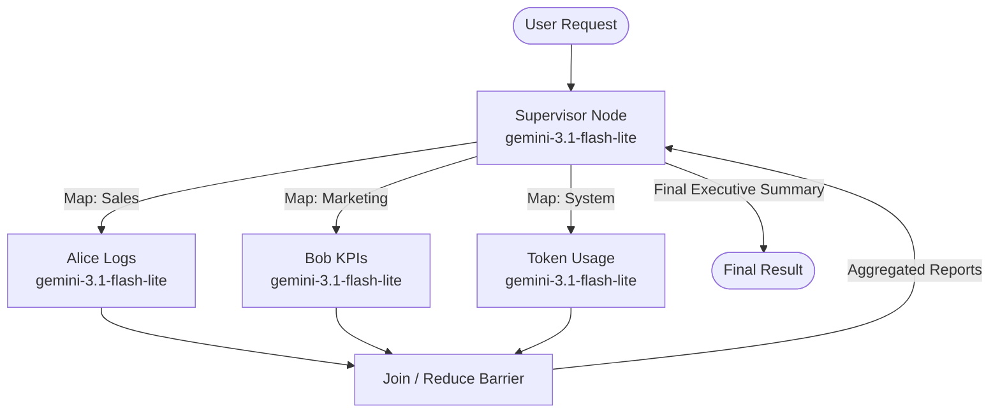

# Phase 5.1.10: Workflow Engine Fan-out (並發執行) 業務場景分析與實作計畫

本計畫旨在接續 Phase 5.1.9 的實驗性模組 (`engine_beta_graph.py`)，為 Archon 系統導入「非同步並發 (Fan-out / Parallel Execution)」的 Pydantic Graph 架構。

## User Feedback & Decisions

基於使用者的反饋，我們已確立以下實作方向：
1.  **首選商業場景**：**場景 C (Charlie 的多源情報彙整 Map-Reduce)** 最具商業價值，將優先作為 PoC 開發目標。
2.  **關於自動化與驗證**：是的，一旦 Fan-out 引擎測試穩定，這些並發 workflow 都可以完全掛載到現有的排程器 (`business.py` / Clockwork) 中成為**全自動化**任務，且能透過 `make test-be` (Pytest) 或 `make twin-scout` (Playwright) 進行全自動化斷言驗證。
3.  **關於 Token 消耗與 Free-Tier 限制的防禦策略**：
    *   **總量不變，但密度變高**：並發處理多筆資料，**不會增加「總 Token 數量」** (循序跟並發的算力總需求是一樣的)。但是，並發會導致 **RPM (每分鐘請求數)** 與 **TPM (每分鐘 Token 數)** 瞬間暴增。
    *   **模型精準對齊 (SSOT)**：根據 `model_ssot.py`，我們已全面淘汰舊的 preview 模型。現在 Map 階段 (子情報 Agent) 與 Reduce 階段 (Supervisor 總結) 皆統一使用目前最佳的 Free Tier 選擇：`gemini-3.1-flash-lite`。
    *   **精確的配額盤點與信號量控制 (Rate-Limiting & Semaphore)**：
        *   **實體限制**：根據文件與 SSOT，`gemini-3.1-flash-lite` 的免費額度為 **15 RPM** (平均每 4 秒 1 次) 與 **1000 RPD**。
        *   **防護策略**：Fan-out 若瞬間啟動 3 個 Worker，會在 1 秒內消耗 3 RPM (佔每分鐘額度的 20%)。為防止瞬間突發流量觸發 429 Too Many Requests，PoC 將實作 **信號量 (asyncio.Semaphore(2))**，並搭配微小的非同步延遲 (Jitter)，將平行任務「平滑化 (Smoothed)」，在享受並發加速的同時保護 API 額度。

---

## 1. PoC 實作計畫: 場景 C (Charlie 的戰情室 - Map-Reduce)

### 觸發點與預期行為
*   **觸發點**: 系統排程或 Charlie 主動索取每日團隊戰情報告。
*   **Fan-out (Map-Reduce) 實作**: 
    *   **Map (發散)**: Supervisor 喚醒 3 個不同的 Agent，分別並行分析：
        1. Alice 的日誌 (Sales Insights)
        2. Bob 的轉換率 (Marketing KPIs)
        3. 系統 Token 成本 (System Health)
    *   **Reduce (聚合)**: Join Node 將三份迷你報告合併，過濾掉雜訊後，交由 Supervisor 產出最終的 Executive Summary。

### 技術挑戰與防禦性設計 (State Management & Resilience)
*   **Race Condition 防禦**: 在 `BetaState` 中導入獨立的 `map_results` 字典，並在 `Join Node` 中以純函數 (Pure Function) 的方式統一合併 (Merge)，確保狀態不可變性 (Immutability)。
*   **Free-Tier 熔斷防禦**: 必須結合 Phase 5.4 的 `_run_agent_with_retry`，若遇到 429 錯誤，自動觸發 Exponential Backoff。

---

## 2. Pydantic Graph Beta 物理探測報告 (Physical Findings)

在進入真實 LLM 整合前，我們在沙盒環境中對 `pydantic_graph.beta` 進行了物理驗證，排除了以下樂觀幻想：

1.  **Map 拆解行為 (`ctx.inputs`)**: 
    在發散節點 (`worker_step`) 中，框架會自動將上游傳來的 Array (如 `["sales", "marketing", "system"]`) 拆解。`ctx.inputs` 實際上就是該次並發執行的「單一項目字串」。不需要使用 `ctx.inputs.values()[0]` 或寫迴圈。
2.  **Join 聚合與 Double-Execution 陷阱 (`downstream_join_id`)**: 
    官方文件宣稱 `add_mapping_edge` 使用 `downstream_join_id` 參數可防止空資料錯誤。但實體驗證發現，如果設定了這個參數，**同時又**按照常理使用 `builder.add_edge(join_node, final_summary_step)`，會導致最終的 `final_summary_step` 被執行**兩次**（第一次收到空字典，第二次收到真實資料）。
    *   **決策**: 移除 `downstream_join_id`，改用傳統的連續 `add_edge`，完美解決重複觸發問題。
3.  **信號量防禦 (`asyncio.Semaphore`)**: 
    證實可以在 Worker 節點中使用 `async with sem:` 有效限流。

---

## 3. Pydantic Graph 實作架構 (Proposed Architecture)

我們將在 `engine_beta_graph.py` 實作以下拓撲：

## 4. 接下來的執行步驟 (Execution Steps)

1.  ~~**定義 State**: 在 `engine_beta_graph.py` 擴充 `BetaState` 以支援 `map_results` 字典。~~ (✅ 完成)
2.  ~~**實作 Nodes**: 建立 `Map (Worker)` 與 `Reduce (Join)` 節點邏輯，並掛載 Pydantic Graph Edge。~~ (✅ 完成)
3.  ~~**注入 Semaphore**: 在 Worker 呼叫端加入 `asyncio.Semaphore(2)` 限制併發量。~~ (✅ 完成)
4.  ~~**Mock 驗證**: 準備 Alice/Bob/System 的假資料 (Mock Data)，進行第一次物理跑通 (Physical Run)。~~ (✅ 完成)

### 🚀 Phase 5.1.10 第二階段：實體 LLM 整合與公證 (Current Phase)

在確認 Mock 邏輯完美運行後，我們將進行真實的 LLM 整合：

1.  **注入系統依賴**: 將現有的 `SharedState` (承載 token 用量) 與 `Deps` (包含 Supabase client 等) 整合進 `BetaState`。
2.  **收斂 LLM 調用**: 在 Worker 與 Supervisor 節點中，**必須且只能**呼叫 `src.agents.workflow.utils._run_agent_with_retry()`，並指定 `model_name="gemini-3.1-flash-lite"`。此函式內建了 429 退避與 Token 成本追蹤。
3.  **定義 Worker Agents**: 實體化具備專屬 System Prompt 的 `pydantic-ai` Agent (Alice, Bob, System)，交由 Worker 執行。
4.  **防護網物理驗證 (Physical Verification)**:
    *   **Token ROI 不漏算驗證**: 執行後必須檢查 `SharedState.token_usage`，確認 3 個並發 Worker 消耗的 Token 都有正確累加，無 Race Condition 覆蓋。
    *   **429 熔斷測試 (Negative Test)**: 故意拔掉 Semaphore 製造高並發，觀察是否正常進入 Backoff 重試而非崩潰。
    *   **Map-Reduce 一致性驗證**: 斷言最終 `Executive Summary` 包含所有 3 份情報。
