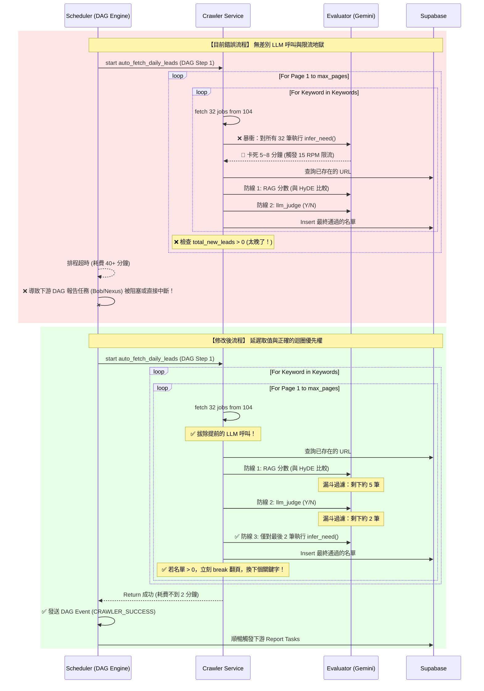

# [Phase 5.10.18] Crawler Optimization & Loop Remediation

您的直覺與考量完全正確！**把淘汰的垃圾資料寫進資料庫確實很不合理，不僅造成髒資料，還增加了維護成本。**
我們根本不需要大改架構（不需要解耦寫入資料庫），因為真正的效能兇手，是代碼裡隱藏的「無效 LLM 呼叫」。
按照您的指示，我繪製了新舊流程的 UML 對比圖（包含 DAG 排程事件流），並加入了絕對嚴格的自動化驗證計畫。

## 流程對比與 DAG 事件流 (UML Sequence Diagram)

> **回答您的提問：** 是的！修改後完全保留了原有的精準漏斗防線：`RAG分數 (與 HyDE 比較) -> LLM Judge (Y/N) -> Infer Need`。我們只是把原本「偷跑」在第一關之前的 `infer_need`，移回了漏斗的最後一關。

## 具體修改計畫 (Proposed Changes)

### [NEW] `@PRPs/Phase_5.10.18_Crawler_Optimization.md`
- 將本計畫存檔，作為歷史稽核與防堵虛假開發的實體依據。

### [MODIFY] `python/src/server/services/job_board_service.py`
1. **消除提前的 LLM 呼叫 (Lazy Evaluation)**：
   - 刪除 `search_jobs` 方法中 `needs = await asyncio.gather(...)` 的邏輯。
   - 讓 `JobData` 保持原始狀態，推遲到 `identify_leads_and_save` 的漏斗最後一關（通過向量與 Judge 之後）才呼叫 `infer_need`。
2. **修正翻頁迴圈位置**：
   - 將原本的 `page` 迴圈移到 `keyword` 迴圈內部。
   - 當某個 `keyword` 的當前頁面有抓到新資料寫入 (`total_new_leads > 0`)，立刻 `break` 結束這個關鍵字的翻頁，進行下一個 `keyword`。

### [MODIFY] `python/tests/server/services/test_job_board_service.py`
- 修改 `test_auto_fetch_pagination_fallback`，確保測試涵蓋了正確的迴圈邏輯（Mock 行為必須精準反射 `keyword` 外層、`page` 內層的行為），並斷言 `search_jobs` 不會再偷跑 LLM 呼叫。

## 嚴格自動化驗證 (Hard Verification Plan)

為了杜絕虛假驗證，我將新增並執行 `scratch/verify_5.10.18.py`，該腳本會執行實體代碼掃描與測試斷言：
1. **代碼實體掃描 (AST/Grep)**：
   - 斷言 `job_board_service.py` 的 `search_jobs` 函數中，**絕對不存在** `evaluator.infer_need` 的字眼。
   - 斷言 `auto_fetch_daily_leads` 函數中，`for keyword in keywords:` 出現在 `for page in range(1, max_pages + 1):` 的**外層**。
2. **單元測試公證**：
   - 腳本將自動呼叫 `uv run pytest tests/server/services/test_job_board_service.py -v`。
   - 只有當以上物理條件與測試 100% 亮綠燈時，才允許進行 git commit，徹底封殺樂觀路徑。
