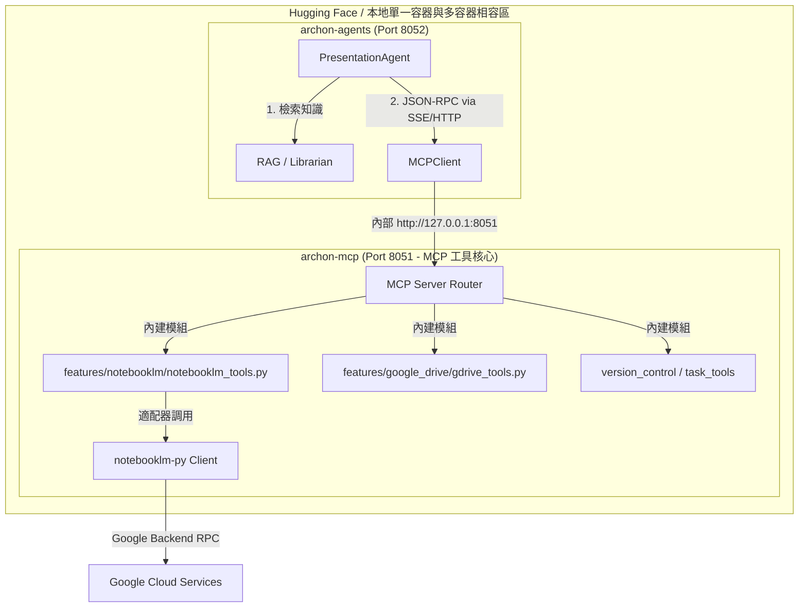

# NotebookLM 與 Google Drive MCP 整合實作計畫 (v4 - 雲端 HF 單一容器與相容性硬化)

本計畫提供基於 `archon-agents` 與 MCP 協議的完整架構設計，並針對 **Hugging Face Spaces 部署限制 (`scripts/deploy_to_hf.sh` 與 `start_all.sh`)** 進行實體相容性硬化。

---

## 🔍 一、 雲端 Hugging Face 部署實體查核 (HF Deployment Audit)

經查核 `.github/workflows/deploy-hf.yml`、`scripts/deploy_to_hf.sh` 與 `python/start_all.sh`，確認以下物理部署事實：

1. **單一容器限制 (Single Docker Container)**:
   * HF Spaces 僅支援單一 Docker 容器 (`sdk: docker`, 門戶 Port 8181)，**無法運行 `docker-compose` 多容器架構**。
2. **多進程併發機制 (`start_all.sh`)**:
   * 當部署至 HF 時，`scripts/deploy_to_hf.sh` 會將 `Dockerfile.server` 複製為 `Dockerfile`，並設定 `START_MCP=true` 與 `START_AGENTS=true`。
   * 容器啟動時，由 `start_all.sh` 在**同一個容器內部**以背景進程 (`&`) 形式分別啟動：
     * `archon-mcp` (內部 Port 8051)
     * `archon-agents` (內部 Port 8052)
     * `archon-server` (對外 Port 8181)

### 💡 部署相容性戰略 (Deployment Strategy):
為了確保程式碼在 **「本地全 Docker/混合模式」** 與 **「Hugging Face 雲端單一容器」** 皆能 100% 物理執行：
* ❌ **嚴禁新增獨立的 Docker 容器**（否則在 HF 上會因為無 docker-compose 而無法運行）。
* 🟢 **正確作法**：將 NotebookLM 工具直接模組化掛載至既有的 `python/src/mcp_server/features/notebooklm/` 之中。
  * **本地模式**: 由 `archon-mcp` (Port 8051) 提供服務。
  * **HF 雲端模式**: 由 `start_all.sh` 啟動的背景 MCP 進程 (Port 8051) 統一提供服務。

---

## 📐 二、 雙模式相容 UML 架構圖

### 2.1 系統模組架構圖 (Multi-Environment Compatible Architecture)

---

## 🛡️ 三、 專案食譜 (CONTRIBUTING_tw.md) 風險硬化對齊

1. **雲端單一容器相容 (部署 SOP)**:
   * *防禦*: 遵循 `deploy_to_hf.sh` 規範，不安裝任何需要額外 Docker 服務的組件，確保 `git push hf` 後能自動打包運行。
2. **Cookie 加密 Mac-to-Docker 盲區 (食譜 2.4 節)**:
   * *防禦*: HF 雲端與本地 Docker 皆統一讀取環境變數 `NOTEBOOKLM_COOKIE` 與 `GOOGLE_DRIVE_OAUTH_TOKEN`，絕不依賴本地 Chrome 實體檔。
3. **防範虛假測試與型別斷層 (食譜心法 13)**:
   * *防禦*: `test_presentation_agent.py` 的 Mock payload 必須 100% 物理對齊 `notebooklm-py` 的 DTO。
4. **防範單檔膨脹 (食譜附錄 B)**:
   * *防禦*: Agent 程式碼與 MCP 工具定義各自獨立，`presentation_agent.py` 控制在 200 行內。

---

## 🛠️ 四、 具體檔案變更清單 (Proposed Changes)

### 1. Agent 核心邏輯
#### [NEW] `python/src/agents/presentation/__init__.py`
#### [NEW] `python/src/agents/presentation/presentation_agent.py`
繼承 `BaseAgent`。呼叫 RAG -> 呼叫 Port 8051 MCP 的 `notebooklm_ask_question` -> 呼叫 GDrive 工具歸檔。

### 2. MCP 工具鏈 (相容本地與 HF)
#### [NEW] `python/src/mcp_server/features/notebooklm/__init__.py`
#### [NEW] `python/src/mcp_server/features/notebooklm/notebooklm_tools.py`
定義 `notebooklm_list_notebooks`, `notebooklm_ask_question`, `notebooklm_create_notebook` 等 MCP 工具。

#### [MODIFY] `python/src/mcp_server/server.py`
將 `notebooklm_tools` 註冊進主 MCP Server。

### 3. 生命週期與依賴
#### [MODIFY] `python/pyproject.toml`
在 `[dependency-groups] mcp` 與 `agents` 下補充 `notebooklm-py` 所需之輕量 HTTP 依賴。

---

## 🚦 五、 驗證計畫 (Verification Plan)

1. **靜態與型別檢驗**: 執行 `make lint-be` 與 `make phase-audit`，確認型別覆蓋率 99% 以上。
2. **HF 部署腳本模擬驗證**: 本地執行 `bash scripts/deploy_to_hf.sh` (Dry-run)，確保 orphan branch 打包無缺檔與體積過大問題。
3. **SAP 自動化測試研究落地**: 實測對「**SAP 自動化測試**」進行 RAG 檢索，並透過 Port 8051 產出簡報與歸檔。
