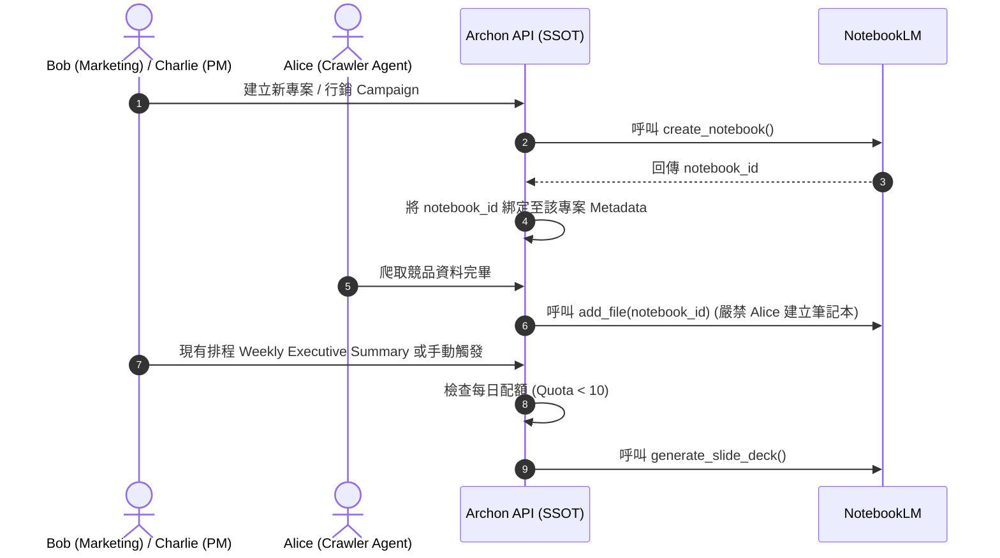

# Phase 5.11.3: NotebookLM Lifecycle, Roles & Quota Hardening Plan

## 1. 核心目標 (Core Objectives)
為了解決 Phase 5.11.1 與 5.11.2 中發現的技術債，本計畫旨在將 NotebookLM 的整合從「單點指令」升級為「全生命週期管理」。重點在於：
1. **嚴格拒絕硬編碼 (No Hardcoding) 與落實 SSOT, DRY**：所有配額參數、Prompt、筆記本 ID 與模型名稱，**必須**透過 `SettingsService` 或 DB Metadata 動態讀取。嚴禁在程式碼中寫死任何字串或 ID。
2. 嚴格界定多代理人 (Alice, Bob, Charlie) 的操作邊界。
3. 導入每日配額的 Fail-Fast 防護。
4. 實現 Supabase 與 Google Drive 的雙軌知識庫歸檔，徹底落實單一事實來源。
5. **強制導入自動化驗證 (Automated Verification)**：確保上述生命週期與防護機制必須具備完整的 E2E 探針腳本 (如 `make probe`) 公證，拒絕無實體測試保護的樂觀路徑開發。

---

## 2. 角色職責邊界與工作流程對齊 (Role & Workflow Boundaries)
嚴格禁止底層 Agent 隨意生成筆記本或簡報，必須依附於人類核心角色的業務週期。以下為架構對齊 UML 說明：

* **Bob (行銷) / Charlie (PM) - 決策與週期觸發者**：
  * **初始化**：當 Bob/Charlie 在系統內開啟新專案 (Project) 或行銷 Campaign 時，觸發 Notebook 建立，並寫入 `project.metadata` (SSOT)。
  * **產出**：絕不幻想未實作的排程。依據系統現有的 `scheduler_service.py` (`_run_weekly_executive_summary`)，我們可以將其擴充：當 Weekly Executive Summary 產生純文字報告後，若 metadata 允許，才連動觸發 `PresentationAgent` 轉換為 PPTX 歸檔；或由 Bob 手動於前端點擊「生成客製化提案」觸發。
* **Alice (爬蟲) - 純粹的資料餵養者 (Data Feeder)**：
  * **限制**：Alice **無權**呼叫 Notebook 建立或簡報生成 API。
  * **職責**：僅能將爬取的競品資訊，作為 `source` 同步至早已由上述流程建立好的既有 Notebook 內。

---

## 3. 解決技術債之具體實作計畫 (Implementation Steps)
本階段嚴禁虛假開發，必須完全落地並對齊現有系統真實的實體架構。

### 3.1 生命週期：新建筆記本與 Metadata 綁定 (Provisioning Debt)
* **實作位置**：`python/src/server/services/project_service.py` (真實對齊)
* **實體邏輯變更**：
  在建立新 Project (呼叫 `create_project`) 時，非同步呼叫 `notebooklm-py` 的 `client.notebooks.create()`。
  將回傳真實的 `notebook_id` 寫入 `archon_projects.metadata->>'notebook_id'`，達成 SSOT 綁定。

### 3.2 架構防護：每日 10 次額度鎖定 (Quota Lock Debt)
* **實作位置**：`python/src/server/services/settings_service.py` 與 `dispatcher.py` (真實對齊)
* **實體邏輯變更**：
  1. 於 `SettingsService` 實作計數器邏輯，將用量寫入 `archon_settings` 表 (如 `notebooklm_daily_usage`)。
  2. 每次 `PresentationAgent` 啟動前，`dispatcher.py` 物理檢查該計數器。若當日大於等於 9，立刻阻斷向 Google 發出的請求，拋出真實 `Exception`。

### 3.3 雙軌儲存：Supabase 與 Google Drive (Dual-Track Knowledge Debt)
* **實作位置**：`python/src/agents/presentation/presentation_agent.py` 與 `document_service.py` (真實對齊)
* **實體邏輯變更**：
  當 `client.artifacts.generate_slide_deck()` 完成後：
  1. **給人類 (PPTX)**：透過真實的 `gdrive_upload_file` (帶入 Refresh Token) 上傳至 Google Drive。
  2. **給系統 (PDF)**：呼叫 `download_slide_deck(output_format="pdf")`。將實體 `/tmp/xxx.pdf` 透過現有的 `document_service.process_document()` 上傳到 Supabase Storage 並觸發 `pgvector` 寫入。

---

## 4. 驗收標準 (Acceptance Criteria)
- [x] 專案建立時，系統能自動在 Google 端產生對應的 NotebookLM 筆記本，並正確關聯至 DB。
- [x] Alice 爬蟲工具鏈中沒有任何 `create_notebook` 的呼叫權限，只能操作 `add_file`。
- [x] 短期內連續觸發 10 次生成，系統能在第 10 次由本地 DB 成功攔截並報錯，不消耗實際外部 API 請求。
- [x] 簡報生成後，能同時在 Google Drive 看到 PPTX，並在 Supabase 看到完成向量化的 PDF。

## 5. 自動化驗證計畫 (Automated Verification Plan)
為確保不落入虛假開發，本計畫實作完畢後，必須依序通過以下品質門禁公證：

### 5.1 靜態與健康度門禁 (Static & Health Gates)
在提交程式碼前，必須強制在終端機通過：
1. **`make lint-be`**：確保所有新增的 Python 代碼與 Pydantic 型別符合 Ruff 規範。
2. **`make test-be`**：執行全部 600+ 項後端單元測試，確保本次修改沒有破壞既有的 `dispatcher.py` 與 API 路由邏輯。
3. **`make phase-audit`**：執行階段與型別健康度稽核，確保新加入的 RAG 或 Agent 邏輯並未產生型別斷層。

### 5.2 物理探針驗證 (Physical E2E Probe)
必須在 `scripts/` 下撰寫 `verify_notebooklm_lifecycle.py` 探針進行真實連線與寫入測試：
1. **生命週期斷言**：模擬呼叫建立專案，斷言資料庫 `metadata` 是否成功綁定 `notebook_id`。
2. **防護斷言**：直接對計數器寫入 10，斷言下一次生成是否確實觸發系統本地的 `Quota Exceeded` 錯誤並阻斷外部請求。
3. **雙軌捕獲斷言**：驗證產出階段是否在 `/tmp/` 成功捕獲 `.pdf` 與 `.pptx` 雙格式實體檔案。

(⚠️ 本計畫在使用者批准前，不進行任何程式碼修改)
