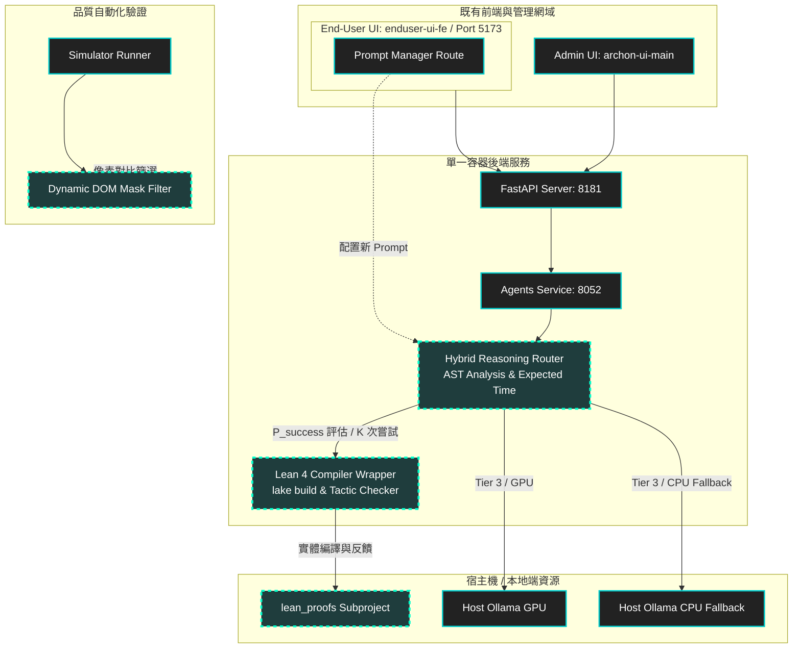

# Phase 5.6.0: Lean 整合、離線與自動化工作流優化計畫 (Lean & Offline Workflow Optimization)

## 核心目標 (Goal)
本階段目標在於銜接已完成的 Phase 5.5 系列成果，針對 **Lean 4 本地/雲端輔助證明**、**本地算力效益匹配**，以及 **Digital Twin 百關模擬器的運行負擔與視覺對帳** 進行整合性優化與文件化。

---

## 研發背景與說明 (R&D Background & Context)

本階段的研發背景源自於系統在 Phase 5.5 系列（包含 Docker OOM 瘦身、3-Tier Fallback 降階機制與 Clockwork 節律感知）落地後，所面臨的「本地自主化」與「資源開銷」之間的摩擦力。

隨著 `lean_proofs` 子專案的引入，系統開始具備形式化證明的撰寫潛力。然而，如何在本地資源有限甚至斷網的環境下，既能維持 AI 輔助證明的精準度，又不會因為無效的本地推論死循環或巨型的 E2E 視覺對帳（Vision Judge）拖垮開發機的 CPU 效能，成為了亟待解決的關鍵課題。

我們必須在啟動新一輪開發前，建立量化的物理依據（Empirical Benchmarks），用以判定何時該讓任務「留在本地」以節省成本並保護數據隱私，何時該「求助雲端」以獲得高精度的邏輯解答。

---

## 系統架構對比圖 (Architecture Comparison)

在本次優化計畫中，以下架構圖以不同顏色區分了**既有基礎設施**與**本階段（Phase 5.6.0）新增之組件與邏輯**：

---

## 研發痛點與實證假設 (Hypothesis & Pain Points Analysis)

> [!WARNING]
> **假設防禦與數據補強**：本計畫所提之對策，在尚未收集到實際運算數據前，皆為「工程實證假設 (Hypotheses)」。本階段的第一步任務**必須是執行基準測試 (Benchmarking)**，以獲取精確的效能與成功率數據，拒絕憑空幻想。

### 1. 痛點一：本地模型算力與 Docker 啟動效益比值失衡 (本地無 GPU 假設)
*   **現狀說明**：Docker 啟動僅需 15~30 秒，但若將 Ollama 服務直接執行於 Docker 容器內，由於無法共享 macOS Host 的 Metal (GPU) 硬體加速，或者**假設本地開發機/CI 容器根本沒有 Metal GPU 加速（處於純 CPU 運算狀態）**，模型推理會面臨嚴重的效能降階。
*   **數據瓶頸**：在純 CPU 模式下，推理 `gemma3:4b` 速度會降至 **2~5 tokens/s**。如果一個背景任務需要生成 500 字，這將耗時將近 2 分鐘，造成算力效益與啟動時間的嚴重失衡。
*   **實證對策 (CPU-Bound Fallback Strategy)**：
    *   **Host-Bridged 優先**：若宿主機支援 GPU，優先實作 `http://host.docker.internal:11434` 對接本機 native Ollama。
    *   **無 GPU 物理降階機制**：若檢測到運行環境為純 CPU 運算，系統將自動調降本地模型尺寸（例如將 `gemma3:4b` 降階為微型的 `qwen2.5:0.5b` 或 `gemma3:1b`），以確保推論速度維持在 15 tokens/s 以上。
    *   **數據補強指標**：設計腳本測試並記錄「Host GPU」、「Host CPU」、「Docker CPU」三種狀態下的載入秒數與推論速率 (Tokens/s)，做成硬體能力矩陣報告。

### 2. 痛點二：兩種 LLM 推理深度與編譯等待時間匹配 (數學期望值評估)
*   **現狀說明**：本地 3B~4B 級別模型並不具備高難度的定理邏輯推導與 Proof Search 能力。若讓其嘗試編寫複雜的 Lean 4 證明，將因語法錯誤被 `lake build` 不斷退件，陷入無意義的 CPU 運算迴圈。
*   **數學匹配公式 (Mathematical Expectation)**：
    寫出一個正確編譯證明的預期總時間 $E[T_{total}]$ 可被定義為：
    $$E[T_{total}] = \frac{T_{inference} + T_{compile}}{P_{success}}$$
    其中：
    *   $T_{inference}$：LLM 生成證明程式碼的時間。
    *   $T_{compile}$：Lean 4 編譯器 (`lake build`) 執行編譯與驗證的時間。
    *   $P_{success}$：產出之證明程式碼正確且通過編譯的機率。
*   **數據匹配推論**：
    對於本地小型模型，$P_{success}$ 面對中高難度定理時趨近於 $0$，導致 $E[T_{total}]$ 趨向無限大（陷入死循環）；而雲端 Pro 模型（如 Gemini 1.5 Pro）具備極高的推理深度，$P_{success}$ 顯著提升，使總時間收斂。
*   **實證對策 (Hybrid Reasoning Router)**：
    *   **複雜度估算路由**：依據證明的抽象語意樹（AST）深度或目標 Tactic 數量評估難度。
    *   **本地重試門檻**：若本地模型嘗試 $K$ 次（預設 $K=2$）仍編譯失敗，路由必須立即中斷本地迴圈，自動升級調用雲端 Pro模型，以防耗盡本地 CPU 資源。

### 3. 痛點三：百關挑戰（Digital Twin Simulator）的運行負擔與對策評估
*   **現狀說明**：`simulator_runner.py` 執行 E2E 併發測試時，若因動態欄位或網絡混沌注入導致像素差異大於 5.0%，會觸發 `vision_judge.py`（多模態 VLM 判定）。在本地執行時，高頻呼叫 VLM 會給 CPU 帶來極大壓力，導致百關挑戰執行超時。
*   **對策獨立性與數學評估**：
    本計畫提出之對策 A、B、C 為 **獨立且互補的方案**，其數學效益評估如下：

    #### 對策 A：動態 DOM 遮罩過濾 (Dynamic Masking)
    *   **機制**：在 PIL 像素比對階段，使用 Mask 主動排除「時間戳記」、「Log 內容」與「變動計數器」等變動區域。
    *   **數學評估**：
        設 $N_{total}$ 為總測試關卡數（如 100），$P_{call}$ 為像素差異大於 5.0% 而觸發 VLM 呼叫的機率。
        透過遮罩將動態區塊的版面變異數 $\sigma^2_{layout}$ 降至趨近於 $0$，可將 $P_{call}$ 從預估的 $\approx 25\%$ 降至 $\approx 1\%$。
        預期 VLM 呼叫次數 $E[C_{vlm}] = N_{total} \times P_{call}$ 將由 $25$ 次降至 $1$ 次，大幅節省 VLM 推論開銷。

    #### 對策 B：限額防禦模式 (Limit Mode)
    *   **機制**：Makefile 常規測試僅限額跑 `--limit 3` 關卡，Major Release 整合測試才跑 100 關。
    *   **數學評估**：
        強行限制最大執行關卡數 $N_{run} = \min(N_{total}, 3)$。
        此對策保證了在開發測試（Dev Commit）期間，本地最壞情況下的 VLM 呼叫次數被物理截斷為 $\le 3$ 次。

    #### 對策 C：網路與睡眠感知 (Circadian Gate)
    *   **機制**：當 HF 處於休眠期（台灣時間 00:18 ~ 06:41 CST）或本機斷網時，對策二（VLM 評判）自動降階為 `[Skip VLM Judge]`。
    *   **數學評估**：
        引入二元過濾器 $G \in \{0, 1\}$，VLM 運算成本將乘以 $G$（當處於睡眠或無網狀態時 $G = 0$），徹底免除極端環境下的 VLM 阻塞時間。

---

## 建議變更與詳細實作計畫 (Proposed Changes & Detailed Implementation Plan)

### 1. 資料庫 Prompt 治理整合 (Prompt Seeding & UI Sync)
*   **實作變更檔案**：
    *   [11_seed_config.sql](file:///Users/vincenta/GoogleKwok022/Archon/migration/0.2.2/11_seed_config.sql) (或新增對應的 SQL patch 檔案)
    *   [init_db.py](file:///Users/vincenta/GoogleKwok022/Archon/scripts/init_db.py)
*   **詳細步驟**：
    1. 在 `prompts` 種子資料庫表格中注入新欄位：
       * `key`: `'LEAN_4_DEVELOPER_ASSISTANT'`
       * `prompt`: 包含 Lean 4 基本架構語法、tactics 強制指令、編譯反饋解析規則。
    2. 更新 `init_db.py` 以確保升級數據庫時會自動 Append 此 Seed，且在 5173 前端 Prompt Manager 介面可以直接進行增刪改查。

### 2. 混合推理路由器 (Hybrid Reasoning Router) 實作
*   **實作變更檔案**：
    *   [NEW] `python/src/server/services/llm/hybrid_router.py`
    *   [MODIFY] [base.py](file:///Users/vincenta/GoogleKwok022/Archon/python/src/server/services/llm/base.py)
*   **詳細步驟**：
    1. 新建 `HybridRouter` 類別，實作基於 $E[T_{total}]$ 的決策演算法。
    2. 提供 `evaluate_complexity(proof_context: str) -> int` 函式，解析當前 Lean 定理證明的 AST 複雜度。
    3. 在 `base.py` 路由入口注入 `HybridRouter`。當檢測到目標為 Lean 4 證明生成時，若難度大於臨界值或本地重試計數器 $K \ge 2$，自動將請求發送至 Tier 1 雲端 API，否則指派給本地 Ollama。

### 3. Lean 4 本地編譯驗證器 (Lean 4 Compiler Wrapper)
*   **實作變更檔案**：
    *   [NEW] `python/src/server/services/lean/compiler_service.py`
*   **詳細步驟**：
    1. 封裝 `LeanCompilerService` 類別，透過 `subprocess` 在隔離環境下調用 `lake build`。
    2. 實作錯誤解析器 `parse_lake_errors(stdout: str) -> dict`，將編譯出錯的行數、tactic 失敗原因轉化為結構化的錯誤 JSON，供 Agent 或 LLM 作為自癒輸入。

### 4. 百關模擬器動態遮罩 (Dynamic DOM Mask Filter)
*   **實作變更檔案**：
    *   [MODIFY] [simulator_runner.py](file:///Users/vincenta/GoogleKwok022/Archon/scripts/simulator_runner.py)
*   **詳細步驟**：
    1. 於 PIL 比對邏輯前，引入遮罩區域 JSON 配置檔 `baselines/viewport_mask.json`。
    2. 使用 `PIL.ImageDraw.Draw` 將座標中定義的動態區域（例如頂欄時間戳、日誌輸出框等）實體塗黑（填充 `#000000`）。
    3. 執行像素比對，確保動態渲染產生的偽隨機誤差不計入 5.0% 閾值。

---

## 驗證計畫 (Verification Plan)

### 1. 實證基準測試 (Empirical Benchmarks)
*   執行本地 native Ollama 在開啟/關閉 Metal 加速下的運算比對，以及純 CPU 下不同尺寸模型（1B vs 4B）的 Tokens/s 比對。
*   驗證 `make twin-simulator --limit 3` 於離線環境下，PIL 對比與 `vision_judge` 降階機制運作正常。

### 2. 自動化測試
*   新增測試確保 `LEAN_4_DEVELOPER_ASSISTANT` Prompt 能被後端正確載入，且在 DB 斷線時能正確回退至代碼中的 default prompt。
