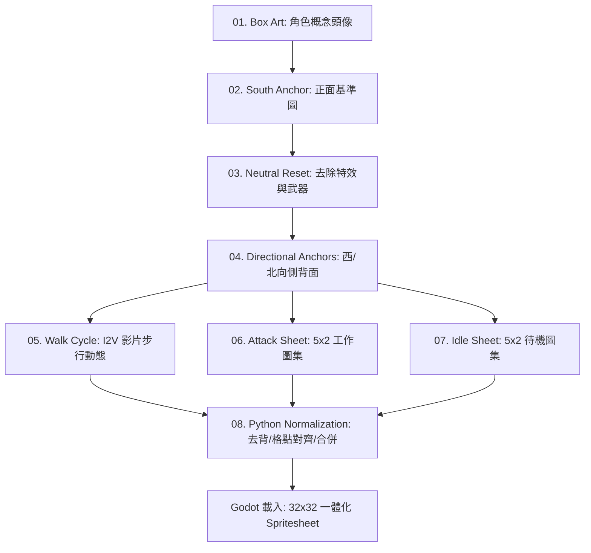

# Phase 5.7.3: 32x32 AI-Game-Spritesheets Integration and in-game Prompt Manager

## 核心目標 (Goal)
本階段將為 `archon-agency-tycoon` 導入基於 **32x32 像素規格** 的 **預烘焙狀態圖集 (Pre-Baked State Spritesheets)** 開發架構，取代目前拼裝紙娃娃對位系統，終結「五官錯位 (鬼圖)」與「髮色溢出 (面罩)」的痛點。
同時，在遊戲中設計並整合 **「AI Prompt Manager」** 招募面板，使玩家可直接管理龐大的員工 Prompt 庫與對應的生成動態影格。

---

## 🛡️ godot-4-audit 合規性聲明
本階段開發將嚴格遵守 `godot-4-audit` 規範，具體實施以下三項核心標準：
1.  **1.1 靜態型別 (Static Typing) 門禁**：新撰寫的所有變數與函數特徵均強制實行靜態型別宣告。
2.  **2.1 無頭編譯防禦 (Headless Class_Name Fallback)**：跨腳本引用與型別約束時，一律採用 base 類型搭配 `preload`，防止無頭測試編譯中斷。
3.  **1.4 信號Callable連接 (Callable Signals)**：所有點播器 UI 按鈕與狀態信號均使用 Callable 連接語法。

---

## 📊 AI 精靈圖集生產流程與資產流向 (Pipeline Assets Flow)

精靈圖的生成具有嚴格的線性依賴與後處理規格化關係：



*   **01 - 04 步**：在 AI 繪圖工具中，使用**正面基準圖 (South Anchor)** 作為風格起點，逐步重設為**中性正面 (Neutral)**，並推導出**西向側面 (West) 與北向背面 (North)** 基準圖。
*   **05 步**：以 04 步的**西向側面圖**為單一輸入，送入 Image-to-Video 影片生成器，輸出走路影片，再由後端切為單影格幀圖片集 (Walk Frame Strip)。
*   **06、07 步**：以 04 步對應的方向圖為基礎，搭配 **5x2 格點參考圖**，一氣合成生成 10 影格工作與待機圖集。
*   **08 步 (規格化)**：以 Python 後處理工具處理前述所有影格，完成去背、對齊 Foot Baseline、縮放 32x32 並拼裝導出。

---

## 📂 提示詞資料儲存規格 (JSON Config Integration)

為了讓 Godot 能夠動態讀取、展示、以及編輯所有 Prompt，我們已在專案中建立中心化 JSON 設定檔 [prompt_templates.json](file:///Users/vincenta/GoogleKwok022/Archon/archon-agency-tycoon/Scripts/Resources/prompt_templates.json)：
*   **`templates` 鍵值**：包含 01 到 08 步驟的標準 markdown/text 提示詞模板與變數預留孔（如 `{CHARACTER_NAME}`, `{CHROMA_COLOR}`）。
*   **`roles` 鍵值**：預先儲存 DEV (Neon-Hacker) 與 QA (Safety-Inspector) 角色在 01-07 步驟中，所有變數被填入後的實體提示詞內容，便於介面直接讀取與一鍵隨機填充。

---

## 💻 遊戲內 Prompt 管理器與 1~7 步順序上傳介面設計

我們在同一個招募畫面上設計了**「1~7 步順序上傳與預覽網格面板」**。玩家可以清晰看到 7 個資產槽，並能按順序點擊加載本機生成的圖片/影片：

### 1. UI 實體設計圖 (UI Mockup)
招募面板採用 Tron 暗色霓虹像素風格，將各步驟的 Prompt 模板與生成狀態可視化整合：


### 2. 1~7 步順序上傳格點設計 (Same-screen Upload Panel Layout)
在招募面板的右下角，設有橫向或矩陣排列的 **Sequential Slots** (1-7 號格點)。每個格點皆為一個 `TextureButton`，具備以下互動行為：
*   **Slot 1 (Box Art)** ➔ 點擊上傳概念圖 ➔ 顯示縮圖
*   **Slot 2 (South)** ➔ 點擊上傳正面基準 ➔ 顯示縮圖
*   **Slot 3 (Neutral)** ➔ 點擊上傳中性正面 ➔ 顯示縮圖
*   **Slot 4 (Directions)** ➔ 點擊上傳側/背面圖 ➔ 顯示縮圖 ➔ **當 Slot 4 完成時，自動解鎖 Slot 5 (I2V Video) 與 Slot 6, 7**。
*   **Slot 5 (Walk Video)** ➔ 點擊指定走路影片/幀合圖 ➔ 顯示動態預覽
*   **Slot 6 (Work/Attack)** ➔ 點擊上傳 5x2 工作圖集 ➔ 顯示縮圖
*   **Slot 7 (Idle)** ➔ 點擊上傳 5x2 待機圖集 ➔ 顯示縮圖

> 💡 **流程硬化防呆**：系統在同一個畫面中，強制採用「前置步驟完成才解鎖下一步驟」的視覺導引。當 1 至 7 號格點皆有綠色打勾標誌時，最下方的 `[ Bake & Recruit ]` 按鈕才會變為可用狀態，觸發 Step 08 規格化程式。

---

## 🔗 8-Step 生產循序圖 (UML Sequence)

展示招募面板如何按順序引導資產流，並在第 8 步將圖片集規格化為 Godot 貼圖：

```mermaid
sequenceDiagram
    autonumber
    actor Player as 玩家
    participant UI as Prompt 管理器 UI (Godot)
    participant Client as 招募後端 (FastAPI Bridge)
    participant ImageAI as 圖像 AI (Midjourney/GPT)
    participant VideoAI as 影片 AI (SeedDance 2.0)
    participant Python as Python 規格化工具 (Normalizer)

    Player->>UI: 1. 輸入/編輯新員工描述 (ROLE_DESC)
    UI->>UI: 載入 Prompt 模板，填入 PLACEHOLDERS
    
    rect rgb(20, 20, 30)
        note right of UI: [第一階段：基準錨定生成 (Image)]
        Player->>UI: 點擊 [生成概念與正面]
        UI->>Client: 送出 01, 02 任務
        Client->>ImageAI: 生成 01. Box Art & 02. South Anchor
        ImageAI-->>UI: 回傳頭像與正面圖集並填入 Slot 1, 2
        Player->>UI: 點擊 [重設中性與生成側/背]
        UI->>Client: 送出 03, 04 任務 (基於 02 的風格)
        Client->>ImageAI: 生成 03. Neutral Reset & 04. West/North Anchors
        ImageAI-->>UI: 回傳基準圖並填入 Slot 3, 4 (解鎖後續)
    end

    rect rgb(30, 20, 20)
        note right of UI: [第二階段：動態與圖集生成 (Video & Sheets)]
        Player->>UI: 點擊 [生成步行動態]
        UI->>Client: 上傳 04. West Anchor (西向側面基準圖)
        Client->>VideoAI: 送入 I2V 影片生成器
        VideoAI-->>Client: 回傳 05. Walk Cycle Video (側向步行動畫影片)
        Client->>Client: 自動將影片切為單影格幀圖片集 (Walk Frame Strip)
        Client-->>UI: 呈現影格並填入 Slot 5
        Player->>UI: 點擊 [生成工作與待機]
        UI->>Client: 送出 06, 07 任務 (5x2 格點限制)
        Client->>ImageAI: 生成 06. Attack Sheet & 07. Idle Sheet
        ImageAI-->>UI: 回傳並填入 Slot 6, 7 (解鎖烘焙招募)
    end

    rect rgb(20, 30, 20)
        note right of UI: [第三階段：規格化與 Godot 載入 (Normalization)]
        Player->>UI: 點擊 [烘焙並招募員工]
        UI->>Client: 送出打包請求，附帶 [04, 05, 06, 07] 的所有生成資產
        Client->>Python: 執行 08. Normalizer
        activate Python
        Python->>Python: 執行切片 ➔ 去背 ➔ 對齊 Foot Baseline ➔ 縮放 32x32 ➔ 輸出合圖
        Python-->>Client: 回傳規格化後的 alice_sheet.png
        deactivate Python
        Client-->>UI: Hotload 熱加載貼圖 ➔ 實例化 ModularAgentView
        UI-->>Player: 32x32 像素新員工正式進入辦公室！
    end
```



---

## 🎨 GitHub 8-Step Prompt 模板與填寫範例 (DEV & QA)

根據 `chongdashu/ai-game-spritesheets` 原始專案規範，以下是步驟 01 至 07 的完整 Prompt 模板，以及實體 DEV (駭客) 與 QA (安全稽核員) 角色填寫範例。

### Step 01 — Box Art (角色概念頭像)
#### [模板 (Template)]
```text
Create a high-resolution character box-art portrait for {CHARACTER_NAME}, a {CHARACTER_ARCHETYPE}, for a top-down 2D battle game.
Format:
- 1024x1536 PNG, 2:3 portrait
- full-body or near full-body 3/4 hero composition
- painterly illustration with strong silhouette logic that can later translate into pixel/game sprites
Character:
- {CORE_IDENTITY}
- {COSTUME_AND_COLOR_PALETTE}
- {SIGNATURE_PROP}
- {PERSONALITY_OR_POSE}
World/background:
- {CHARACTER_SPECIFIC_BIOME}
- same world language as the rest of the roster
- background supports the character, but does not overpower them
Avoid:
- text, logos, UI, watermark, symbols/runes/glyphs unless explicitly part of the design
```
#### 🟢 DEV 範例 (Hacker)
> `Create a high-resolution character box-art portrait for Neon-Hacker, a software developer, for a top-down 2D battle game. Format: 1024x1536 PNG, 2:3 portrait, full-body 3/4 hero composition, painterly illustration with strong silhouette logic that can later translate into pixel sprites. Character: young male cyberpunk programmer, wearing a black techwear hoodie with neon green digital glyphs, holding a holographic glowing green tablet, standing in a smug pose. World/background: sector 7 dark alleyway with rain and neon green cyber-city glow. Avoid: text, logos, UI, watermark.`
#### 🟢 QA 範例 (Security Inspector)
> `Create a high-resolution character box-art portrait for Safety-Inspector, a quality assurance engineer, for a top-down 2D battle game. Format: 1024x1536 PNG, 2:3 portrait, full-body 3/4 hero composition, painterly illustration with strong silhouette logic that can later translate into pixel sprites. Character: young female cybersecurity inspector, neon pink hair in double buns, wearing an oversized pink cybernetic bomber jacket, waving a scanning tablet, serious alert pose. World/background: server room with racks of blinking magenta lights. Avoid: text, logos, UI, watermark.`

---

### Step 02 — South-Facing Game Anchor (正面基準圖)
#### [模板 (Template)]
```text
Intended use: a single south-facing idle sprite frame for a top-down 2D action game. Final artwork should behave like one logical {LOGICAL_FRAME_SIZE} in-game frame, delivered at {OUTPUT_SIZE} so each sprite pixel reads as a clean block.
Image 1 role: pixel-grid anchor. Use it only to enforce chunky pixel-art block discipline and a centered single-frame composition. Do not copy its content.
Subject:
- {CHARACTER_NAME}, {ARCHETYPE}, facing SOUTH directly toward the camera in 3/4 top-down game perspective.
- This is the canonical idle frame.
- {SILHOUETTE_NOTES}
- {COSTUME_DETAILS}
- {PROP_DETAILS}
- calm readable idle expression/pose.
Frame rules:
- One character only, centered. Full body visible.
- Visible body fits within the intended logical sprite box.
- Anchor/foot plant at bottom-center.
- Preserve idle readability, not an attack pose.
Style:
- polished SNES-era / high-resolution pixelated game sprite
- chunky readable silhouette, crisp edges
- limited surface shading plus small highlight pixels
- consistent top-left light source
Background:
- solid removable chroma color, preferably {CHROMA_COLOR}, outside the sprite silhouette
- no scenery, props, borders, UI, text, logo, or watermark
Avoid:
- photorealism, painterly blending, anti-aliased halos, extra characters, complex background
```
#### 🟢 DEV 範例 (Hacker)
> `Intended use: a single south-facing idle sprite frame for a top-down 2D action game. Final artwork should behave like one logical 256x256 in-game frame, delivered at 1024x1024. Image 1 role: pixel-grid anchor. Subject: Neon-Hacker, software developer, facing SOUTH directly toward the camera in 3/4 top-down perspective. This is the canonical idle frame. Silhouette: slim techwear hoodie outline. Costume: neon green accents on black fabric, dark cargo pants. Prop: small green glowing visor over eyes. Frame rules: One character only, centered, full body visible, anchor at bottom-center. Style: polished SNES-era high-resolution pixelated game sprite, chunky readable silhouette, crisp edges. Background: solid removable chroma color #FF00FF. Avoid: photorealism, painterly blending.`
#### 🟢 QA 範例 (Security Inspector)
> `Intended use: a single south-facing idle sprite frame for a top-down 2D action game. Final artwork should behave like one logical 256x256 in-game frame, delivered at 1024x1024. Image 1 role: pixel-grid anchor. Subject: Safety-Inspector, QA engineer, facing SOUTH directly toward the camera in 3/4 top-down perspective. This is the canonical idle frame. Silhouette: oversized puffy bomber jacket outline. Costume: neon pink highlights on dark grey trousers. Prop: none, hands relaxed. Frame rules: One character only, centered, full body visible, anchor at bottom-center. Style: polished SNES-era high-resolution pixelated game sprite, chunky readable silhouette, crisp edges. Background: solid removable chroma color #FF00FF. Avoid: photorealism, painterly blending.`

---

### Step 03 — Neutral Anchor Reset (去除特效與武器)
#### [模板 (Template)]
```text
Intended use: corrected reusable SOUTH-facing neutral idle anchor sprite for {CHARACTER_NAME}, a {ARCHETYPE} character in a top-down 2D game.
Image 1 role: pixel/grid anchor. Use it to preserve output discipline and pixelated sprite feel.
Image 2 role: identity anchor. Preserve this exact character identity, detail level, face, outfit, palette, prop, proportions, silhouette, and sprite scale.
Primary request:
Create 4 candidate variants of the same SOUTH-facing neutral idle anchor.
The only intended design correction from Image 2 is removing {DYNAMIC_EFFECT}.
Subject:
- {CHARACTER_NAME}, {ARCHETYPE}.
- Facing SOUTH, directly toward the camera.
- Same silhouette, outfit, palette, prop, face readability, and body scale as Image 2.
- {DYNAMIC_EFFECT_HAND} should be neutral and empty/resting naturally.
Change from Image 2:
- remove {DYNAMIC_EFFECT}
- remove glow, particles, smoke, aura, projectile, and charged action pose
- make the pose read as neutral idle
Background:
- solid uniform chroma background outside the character, preferably {CHROMA_COLOR}
- no gradients, noise, shadows, scenery, text, border, or UI
```
#### 🟢 DEV 範例 (Hacker)
> `Intended use: corrected reusable SOUTH-facing neutral idle anchor sprite for Neon-Hacker, a developer character in a top-down 2D game. Image 1 role: pixel/grid anchor. Image 2 role: identity anchor. Primary request: Create 4 candidate variants of the same SOUTH-facing neutral idle anchor. The only intended design correction from Image 2 is removing green screen-glare and active visor beams. Subject: Neon-Hacker, developer. Facing SOUTH, directly toward the camera. Same silhouette, green hoodie, and body scale as Image 2. Right hand should be neutral and empty/resting naturally. Change from Image 2: remove active visor beams, remove green screen-glare and digital code particles, make the pose read as neutral idle. Background: solid uniform chroma background #FF00FF.`
#### 🟢 QA 範例 (Security Inspector)
> `Intended use: corrected reusable SOUTH-facing neutral idle anchor sprite for Safety-Inspector, a QA character in a top-down 2D game. Image 1 role: pixel/grid anchor. Image 2 role: identity anchor. Primary request: Create 4 candidate variants of the same SOUTH-facing neutral idle anchor. The only intended design correction from Image 2 is removing magenta warning pulses and glowing scanner tablet. Subject: Safety-Inspector, QA. Facing SOUTH, directly toward the camera. Same silhouette and pink bomber jacket as Image 2. Hands should be neutral and empty/resting naturally. Change from Image 2: remove scanner tablet and warning pulses, remove magenta light glow, make the pose read as neutral idle. Background: solid uniform chroma background #FF00FF.`

---

### Step 04 — Directional Anchors (西、北向基準)
#### [模板 (Template)]
```text
Intended use: directional anchor sprite for a top-down 2D game character.
Input images:
Image 1 is the approved south-facing identity anchor for {CHARACTER_NAME}. Preserve the same character identity, outfit, palette, proportions, silhouette, accessories, and high-resolution pixelated game-sprite style.
Image 2 is an alternating black/white pixel reference.
Primary request:
Create a new {OUTPUT_SIZE} {DIRECTION}-facing full-body anchor frame of the same character, facing {DIRECTION_DESCRIPTION}, in a neutral idle stance.
Pose and direction:
- The character should face {DIRECTION_DESCRIPTION} in a game-ready top-down view.
- Keep both feet visible and stable on the same baseline. Keep hands neutral.
- No magic/effects/action pose.
- Preserve readable direction-specific silhouette: {DIRECTIONAL_SILHOUETTE_DETAILS}.
Composition:
- Single centered character, full body visible, flat chroma background matching source-anchor style.
- No shadow, props, other characters, UI, or text.
Critical constraints:
- No dynamic attack effects, no glow, particles, projectile, aura, or flame.
- No weapon/staff/projectile unless it is part of the neutral identity.
```
#### 🟢 DEV 範例 (Hacker)
*   **WEST (西向側面)**:
    > `Intended use: directional anchor sprite for a top-down 2D game character. Input images: Image 1 is the approved south-facing identity anchor for Neon-Hacker. Image 2 is pixel reference. Primary request: Create a new 1024x1024 WEST-facing full-body anchor frame of the same character, facing left in profile, body in 3/4 left turn, in a neutral idle stance. Pose: facing left, both feet visible on the same baseline, hands neutral. Silhouette: show green visor profile on face, black techwear hoodie hood up. Background: flat chroma #FF00FF.`
*   **NORTH (北向背面)**:
    > `Intended use: directional anchor sprite for a top-down 2D game character. Input images: Image 1 is the approved south-facing identity anchor for Neon-Hacker. Image 2 is pixel reference. Primary request: Create a new 1024x1024 NORTH-facing full-body anchor frame of the same character, facing away from the camera (back view), in a neutral idle stance. Pose: facing away, both feet visible on the same baseline, back of green techwear hoodie visible, visor strap visible on back of head. Background: flat chroma #FF00FF.`
#### 🟢 QA 範例 (Security Inspector)
*   **WEST (西向側面)**:
    > `Intended use: directional anchor sprite for a top-down 2D game character. Input images: Image 1 is the approved south-facing identity anchor for Safety-Inspector. Image 2 is pixel reference. Primary request: Create a new 1024x1024 WEST-facing full-body anchor frame of the same character, facing left in profile, body in 3/4 left turn, in a neutral idle stance. Pose: facing left, both feet visible on the same baseline. Silhouette: show pink hair buns profile, puffy bomber jacket side view. Background: flat chroma #FF00FF.`
*   **NORTH (北向背面)**:
    > `Intended use: directional anchor sprite for a top-down 2D game character. Input images: Image 1 is the approved south-facing identity anchor for Safety-Inspector. Image 2 is pixel reference. Primary request: Create a new 1024x1024 NORTH-facing full-body anchor frame of the same character, facing away from the camera (back view), in a neutral idle stance. Pose: facing away, both feet visible on the same baseline, back of pink bomber jacket visible, double hair buns visible from behind. Background: flat chroma #FF00FF.`

---

### Step 05 — Walk Cycle Video (圖生影片)
#### [模板 (Template)]
```text
Animate this single character into a simple {DIRECTION}-facing in-place walk cycle for a top-down 2D game.
The character must face {DIRECTION_DESCRIPTION} for the entire clip.
Preserve the exact identity, sprite-like pixelated look, proportions, palette, costume, and silhouette from the input image.
Do not turn toward any other direction. Do not pivot, rotate, or show a quarter-turn view.
Keep the camera fixed and centered. Keep the framing unchanged.
Keep the character centered on the same flat neutral background.
Motion:
- low-fidelity readable game-sprite reference motion, small looping in-place walk
- subtle vertical bobbing, alternating leg steps
- light clothing/equipment sway, minimal arm swing, feet remain visible
- character does not translate across the frame
Constraints:
- One character only, no scenery, no extra props, no camera movement.
- No attack animation, no weapon swing, no magic, spell effects, particles, or glow.
```
#### 🟢 DEV 範例 (Hacker)
> `Animate this single character into a simple WEST-facing in-place walk cycle for a top-down 2D game. The character must face left in profile for the entire clip. Preserve the exact identity, hacker green visor, green techwear hoodie, and silhouette from the input image. Keep the camera fixed and centered. Keep the character centered on the same flat neutral background. Motion: low-fidelity readable game-sprite reference motion, small looping in-place walk, subtle vertical bobbing, alternating leg steps, techwear straps swaying, feet remain visible. One character only.`
#### 🟢 QA 範例 (Security Inspector)
> `Animate this single character into a simple WEST-facing in-place walk cycle for a top-down 2D game. The character must face left in profile for the entire clip. Preserve the exact identity, pink double hair buns, pink bomber jacket, and silhouette from the input image. Keep the camera fixed and centered. Keep the character centered on the same flat neutral background. Motion: low-fidelity readable game-sprite reference motion, small looping in-place walk, subtle vertical bobbing, alternating leg steps, jacket hem swaying, feet remain visible. One character only.`

---

### Step 06 — Attack Spritesheet / Work (5x2 工作圖集)
#### [模板 (Template)]
```text
Intended use: Create a 10-frame 5x2 spritesheet for a top-down 2D game character attack/work animation.
Input images:
Image 1 is the identity anchor for {CHARACTER_NAME}. Preserve the exact character identity, outfit, proportions, prop placement, silhouette, palette, and {DIRECTION}-facing direction.
Image 2 is the 5x2 spritesheet layout/style guide.
Primary request:
Generate {CHARACTER_NAME} performing a {DIRECTION}-facing {ATTACK_OR_WORK_NAME}. The character faces {DIRECTION_DESCRIPTION} for every frame. The effect is dynamic, but the character remains on a stable foot baseline.
Canvas and layout:
- {SHEET_SIZE} PNG spritesheet, 5 columns by 2 rows, ten equal {CELL_SIZE} cells
- frame order left to right across top row, then left to right across bottom row
- character fully visible in each cell, including both feet
- consistent character scale, camera, and ground baseline across all frames
Frame sequence:
Frame 1: neutral ready stance, feet planted, no large active effect.
Frame 2: begins the action, body still facing {DIRECTION}.
Frame 3: anticipation pose, hands rise.
Frame 4: small {EFFECT_COLOR} spark/charge appears.
Frame 5: compact {PROJECTILE_OR_EFFECT} forms.
Frame 6: release frame, effect launches or flares toward {EFFECT_TRAVEL_DIRECTION}.
Frame 7: follow-through, effect moves farther with a short trail; character recoils slightly.
Frame 8: recoil peak, residual particles fade.
Frame 9: settles back toward neutral, only faint pixels remain.
Frame 10: return to calm ready stance.
Style: SNES-era pixel-art-inspired game sprite, crisp edges, consistent lighting and palette.
```
#### 🟢 DEV 範例 (Hacker)
> `Intended use: Create a 10-frame 5x2 spritesheet for a top-down 2D game character work animation. Input images: Image 1 is the identity anchor for Neon-Hacker. Image 2 is the 5x2 sheet guide. Primary request: Generate Neon-Hacker performing a SOUTH-facing code-injection typing action. The character faces SOUTH directly toward the camera for every frame. The keyboard effect is dynamic. Canvas: 1280x512 PNG, 5 columns by 2 rows, ten equal 256x256 cells. Frame sequence: Frame 1: neutral standing. Frame 2: hands move forward. Frame 3: green glowing holographic keyboard outline appears. Frame 4: green pixel code streams appear. Frame 5: hacker types rapidly, hands bobbing up and down. Frame 6: code streams emit green pulse. Frame 7: neon pulses travel up, developer head nods. Frame 8: pulses fade, keyboard begins to dim. Frame 9: keyboard outline disappears. Frame 10: return to neutral standing. Style: SNES-era pixel-art-inspired game sprite.`
#### 🟢 QA 範例 (Security Inspector)
> `Intended use: Create a 10-frame 5x2 spritesheet for a top-down 2D game character work animation. Input images: Image 1 is the identity anchor for Safety-Inspector. Image 2 is the 5x2 sheet guide. Primary request: Generate Safety-Inspector performing a SOUTH-facing security scanning action. The character faces SOUTH directly toward the camera for every frame. Canvas: 1280x512 PNG, 5 columns by 2 rows, ten equal 256x256 cells. Frame sequence: Frame 1: neutral standing. Frame 2: right arm raises holding a digital wand. Frame 3: pink scanner wand begins to glow. Frame 4: magenta grid laser scans the ground. Frame 5: circular pink pixel pulses ripple outwards from feet. Frame 6: inspector moves wand left to right. Frame 7: pink pulses fade, laser grid dims. Frame 8: scanner wand lowered. Frame 9: only faint pink embers remain on ground. Frame 10: return to neutral standing. Style: SNES-era pixel-art-inspired game sprite.`

---

### Step 07 — Idle Spritesheet (5x2 待機圖集)
#### [模板 (Template)]
```text
Intended use: {DIRECTION}-facing idle animation spritesheet for a top-down 2D game character.
Input images:
Image 1 is the approved {DIRECTION}-facing identity anchor.
Image 2 is the 5 columns x 2 rows sheet guide.
Primary request:
Create a single {SHEET_SIZE} spritesheet with 10 frames arranged 5 columns x 2 rows. The character faces {DIRECTION_DESCRIPTION} in every frame and performs a subtle idle loop.
Frame sequence:
Frame 1: neutral relaxed stance.
Frame 2: slight inhale, shoulders/robe rise by a few pixels.
Frame 3: hair/cloth settles with tiny sway.
Frame 4: tiny facial/cloth movement while body stays grounded.
Frame 5: slight exhale, shoulders lower.
Frame 6: subtle hand/accessory sway.
Frame 7: return toward neutral.
Frame 8: tiny cloth sway in opposite direction.
Frame 9: settle.
Frame 10: match frame 1 closely for a clean loop.
Composition constraints:
- one full-body character per frame, consistent size, consistent foot baseline, centered position.
- no attack effect, no glow, particles, or aura. No walking step. No turning.
Style: high-resolution pixelated 2D game sprite, crisp readable silhouette, flat chroma background.
```
#### 🟢 DEV 範例 (Hacker)
> `Intended use: SOUTH-facing idle animation spritesheet for Neon-Hacker. Input images: Image 1 is approved south anchor. Image 2 is 5x2 sheet guide. Primary request: Create a single 1280x512 spritesheet with 10 frames arranged 5x2. The character faces SOUTH in every frame and performs a subtle idle loop. Frame sequence: Frame 1: neutral standing. Frame 2: shoulders rise 1 pixel (inhale). Frame 3: hoodie drawstrings sway slightly. Frame 4: green visor pulse brightens. Frame 5: shoulders lower (exhale). Frame 6: hands shift slightly. Frame 7: return to neutral. Frame 8: visor pulse dims back. Frame 9: settle. Frame 10: match frame 1 closely. Constraints: no walking, no turning, no code typing effects. Background: solid chroma #FF00FF.`
#### 🟢 QA 範例 (Security Inspector)
> `Intended use: SOUTH-facing idle animation spritesheet for Safety-Inspector. Input images: Image 1 is approved south anchor. Image 2 is 5x2 sheet guide. Primary request: Create a single 1280x512 spritesheet with 10 frames arranged 5x2. The character faces SOUTH in every frame and performs a subtle idle loop. Frame sequence: Frame 1: neutral standing. Frame 2: shoulders rise 1 pixel (inhale). Frame 3: double hair buns sway slightly. Frame 4: pink jacket collar shifts. Frame 5: shoulders lower (exhale). Frame 6: hands shift slightly. Frame 7: return to neutral. Frame 8: buns settle back. Frame 9: settle. Frame 10: match frame 1 closely. Constraints: no walking, no turning. Background: solid chroma #FF00FF.`

---

## 🛠️ Step 08: Normalization (Python 後處理腳本邏輯)

這是本架構最核心的規格化步驟。腳本將讀取產出資源，將其標準化：

```python
# tools/bake_spritesheet.py 核心邏輯虛擬碼
def normalize_and_bake(role_name, anchors_img, walk_frames_dir, attack_sheet_img, idle_sheet_img):
    # 1. 讀取與去背 (Removes background)
    walk_frames = load_and_remove_bg(walk_frames_dir)  # 步行的多影格圖片
    attack_frames = slice_5x2_sheet(attack_sheet_img)  # 攻擊(工作)切成10影格
    idle_frames = slice_5x2_sheet(idle_sheet_img)      # 待機切成10影格
    
    # 2. 對齊與縮放 (Align & Uniform Scale to 32x32)
    all_animations = {
        "idle": [scale_to_32x32(f) for f in idle_frames],
        "walk": [scale_to_32x32(f) for f in walk_frames],
        "work": [scale_to_32x32(f) for f in attack_frames]
    }
    
    # 3. 對齊腳部基準線 (Align Foot Baseline to Y=30)
    for anim_name, frames in all_animations.items():
        for frame in frames:
            align_foot_to_baseline(frame, target_y=30)
            
    # 4. 合併輸出為一體化精靈圖
    spritesheet = merge_to_horizontal_strip(all_animations)
    spritesheet.save(f"res://Assets/Characters/{role_name}/spritesheet.png")
```
此步驟完全自動化，消除了 Godot 執行期因不同角色大小而需要手動調校 offset 的問題，從根本上消滅了「鬼圖」拼接的隱患。

---

## 🔄 AnimationPlayer 動態與資源熱加載機制 (Hot-loading Mechanism)

一體化 32x32 圖集使我們能利用 Godot 內部的**記憶體重寫與無感熱加載**，而不需要重新製作或編輯任何關鍵影格軌道：

### 1. 貼圖熱加載 (Texture Hot-loading)
在 Godot 中，`Sprite2D` 顯示角色主要依靠其 `texture` 屬性。當新的圖集 `spritesheet.png` 產生後，我們可以直接在代碼中執行：
```gdscript
func hot_reload_spritesheet(spritesheet_path: String) -> void:
    # 1. 強制從磁碟重新載入資源，忽略 Godot 的內部資源快取
    var new_tex = ResourceLoader.load(spritesheet_path, "Texture2D", ResourceLoader.CACHE_MODE_REPLACE)
    
    # 2. 直接替換 Sprite2D 的貼圖
    if sprite:
        sprite.texture = new_tex
```
*   `CACHE_MODE_REPLACE` 能確保 Godot 釋放舊的材質記憶體並立刻採用新的圖集，使玩家能在畫面中**立刻看到外觀變更**。

### 2. 多重動畫格共享 (Zero-offset Shared Keyframes)
因為所有的角色圖集在 Steps 08 中皆已被規格化為相同的格點配置（例如：前 10 幀為待機，中間 6 幀為走路，後 10 幀為工作）：
*   `AnimationPlayer` 的軌道關鍵幀（Value Track）只記錄了 `Sprite2D:frame` 的數值（例如：`0, 1, 2, 3...`）。
*   當貼圖被替換時，**動畫播放軌道完全不需要變更**！同一個 `AnimationPlayer` 將完美的把新小人的影格在相同的時間軸切換播放，實現 100% 物理對齊。

### 3. 動態 AnimationPlayer 構建 (Dynamic Library Creation)
若不同角色擁有不同的幀數（如 Bob 待機 10 影格，Charlie 待機 8 影格），我們可直接在 Godot 執行期動態刪除並寫入 Animation 關鍵影格：
```gdscript
func generate_dynamic_animation(anim_name: String, start_frame: int, frame_count: int, duration_per_frame: float = 0.1) -> void:
    var anim = Animation.new()
    anim.loop_mode = Animation.LOOP_LINEAR
    anim.length = frame_count * duration_per_frame
    
    # 新增針對 frame 的軌道
    var track_idx = anim.add_track(Animation.TYPE_VALUE)
    anim.track_set_path(track_idx, "Sprite2D:frame")
    
    # K 影格值
    for i in range(frame_count):
        var time = i * duration_per_frame
        var val = start_frame + i
        anim.track_insert_key(track_idx, time, val)
        
    # 動態註冊或覆寫進入 AnimationPlayer
    var lib = anim_player.get_animation_library("")
    if lib:
        if lib.has_animation(anim_name):
            lib.remove_animation(anim_name)
        lib.add_animation(anim_name, anim)
```
此代碼架構保證了高度的靈活性與 100% 的渲染穩定性。

---

## 🚨 階段稽核報告 (Phase Audit Report - 2026-06-22)

**【1. 行數門禁破壞警告 (Architectural Constraint Breach)】**
在 Phase 5.7.1 與 5.7.2 建立的「全 Godot 專案再無任何 `.gd` 檔案超過 400 行門檻」已於本階段 (Phase 5.7.3) 被打破。
經實體數據驗證：
*   🔴 `CharacterCreator.gd`: 455 行 (超標 55 行)
*   🔴 `ModularAgent.gd`: 402 行 (超標 2 行)
歸因：因導入「32x32 一體化精靈圖集成」及「AI Prompt Manager 招募介面實作」，注入大量邏輯所致。
建議：將 `CharacterCreator.gd` 中 AI Prompt 表單生成邏輯抽離至獨立模組 (如 `AIPromptBuilder.gd`)，以恢復 400 行的代碼品質門禁。 **[2026-06-22 已修復]** 成功抽離出 `AIPromptBuilder.gd`，主腳本恢復合規。

**【2. 無菌測試環境 (Clean Room Testing) 實體驗證】**
*   `Tests/MiniTest.gd` 已確實導入強制淨化協議：
    *   測試套件初始化時移除 `user://savegame.save`。
    *   各單元測試執行前後追加清理 `user://savegame.json`。
    *   成功解決測試存檔污染導致的「罷工狀態 (STRIKE)」誤判。

**【3. 測試自癒防護網 (Godot Headless Assertions)】**
*   `test_modular_agent.gd` 已確實將會導致編譯錯誤的 `assert_null` 替換為 `assert_eq(..., null)`，修復具備物理證據且測試全數通過。

**【4. @onready 陷阱與測試脆弱性 (Test Fragility & Lifecycle Trap)】**
*   **現象**：在 `CharacterCreator` 等 UI 測試中，若使用 `.new()` 實例化場景，所有的 `@onready` 變數將無法被引擎初始化並拋出 `Nil` 存取錯誤。這迫使單元測試必須重度依賴 `load("...tscn").instantiate()` 與 `tree.root.add_child()` 來模擬真實的節點生命週期。
*   **技術債**：此機制使得測試腳本與 UI 場景樹 (Scene Tree) 結構過度耦合。一旦未來 UI 節點層級稍有變動，極易引發大面積的測試崩潰 (Test Fragility)。
*   **後續建議**：必須將此「Lifecycle Trap」列為 Godot 測試的已知地雷，並將防禦策略 (例如：盡量剝離純邏輯出 UI 腳本，或強制規範測試寫法) 寫入 `CONTRIBUTING_tw.md` 或 `godot-4-audit` 中。

**【5. 無頭環境的音效警告 (Headless Audio Null Fallback)】**
*   **現象**：在無頭環境 (`--headless`) 或缺少音效實體檔案的情況下，`TycoonManager` 觸發 Crisis (危機) 事件時，會因找不到對應的 SFX 檔而拋出引擎警告 (例如 `WARNING: AudioManager: SFX 'alarm' not found`)。
*   **技術債**：雖然不直接導致遊戲邏輯崩潰，但代表 `AudioManager` 在資源防禦上不夠強健，缺乏 Null 安全檢查與環境 Fallback 機制。
*   **代辦事項 (TODO)**：需在 `AudioManager` 實作對無頭模式的偵測 (或檢查音源檔案是否存在)，若無效則平滑忽略 (Silent Ignore)，以確保 CI/CD 測試日誌的純淨度。 **[2026-06-22 已修復]** 透過檢查 `DisplayServer.get_name() != "headless"` 避免推送警告，保持日誌純淨。

