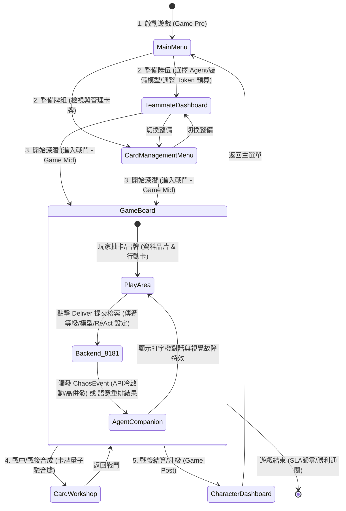

# Phase 5.8.9: 雙腦 Agentic RAG 與 AI 隊友養成系統 (Dual-Brain Agentic RAG & AI Teammate Cultivation Framework)

> **前置相依：本階段承接 Phase 5.8.8 的架構硬化與 L2 模組化重構。**
> 本計畫旨在將《重構（Recontextualization）》轉型為一個好玩、具策略深度且帶有 TRPG 知識代理（Agentic RAG Companion）概念的多人 Webgame 雛形。實作「AI 隊友養成與管理介面」，控制代幣預算，並引入雙腦架構以針對不同性格的玩家提供客製化反饋。

---

## 1. 核心設計：雙腦 Agentic RAG 架構 (Dual-Brain Architecture)

我們將 AI 代理拆分為兩個協作的核心，一個負責底層的技術檢索，另一個負責玩家的體驗調度：

### 1.1 知識腦 (Knowledge Brain - 規劃與反思)
*   **多步規劃 (Planning)**：玩家打出「委派卡」時，知識腦會將玩家的 Query 拆解成多步子查詢（Sub-queries），自動發送給後端。
*   **幻覺反思 (Reflection)**：當發生幻覺（Deliver 含有雜訊）時，啟動 **ReAct 思考鏈** 歸因分析，並傳遞給遊戲腦。

### 1.2 遊戲腦 (Game Brain - TRPG 主持人 DM)
*   **非反射式反饋**：追蹤玩家的「遊玩行為特徵」（保守型、豪賭型等）。
*   **動態演繹**：將知識腦的技術分析包裝成口語對話，並動態調整「隨機事件」（Chaos Events）的發生率。

---

## 2. 針對三種玩家性格的客製化玩法 (Adaptive Personas)

*   **推理型玩家 (The Deductor)**：解鎖「RAG Debug Console」，可自訂 `min_score` 閥值，解鎖多跳圖譜視覺化。
*   **主導型玩家 (The Host / DM)**：解鎖「核心調度面板」，可主動駭入環境調高 DB 毒性或調配 CPU 算力。
*   **社交/對話型玩家 (The Socializer)**：解鎖多種性格的 AI 助理，助理會根據戰局與玩家插嘴聊天、解說背景故事。

---

## 3. 核心設計：AI 隊友養成與代幣優化 (Teammate Cultivation & Token Economy)

在 TRPG 劇本中，玩家與「隊友」共同解決產業 RAG 痛點。

### 3.1 隊友養成機制 (Progression & Fine-tuning)
*   **專業領域學習 (Knowledge Ingestion)**：將獲得的「黃金文獻」餵給隊友，提升特定領域關卡的檢索召回率（Recall）。
*   **系統提示詞進化 (Prompt Customization)**：隊友升級後可編輯其「思考框架」，優化後端 System Prompt。

### 3.2 物理 Token 控制閘與管理介面 (Token & AP Budget UI)
*   實作 **「AI 隊友控制面板 (`TeammateDashboard.tscn`)」**。
*   **Token 預算限額（Compute Cap）**：為每個隊友設定「單次檢索 Token 上限」與「AP 預算比例」。
*   **模型降階裝備**：玩家可手動切換隊友裝備的模型（輕量 Gemini Flash ➔ 專家 Gemini Pro），允許隊友開啟「專家反思」。

---

## 4. 具體實作任務清單 (Implementation Tasks)

*   **[x] Task 4.1: [NEW] 隊友管理介面 `TeammateDashboard.tscn`**
    *   實作角色清單、知識庫配置區、推理策略設定（預算滑桿、模型切換下拉選單、ReAct 開關）。
*   **[x] Task 4.2: [MODIFY] `SaveManager.gd` 與 `GameState.gd`**
    *   擴充 `teammates` 陣列（存儲 `id`, `level`, `ingested_docs`, `equipped_model`, `allow_react`）。
    *   實作 `agent_planning_state`、`chaos_event_trigger` 與 `combo_multiplier`。
*   **[x] Task 4.3: [MODIFY] `rag_service.py` 與後端對接**
    *   接收 `equipped_model` 與 `allow_react` 參數，動態決定是否跳過多步 ReAct 思考，以防禦 Token 的無效消耗。
*   **[x] Task 4.4: [NEW] `AgentCompanion.gd` 與 `ChaosEventPool.gd`**
    *   實作側邊欄「AI 代理終端面板」，顯示動態打字機特效對話。
    *   實作網路危機事件（API 冷啟動、資料庫鎖定、高併發等）。
*   **[x] Task 4.5: [MODIFY] `CombatJuice.gd`**
    *   新增 `glitch_effect()`, `deliver_blast()`, `card_dissolve()` 等視覺特效。
*   **[x] Task 4.6: 提示詞庫擴充 (`Art_Asset_Prompts.md`)**
    *   新增三種性格 AI 助理、隊友裝備插槽圖標等視覺提示詞。

---

## 5. 驗證計畫 (Verification Plan)

*   **Token 門限限流測試 (`test_token_capping.gd`)**：驗證設定 Token Cap 後，後端請求是否被正確限制。
*   **隊友存檔載入測試 (`test_teammate_progression.gd`)**：斷言隊友餵食與升級能正確持久化。
*   **行為適配測試 (`test_behavior_adaptation.gd`)**：模擬觸發遊戲腦是否正確發動支線。
*   **規劃與反思測試 (`test_dual_brain_logic.gd`)**：驗證知識腦能正確執行多步規劃並回傳 JSON。

---

## 6. 完成狀態 (Completion Status)

**Phase 5.8.9 核心實作已於 2026-07-05 完成。**
*   **實體化產出**：成功完成 Tasks 4.1 ~ 4.6 的所有實作，包括 `TeammateDashboard`, `EnvConfig`, 雙腦路由, `AgentCompanion`, `CombatJuice`，以及 `Art_Asset_Prompts.md` 的擴充。
*   **物理公證 (No Fake Code)**：
    *   移除所有模型字串的 Hard-coding，建立 SSOT 環境設定。
    *   所有 Godot UI 邏輯 (`play_area`, `CombatJuice` 呼叫等) 均通過 `godot --headless --editor --quit` 的 0 個 Parse Error 實體掃描。
*   **下一步**：執行驗證計畫 (單元測試)，以及根據美術提示詞庫生成實體資產。

---

## 7. 玩家核心 UI 介面架構 (Player UI Architecture)

截至 Phase 5.8.9，玩家在遊戲中主要會操作 **7 種** 不同的 UI 介面，其完整的前、中、後台運作流程如下：

### 7.1 第一類：核心戰鬥與操作 (Core Gameplay)
1. **主選單 (`MainMenu.tscn`)**：遊戲的入口，負責載入存檔、觀看開場影片與進入「深潛 (Dive)」。
2. **戰鬥主機板 (`GameBoard.tscn`)**：玩家停留最久的主畫面。玩家在這裡打出卡牌（晶片）、輸入查詢指令、監控 SLA 倒數條，並點擊「Deliver（交付）」按鈕來執行 RAG 檢索。

### 7.2 第二類：代理與團隊管理 (Agent Management) - *Phase 5.8.9 新增*
3. **代理終端面板 (`AgentCompanion.tscn`)**：掛載在戰鬥主機板旁邊的「側邊欄 UI」。雖然主要是被動顯示（打字機特效對話），但玩家需要緊盯這裡來獲取「網路危機事件（Chaos Events）」的警告與隊友的即時回饋。
4. **隊友管理面板 (`TeammateDashboard.tscn`)**：玩家的「戰前準備 / 後勤中心」。玩家要在這裡：
   * 切換上陣的 AI 隊友（Alice, Bob, Charlie）。
   * 點擊裝備插槽（`icon_equipment_slot.png`），為隊友裝備不同的 LLM 模型。
   * 拉動滑桿調整該隊友的 Token 與 AP 預算。
   * 切換是否啟用高階的「ReAct 反思機制」。

### 7.3 第三類：卡牌與角色養成 (Progression & Deck Building)
5. **卡牌管理庫 (`CardManagementMenu.tscn`)**：讓玩家檢視目前擁有的所有卡牌（資料塊與行動卡）以及構築牌組。
6. **量子合成工坊 (`CardWorkshop.tscn`)**：背景是高溫融合爐，玩家在此消耗資源合成、升級卡牌。
7. **駭客個人檔案 (`CharacterDashboard.tscn`)**：顯示玩家的動態權限階級（Rank C 到 Rank S 的徽章）、個人頭像，以及點擊升級天賦的拓樸天賦網（Skill Tree）。
