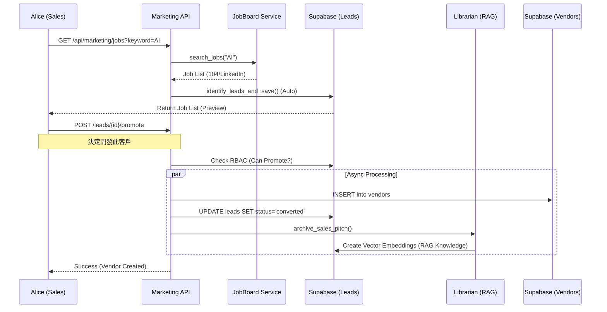
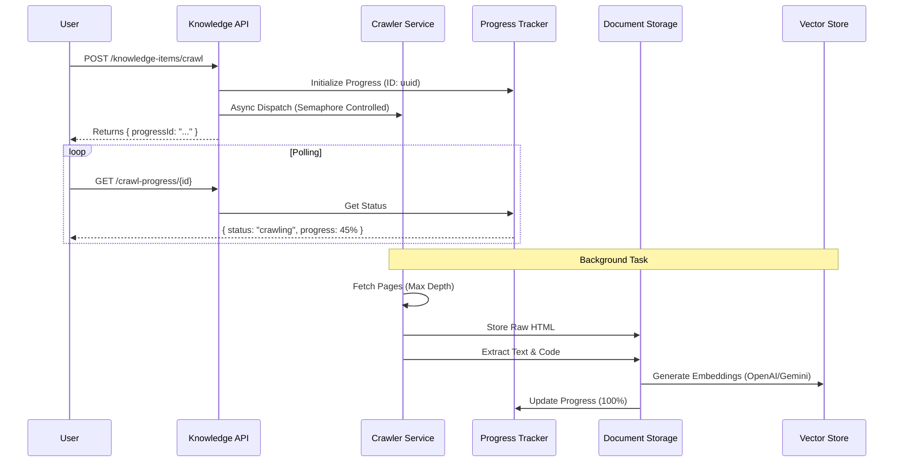
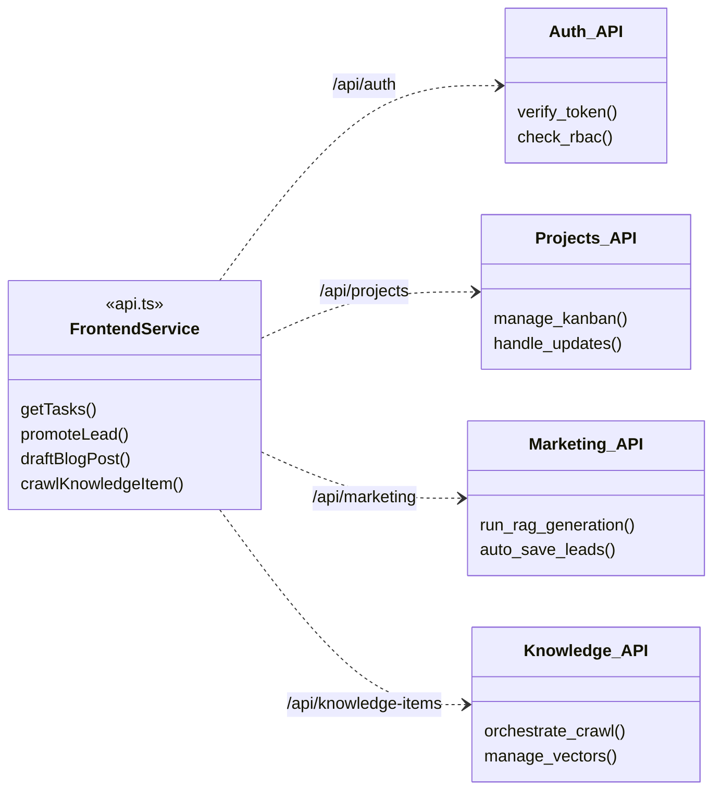

# 後端 API 架構設計文件 (Backend API Architecture)

**適用對象**: 系統分析師 (SA)、後端開發者、AI Agent 架構師
**目的**: 作為後端 API 結構、服務交互與數據流的單一真理來源
**最後更新**: 2026-01-27
**語言**: 繁體中文 (Traditional Chinese)

---

## 1. 系統架構概觀 (System Overview)

Archon 的後端採用微服務化 (Microservice-like) 的模組設計，基於 **FastAPI** 框架，並深度整合 **Supabase** (PostgreSQL + Auth + Vector) 作為核心資料與身份驗證層。

### 核心服務交互圖 (Service Interaction)

```mermaid
graph TD
    subgraph ClientLayer ["Client Layer"]
        U["前端應用 (Archon UI)"]
        Client["外部 API Client"]
    end

    subgraph BackendLayer ["Backend Layer (Port 8181)"]
        Gateway["API Gateway / Router"]
        Auth["Auth Service"]
        Projects["Project Service"]
        Know["Knowledge Service"]
        Mkt["Marketing Service"]
        Agents["Agent Service"]
    end

    subgraph Infrastructure ["Infrastructure"]
        DB[("Supabase (PostgreSQL)")]
        Vector[("Supabase (Vector)")]
        LLM["LLM Providers (OpenAI/Gemini)"]
        Crawlers["Crawler Service"]
    end

    U -- HTTPS/REST --> Gateway
    Client --> Gateway
    Gateway -- JWT/RBAC --> Auth
    Gateway --> Projects
    Gateway --> Know
    Gateway --> Mkt
    
    Projects -- Async --> Agents
    Know -- Queue --> Crawlers
    Mkt -- RAG --> Vector
    Mkt -- RAG --> Vector
    Agents -- Tools --> LLM
    Agents -- GitBranch --> Agents : Self-Healing Loop (Sandboxed)
    
    %% Database Connections
    Auth --> DB
    Projects --> DB
    Know --> DB
    Mkt --> DB
```

---

## 2. 身份驗證與安全規範 (Authentication & Security)

系統採用 **雙重驗證機制 (Dual Authorization Strategy)**，結合 JWT 標準與角色存取控制 (RBAC)。

### 2.1 驗證流程 (Auth Flow)
*   **Token**: 使用 Supabase 簽發的 JWT (`access_token`)。
*   **傳遞方式**: HTTP Header `Authorization: Bearer <token>`。
*   **開發後門**: 本地開發環境可使用 `/api/auth/dev-token` 快速獲取 Admin 權限。

### 2.2 角色存取控制 (RBAC)
系統定義了以下核心角色，權限矩陣由 `RBACService` 統一管理：

*   **System Admin**: 全系統最高權限。
*   **Admin**: 組織管理員，可管理使用者。
*   **Manager**: 部門主管，可審核內容與指派任務。
*   **Member**: 一般成員 (Sales, Marketing, Content Creator)。
*   **Viewer**: 僅讀權限。

**SA 注意事項**:
*   API 層會在 Header 注入 `X-User-Role` (來自 Gateway 或 Middleware) 輔助判斷，但核心邏輯必須驗證 `current_user` 的 JWT claim。
*   敏感操作 (如 `promote_lead`, `approve_blog`) 必須在 Service 層進行二次 RBAC 檢查。

---

## 3. 核心業務流程 (Core Business Workflows)

### 3.1 銷售線索轉化流程 (Sales-to-Vendor)

描述從外部職缺看板爬取資料，轉化為銷售線索，最終晉升為供應商的過程。



### 3.2 知識庫構建與 RAG 流程 (Knowledge Pipeline)

描述如何從 URL 爬取並建立向量索引。



---

## 4. API 詳細規格 (Detailed API Specification)

### 4.1 專案管理模組 (Projects Module)
**Base Path**: `/api`

| Method | Endpoint | Description | Request Body | Response Model |
| :--- | :--- | :--- | :--- | :--- |
| **GET** | `/projects` | 列出專案 (支援 ETag) | - | `List[Project]` |
| **POST** | `/projects` | 建立專案 (AI 輔助) | `CreateProjectRequest` | `Project` |
| **GET** | `/tasks` | 列出任務 (過濾器) | - | `Paginated[Task]` |
| **POST** | `/tasks` | 建立/指派任務 | `CreateTaskRequest` | `Task` |

#### 關鍵資料模型 (Data Models)

**CreateProjectRequest**
```json
{
  "title": "string (required)",
  "description": "string",
  "github_repo": "string",
  "pinned": "boolean",
  "technical_sources": ["source_id_1"],
  "business_sources": ["source_id_2"]
}
```

**CreateTaskRequest**
```json
{
  "project_id": "uuid (required)",
  "title": "string (required)",
  "assignee_id": "uuid (optional)",
  "due_date": "ISO8601",
  "priority": "high|medium|low",
  "knowledge_source_ids": ["source_ids"]
}
```

### 4.2 行銷與內容模組 (Marketing Module)
**Base Path**: `/api/marketing`

| Method | Endpoint | Description | Request Body | Response Model |
| :--- | :--- | :--- | :--- | :--- |
| **GET** | `/jobs` | 搜尋職缺 (自動存 Lead) | `?keyword=...` | `List[JobData]` |
| **GET** | `/leads` | 獲取已存銷售線索 | - | `List[Lead]` |
| **POST** | `/leads/{id}/promote` | 晉升 Lead 為供應商 | `PromoteLeadRequest` | `Vendor` |
| **POST** | `/blog/draft` | AI 撰寫部落格草稿 | `DraftBlogRequest` | `DraftBlogResponse` |
| **POST** | `/approvals/{type}/{id}/{action}` | 審核內容 (Admin Only) | - | `Status` |

#### 關鍵資料模型 (Data Models)

**PromoteLeadRequest**
```json
{
  "vendor_name": "string (company name)",
  "contact_email": "string@example.com",
  "notes": "業務備註"
}
```

**DraftBlogRequest**
```json
{
  "topic": "string",
  "keywords": "string (comma separated)",
  "tone": "professional|casual"
}
```

### 4.3 知識管理模組 (Knowledge Module)
**Base Path**: `/api`

| Method | Endpoint | Description | Request Body | Response Model |
| :--- | :--- | :--- | :--- | :--- |
| **POST** | `/knowledge-items/crawl` | 觸發爬蟲 | `KnowledgeItemRequest` | `CrawlStartResponse` |
| **GET** | `/crawl-progress/{id}` | 查詢爬蟲進度 | - | `BaseProgressResponse` |
| **POST** | `/documents/upload` | 上傳文件 | `FormData` | `UploadProgress` |
| **POST** | `/rag/query` | 執行 RAG 檢索 | `RagQueryRequest` | `RagResult` |

#### 關鍵資料模型 (Data Models)

**KnowledgeItemRequest**
```json
{
  "url": "https://example.com",
  "knowledge_type": "technical|marketing",
  "tags": ["tag1", "tag2"],
  "max_depth": 2,
  "extract_code_examples": true
}
```

**ProgressResponse**
```json
{
  "progressId": "uuid",
  "status": "crawling|processing|completed",
  "progress": 45.5,
  "message": "Processing page 5/10...",
  "details": {
    "pagesCrawled": 5,
    "totalPages": 10
  }
}
```

---

## 5. 前端整合架構 (Frontend Integration)

此圖說明前端 (`api.ts` Service Layer) 如何對應後端路由。

