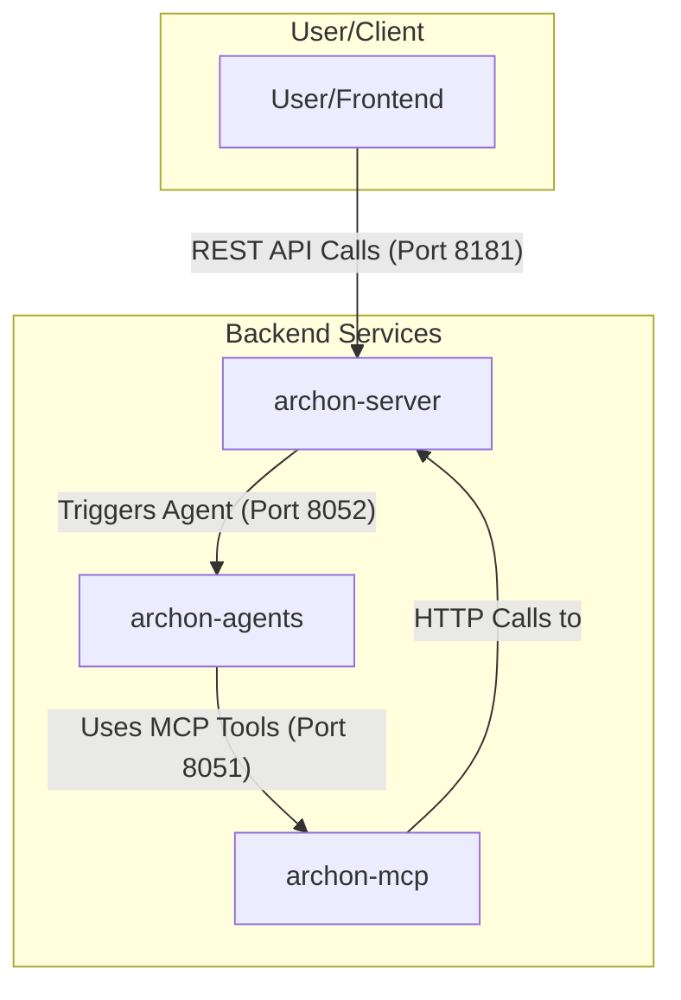
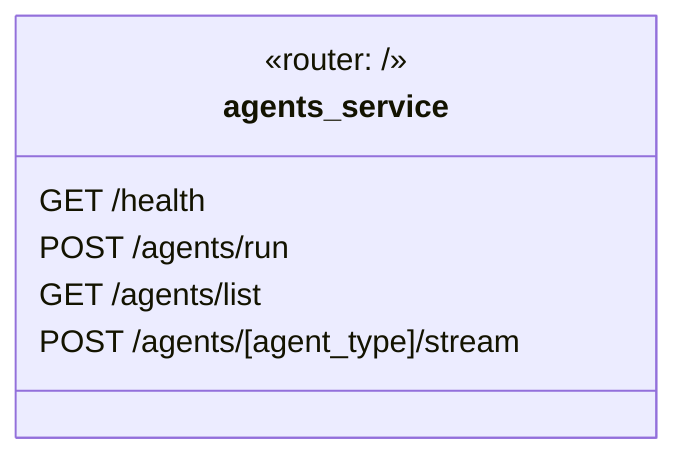
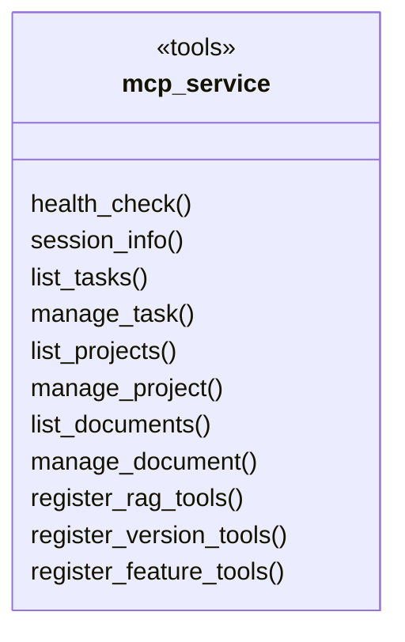

# Backend API Architecture

**Audience**: Developers, AI Agents
**Purpose**: Single source of truth for Backend API structure and service interactions
**Usage**: Reference for implementing clients and understanding system boundaries
**Last Updated**: 2026-01-09

---

## 1. Service Interaction Diagram

This diagram shows how the backend services call each other to perform complex tasks.

---

## 2. `archon-server` API UML

This is the main API gateway with a rich set of endpoints for managing the entire application.

```mermaid
classDiagram
    direction LR
    class auth_api {
        <<router: /api>>
        POST /admin/users
        POST /auth/register
        PUT /auth/email
    }
    class agent_chat_api {
        <<router: /api/agent-chat>>
        POST /sessions
        GET /sessions/[session_id]
        GET /sessions/[session_id]/messages
        POST /sessions/[session_id]/messages
    }
    class bug_report_api {
        <<router: /api/bug-report>>
        POST /github
        GET /health
    }
    class changes_api {
        <<router: /changes>>
        GET /changes
        GET /changes/[change_id]
        POST /changes/[change_id]/approve
        POST /changes/[change_id]/reject
    }
    class files_api {
        <<router: /api/files>>
        POST /upload
    }
    class internal_api {
        <<router: /internal>>
        GET /health
        GET /credentials/agents
        GET /credentials/mcp
    }
    class knowledge_api {
        <<router: /api>>
        GET /blogs
        GET /blogs/[post_id]
        POST /blogs
        PUT /blogs/[post_id]
        DELETE /blogs/[post_id]
        GET /crawl-progress/[progress_id]
        GET /knowledge-items/sources
        GET /knowledge-items
        PUT /knowledge-items/[source_id]
        DELETE /knowledge-items/[source_id]
        GET /knowledge-items/[source_id]/chunks
        GET /knowledge-items/[source_id]/code-examples
        POST /knowledge-items/[source_id]/refresh
        POST /knowledge-items/crawl
        POST /documents/upload
        POST /knowledge-items/search
        POST /rag/query
        POST /rag/code-examples
        POST /code-examples
        GET /rag/sources
        DELETE /sources/[source_id]
        GET /database/metrics
        GET /health
        GET /knowledge-items/task/[task_id]
        POST /knowledge-items/stop/[progress_id]
    }
    class log_api {
        <<router: /api>>
        POST /record-gemini-log
    }
    class marketing_api {
        <<router: /api/marketing>>
        GET /jobs
    }
    class mcp_api {
        <<router: /api/mcp>>
        GET /status
        GET /config
        GET /clients
        GET /sessions
        GET /health
    }
    class migration_api {
        <<router: /api/migrations>>
        GET /status
        GET /history
        GET /pending
    }
    class ollama_api {
        <<router: /api/ollama>>
        GET /models
        GET /instances/health
        POST /validate
        POST /embedding/route
        GET /embedding/routes
        DELETE /cache
        POST /models/discover-and-store
        GET /models/stored
        POST /models/test-capabilities
        POST /models/discover-with-details
    }
    class progress_api {
        <<router: /api/progress>>
        GET /[operation_id]
        GET /
    }
    class projects_api {
        <<router: /api>>
        GET /assignable-users
        GET /projects
        POST /projects
        GET /projects/task-counts
        GET /projects/[project_id]
        PUT /projects/[project_id]
        DELETE /projects/[project_id]
        GET /projects/[project_id]/features
        GET /projects/[project_id]/tasks
        POST /tasks
        GET /tasks
        GET /tasks/[task_id]
        PUT /tasks/[task_id]
        DELETE /tasks/[task_id]
        PUT /mcp/tasks/[task_id]/status
        GET /projects/[project_id]/docs
        POST /projects/[project_id]/docs
        GET /projects/[project_id]/docs/[doc_id]
        PUT /projects/[project_id]/docs/[doc_id]
        DELETE /projects/[project_id]/docs/[doc_id]
        GET /projects/[project_id]/versions
        POST /projects/[project_id]/versions
        GET /projects/[project_id]/versions/[field_name]/[version_number]
        POST /projects/[project_id]/versions/[field_name]/[version_number]/restore
    }
    class providers_api {
        <<router: /api/providers>>
        GET /[provider]/status
    }
    class settings_api {
        <<router: /api>>
        GET /credentials
        GET /credentials/categories/[category]
        POST /credentials
        GET /credentials/[key]
        PUT /credentials/[key]
        DELETE /credentials/[key]
        POST /credentials/initialize
        GET /database/metrics
        GET /settings/health
    }
    class stats_api {
        <<router: /api/stats>>
        GET /tasks-by-status
        GET /member-performance
    }
    class version_api {
        <<router: /api/version>>
        GET /check
        GET /current
        POST /clear-cache
    }
```

## 3. `archon-agents` API UML

A specialized service for running AI agents.

## 4. `archon-mcp` API UML

An orchestration service that exposes its capabilities as "tools" rather than standard REST endpoints.

