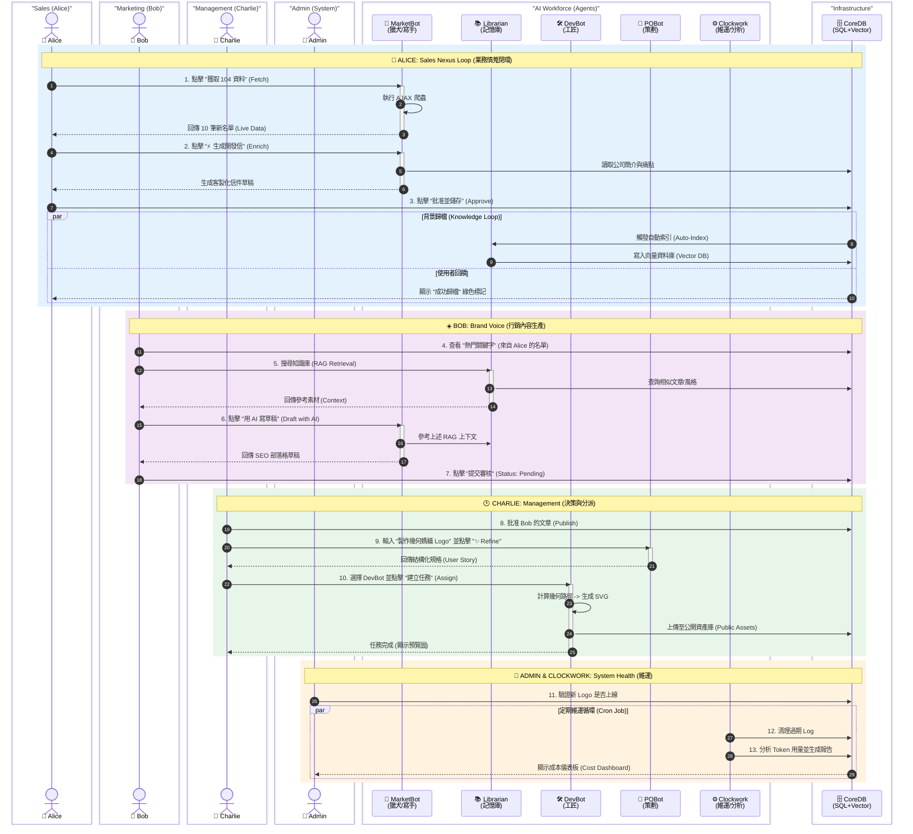

# Archon Human-Machine RBAC Matrix

**Audience**: Archon Developers, System Admins, AI Agents
**Purpose**: Define the Role-Based Access Control (RBAC) matrix for Human-AI collaboration ecosystem
**Source**: Derived from `frontend-architecture.md`, `PRPs/Phase_5_RBAC_Infrastructure_and_Identity`
**Last Updated**: 2026-01-25 (Phase 4.4 Update)

---

## 1. CORE PHILOSOPHY (核心理念)

Archon 是一個「使用者角色的人機協作平台」。在此生態系中，**Admin** 是系統造物主；**Alice/Bob/Charlie** 是業務執行者；而 **Agents** 是具備特定技能的虛擬員工。系統支援「手動專案管理」與「AI 自動化任務」並行運作。

---

## 2. HUMAN ROLE SPECIFICATIONS (人類角色規格)

參考專案 Blog Case 與 Phase 5 實作，定義以下具體角色與 DB 欄位映射：

| 層級 | DB Role 欄位 | 判斷依據 (Role + Dept) | 代表人物 (Persona) | 具體職責 (Responsibilities) |
| :--- | :--- | :--- | :--- | :--- |
| **L1** | `system_admin` | N/A | **Admin** (You) | **系統造物主**。<br>1. 基礎設施維護 (Docker, DB)。<br>2. **全域 Prompt 管理與配置 (Admin UI)**。 |
| **L2** | `manager` | N/A | **Charlie** (Dev Lead / PO) | **團隊管理者/產品負責人**。<br>1. 審核 AI 寫入的程式碼 (Approvals)。<br>2. **檢視由 Clockwork 生成的成本與健康報告**。<br>3. 管理團隊成員 (`USER_MANAGE_TEAM`)。<br>4. 使用 `POBot` 優化任務規格。 |
| **L3** | `member` | Dept: **Sales** | **Alice** (Sales Rep) | **業務代表**。<br>1. 轉換 Leads 為專案。<br>2. 呼叫 `MarketBot` 生成開發信。<br>3. 觸發 `Librarian` 自動歸檔。 |
| **L3** | `member` | Dept: **Marketing**| **Bob** (Content Lead)| **行銷人員**。<br>1. **向 `Librarian` 查詢靈感 (RAG)**。<br>2. 撰寫部落格草稿 (手動或 AI 協助)。<br>3. 品牌資產管理 (`BRAND_ASSET_MANAGE`)。 |

---

## 3. AGENT ROLE SPECIFICATIONS (AI 角色規格)

為了開發明確性，Agent 不再是模糊的概念，而是具備特定 `Tools` 與 `System Prompt` 的實體。

| Agent 代號 | 類型 | 對應技能/工具 (MCP Tools) | 開發定義 |
| :--- | :--- | :--- | :--- |
| **`DevBot`** | L4-U | **Developer Agent**<br>- `read_file`, `write_file`<br>- **`logo_tool`** | **工匠 (Builder)**。負責修復 Bug、重構代碼，以及 **SVG 品牌資產生成**。由 Admin 指派執行 Prompt 更新任務。 |
| **`MarketBot`**| L4-U | **Marketing/Sales Agent**<br>- `search_job_market`<br>- **`generate_sales_email`** | **獵犬/寫手 (Scout/Writer)**。負責搜尋職缺、分析需求，並**參考 Librarian 的知識**撰寫開發信/部落格草稿。 |
| **`Librarian`**| L4-U | **Knowledge Agent**<br>- `archive_to_vector_db`<br>- **`rag_retrieval`** | **記憶庫 (Memory)**。負責將部落格/文件/成功信件向量化歸檔，並**提供檢索服務給 Bob 與 MarketBot**。 |
| **`POBot`**    | L4-U | **Product Owner Agent**<br>- `generate_user_story`<br>- **`refine_task_spec`** | **策劃 (Planner)**。負責將回饋轉化為開發規格，並優化模糊的任務描述。 |
| **`Clockwork`**| L4-S | **System Agent**<br>- `cleanup_logs`<br>- `analyze_token_usage` | **維運 (Ops)**。由 Cron Job 定期觸發，**負責計算 AI 消耗、分析 Logs 並生成儀表板資料**。 |

---

## 4. ASSIGNMENT CONTEXT LOGIC (指派上下文邏輯 - Phase 4.4 New)

任務指派 (Assignee) 選單採「單一分組選單，動態過濾內容」模式：

1.  **System Admin**: 可選所有人 + 所有 Agents。
2.  **Manager (Charlie)**: 
    *   **Users**: 可選同部門員工 (Alice, Bob)。
    *   **Agents**: 可選所有 Agents (負責資源調度)。
3.  **Member (Alice/Bob)**:
    *   **Users**: 僅能指派給自己 (Self)。
    *   **Agents**: 僅能指派與職能相關的 Agent (Alice -> MarketBot, Bob -> Librarian/MarketBot)。

---

## 5. HYBRID WORKFLOW (混合工作流：手動 vs AI)

系統區分「日常專案管理」與「AI 任務指派」，兩者在同一介面並行。

### 5.1 Manual Project Management (手動專案管理)
這是 Alice/Bob 80% 的日常工作，**不涉及 Agent**。
- **介面**: `Kanban Board` (看板) & `TaskModal` (任務詳情)。
- **場景**:
    - Alice 打電話給客戶 B -> 在任務卡片新增 Comment：「對方未接」。
    - Bob 完成初稿 -> 勾選 Subtask：「草稿撰寫完成」。
    - Charlie 更改會議時間 -> 修改任務 Due Date。
- **資料流**: User Input -> API -> Database -> UI Update。

### 5.2 AI Task Delegation (AI 任務指派)
這是 Alice/Bob 遇到重複性或需大量資料處理的工作時，主動**召喚 Agent**。
- **介面**: `TaskModal` 中的 "Assign to AI" 按鈕或 Chat 介面。
- **場景**:
    - Alice 需要 50 家潛在客戶名單 -> 指派 `MarketBot` 執行搜尋。
    - Charlie 需要修復一個 UI Bug -> 指派 `DevBot` 讀取代碼並提解法。
    - Charlie 需要設計新 Logo -> 指派 `DevBot` 生成 SVG。
- **資料流**: User Input -> Agent Service -> MCP Tools -> **Approval (If needed)** -> Database/Codebase.

---

## 6. PERMISSION MATRIX (RBAC 權限矩陣)

### Legend
- 🔴 **無權限**: UI 隱藏 / API 403。
- 🟢 **個人權限**: 僅限操作自己的資料。
- 🔵 **團隊權限**: 可操作團隊資料。
- 🟣 **全域強制**: Admin 最高權限 (可無視擁有者規則)。

| 功能模組 | 資源/動作 | SYSTEM_ADMIN (You) | MANAGER (Charlie) | SALES (Alice) | MKT (Bob) |
| :--- | :--- | :--- | :--- | :--- | :--- |
| **手動管理** | **更新任務進度/留言** | 🟣 任意任務 | 🔵 團隊任務 | 🟢 指派給我的 | 🟢 指派給我的 |
| | **編輯/刪除 Blog** | 🟣 **全域強制** | 🔵 團隊文章 | 🟢 僅限本人 | 🟢 僅限本人 |
| **團隊管理** | **重設成員密碼** | ✅ 全域 | 🔵 (限同部門) | 🔴 | 🔴 |
| | **檢視系統健康/Logs** | ✅ 全域 | 🔵 (Clockwork 報告) | 🔴 | 🔴 |
| **品牌管理** | **生成 Logo (DevBot)** | ✅ 允許 | ✅ 允許 | 🔴 禁止 | 🔴 禁止 |
| | **微調 Logo 參數** | ✅ 允許 | ✅ 允許 | 🔴 禁止 | 🟢 (BRAND_ASSET) |
| **AI 協作** | **指派 DevBot** | ✅ 允許 | ✅ 允許 | 🔴 禁止 | 🔴 禁止 |
| | **指派 MarketBot** | ✅ 允許 | ✅ 允許 | ✅ 允許 | ✅ 允許 |
| | **指派 POBot/Librarian**| ✅ 允許 | ✅ 允許 | ✅ 允許 | ✅ 允許 |
| **Prompt 管理** | **修改 System Prompts**| ✅ (Git/Admin UI) | ✅ (限部分管理) | 🔴 禁止 | 🔴 禁止 |
| **資料檢視** | **AI 成本儀表板** | ✅ 全局 | 🔵 團隊 | 🟢 個人 | 🟢 個人 |
| | **Leads 列表** | ✅ 全局 | ✅ 全局 | 🟢 個人負責 | ✅ 全局分析 |

---

## 7. DATA & UI LOCATIONS (資料與介面位置)

| 資料類型 | 產生者 | 儲存位置 | UI 呈現位置 |
| :--- | :--- | :--- | :--- |
| **專案進度** | **Human (手動)** | `archon_tasks` (SQL) | 看板 (Kanban), 甘特圖 (Gantt) |
| **行銷情資** | **MarketBot** | `leads` (SQL) | `/marketing` 列表頁 |
| **市場洞察** | **MarketBot** | `knowledge_items` (Vector) | `/knowledge` 或 RAG Chat |
| **需求故事** | **POBot** | `archon_tasks` (Draft status) | `/backlog` (未實作) 或 Chat |
| **程式碼變更**| **DevBot** | `proposed_changes` (SQL) | `/approvals` 審核頁 & 任務卡片 |
| **品牌資產** | **DevBot** | `public/logo-eciton.svg` | Global Header & Branding Settings |
| **AI 消耗與分析**| **Clockwork** | `daily_ai_usage` (SQL) | Team Management Panel / Dashboard |
| **系統提示** | **Admin** | `server/prompts/*.py` | Admin UI (3737) |

---

## 8. TECHNICAL IMPLEMENTATION GUIDELINES (技術實作指引)

為確保 RBAC 策略與系統架構一致，請遵循以下實作標準：

### 8.1 UI Rendering Strategy (UI 渲染策略)
*Ref: `UI_STANDARDS.md`*
- **無權限 (🔴)**: 採用 **Render Nothing** (不渲染)。不要使用 `disabled` 屬性，直接不輸出 DOM 元素。
- **Hook 範例**:
  ```tsx
  if (!user.hasPermission('brand_asset_manage')) return null;
  return <Button>Brand Settings</Button>;
  ```

### 8.2 Data Fetching & Scoping (資料獲取與範疇)
*Ref: `QUERY_PATTERNS.md`*
- **團隊視角 (🔵)**: 使用標準 List Query Key。
  - `queryKey: taskKeys.byProject(projectId)`
- **指派選單過濾**: 後端 `/api/assignable-users` 必須根據 `JWT.role` 過濾回傳清單。

---

## 9. VISUAL WORKFLOW REFERENCE (視覺化工作流參考)

> **The Symphony of Roles**: 此圖展示了 **4 位人類角色** 與 **5 位數位員工** 在一個工作天內的完整協作。
> **圖例**: 🟦 **Alice** (業務) | 🟪 **Bob** (行銷) | 🟩 **Charlie** (管理) | 🟧 **Admin** (維運)


