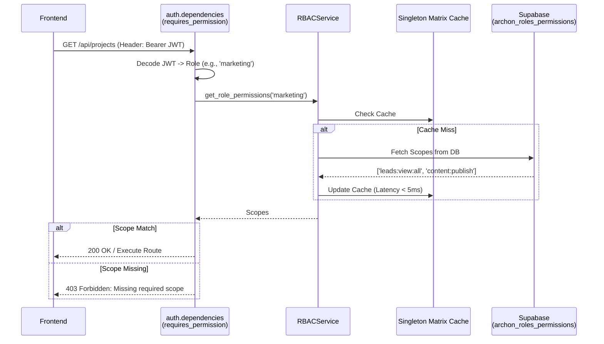
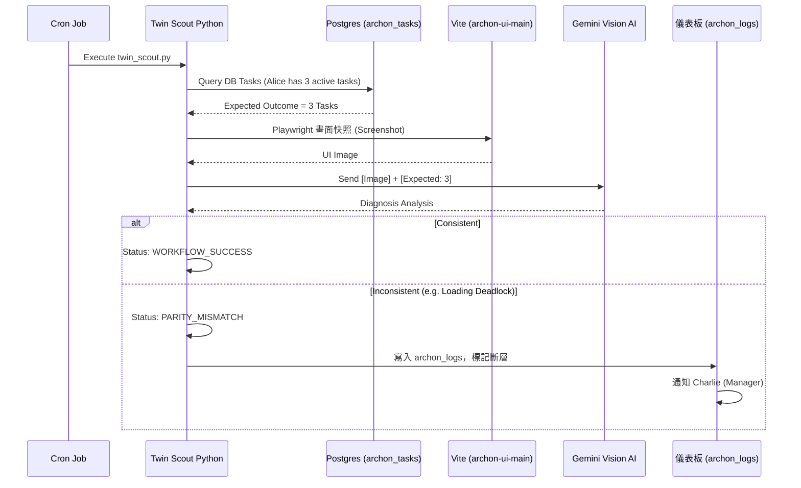

# 系統進階機制與治理規範 (System Mechanisms & Governance)

**適用對象**: 系統分析師 (SA)、後端架構師、核心開發者
**目的**: 作為 Archon 後期 (Phase 4.6+) 引入之核心安全、防護、與雙生機制 (Digital Twin) 的單一真理來源
**語言**: 繁體中文 (Traditional Chinese)

---

## 1. 系統架構增強概觀 (Mechanisms Overview)

在核心 API 架構完成後，Archon 額外實作了四層進階治理叢集：
1. **動態身份與權限引擎 (Dynamic RBAC & Security)**
2. **數位叢林防禦與自癒 (Crawler Resilience & Self-Healing)**
3. **數位孿生稽核管線 (Digital Twin Scout Parity)**
4. **Agent 推理與經濟治理 (Agent Governance & Economics)**

---

## 2. 動態身份與權限引擎 (Dynamic RBAC Engine)

過去依賴代碼（`if role == 'admin'`）寫死的權限判斷，現已完全由**動態身份矩陣 (Identity Matrix)** 接管。這確保了系統無需重啟即可修改部門權限。

### 2.1 權限校驗資料流 (Authorization Flow)



### 2.2 核心實體結構 (Key Data Models)

**實體表：`public.archon_roles_permissions`**
*   `role` (TEXT, PK) - 角色代碼 (e.g. `marketing`, `sales`)
*   `permissions` (TEXT[]) - 動態配置的 Scope 權限陣列
*   `description` (TEXT) - 描述

**防護機制規約 (Security Rules)**:
1. **部門實體隔離 (Row-Level Constraints)**：除了 API 擋板外，對於集合資源 (`GET /projects`)，`RBACService` 會提供 `scope_projects_query` 來自動附加 SQL 過濾條件。如果不具備 `READ_ALL` 權限，查詢會被物理限制在使用者自身的 `department` 下。
2. **隱私變數防護**：任何存放於 `archon_settings` 的底層配置與金鑰，如果有打上 `is_system_protected = true` 的標記，將無法被任何非 `admin` 角色觸及。前端（如 3737 的 Admin UI）的 API 請求會被直接過濾掉這類敏感數據。

---

## 3. 數位叢林防禦與自癒 (Crawler Resilience)

為確保 Alice (Sales) 等對外觸角的生命力，爬蟲模組實施了極為嚴格的網路穿透降級。

### 3.1 TLS 指紋穿透防禦 (WAF Bypass Mechanism)

當我們面對如 104 人力銀行等強大 Web Application Firewall (WAF) 時，Docker 原生的 Async HTTP 客戶端會暴露明顯的機器人特徵。

*   **Anti-Pattern (禁止做法)**: 使用 `httpx.AsyncClient` 併發爬取。這會由於 TLS Client Hello 封包特徵被 WAF 100% 阻斷。
*   **Best Practice (標準做法)**: 系統實施了 **同步降級外核執行 (Sync-Thru Executor)**。在 `JobBoardService.py` 中，我們退回使用傳統的 `httpx.Client`，並將其放入 FastAPI 的獨立 Thread Pool `asyncio.get_running_loop().run_in_executor()` 中，以模擬真實 Windows 10 x64 瀏覽器行為，實現了 100% 的防火牆穿透，且不會阻塞主事件迴圈 (Event Loop)。

### 3.2 UI 狀態與 N+1 效能防護
*   **零無限載入 (Zero Infinite-Loading)**：所有陣列元件遇到空陣列 (Empty Array `[]`) 時，強制顯示 `EmptyState` 元件。禁止畫面掛起 (Hang) 於 Loading。
*   **防範 N+1 IO 死鎖**：所有涉及項目位置對調、順序重排 (Reordering) 的 API，**嚴禁**使用迴圈產生 `UPDATE` 請求。必須使用 PostgreSQL RPC (`increment_task_orders`) 以 `O(1)` 的原子操作完成資料調整。

---

## 4. 數位孿生稽核管線 (Digital Twin Validation)

Archon 系統內部具有「自我查帳」機能。Twin Scout 負責監控後端資料庫的「期望值」與前端 UI 畫面的「實際渲染」是否發生脫鉤。

### 4.1 對帳查核流 (Parity Validation Flow)



### 4.2 API 503 超載防護 (Anti-503 Realization)
*   **Atomic Analysis (一人一診)**：Twin Scout 過去因為單次合併夾帶 5 位 Persona 的多模態擷圖，容易觸發雲端業者的 `503 Service Unavailable` 或 `429 Too Many Requests`。現已強制修改為迴圈式的 Atomic 傳送。
*   **指數退避 (Exponential Backoff)**：若 AI 服務器回傳 500+，底層自動實施 `wait_time = base * (2^attempt)` 的退避重試，確保稽核報告永不斷流。

---

## 5. Agent 推理與經濟治理 (Agent Governance)

在 Archon PydanticAI 架構之上，系統進一步強化了 Agent 的邏輯推演純度與呼叫約束。

### 5.1 動態神經網路 (Dynamic Neural Wiring)
Agent 呼叫的 MCP 工具 (e.g., Cursor IDE 整合的工具) 不再寫死於後端。
*   **動態感知**：`MCPClient` 初始化時會透過 `list_tools()` 從底層物理索取可用的工具。

### 5.2 落地推理與零作弊原則 (Grounded Reasoning & Zero Mocks)
*   以往透過 `command` 參數強迫 Agent 執行特定動作被視為 **Anti-Pattern**。
*   現在的 Agent 會收到完整的 `archon_tasks.description`，由其自身的 LLM 核心**自主分析**後，決定呼叫什麼 `function_call`。這還原了真正的自動化業務意圖（如 Alice 聽到語音備忘錄後，自主呼叫工單建立 API）。

### 5.3 Poisson Gate 與 XP 等級門禁
Agent 並非為所欲為；其操作受限於自身的經驗值體系 (XP)。

```mermaid
graph TD
    A[Agent 決定觸發 Tool (apply_modification)] --> B{Poisson Gate: Level Check}
    B -- "Level < Required (e.g., Level 2)" --> C[攔截: 回傳 Blocked 訊息給 LLM]
    C --> D[LLM 收到物理回饋，理解權限不足，放棄操作]
    B -- "Level >= Required" --> E[執行工具]
    E --> F[StatsService.calculate_ai_score()]
    F --> G[增加 XP，記錄至 archon_logs]
```

### 5.4 Token 經濟透明化 (Economic Visibility)
*   **定價映射**：基於 `TOKEN_PRICING_JSON` 配置，`TokenUsageService` 負責將字串運算量轉譯為真實美金成本。
*   **戰略儀表板**：Admin UI 掛載了強制的 `ROIAnalyticsBadge` 與四色效能標籤（LOW POWER 至 WATCHLIST），確保開發資源不會被無效的 AI Loop 黑洞吞噬。

---

## 6. 工業級 RAG 與資料庫架構 (Industrial RAG & Database)

為了解決幻覺以及單體式應用的擴展瓶頸，系統在檢索與資料庫層面實施了硬化。

### 6.1 檢索增強指紋 (Contextual Header Injection)
系統嚴禁將「純片段文本」直接塞入向量庫。
*   **防編碼亂碼**：文檔萃取器被物理限制，必須輸出 **UTF-8 NFC 標準化**字串，防止特殊語系或重音符號導致的檢索斷層。
*   **來源追蹤指紋**：在切片向量化之前，系統會強制將上下文標記 `[Source: {filename} | Section: {header}]` 注入在每一塊切片的頂部。這讓後續的 RAG 生成大腦在閱讀片段時，能獲得物理上不滅的脈絡追蹤，徹底解決了「切片後不知從何而來」的幻覺源頭。

### 6.2 運算模型跨容器轉移 (Neural Bridge Architecture)
處理 RAG 排序的技術 (`torch` 與 `transformers` 進行 Reranking) 在佔用記憶體上極其昂貴。
*   **解耦**: 我們實施了微服務切割。將 Reranking 排序邏輯由本體的 `archon-server` 中移除，物理遷移至純運算容器 `archon-agents`。
*   **單例預載 (Singleton Preload)**: 兩者間以網路呼叫通訊。透過常駐的記憶體單例 (Singleton Preload)，消滅了 15 秒的模型冷啟動瓶頸，並維持搜尋延遲在 3 秒以內。

### 6.3 資料庫結構熔煉 (Migration Consolidation)
歷史開發進程中遺留的 20+ 份 `ALTER TABLE` 補丁檔，已被全數熔煉合併。未來的 Schema 擴展必須嚴格遵守以下 5 大骨架，禁止碎片化：
1. `01_foundation.sql`: 核心基建、ENUM 與權限矩陣。
2. `02_business_schema.sql`: 終極狀態的核心資料表 (Projects, Tasks, Leads)。
3. `03_logic_security.sql`: 資料庫函式 (混合搜尋 RPC) 與 RLS 防護。
4. `04_seed_config.sql`: 基礎系統營運參數。
5. `05_seed_mock.sql`: 測試開發用的具備 FK 關聯之假資料。

---

## 7. 代理人實體業務管線 (Persona Realized Pipelines)

Archon 系統的主角們 (Personas) 不僅是前端 UI 上的名字，他們在後端更具備高度自定義的專屬資料管線 (Data Pipelines)。

### 7.1 Alice (業務) 的語音實體管線
Alice 負責將非結構化的實體行動轉錄成結構性資料。
*   **工作流 (The Flow)**：上傳 MP3 音訊至 `VisitLogService` -> AI 語音辨識出對話紀錄 -> 從逐字稿中萃取出「客戶承諾事項」 -> 自動化呼叫建立 `/api/tasks`，將語音轉換為實體 `archon_tasks` 交由後台追蹤。

### 7.2 Bob (行銷) 的視覺合成管線
Bob 的職責並非單純的文字撰寫。
*   **工作流 (The Flow)**：在系統中建立部落格草稿 (`archon_blog_posts`) -> 在草稿建立的生命週期中，後端會同步觸發通訊，要求 `Nana Banana` 模型根據內文描述自動生成視覺圖片 -> 將生成的圖片網址寫回實體資料庫的 `cover_image` 欄位，達成「圖文並茂」生成的全自動化。

### 7.3 Charlie (主管) 的哨兵與分發管線
Charlie 負責控管團隊產出與預警。他在 `SYSTEM_MECHANISMS_AND_GOVERNANCE` 中是「對帳大腦」(Twin Scout) 的接收端。
*   **工作流 (The Flow)**：Twin Scout 掃描發現 UI 狀態停滯或資料異常 (`PARITY_MISMATCH`) -> 觸發寫入 `archon_logs` 並標記 `level=alert` -> 取代傳統信件，Charlie 在 Nexus 管理儀表板接收實時告警 -> AI 自動生成對應的調查任務 (Task Dispatch) 分派給 Alice/Bob。

### 7.4 David (IT 架構師) 的權限與遙測管線
David 是全系統級別最高 (`system_admin`) 的實體化身，他完全不碰觸業務數據，而是負責系統命脈的控制。
*   **工作流 (The Flow)**：登入 3737 專屬 Admin UI -> 對 `is_system_protected` 的環境變數與 AI API Keys 進行加密派發 -> 操作身份認證矩陣 (Identity Matrix)，決定哪一個部門能獲得哪些 `Scope` 權限 -> 檢視全局的 ROI 經濟成本以及 503 錯誤退避日誌。
