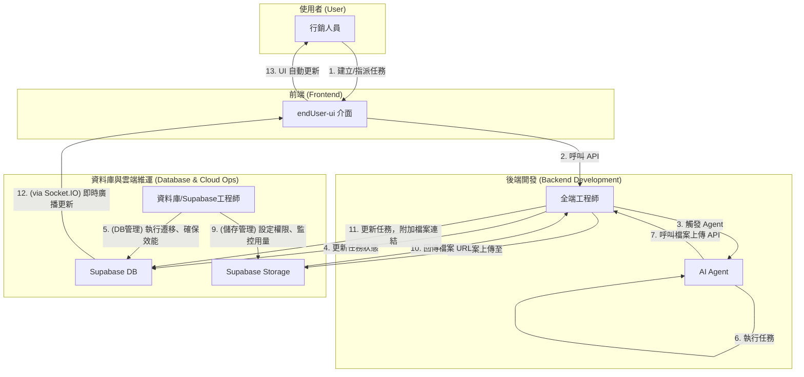
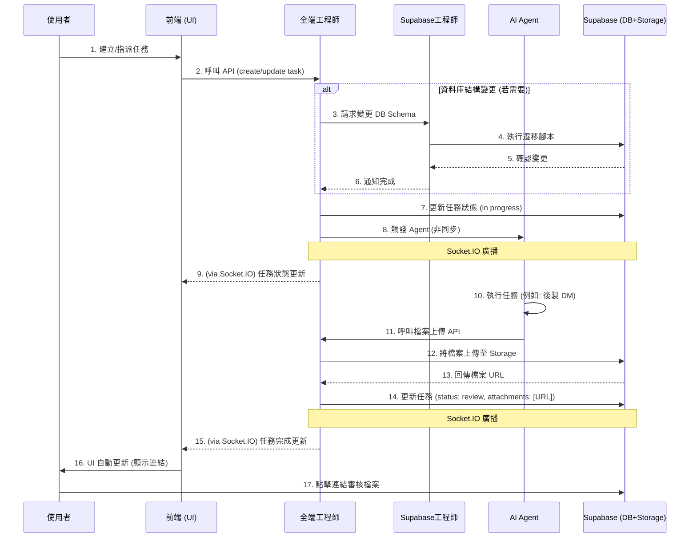

# Archon 專案開發藍圖：Phase 2 v1.1

本文件旨在規劃 Archon 專案的下一階段開發，核心目標是將 Agent 自動化與 RAG (檢索增強生成) 功能深度整合到 endUser-ui 中，實現人機協作的智慧任務管理。

## 1. 專案目標與使用案例 (Goals & Use Cases)

我們的目標是讓使用者（如專案經理、行銷人員）能透過 UI 介面，指派任務給 AI Agent，Agent 能利用知識庫或網路資源完成任務、產出文件，並自動更新任務狀態。

- **案例一：市場研究**
  - **使用者**: 專案經理 (PM)
  - **情境**: 為新客戶做產業背景研究。
  - **流程**: PM 在 UI 建立任務，要求 Agent 搜尋特定產業的挑戰與機會。Agent 完成後產出報告，並將任務狀態更新為「待審核」。

- **案例二：內部知識查詢**
  - **使用者**: 專案經理 (PM)
  - **情境**: 回覆客戶關於過去專案的技術細節問題。
  - **流程**: PM 指派 Agent 查詢指定的專案文件夾 (作為 KM)，Agent 從文件中找到答案、總結回覆，並更新任務狀態。

- **案例三：人機協作產出文件**
  - **使用者**: 行銷人員
  - **情境**: 製作一份行銷 DM。
  - **流程**: 行銷人員在 UI 建立任務，提供文案和需求，指派 Agent 進行後製。Agent 完成後將 DM 範例存檔，並將檔案連結附在任務中，最後更新任務狀態。

## 2. 預期專案架構 (Target Architecture)

為了支援上述案例，我們預期一個更完善的專案架構，包含前後端、資料庫和 Agent 的清晰分工。

```
/
├── endUser-ui-front/       # 前端應用
│   └── src/
│       ├── components/
│       │   └── ReportDashboard.tsx   # (新) 管理者儀表板組件
│       └── pages/
│           └── Dashboard.tsx         # (新) 儀表板頁面
│
├── python/                   # 後端應用
│   └── src/
│       ├── agents/
│       │   └── tools/
│       │       └── file_tools.py     # (新) Agent 的檔案處理工具
│       ├── server/
│       │   ├── api_routes/
│       │   │   ├── files_api.py      # (新) 處理檔案上傳的 API
│       │   │   └── reports_api.py    # (新) 儀表板數據的 API
│       │   └── services/
│       │       └── storage_service.py  # (新) 封裝與 Supabase Storage 互動的邏輯
│       └── ...
│
└── supabase/
    └── migrations/
        └── xxxx_add_customers_and_attachments.sql # (新) 資料庫遷移檔案
```

## 3. 核心工作流程圖 (v1.1 - 含角色職責)

下圖展示了不同角色在一次完整的任務協作流程中的職責分工：



### 時序圖 (v1.1 - 含角色職責)



## 4. 開發順序與待辦事項 (v1.2 - 已整合 AGENTS.md 規範)

我們將依賴關係，由後到前分階段進行開發：**後端基礎 -> Agent 能力 -> 前端功能**。

---

### **Phase 2.1: 後端基礎建設 (Backend Foundation)**

此為最高優先級，為所有新功能打下地基。

- **[ ] 資料庫擴充 (Database Schema)**
    - [x] 撰寫 SQL 遷移腳本，為 `archon_tasks` 表新增 `attachments` 欄位 (型別為 JSONB 或 TEXT[])。
    - [ ] (可選) 撰寫 SQL 遷移腳本，新增 `customers` 和 `vendors` 資料表。
    - [ ] 在開發環境中執行並驗證遷移腳本。
    - [ ] 更新 Prisma schema (`schema.prisma`) 以反映資料庫變更。

- **[x] 檔案上傳功能 (File Handling)**
  - ~~在 `python/src/server/services/` 下建立 `storage_service.py`，專門處理與 Supabase Storage 的所有互動 (上傳、下載、取得 URL)。~~
  - ~~在 `python/src/server/api_routes/` 下建立 `files_api.py`，提供一個 `POST /api/files/upload` 端點，接收檔案並使用 `StorageService` 進行上傳。~~

- **[ ] 核心 API 擴充 (Core API)**
    - [ ] 修改後端 `update_task` 的 API 端點 (`projects_api.py`)，使其能夠接收並處理 `attachments` 欄位的更新請求。
    - [ ] 更新對應的服務層邏輯 (`task_service.py`) 來處理 `attachments` 的資料庫操作。
    - [ ] 為 `attachments` 更新功能撰寫並通過 Pytest 測試案例。
    - [ ] 根據 `AGENTS.md` 指南，在 `python/` 目錄下執行 `pytest` 和 `ruff check` 確保程式碼品質。

---

### **Phase 2.2: Agent 能力擴充 (Agent Capabilities)**

在後端 API 備妥後，賦予 Agent 使用這些新功能的能力。

- **[ ] 開發 Agent 新工具 (Agent Tools)**
    - [ ] 建立 `python/src/agents/tools/file_tools.py`。
    - [ ] 定義 `upload_and_link_file_to_task` 工具，並實作其呼叫後端上傳與連結 API 的邏輯。
    - [ ] 為新工具撰寫並通過 Pytest 單元測試。
    - [ ] 根據 `AGENTS.md` 指南，在 `python/` 目錄下執行 `pytest` 和 `ruff check`。

- **[ ] 完善 Agent 工作邏輯 (Agent Logic)**
    - [ ] 識別需要使用新檔案工具的 Agent (例如「行銷 Agent」)。
    - [ ] 修改該 Agent 的主要邏輯或提示 (prompt)，在其工作流程的最後一步加入呼叫 `upload_and_link_file_to_task` 工具的指令。
    - [ ] 進行端對端測試，確保 Agent 能成功產出檔案並更新任務，且相關測試案例皆通過。

---

### **Phase 2.3: 前端功能開發 (Frontend Features)**

當後端和 Agent 都準備就緒後，開始進行使用者可見的功能開發。

- **[ ] 任務附件顯示 (Task Attachments)**
    - [ ] 修改前端服務，確保能接收 `attachments` 資料。
    - [ ] 修改 React 元件，將附件渲染為可點擊的檔案連結。
    - [ ] 為新功能撰寫 Vitest 測試。
    - [ ] 根據 `AGENTS.md` 指南，在 `endUser-ui-front` 目錄下執行 `npm test` 和 `npm run lint` 來驗證變更。

- **[ ] 管理者儀表板 (Report Dashboard)**
    - [ ] **後端**: 建立 `reports_api.py` 並提供數據聚合 API。
    - [ ] **前端**: 建立儀表板頁面與路由。
    - [ ] **前端**: 建立儀表板 React 元件，呼叫 API 並將數據視覺化。
    - [ ] 為新的儀表板元件撰寫 Vitest 測試。
    - [ ] 根據 `AGENTS.md` 指南，執行 `npm test` 和 `npm run lint`。

- **[ ] AI 資訊頁面整合 (AI Info Page Integration)**
    - [ ] 分析 `public/ai/home.html` 的結構與樣式。
    - [ ] 建立新的 `AIInfoPage.tsx` React 元件。
    - [ ] 使用 React 和 Tailwind CSS 重建頁面。
    - [ ] 將此頁面加入應用程式路由。
    - [ ] 根據 `AGENTS.md` 指南，執行 `npm test` 和 `npm run lint` 來驗證整合後的頁面。

---

## 5. 開發與測試策略 (Development & Testing Strategy)

為了確保專案的穩定性與程式碼品質，所有開發工作都應遵循以下策略。本策略是基於對專案既有測試框架的分析而定。

### 後端 (Python / Pytest)

1.  **禁止真實資料庫連線**: 所有單元/整合測試都**禁止**連線到真實的 Supabase 資料庫。測試環境會自動阻止這類網路請求。
2.  **使用模擬 (Mocking) 進行測試**:
    *   測試的核心是驗證商業邏輯，而非資料庫本身。
    *   必須使用 `conftest.py` 中提供的 `client` 和 `mock_supabase_client` 來進行測試。
    *   在測試的「Arrange (安排)」階段，明確設定 `mock_supabase_client` 的回傳值，以模擬資料庫的行為。
3.  **本地測試流程**:
    *   在 `python/` 目錄下執行 `pytest` 來快速驗證程式碼變更。
    *   在提交 (Commit) 程式碼前，必須確保所有本地測試都已通過。

### 前端 (React / Vitest)

1.  **模擬 API 呼叫**: 前端測試不應呼叫真實的後端 API。應使用 `msw` (Mock Service Worker) 或其他模擬工具來攔截 API 請求，並回傳預先定義好的假資料 (JSON)。
2.  **測試使用者互動**: 測試的重點應放在：
    *   元件是否根據傳入的 props 正確渲染。
    *   使用者的操作（如點擊、輸入）是否觸發了正確的函式。
    *   UI 狀態是否根據 API 的模擬回傳值或使用者操作而正確更新。
3.  **本地測試流程**:
    *   在 `endUser-ui-front/` 等前端專案目錄下執行 `npm test` (或 `yarn test`)。
    *   在提交 (Commit) 程式碼前，必須確保所有本地測試都已通過。