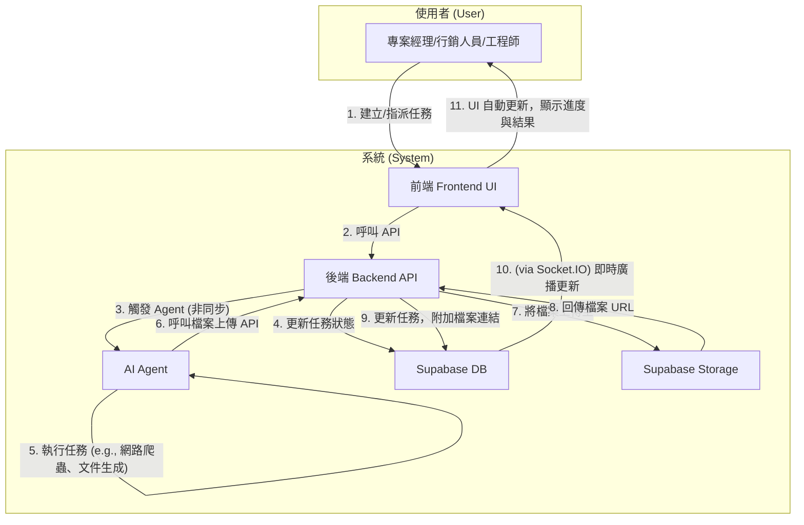
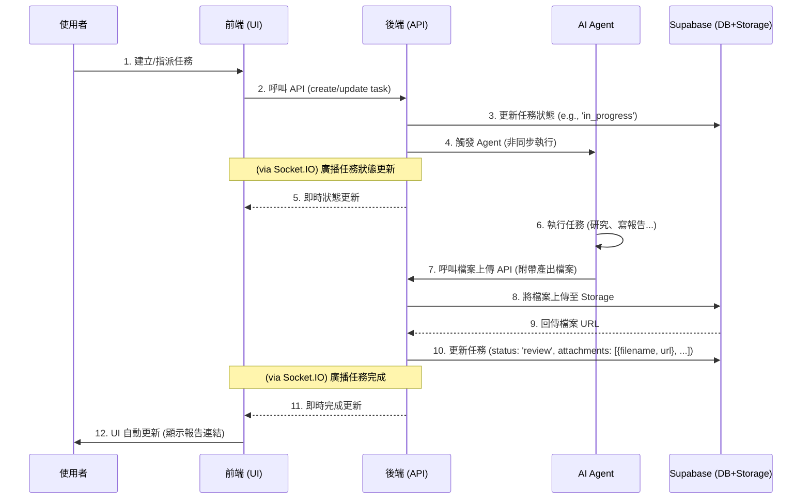

# Archon 專案開發藍圖：Phase 2 v1.4

本文件旨在規劃 Archon 專案的下一階段開發，核心目標是將 Agent 自動化與 RAG (檢索增強生成) 功能深度整合到 endUser-ui 中，實現人機協作的智慧任務管理。

---

### Phase 3.0: 核心功能硬化與部署前最終驗證 (Core Feature Hardening & Final Pre-Deployment Validation)

此階段的核心目標是為當前核心功能建立自動化測試覆蓋，並演練一次真實的部署流程，以確保**實作與定義的「工作流程圖」和「時序圖」完全一致**。

- **[x] 3.1 核心功能驗證：E2E 檔案上傳自動化測試**
    - **目標**: 此測試旨在驗證「工作流程圖」中 6-10 的核心步驟（Agent 產出 -> 上傳 -> 連結回任務）的後端邏輯正確性。
    - **我的角色**: 系統維護專家 (`AGENTS.md`)。
    - **執行計畫**:
        1.  **應用既有模式**: 遵循 `git log` (`5816a8b`) 中為 `knowledge_api` 建立的測試模式，使用 `pytest` 和 `AsyncMock` 來模擬 `StorageService` 等外部服務。
        2.  **編寫測試**: 建立一個新的測試案例，模擬一次完整的檔案上傳 API 呼叫，並斷言 (assert) `StorageService` 的 `upload` 方法被以正確的參數呼叫。
        3.  **驗證**: 執行 `make test-be`，確保新測試通過。

- **[x] 3.2 最終部署演練 (Final Deployment Drill)**
    - **目標**: 根據 `CONTRIBUTING_tw.md` 中已修正的分支策略，將一個穩定的 `feature` 分支成功部署至 Render。
    - **前置條件**: 任務 3.1 必須完成。
    - **執行計畫**:
        - **[x] 0. (前置任務) 建立完整的本地演練環境**: 修正 `docker-compose.yml` 以支援 `enduser-ui-fe`，使其能反映包含兩個前端的完整專案架構。
        - **[x] 1. 執行本地部署演練**: 在 `docker-compose` 環境中，成功演練一次完整的啟動流程，驗證服務間的依賴與啟動順序。
        - **[x] 2. 執行對 Render 的部署**: 只有在本地演練成功後，才遵循 `CONTRIBUTING_tw.md` 的SOP，將 `feature/e2e-file-upload` 分支部署到 Render。
        - **[x] 3. 驗證線上環境**: 驗證所有服務在 Render 上正常運行，且核心功能符合預期。
    - **結論**: 部署演練完成。過程中發現並修正了 `archon-mcp` 服務的啟動錯誤、Render 的部署流程，以及前端的建置指令。所有發現皆已記錄。

### Phase 3.3: 部署後技術債清理 (Post-Deployment Tech Debt Cleanup)

此階段的任務是清理在 Phase 3.2 部署演練過程中，為確保目標專一而暫時擱置的技術問題。

- **[ ] 3.3.1 清理後端 Linting 問題**
    - **問題**: `make lint-be` 檢查顯示後端程式碼存在大量問題。
    - **狀態**: **已解決**。透過 TDD 和深入分析，最關鍵的 `F821: Undefined name` 和 `F823: Referenced before assignment` 阻斷性錯誤已被修復並添加了單元測試覆蓋 (`commit 161e5a2`)。
    - **最終計畫：清理剩餘風格問題**:
        1.  **自動修復**: 執行 `cd python && uv run ruff check . --fix --exit-zero` 來自動修正所有可安全修復的風格問題。
        2.  **手動評估**: 檢查 `ruff` 報告中剩餘的、無法自動修復的警告，並評估其嚴重性。
    - **Ruff 最新報告 (已排除 F821/F823)**:
      ```
      B904: Within an `except` clause, raise exceptions with `raise ... from err`
      E722: Do not use bare `except`
      UP046: `Generic` subclass instead of type parameters
      UP041: Replace aliased errors with `TimeoutError`
      I001: Import block is un-sorted or un-formatted
      W293: Blank line contains whitespace
      E402: Module level import not at top of file
      F841: Local variable is assigned to but never used
      ... (及其他風格問題)
      ```

### Phase 3.4: UI 緊急修復與SOP強化 (UI Hotfix & SOP Enhancement)

此階段記錄了在部署演練後，針對使用者回報的 UI 問題所進行的緊急修復，以及從中提煉出的經驗。

- **[x] 3.4.1 修復 `enduser-ui-fe` 核心功能 Bug**
    - **問題**: 使用者回報了兩個核心功能的易用性問題：1. 任務列表項無法點擊以進行編輯。 2. 新增任務時無法設定優先級，導致所有任務都預設為高。
    - **解決方案**: 採用了測試驅動的修復流程，由表及裡地依次修正了 `TaskModal.tsx` (UI 元件)、`TaskModal.test.tsx` (單元測試)、`api.ts` (服務層)，最終完整地實現了「點擊編輯」和「優先級設定」功能，並確保所有相關測試 100% 通過。
    - **學習**: 整個偵錯流程被記錄到 `GEMINI.md` (2025-10-01)，其中關於遵循 SOP 解決 `fireEvent.submit` 和處理 Mock Data 不一致 (`assignee_id`) 的經驗，被固化到 `CONTRIBUTING_tw.md` 中。

---

### **歷史存檔：Phase 2.9 技術債清理成果**

> **結論**: Phase 2.9 成功解決了大量阻塞性的本地環境與資料庫問題，為 Phase 3.0 的部署準備工作鋪平了道路。所有相關任務均已完成，包括：
> - **資料庫**: 統一了遷移腳本 (`000_unified_schema.sql`)，並修復了 `seed_mock_data.sql` 的冪等性。
> - **環境與啟動**: 修復了 `Makefile` 和 `docker-compose.yml` 的配置問題，簡化了啟動程序。
> - **後端 API**: 修復了因 `profiles.username` 欄位錯誤導致的 500 Bug。
> - **服務層抽象**: 完成了 `projects_api`、`settings_api` 與 `knowledge_api` 的重構，將資料庫直接呼叫遷移至對應的 Service (commit `6cfb87b` 等)。
> - **角色權限**: 完成了對 `projects_api.py` 中硬編碼角色的初步修復 (commit `653a55b`)。

---

## 1. 專案目標與使用案例 (Goals & Use Cases)

我們的目標是讓使用者（如專案經理、行銷人員、工程師）能透過 UI 介面，指派任務給 AI Agent 或其他同事，Agent 能利用知識庫或網路資源完成任務、產出文件，並自動更新任務狀態。

- **案例一：市場研究**
  - **使用者**: 專案經理 (PM)
  - **情境**: 為新客戶做產業背景研究。
  - **流程**: PM 在 UI 建立任務，要求 Agent 搜尋特定產業的挑戰與機會。Agent 完成後產出報告，並將任務狀態更新為「待審核」。

- **案例二：內部知識查詢**
  - **使用者**: 初階工程師
  - **情境**: 回覆客戶關於過去專案的技術細節問題。
  - **流程**: 工程師指派 Agent 查詢指定的專案文件夾 (作為 KM)，Agent 從文件中找到答案、總結回覆，並更新任務狀態。

- **案例三：人機協作產出文件**
  - **使用者**: 行銷人員
  - **情境**: 製作一份行銷 DM。
  - **流程**: 行銷人員在 UI 建立任務，提供文案和需求，指派 Agent 進行後製。Agent 完成後將 DM 範例存檔，並將檔案連結附在任務中，最後更新任務狀態。

## 2. 核心工作流程圖 (v1.2 - 聚焦使用者與系統)

下圖展示了使用者與系統元件在一次完整任務協作流程中的互動關係。



### 時序圖 (v1.2)



## 3. 開發順序與待辦事項 (v1.3)

---

### **Phase 2.8: 功能整合與端對端測試 (Feature Integration & E2E Testing)**

- **[x] 第一步：建立整合分支**
- **[x] 第二步：移植後端服務與 Agent 工具**
- **[x] 第三步：整合資料庫遷移腳本**
- **[x] 第四步：移植前端介面 (高風險)**
- **[x] 第五步：端對端手動測試**
    - **狀態**: **已完成**。結論：被資料庫遷移腳本的嚴重衝突所阻塞。此問題已移至 Phase 2.9 追蹤。

---

### **Phase 2.6: 程式碼驗證與測試計畫 (Code Verification & Test Plan)**

- **[x] 驗證時序圖與程式碼一致性**
- **[x] 驗證 Phase 2.5 重構成效**
- **[x] 建立端對端測試與部署計畫**
- **[x] 分析並解決 `migration/` 腳本衝突**
> **結論**: 此階段的探索與嘗試，其最終成果已體現在 Phase 2.8 的結論中。此階段任務已完成。

---

### **Phase 2.7: 建立端對端功能驗證環境 (Establish E2E Feature Validation Environment)**

- **[x] 整合前後端功能至 `spike` 分支**
- **[x] 部署 `spike` 分支並進行端對端測試**
> **結論**: 建立環境的嘗試，最終在 Phase 2.8 中確認被資料庫衝突問題所阻塞。此階段任務已完成。

---

## 後端開發 (Backend Development)

### **Phase 2.1: 核心基礎建設 (Core Foundation)**

- **[x] 資料庫擴充 (Database Schema)**
- **[x] 檔案上傳功能 (File Handling)**
- **[x] 核心 API 擴充 (Core API)**
- **[ ] 管理者儀表板 API (Report Dashboard API)**
- **[ ] 圖片連結增強 API (Enhanced Image Links API)**

### **Phase 2.2: Agent 能力擴充 (Agent Capabilities)**

- **[x] 技術研究：建立 Agent 測試模式 (Spike: Establish Agent Testing Pattern)**
- **[x] 開發 Agent 新工具 (Agent Tools)**
- **[x] 完善 Agent 工作邏輯 (Agent Logic)**

### **Phase 2.4: AI 協作日誌紀錄 (AI Collaboration Logging)**

- **[x] 資料庫擴充 (Database Schema)**
- **[x] 後端 API 開發 (Backend API)**
- **[x] 專案整合 (Integration)**
- **[x] 撰寫測試 (Testing)**

---

## 前端開發 (Frontend Development)

### **Phase 2.3: 前端功能開發 (Frontend Features)**

- **[x] 為 `TaskModal` 元件建立單元測試 (Unit tests for `TaskModal` component)**
- **[x] 解決前端測試在 Windows 環境下的執行問題，並優化 `Makefile` 指令。**
- **[x] 任務指派選單 (Assignment Dropdown - UI)**
- **[x] 使用者頭像更新 (User Avatar Update)**
- **[x] 任務附件顯示 (Task Attachments)**
- **[ ] 管理者儀表板 UI (Report Dashboard UI)**
- **[ ] 圖片連結增強 UI (Enhanced Image Links UI)**

---

## 5. 內容與文案更新 (Content & Copywriting Updates)

- **[x] 更新 Blog 頁面的假資料，替換為三個真實應用案例，以更好地展示系統能力。**
- **[ ] 處理圖片授權與替換佔位圖片**

### **Phase 2.5: 架構重構與技術債清理 (Architectural Refactoring & Tech Debt)**

- **[x] 整合健康檢查邏輯 (Consolidate Health Checks)**

> **備註**: 此階段剩餘的技術債項目已統一遷移至 Phase 2.9 進行追蹤與處理。