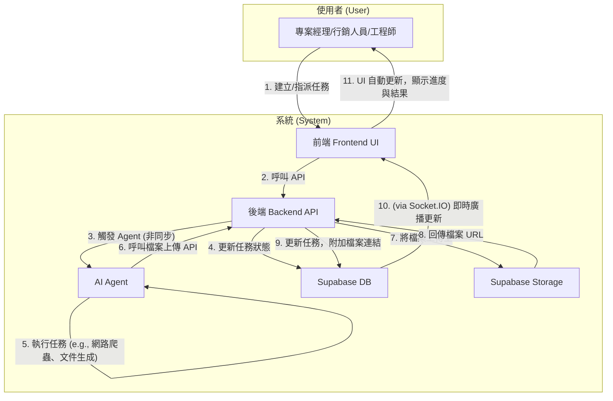

# Archon 專案開發藍圖：Phase 2 v1.3

本文件旨在規劃 Archon 專案的下一階段開發，核心目標是將 Agent 自動化與 RAG (檢索增強生成) 功能深度整合到 endUser-ui 中，實現人機協作的智慧任務管理。

## 1. 專案目標與使用案例 (Goals & Use Cases)

我們的目標是讓使用者（如專案經理、行銷人員、工程師）能透過 UI 介面，指派任務給 AI Agent 或其他同事，Agent 能利用知識庫或網路資源完成任務、產出文件，並自動更新任務狀態。

- **案例一：市場研究**
  - **使用者**: 專案經理 (PM)
  - **情境**: 為新客戶做產業背景研究。
  - **流程**: PM 在 UI 建立任務，要求 Agent 搜尋特定產業的挑戰與機會。Agent 完成後產出報告，並將任務狀態更新為「待審核」。

- **案例二：內部知識查詢**
  - **使用者**: 初階工程師
  - **情境**: 回覆客戶關於過去專案的技術細節問題。
  - **流程**: 工程師指派 Agent 查詢指定的專案文件夾 (作為 KM)，Agent 從文件中找到答案、總結回覆，並更新任務狀態。

- **案例三：人機協作產出文件**
  - **使用者**: 行銷人員
  - **情境**: 製作一份行銷 DM。
  - **流程**: 行銷人員在 UI 建立任務，提供文案和需求，指派 Agent 進行後製。Agent 完成後將 DM 範例存檔，並將檔案連結附在任務中，最後更新任務狀態。

## 2. 核心工作流程圖 (v1.2 - 聚焦使用者與系統)

下圖展示了使用者與系統元件在一次完整任務協作流程中的互動關係。

### 時序圖 (v1.2)

## 3. 開發順序與待辦事項 (v1.3)

我們將開發任務明確區分為「後端」與「前端」，以便團隊成員可以並行工作，同時確保後端基礎建設優先完成。

---

## 後端開發 (Backend Development)

後端負責所有核心商業邏輯、資料庫互動、Agent 能力以及 API 端點。

### **Phase 2.1: 核心基礎建設 (Core Foundation)**

此為最高優先級，為所有新功能打下地基。

- **[ ] 資料庫擴充 (Database Schema)**
    - [x] 撰寫 SQL 遷移腳本，為 `archon_tasks` 表新增 `attachments` 欄位 (型別為 JSONB 或 TEXT[])。
    - [ ] (可選) 撰寫 SQL 遷移腳本，新增 `customers` 和 `vendors` 資料表。
    - [ ] 在開發環境中執行並驗證遷移腳本。

- [x] **角色權限管理 (RBAC - Security & Data)**
    - [x] **1. 定義角色與權限 (v1.3)**
        - **角色 (Roles):**
            - `Admin` (管理者)
            - `PM` (專案經理)
            - `Engineer` (工程師)
            - `Marketer` (行銷人員)
            - `AI Agent` (人工智慧代理): 一個角色類別，未來可擴充為多個不同職能的 Agent。
        - **權限 (Permissions) - "誰可以指派給誰":**
            - `Admin`: 可指派給**任何人** (包括所有人類角色與 AI Agent)。
            - `PM`: 可指派給**團隊中的 Engineer、Marketer**，以及**任何 AI Agent**。
            - `Engineer`: 可指派給**自己、其他 Engineer**，以及**任何 AI Agent**。
            - `Marketer`: 可指派給**自己**，以及**任何 AI Agent**。
            - `AI Agent`: **不可指派任務**，僅作為被指派者。
    - [x] **2. API 端點**: 在 `projects_api.py` 中建立 `GET /api/assignable-users`，根據上述權限規則，回傳合法的可指派人員列表。
        - **實作細節 (Implementation Details):**
            - 在 `projects_api.py` 的 `typing` import 中加入 `List`。
            - 新增 Pydantic 模型 `AssignableUser(id: str, name: str, role: str)`。
            - 新增 `@router.get("/assignable-users")` 路由函式。
            - 函式內部暫時將當前使用者角色寫死為 "PM" 進行開發。
            - 從 `profiles` 資料表讀取所有使用者，並根據 RBAC 規則過濾後回傳。
    - [x] **3. 安全驗證**: 在 `create/update_task` API 中，加入伺服器端驗證，確保每次指派操作都經過權限檢查。
    - [x] **4. 資料庫**: 確保 `users` 或 `profiles` 資料表包含 `role` 欄位以供判斷。

- **[x] 檔案上傳功能 (File Handling)**
  - ~~在 `python/src/server/services/` 下建立 `storage_service.py`~~
  - ~~在 `python/src/server/api_routes/` 下建立 `files_api.py`~~

- **[x] 核心 API 擴充 (Core API)**
    - [x] 修改後端 `update_task` 的 API 端點 (`projects_api.py`)，使其能夠接收並處理 `attachments` 欄位的更新請求。
    - [x] 更新對應的服務層邏輯 (`task_service.py`) 來處理 `attachments` 的資料庫操作。
    - [x] 為 `attachments` 更新功能撰寫並通過 Pytest 測試案例。

- **[ ] 管理者儀表板 API (Report Dashboard API)**
    - [ ] 建立 `reports_api.py` 並提供數據聚合 API。

- **[ ] 圖片連結增強 API (Enhanced Image Links API)**
    - [ ] 修改資料模型 (如 `BlogPost`)，允許圖片關聯一個可選的「文件下載連結」(例如 PDF)。

### **Phase 2.2: Agent 能力擴充 (Agent Capabilities)**

在後端 API 備妥後，賦予 Agent 使用這些新功能的能力。

- **[x] 開發 Agent 新工具 (Agent Tools)**
    - [x] 建立 `python/src/agents/tools/file_tools.py`。
    - [x] 定義 `upload_and_link_file_to_task` 工具，並實作其呼叫後端上傳與連結 API 的邏輯。
    - [x] 為新工具撰寫並通過 Pytest 單元測試。

- **[ ] 完善 Agent 工作邏輯 (Agent Logic)**
    - [ ] 識別需要使用新檔案工具的 Agent (例如「行銷 Agent」)。
    - [ ] 修改該 Agent 的主要邏輯或提示 (prompt)，在其工作流程的最後一步加入呼叫 `upload_and_link_file_to_task` 工具的指令。
    - [ ] 進行端對端測試，確保 Agent 能成功產出檔案並更新任務。

### **Phase 2.4: AI 協作日誌紀錄 (AI Collaboration Logging)**

此功能用於記錄開發過程中與 AI 的互動，作為未來分析與優化的教材。

- **[x] 資料庫擴充 (Database Schema)**
    - [x] 撰寫 SQL 遷移腳本 `20250901_create_gemini_logs_table.sql`。
    - [x] 在新腳本中建立 `gemini_logs` 資料表，需包含 `id`, `user_input`, `gemini_response`, `project_name`, `user_name`, `created_at` 欄位。

- **[x] 後端 API 開發 (Backend API)**
    - [x] 在 `python/src/server/api_routes/` 下建立 `log_api.py`。
    - [x] 建立 Pydantic 模型以驗證 `POST` 請求的 Body (`gemini_response` 為必填)。
    - [x] 實作 `POST /api/record-gemini-log` 端點，處理資料驗證與寫入邏輯。

- **[x] 專案整合 (Integration)**
    - [x] 在主 FastAPI 應用中註冊 `log_api` 的路由。

- **[x] 撰寫測試 (Testing)**
    - [x] 為新的 API 端點撰寫並通過 Pytest 測試案例。

---

## 前端開發 (Frontend Development)

前端負責所有使用者介面、互動體驗以及與後端 API 的串接。

### **Phase 2.3: 前端功能開發 (Frontend Features)**

- [x] 為 `TaskModal` 元件建立單元測試 (Unit tests for `TaskModal` component)
- [x] 解決前端測試在 Windows 環境下的執行問題，並優化 `Makefile` 指令。

- **[ ] 任務指派選單 (Assignment Dropdown - UI)**
    - [ ] **畫面開發**: 在任務表單中，呼叫後端的 `GET /api/assignable-users` API。
    - [ ] **元件實作**: 將回傳的列表渲染成下拉選單，供使用者進行指派。
    - [ ] **測試**: 撰寫 Vitest 測試，確保選單能正確顯示及運作。

- **[ ] 使用者頭像更新 (User Avatar Update)**
    - [ ] **尋找或建立新元件**: 引入一個新的頭像 (Avatar) 元件。
    - [ ] **整合新元件**: 在 UI 中所有顯示「人類使用者」的地方，替換為這個新的頭像元件。
    - [ ] **區分 AI Agent**: 保留或改造舊的頭像元件，專門用來代表「AI Agent」。
    - [ ] **撰寫測試**: 為新的頭像元件撰寫 Vitest 測試。

- **[ ] 任務附件顯示 (Task Attachments)**
    - [ ] 修改前端服務，確保能接收 `attachments` 資料。
    - [ ] 修改 React 元件，將附件渲染為可點擊的檔案連結。
    - [ ] 為新功能撰寫 Vitest 測試。

- **[ ] 管理者儀表板 UI (Report Dashboard UI)**
    - [ ] 建立儀表板頁面與路由。
    - [ ] 建立儀表板 React 元件，呼叫 API 並將數據視覺化。
    - [ ] 為新的儀表板元件撰寫 Vitest 測試。

- **[ ] 圖片連結增強 UI (Enhanced Image Links UI)**
    - [ ] 當圖片包含下載連結時，點擊圖片應觸發文件下載。
    - [ ] 可考慮在圖片上顯示一個下載圖示，以提示使用者。

---

## 4. 開發與測試策略 (Development & Testing Strategy)

為了確保專案的穩定性與程式碼品質，所有開發工作都應遵循以下策略。本策略是基於對專案既有測試框架的分析而定。

### 後端 (Python / Pytest)

1.  **禁止真實資料庫連線**: 所有單元/整合測試都**禁止**連線到真實的 Supabase 資料庫。測試環境會自動阻止這類網路請求。
2.  **使用模擬 (Mocking) 進行測試**:
    *   測試的核心是驗證商業邏輯，而非資料庫本身。
    *   必須使用 `conftest.py` 中提供的 `client` 和 `mock_supabase_client` 來進行測試。
    *   在測試的「Arrange (安排)」階段，明確設定 `mock_supabase_client` 的回傳值，以模擬資料庫的行為。
3.  **本地測試流程**:
    *   在 `python/` 目錄下執行 `pytest` 來快速驗證程式碼變更。
    *   在提交 (Commit) 程式碼前，必須確保所有本地測試都已通過。

### 前端 (React / Vitest)

1.  **模擬 API 呼叫**: 前端測試不應呼叫真實的後端 API。應使用 `msw` (Mock Service Worker) 或其他模擬工具來攔截 API 請求，並回傳預先定義好的假資料 (JSON)。
2.  **測試使用者互動**: 測試的重點應放在：
    *   元件是否根據傳入的 props 正確渲染。
    *   使用者的操作（如點擊、輸入）是否觸發了正確的函式。
    *   UI 狀態是否根據 API 的模擬回傳值或使用者操作而正確更新。
3.  **本地測試流程**:
    *   在 `enduser-ui-fe/` 等前端專案目錄下執行 `npm test` (或 `yarn test`)。
    *   在提交 (Commit) 程式碼前，必須確保所有本地測試都已通過。

---

## 5. 內容與文案更新 (Content & Copywriting Updates)

- [x] 更新 Blog 頁面的假資料，替換為三個真實應用案例，以更好地展示系統能力。
- **[ ] 處理圖片授權與替換佔位圖片**
    - [ ] **檢視**: 檢視專案中所有佔位圖片 (如 `picsum.photos`)。
    - [ ] **替換**: 將無授權的圖片替換為 a) 明確授權的圖庫資源（如 Unsplash）或 b) 專案自有設計素材。