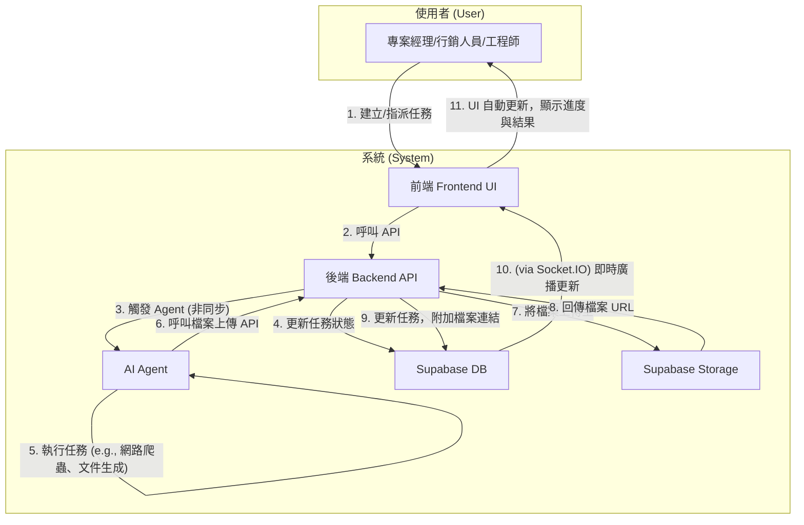
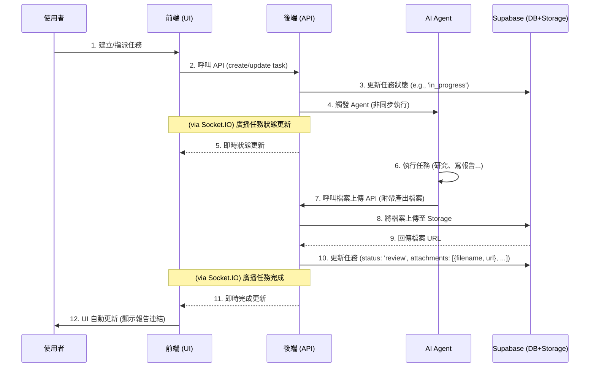

# Archon 專案開發藍圖：Phase 2 v1.3

本文件旨在規劃 Archon 專案的下一階段開發，核心目標是將 Agent 自動化與 RAG (檢索增強生成) 功能深度整合到 endUser-ui 中，實現人機協作的智慧任務管理。

---

### **Phase 2.9: 核心技術債清理與資料庫遷移 (Core Tech Debt & DB Migration)**

此階段的目標是解決所有已知的、阻礙專案進行端對端測試的根本性問題，是進入下一階段開發的關鍵前置任務。

- **[x] 第一步：解決資料庫遷移腳本衝突**
    - [x] 釐清 `enduser-ui-fe` 的資料與功能對應關係。
    - [x] 以 `spike` 分支為基準，分析遷移腳本衝突。
    - [x] 制定合併策略，建立一個單一、統一的 `000_unified_schema.sql`。
    - [x] 封存舊的、衝突的腳本至 `migration/archive/`。
    - [x] 提交資料庫重構 (`refactor(db): ...`)。

- **[x] 第二步：端對端整合測試 (Final Acceptance Test)**
    - [x] **資料庫準備**: 在 Supabase 手動執行 `RESET_DB.sql` (可選), `000_unified_schema.sql`, `seed_mock_data.sql`。
    - [x] **啟動應用**: 成功啟動所有服務 (backend, archon-ui-main, enduser-ui-fe)。
    - [x] `make install` (with `make 3.81` workaround)
    - [x] `make install-ui` (with `make 3.81` workaround)
    - [x] Fix `docker-compose.yml` profiles
    - [x] **Current**: Execute final `make dev` command.
    - [ ] **手動驗證**: 建立任務 -> 指派給 Agent -> 驗證產出的附件。 (發現新 Bug)

- **[ ] (from P2.5) 移除 API 中寫死的角色 (`current_user_role`)**
- [x] (from P2.5) 簡化應用程式啟動程序 (Simplify App Startup) - *已在近期提交中透過 `Makefile` 和 SOP 優化完成。*
- [x] (from P2.5) 強化服務層抽象 (Enforce Service Layer Abstraction) - *已將 `projects_api.py` 和 `settings_api.py` 中的直接呼叫重構至服務層。*
- [x] (Tech Debt) 修復 `seed_mock_data.sql` 的冪等性，確保可重複執行。
- [x] (Bug) 修復更新任務時，因 `profiles.username` 欄位不存在而導致的 500 錯誤。

---

## 1. 專案目標與使用案例 (Goals & Use Cases)

我們的目標是讓使用者（如專案經理、行銷人員、工程師）能透過 UI 介面，指派任務給 AI Agent 或其他同事，Agent 能利用知識庫或網路資源完成任務、產出文件，並自動更新任務狀態。

- **案例一：市場研究**
  - **使用者**: 專案經理 (PM)
  - **情境**: 為新客戶做產業背景研究。
  - **流程**: PM 在 UI 建立任務，要求 Agent 搜尋特定產業的挑戰與機會。Agent 完成後產出報告，並將任務狀態更新為「待審核」。

- **案例二：內部知識查詢**
  - **使用者**: 初階工程師
  - **情境**: 回覆客戶關於過去專案的技術細節問題。
  - **流程**: 工程師指派 Agent 查詢指定的專案文件夾 (作為 KM)，Agent 從文件中找到答案、總結回覆，並更新任務狀態。

- **案例三：人機協作產出文件**
  - **使用者**: 行銷人員
  - **情境**: 製作一份行銷 DM。
  - **流程**: 行銷人員在 UI 建立任務，提供文案和需求，指派 Agent 進行後製。Agent 完成後將 DM 範例存檔，並將檔案連結附在任務中，最後更新任務狀態。

## 2. 核心工作流程圖 (v1.2 - 聚焦使用者與系統)

下圖展示了使用者與系統元件在一次完整任務協作流程中的互動關係。

### 時序圖 (v1.2)

## 3. 開發順序與待辦事項 (v1.3)

---

### **Phase 2.8: 功能整合與端對端測試 (Feature Integration & E2E Testing)**

- **[x] 第一步：建立整合分支**
- **[x] 第二步：移植後端服務與 Agent 工具**
- **[x] 第三步：整合資料庫遷移腳本**
- **[x] 第四步：移植前端介面 (高風險)**
- **[x] 第五步：端對端手動測試**
    - **狀態**: **已完成**。結論：被資料庫遷移腳本的嚴重衝突所阻塞。此問題已移至 Phase 2.9 追蹤。

---

### **Phase 2.6: 程式碼驗證與測試計畫 (Code Verification & Test Plan)**

- **[x] 驗證時序圖與程式碼一致性**
- **[x] 驗證 Phase 2.5 重構成效**
- **[x] 建立端對端測試與部署計畫**
- **[x] 分析並解決 `migration/` 腳本衝突**
> **結論**: 此階段的探索與嘗試，其最終成果已體現在 Phase 2.8 的結論中。此階段任務已完成。

---

### **Phase 2.7: 建立端對端功能驗證環境 (Establish E2E Feature Validation Environment)**

- **[x] 整合前後端功能至 `spike` 分支**
- **[x] 部署 `spike` 分支並進行端對端測試**
> **結論**: 建立環境的嘗試，最終在 Phase 2.8 中確認被資料庫衝突問題所阻塞。此階段任務已完成。

---

## 後端開發 (Backend Development)

### **Phase 2.1: 核心基礎建設 (Core Foundation)**

- **[x] 資料庫擴充 (Database Schema)**
- **[x] 角色權限管理 (RBAC - Security & Data)**
- **[x] 檔案上傳功能 (File Handling)**
- **[x] 核心 API 擴充 (Core API)**
- **[ ] 管理者儀表板 API (Report Dashboard API)**
- **[ ] 圖片連結增強 API (Enhanced Image Links API)**

### **Phase 2.2: Agent 能力擴充 (Agent Capabilities)**

- **[x] 技術研究：建立 Agent 測試模式 (Spike: Establish Agent Testing Pattern)**
- **[x] 開發 Agent 新工具 (Agent Tools)**
- **[x] 完善 Agent 工作邏輯 (Agent Logic)**

### **Phase 2.4: AI 協作日誌紀錄 (AI Collaboration Logging)**

- **[x] 資料庫擴充 (Database Schema)**
- **[x] 後端 API 開發 (Backend API)**
- **[x] 專案整合 (Integration)**
- **[x] 撰寫測試 (Testing)**

---

## 前端開發 (Frontend Development)

### **Phase 2.3: 前端功能開發 (Frontend Features)**

- **[x] 為 `TaskModal` 元件建立單元測試 (Unit tests for `TaskModal` component)**
- **[x] 解決前端測試在 Windows 環境下的執行問題，並優化 `Makefile` 指令。**
- **[x] 任務指派選單 (Assignment Dropdown - UI)**
- **[x] 使用者頭像更新 (User Avatar Update)**
- **[x] 任務附件顯示 (Task Attachments)**
- **[ ] 管理者儀表板 UI (Report Dashboard UI)**
- **[ ] 圖片連結增強 UI (Enhanced Image Links UI)**

---

## 5. 內容與文案更新 (Content & Copywriting Updates)

- **[x] 更新 Blog 頁面的假資料，替換為三個真實應用案例，以更好地展示系統能力。**
- **[ ] 處理圖片授權與替換佔位圖片**

### **Phase 2.5: 架構重構與技術債清理 (Architectural Refactoring & Tech Debt)**

- **[x] 重構角色權限管理 (Refactor RBAC)**
- **[x] 整合健康檢查邏輯 (Consolidate Health Checks)**

> **備註**: 此階段剩餘的技術債項目已統一遷移至 Phase 2.9 進行追蹤與處理。
