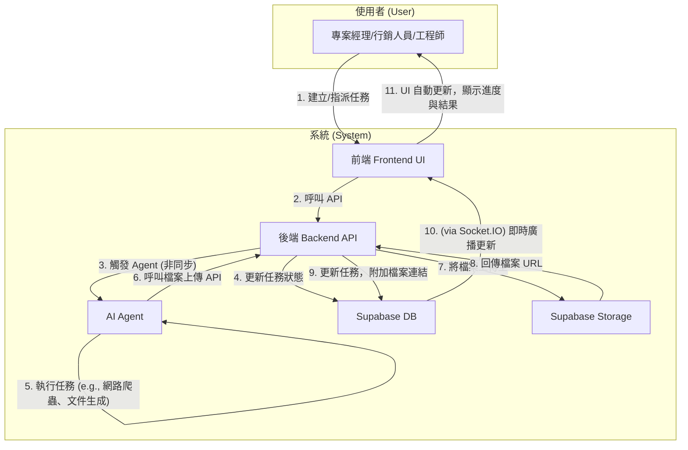
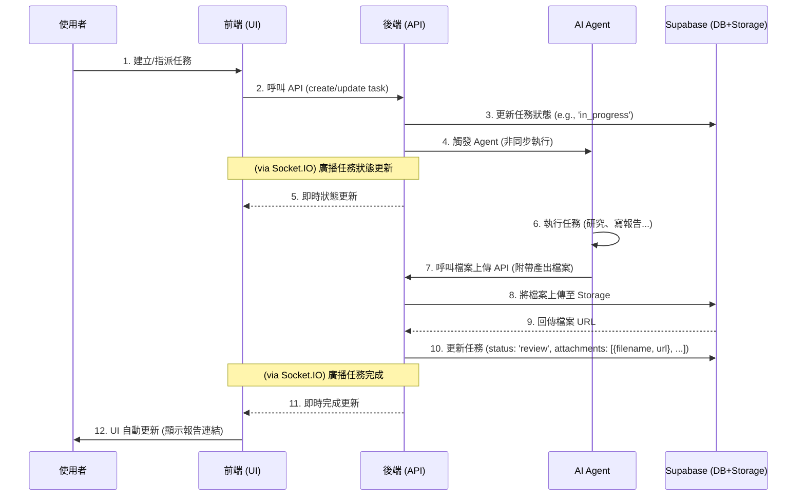

# Archon 專案開發藍圖：Phase 2 v1.4

本文件旨在規劃 Archon 專案的下一階段開發，核心目標是將 Agent 自動化與 RAG (檢索增強生成) 功能深度整合到 endUser-ui 中，實現人機協作的智慧任務管理。

---

### Phase 3.0: 核心功能硬化與部署前最終驗證 (Core Feature Hardening & Final Pre-Deployment Validation)

此階段的核心目標是為當前核心功能建立自動化測試覆蓋，並演練一次真實的部署流程，以確保**實作與定義的「工作流程圖」和「時序圖」完全一致**。

- **[x] 3.1 核心功能驗證：E2E 檔案上傳自動化測試**
    - **目標**: 此測試旨在驗證「工作流程圖」中 6-10 的核心步驟（Agent 產出 -> 上傳 -> 連結回任務）的後端邏輯正確性。
    - **我的角色**: 系統維護專家 (`AGENTS.md`)。
    - **執行計畫**:
        1.  **應用既有模式**: 遵循 `git log` (`5816a8b`) 中為 `knowledge_api` 建立的測試模式，使用 `pytest` 和 `AsyncMock` 來模擬 `StorageService` 等外部服務。
        2.  **編寫測試**: 建立一個新的測試案例，模擬一次完整的檔案上傳 API 呼叫，並斷言 (assert) `StorageService` 的 `upload` 方法被以正確的參數呼叫。
        3.  **驗證**: 執行 `make test-be`，確保新測試通過。

- **[x] 3.2 最終部署演練 (Final Deployment Drill)**
    - **目標**: 根據 `CONTRIBUTING_tw.md` 中已修正的分支策略，將一個穩定的 `feature` 分支成功部署至 Render。
    - **前置條件**: 任務 3.1 必須完成。
    - **執行計畫**:
        - **[x] 0. (前置任務) 建立完整的本地演練環境**: 修正 `docker-compose.yml` 以支援 `enduser-ui-fe`，使其能反映包含兩個前端的完整專案架構。
        - **[x] 1. 執行本地部署演練**: 在 `docker-compose` 環境中，成功演練一次完整的啟動流程，驗證服務間的依賴與啟動順序。
        - **[x] 2. 執行對 Render 的部署**: 只有在本地演練成功後，才遵循 `CONTRIBUTING_tw.md` 的SOP，將 `feature/e2e-file-upload` 分支部署到 Render。
        - **[x] 3. 驗證線上環境**: 驗證所有服務在 Render 上正常運行，且核心功能符合預期。
    - **結論**: 部署演練完成。過程中發現並修正了 `archon-mcp` 服務的啟動錯誤、Render 的部署流程，以及前端的建置指令。所有發現皆已記錄。

### Phase 3.3: 部署後技術債清理 (Post-Deployment Tech Debt Cleanup)

**此階段的任務已完成**，清理了在 Phase 3.2 部署演練過程中暫時擱置的技術問題。

- **[x] 3.3.1 清理後端 Linting 問題**
    - **問題**: `make lint-be` 檢查顯示後端程式碼存在大量待處理問題。
    - **解決方案**: **已解決**。在 `commit 37b1e43` 中，所有後端 Linting 問題已被完全修復，`make lint-be` 現在可以成功通過。
- **[x] 3.3.2 (技術債) 修復被跳過的 Agent 測試**
    - **問題**: `tests/agents/test_document_agent.py` 中的 `test_list_documents_success` 測試因與舊版 `pydantic-ai` 函式庫深度耦合而難以 Mock，一度被暫時跳過。
    - **解決方案**: **已解決**。在 `commit 1a2e58da` 中，透過對 `pydantic-ai` Agent 內部結構的偵錯，採用了 `agent.agent.override` 和 `@patch` 相結合的模式，成功修復並啟用了此測試。
- [x] 3.3.3 (技術債) 修復剩餘的 2 個被跳過的測試
    - **問題**: `make test-be` 的結果 (`435 passed, 2 skipped`) 顯示，在 `tests/test_token_optimization_integration.py` 中仍有 2 個測試被跳過。
    - **解決方案**: **已解決**。在最新的程式碼中，`make test-be` 顯示所有 436 個測試都已通過，不再有任何測試被跳過。此技術債已清理完畢。

### Phase 3.4: UI 緊急修復與SOP強化 (UI Hotfix & SOP Enhancement)

此階段記錄了在部署演練後，針對使用者回報的 UI 問題所進行的緊急修復，以及從中提煉出的經驗。

- **[x] 3.4.1 修復 `enduser-ui-fe` 核心功能 Bug**
    - **問題**: 使用者回報了兩個核心功能的易用性問題：1. 任務列表項無法點擊以進行編輯。 2. 新增任務時無法設定優先級，導致所有任務都預設為高。
    - **解決方案**: 採用了測試驅動的修復流程，由表及裡地依次修正了 `TaskModal.tsx` (UI 元件)、`TaskModal.test.tsx` (單元測試)、`api.ts` (服務層)，最終完整地實現了「點擊編輯」和「優先級設定」功能，並確保所有相關測試 100% 通過。
    - **學習**: 整個偵錯流程被記錄到 `GEMINI.md` (2025-10-01)，其中關於遵循 SOP 解決 `fireEvent.submit` 和處理 Mock Data 不一致 (`assignee_id`) 的經驗，被固化到 `CONTRIBUTING_tw.md` 中。

### Phase 3.5: 前端標準化與部署 (Frontend Standardization & Deployment)

**目標：** 分別針對 `archon-ui-main` 和 `enduser-ui-fe`，將其工具鏈統一至 `pnpm`，清理各自的技術債，並確保兩者最終都能在 Render 上成功部署和運行。

---

- **[x] 3.5.1: `archon-ui-main` (管理後台) 標準化與部署**
    - **目標**: 將 `archon-ui-main` 的工具鏈遷移至 `pnpm`，修復其 API 呼叫錯誤，並成功將其部署到 Render。
    - **任務**:
        1.  **統一工具鏈**:
            - 刪除 `archon-ui-main/package-lock.json`。
            - 更新 `archon-ui-main/Dockerfile` 以使用 `pnpm install --frozen-lockfile`。
        2.  **修復技術債**:
            - 修改 `archon-ui-main/src/components/settings/FeaturesSection.tsx`，使其呼叫正確的 `/health` API。
        3.  **部署與驗證**:
            - 在 Render 上為 `archon-ui-main` 建立或更新服務，確保其建置指令為 `pnpm install --frozen-lockfile && pnpm run build`。
            - 設定正確的 `VITE_API_URL` 環境變數。
            - 成功部署並手動驗證儀表板可正常載入且無 404 錯誤。

---

- **[x] 3.5.2: `enduser-ui-fe` (使用者介面) 標準化與部署**
    - **目標**: 將 `enduser-ui-fe` 的工具鏈遷移至 `pnpm`，並驗證其在 Render 上的部署依然穩健。
    - **任務**:
        1.  **統一工具鏈**:
            - 刪除 `enduser-ui-fe/package-lock.json`。
            - 在 `enduser-ui-fe/` 目錄下執行 `pnpm import` 以生成 `pnpm-lock.yaml`。
            - 更新 `enduser-ui-fe` 在 Render 上的 `Build Command` 為 `pnpm install --frozen-lockfile && pnpm run build`。
        2.  **部署與驗證**:
            - 重新部署 `enduser-ui-fe` 到 Render。
            - 手動驗證使用者介面所有核心功能（如任務列表、建立、編輯）均正常運作。

---

- **[x] 3.5.3: 全域設定與文件更新 (Global Config & Documentation Update)**
    - **目標**: 完成剩餘的全域配置統一和文件更新。
    - **任務**:
        1.  **更新 CI/CD**: 檢查 `.github/workflows/ci.yml`，將所有 `npm` 指令替換為 `pnpm`。
        2.  **更新 `Makefile`**: 檢查 `Makefile`，將所有 `npm` 指令替換為 `pnpm`。
        3.  **文件化標準**: 更新 `CONTRIBUTING_tw.md`，明確 `pnpm` 為專案唯一的前端套件管理器。

---

### Phase 3.6: 核心易用性 & API 強化 (Core Usability & API Hardening)

- **目標**: 釐清三大核心元件的職責，並在此基礎上，補全核心功能、強化 API 穩定性。
    - **`archon-server` (後端)**: 核心業務邏輯與資料庫互動的唯一入口。
    - **`enduser-ui-fe` (使用者介面)**: 面向一般使用者，提供任務管理、查詢知識庫等核心操作。
    - **`archon-ui-main` (管理後台)**: 面向系統管理員，提供系統監控、設定與高階管理功能。

---

#### **跨領域任務 (Cross-Cutting Tasks)**

- **[x] 3.6.1: (研究) 找到 pydantic-ai 的官方文件**
    - **問題**: `pydantic-ai` 是一個真實存在的依賴，但無法透過公開網路搜尋找到。
    - **計畫**: 根據 `uv.lock` 的紀錄，該套件來自公開 PyPI 倉庫。下一步是直接訪問 `https://pypi.org/project/pydantic-ai/` 並找到其 GitHub 連結。
    - **結論**: **已完成**。已確認 `https://pypi.org/project/pydantic-ai/` 為其官方 PyPI 頁面。

---

#### **`archon-server` (後端 API) 任務**

- **[x] 3.6.2: (API 強化) 為 `attachments` 欄位增加嚴格的格式驗證**
    - **問題**: `PUT /tasks/{task_id}` 端點接受任何 JSON 作為 `attachments`，有資料污染風險。
    - **計畫**: 使用 Pydantic Model 定義一個嚴格的 `Attachment` 型別 (`{filename: str, url: str}`)，並在 `UpdateTaskRequest` 中使用 `list[Attachment]` 來強制驗證傳入的資料格式。

---

#### **`enduser-ui-fe` (使用者介面) 任務**

- **[x] 3.6.3: (功能) 實作「新增專案」功能**
    - **問題**: `enduser-ui-fe` 缺少建立新專案的 UI 入口。
    - **計畫**:
        1.  在 `DashboardPage.tsx` 新增「新增專案」按鈕。
        2.  建立 `ProjectModal.tsx` 元件，提供建立專案的表單。
        3.  在 `api.ts` 中新增 `createProject` 函式，呼叫後端已有的 `POST /projects` API。

---

#### **全端功能 (Full-Stack Features)**

- **[x] 3.6.4: (功能) 實作「完成日期 (Due Date)」功能**
    - **問題**: `archon_tasks` 資料表缺少 `due_date` 欄位，導致無法追蹤任務時程。
    - **計畫**:
        1.  **資料庫 (`archon-server`)**: 建立一個新的遷移腳本，為 `archon_tasks` 表新增 `due_date TIMESTAMPTZ` 欄位。
        2.  **後端 (`archon-server`)**: 在 `projects_api.py` 的 `CreateTaskRequest` 和 `UpdateTaskRequest` 中新增 `due_date` 欄位。
        3.  **前端 (`enduser-ui-fe`)**: 在 `TaskModal.tsx` 中新增日期選擇器，並更新 `api.ts` 以支援該欄位的傳遞。

- **[x] 3.6.5: (功能) 實作「Blog 內容管理」**
    - **動機**: 將靜態的 Blog 內容改為可由後台動態管理，並釐清前後端職責。
    - **實作**:
        1.  **後端 (`archon-server`)**: 在 `knowledge_api.py` 中新增安全的 `CRUD` 端點，並建立 `BlogService` 處理業務邏輯。權限控管遵循 `X-User-Role` Header 模式。
        2.  **資料庫 (`archon-server`)**: 建立 `migration/seed_blog_posts.sql` 將現有假資料轉為種子資料。
        3.  **前端 (使用者介面 `enduser-ui-fe`)**:
            - **閱覽**: 修改 `api.ts` 以從後端 API 獲取文章列表。
            - **管理**: 在 `AdminPage.tsx` 中，為授權使用者（如 `SYSTEM_ADMIN`）提供完整的文章管理功能（新增、編輯、刪除）。
        4.  **測試**:
            - **後端**: 為 `knowledge_api` 的 blog 端點新增 `pytest` 單元測試，驗證 API 邏輯與權限控制。 (**已完成**)
            - **前端**: 為 `AdminPage.tsx` 的管理功能新增 `vitest` 單元測試。

- **[ ] 3.6.6: (部署) 部署新功能**
    - **目標**: 將 `feature/e2e-file-upload` 分支上已包含「完成日期」與「新增專案」的新功能，正式部署到線上環境。
    - **計畫**:
        1.  **執行部署**: 遵循 `CONTRIBUTING_tw.md` 中定義的、包含**手動資料庫遷移**的部署 SOP。
        2.  **驗證**: 驗證新功能在線上環境正常運作。

---

### Phase 3.7: 體現人機協作與固化核心流程 (Embodying Human-Agent Collaboration & Solidifying Core Processes)

#### 第一部分：體現「人機協作」的專案狀態 (Feature: Embody "Human-Agent" Project Status)
*(此部分基於您對問題一、二的選擇：B, B)*

-   **任務 3.7.1 (後端 API): 實作「動態計算狀態」**
    -   **目標**: 修改 `GET /projects` API，回傳一個根據任務狀態動態計算的 `computed_status` 欄位。
    -   **計算邏輯**:
        -   如果專案下有任何任務狀態為 `review` -> `computed_status` 為 `Pending Review` (待人類審核)。
        -   如果專案下有任何任務的執行者是 AI Agent 且狀態為 `doing` -> `computed_status` 為 `Agent Executing` (AI 執行中)。
        -   如果專案下所有任務都已 `done` -> `computed_status` 為 `Complete` (已完成)。
        -   其他情況 -> `computed_status` 為 `In Progress` (進行中)。

-   **任務 3.7.2 (前端 UI): 呈現「協作狀態」**
    -   **目標**: 在專案列表頁面，用不同的顏色或圖示，清晰地展示每個專案的 `computed_status`。

-   **任務 3.7.3 (後端通知): 實作「狀態向上影響」**
    -   **目標**: 當任務狀態的變更觸發專案 `computed_status` 改變時，透過 Socket.IO 發送即時通知。

#### 第二部分：固化「以人為本」的資料庫遷移流程 (Process: Solidify "Human-Centric" DB Migration)
*(此部分基於您對問題三、四的選擇：B, A)*

-   **任務 3.7.4 (基礎建設): 建立遷移紀錄表**
    -   **目標**: 建立 `schema_migrations` 表。
    -   **產出**: `migration/000_create_migrations_table.sql`。

-   **任務 3.7.5 (模式建立): 將既有腳本「冪等化」**
    -   **目標**: 重構現有遷移腳本，建立一個可供未來所有遷移參考的、安全的寫作模式。
    -   **產出**: 提供 `001_add_due_date_to_tasks.sql` 和 `seed_blog_posts.sql` 的重構後程式碼。

-   **任務 3.7.6 (文件化): 更新貢獻指南 (SOP)**
    -   **目標**: 將新的、更安全的遷移流程，明文寫入 `CONTRIBUTING_tw.md`。
    -   **產出**: 提供 `CONTRIBUTING_tw.md` 中 `4.2` 節的全新文字。

---

### **歷史存檔：Phase 2.9 技術債清理成果**

> **結論**: Phase 2.9 成功解決了大量阻塞性的本地環境與資料庫問題，為 Phase 3.0 的部署準備工作鋪平了道路。所有相關任務均已完成，包括：
> - **資料庫**: 統一了遷移腳本 (`000_unified_schema.sql`)，並修復了 `seed_mock_data.sql` 的冪等性。
> - **環境與啟動**: 修復了 `Makefile` 和 `docker-compose.yml` 的配置問題，簡化了啟動程序。
> - **後端 API**: 修復了因 `profiles.username` 欄位錯誤導致的 500 Bug。
> - **服務層抽象**: 完成了 `projects_api`、`settings_api` 與 `knowledge_api` 的重構，將資料庫直接呼叫遷移至對應的 Service (commit `6cfb87b` 等)。
> - **角色權限**: 完成了對 `projects_api.py` 中硬編碼角色的初步修復 (commit `653a55b`)。

---

## 1. 專案目標與使用案例 (Goals & Use Cases)

我們的目標是讓使用者（如專案經理、行銷人員、工程師）能透過 UI 介面，指派任務給 AI Agent 或其他同事，Agent 能利用知識庫或網路資源完成任務、產出文件，並自動更新任務狀態。

- **案例一：市場研究**
  - **使用者**: 專案經理 (PM)
  - **情境**: 為新客戶做產業背景研究。
  - **流程**: PM 在 UI 建立任務，要求 Agent 搜尋特定產業的挑戰與機會。Agent 完成後產出報告，並將任務狀態更新為「待審核」。

- **案例二：內部知識查詢**
  - **使用者**: 初階工程師
  - **情境**: 回覆客戶關於過去專案的技術細節問題。
  - **流程**: 工程師指派 Agent 查詢指定的專案文件夾 (作為 KM)，Agent 從文件中找到答案、總結回覆，並更新任務狀態。

- **案例三：人機協作產出文件**
  - **使用者**: 行銷人員
  - **情境**: 製作一份行銷 DM。
  - **流程**: 行銷人員在 UI 建立任務，提供文案和需求，指派 Agent 進行後製。Agent 完成後將 DM 範例存檔，並將檔案連結附在任務中，最後更新任務狀態。

## 2. 核心工作流程圖 (v1.2 - 聚焦使用者與系統)

下圖展示了使用者與系統元件在一次完整任務協作流程中的互動關係。

### 時序圖 (v1.2)

## 3. 開發順序與待辦事項 (v1.3)

---

### **Phase 2.8: 功能整合與端對端測試 (Feature Integration & E2E Testing)**

- **[x] 第一步：建立整合分支**
- **[x] 第二步：移植後端服務與 Agent 工具**
- **[x] 第三步：整合資料庫遷移腳本**
- **[x] 第四步：移植前端介面 (高風險)**
- **[x] 第五步：端對端手動測試**
    - **狀態**: **已完成**。結論：被資料庫遷移腳本的嚴重衝突所阻塞。此問題已移至 Phase 2.9 追蹤。

---

### **Phase 2.6: 程式碼驗證與測試計畫 (Code Verification & Test Plan)**

- **[x] 驗證時序圖與程式碼一致性**
- **[x] 驗證 Phase 2.5 重構成效**
- **[x] 建立端對端測試與部署計畫**
- **[x] 分析並解決 `migration/` 腳本衝突**
> **結論**: 此階段的探索與嘗試，其最終成果已體現在 Phase 2.8 的結論中。此階段任務已完成。

---

### **Phase 2.7: 建立端對端功能驗證環境 (Establish E2E Feature Validation Environment)**

- **[x] 整合前後端功能至 `spike` 分支**
- **[x] 部署 `spike` 分支並進行端對端測試**
> **結論**: 建立環境的嘗試，最終在 Phase 2.8 中確認被資料庫衝突問題所阻塞。此階段任務已完成。

---

## 後端開發 (Backend Development)

### **Phase 2.1: 核心基礎建設 (Core Foundation)**

- **[x] 資料庫擴充 (Database Schema)**
- **[x] 檔案上傳功能 (File Handling)**
- **[x] 核心 API 擴充 (Core API)**
- **[ ] 管理者儀表板 API (Report Dashboard API)**
- **[ ] 圖片連結增強 API (Enhanced Image Links API)**

### **Phase 2.2: Agent 能力擴充 (Agent Capabilities)**

- **[x] 技術研究：建立 Agent 測試模式 (Spike: Establish Agent Testing Pattern)**
- **[x] 開發 Agent 新工具 (Agent Tools)**
- **[x] 完善 Agent 工作邏輯 (Agent Logic)**

### **Phase 2.4: AI 協作日誌紀錄 (AI Collaboration Logging)**

- **[x] 資料庫擴充 (Database Schema)**
- **[x] 後端 API 開發 (Backend API)**
- **[x] 專案整合 (Integration)**
- **[x] 撰寫測試 (Testing)**

---

## 前端開發 (Frontend Development)

### **Phase 2.3: 前端功能開發 (Frontend Features)**

- **[x] 為 `TaskModal` 元件建立單元測試 (Unit tests for `TaskModal` component)**
- **[x] 解決前端測試在 Windows 環境下的執行問題，並優化 `Makefile` 指令。**
- **[x] 任務指派選單 (Assignment Dropdown - UI)**
- **[x] 使用者頭像更新 (User Avatar Update)**
- **[x] 任務附件顯示 (Task Attachments)**
- **[ ] 管理者儀表板 UI (Report Dashboard UI)**
- **[ ] 圖片連結增強 UI (Enhanced Image Links UI)**

---

## 5. 內容與文案更新 (Content & Copywriting Updates)

- **[x] 更新 Blog 頁面的假資料，替換為三個真實應用案例，以更好地展示系統能力。**
- **[ ] 處理圖片授權與替換佔位圖片**

### **Phase 2.5: 架構重構與技術債清理 (Architectural Refactoring & Tech Debt)**

- **[x] 整合健康檢查邏輯 (Consolidate Health Checks)**

> **備註**: 此階段剩餘的技術債項目已統一遷移至 Phase 2.9 進行追蹤與處理。