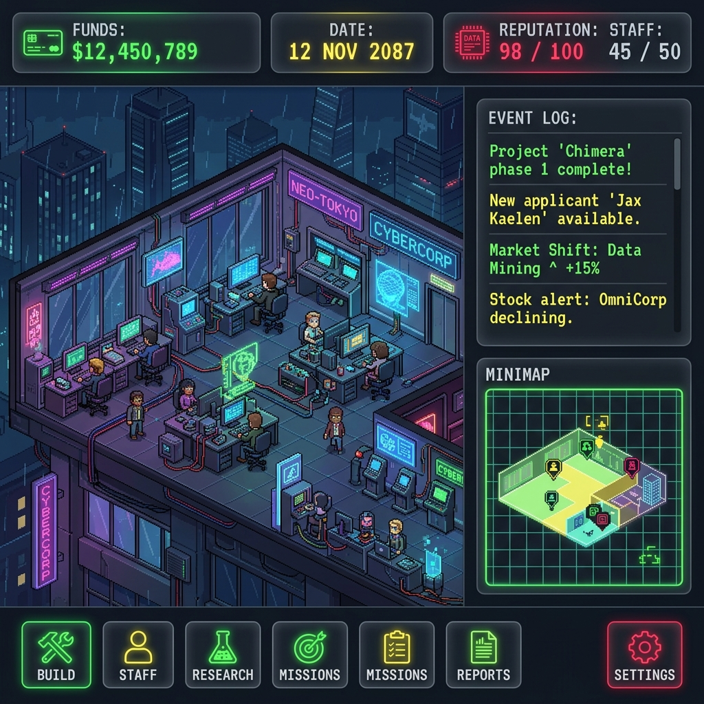
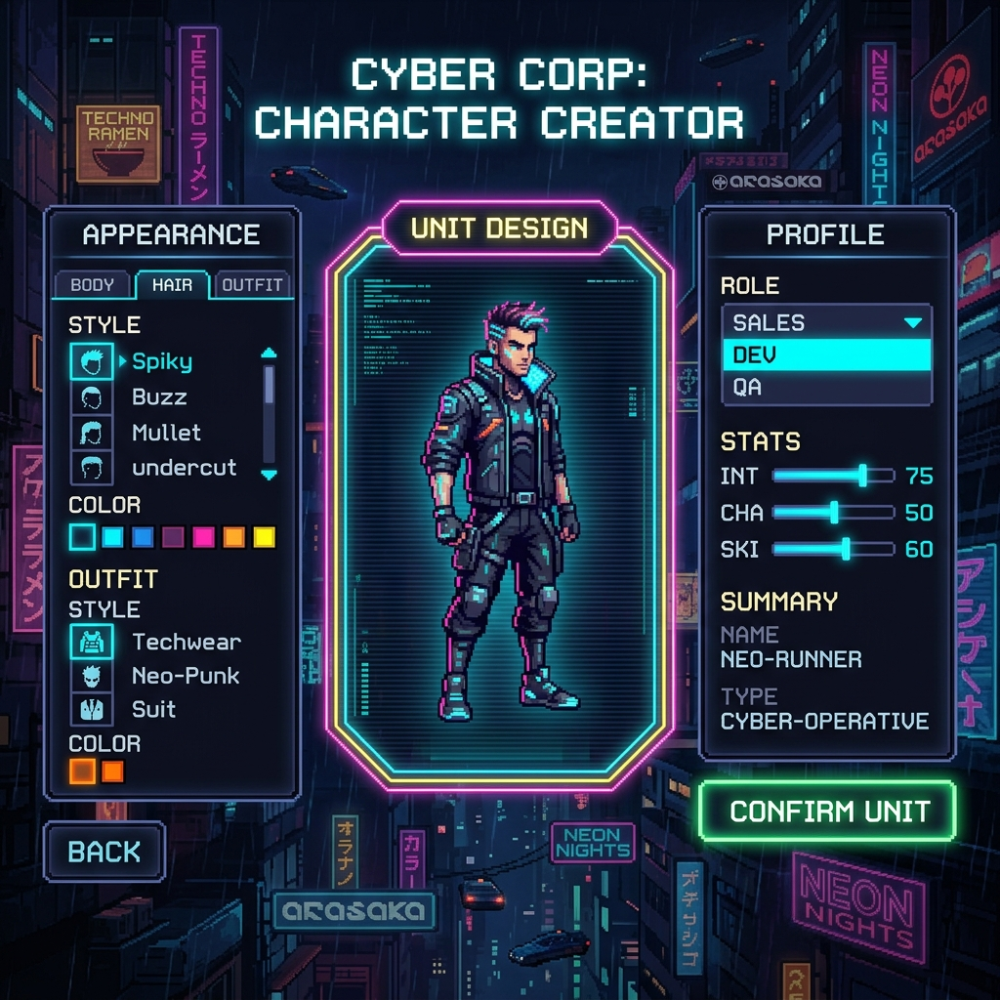

# 🎨 Archon Agency Tycoon - Visual & Art Bible

這份視覺聖經 (Art Bible) 作為 `TDD_Agency_Tycoon.md` 的補充，旨在定義遊戲的整體美術風格、用色規範，以及 UI 視覺基準，確保工程師與美術開發時能有一致的參考。

## 1. 核心視覺風格定調 (Core Aesthetics)
* **風格主題**: 復古像素 (Pixel Art) 結合 Cyberpunk 霓虹科技感 (Neon/Tron Style)。
* **材質表現**: 黑暗背景、毛玻璃透視 (Glassmorphism)、高對比度發光 (Bloom/Glow)。
* **視角**: 2D 橫向剖面視角 (Cross-section Ant Farm View)，配備等距視角 (Isometric) 或正交視角 (Orthogonal) 的像素家具與地磚。

## 2. 概念視覺提案 (Mockups)

### 2.1 主遊戲視角 (Main Office View)
*   **介面構成**: 頂部的精簡跑馬燈 (Ticker)、右側戰情日誌 (Event Log)、微型雷達圖 (Minimap) 以及底部圖示化按鈕。
*   **視覺目標**: 保留畫面空間給「房間」，減少 UI 對遊戲畫面的遮蔽感。

### 2.2 創角與招募面板 (Character Creator)
*   **介面構成**: 發光的外框，高科技感的半透明側邊欄，以及極簡的調整滑桿。
*   **視覺目標**: 突顯角色的外觀差異，利用動態 UI 提供「登入系統」的駭客科技感。

## 3. UI 色彩編碼 (Color Coding Rules)
嚴格規定三大部門的代表色，所有的 UI 邊框、發光效果、字體強調皆須遵守：
*   **開發部 (DEV)**: 螢光綠 `#39ff14`
*   **業務部 (SALES)**: 霓虹黃 `#fde910`
*   **品保部 (QA)**: 警示紅 `#ff003c`
*   **通用背景/面板 (Base/Panel)**: 科技灰/半透明黑 `#1a1a1a` (透明度 70%-80%)

## 4. 動畫與精靈圖管線規範 (Animation & Asset Pipeline)
為了取代現行 `Tween` 造成的「紙片平移」感，所有新資源必須遵守以下規範：

### 4.1 檔案與圖層分離 (Layer Decoupling)
*   人物必須拆分為 `BaseBody`, `Eyes`, `Hair`, `Outfit`, `Tool`。
*   嚴禁在程式碼中使用「魔法數字」偏移量（如 `Vector2(0, -27)`）。所有的 Offset 與圖層 Z-Index 將被抽離並定義於 `character_offsets.json` 中，交由美術控制。

### 4.2 狀態機驅動 (AnimationTree Driven)
*   拋棄 `Tween` 縮放動畫。
*   實作具備真實格數的 Sprite Sheets（例如 `walk_cycle.png` 包含 4 格動畫），交由 Godot 的 `AnimationPlayer` 與 `AnimationTree` 處理狀態切換 (`IDLE` -> `WORKING`)。
