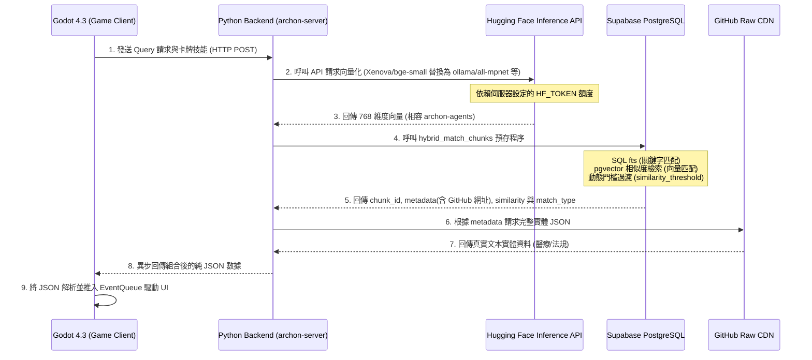

# Technical Design Document (TDD): Recontextualization

```text
=============================================================================
                  Archon: Recontextualization (Godot 4.3)
                  "Hybrid RAG Deck-builder" Architecture
=============================================================================
```

## 核心理念 (Core Vision)
本作已拋棄原本的《Into the Breach》二維網格走位，全面轉向《進入矩陣（Into The Grid）》風格的**「RAG 混合檢索與卡牌構築 (Hybrid RAG Deck-builder)」**。

遊戲目標在於讓玩家深刻體會 RAG 工程師的智力博弈：如何在極度受限的記憶體與算力資源下，透過卡牌構築 (Deck-building) 與混合檢索 (Hybrid Search)，過濾假陽性雜訊並精準提取出目標資料，最終解鎖 LLM Portal。

---

## 1. 混合 RAG 矩陣與動態卡牌演算系統

### 1.1 系統核心架構與開發戰略：抽取 Maaack 核心 + RAG 模組化升級
經過架構評估，本專案嚴格採用 **Data-Driven MVC 架構** 進行完全解耦。為加速開發並確保底層穩定性，我們將採用「抽取 Maaack 核心 (借殼上市)」戰略，而非從零手刻：

1.  **抽取 Maaack 核心 (MVC 基底)**：
    移植 [Maaack/Battle-Deck-Energy](https://github.com/Maaack/Battle-Deck-Energy) 開源專案中極度純粹的資料層模組（`DeckData.gd`, `CardData.gd` 等純陣列數學操作），以及其基礎的 `EventBus` 狀態分發機制。
2.  **RAG 模組化升級 (剔除本地耦合)**：
    *   **拔除本地寫死機制**：捨棄 Maaack 原有的 JSON 本地存檔讀取。掛載 `BackendClient.gd`，讓遊戲在啟動時直接向 FastAPI 與 Supabase 請求 RAG 向量檢索結果。
    *   **消滅手動註冊表**：捨棄 Maaack 寫死的 `card_registry.tres`，改寫為動態工廠模式 (`CardRegistry`)，在遊戲啟動時自動掃描目錄註冊卡牌，實現真正的 OCP (開閉原則)。
3.  **零延遲結算與 Event Queue 視覺化**：
    繼承並強化 MVC 精神：`DeckManager` 僅處理陣列移轉並瞬間結算 (0 毫秒延遲，完美支援自動化測試)；而 `Event Queue` 扮演動畫佇列，視覺層（繼承自 Maaack 的 `CardManager` 節點）只負責消耗佇列播放動畫。

### 1.2 系統架構序列圖 (Sequence Diagram)


### 1.3 0元低耗能分離式 RAG 資料管線 (0-Cost Decoupled RAG Pipeline)
為捍衛系統效能與儲存極限，系統實施「向量索引與文本存儲的物理分離」，並透過 FastAPI 後端達成高效能代理：

*   **步驟一（向量化與重排）**：
    Python 後端 (`archon-server`) 接收到請求後，直接呼叫 Hugging Face Serverless Inference API 取得向量。這裡刻意鎖定 **768 維度**（如 `all-mpnet-base-v2` 或 Ollama 的 `nomic-embed-text`），此設計是為了與 `archon-agents` 生態系的本地大模型額度限制完全對齊，確保在企業級真實環境中的無縫相容性。完全不佔用遊戲客戶端算力。
*   **步驟二（動態門檻過濾與向量索引）**：
    Supabase Postgres 內部**不存完整 JSON 原文**，僅儲存輕量摘要與 768 維向量。透過 `hybrid_match_chunks` 預存程序，結合 FTS (全文檢索) 與 pgvector。資料庫不再寫死判定「什麼是雜訊」，而是根據 `similarity_threshold` 剔除極端離群值，並將剩餘資料標記 `match_type` ('hybrid', 'vector', 'keyword') 吐給客戶端，讓遊戲邏輯層（LLM 視窗）自行演算純淨度。
*   **步驟三（GitHub Raw CDN 取回）**：
    算出 ID 後，FastAPI 解析 `metadata` 中的 GitHub Raw 網址 (例如 `raw.githubusercontent.com/.../medical.json`)，精準抓取對應的龐大 JSON 實體區塊。
*   **步驟四（Godot 異步結算）**：
    將輕量且富含真實資料的 JSON 回傳給 Godot 的 Event Queue 進行卡牌實體化。

---

## 2. 核心遊戲機制與模型層 (Core Mechanics & Model Layer)

### 2.1 牌組邏輯與狀態機 (DeckManager.gd)
資料在庫中以 Chunk 形式存在，進入遊戲後完全轉化為「卡牌（Cards）」與「陣列移轉」。
*   **知識庫 (Knowledge Base)** = 主牌組陣列 `Array[Dictionary]`。
*   **上下文視窗 (Context Window)** = 核心手牌區陣列（上限 5 張）。
*   **算力預算 (AP / 水晶)** = 玩家每回合出牌的 Token 費用限制。

### 2.2 核心對決邏輯 (Signal vs Noise 訊噪比博弈)
為什麼要這樣設計遊戲？因為真實世界中 RAG 最致命的問題就是「被精確的關鍵字誤導」與「語意漂移」。
*   **【BM25 關鍵字實彈卡】**：字面匹配（類似 SQL）。出牌時能精準抓取對應字眼的資料（`match_type='keyword'`），但因為毫無語意理解能力，極容易將「字面相同但意義完全相反」的資料抓進來。在遊戲中，這類卡片若沒有配上高 `similarity`，將直接轉化為【紅幽靈雜訊卡】。
*   **【Dense Laser 向量雷射卡】**：召回率極高（Recall）。能解鎖跨領域語意推理（`match_type='vector'`），但代價是若檢索池過深，會引發「語意邊界模糊」，導致邊緣低相似度的【紅幽靈雜訊卡】污染手牌。
*   **【Reranker 電漿護盾卡】**：發動時，強制對手牌進行 Cross-Encoder 權重重排與硬性截斷。這張卡片能物理抹除手牌區中 `similarity` 低於安全閥值的雜訊卡，淨化 Context Window。

**最終結算（LLM 交付）**：這是對 RAG 架構最殘酷的驗證。手牌純淨度越高（綠色 Target 卡多），LLM 生成的 Combo 傷害越高。若玩家貪圖便宜的算力，放任低 `similarity` 的紅幽靈卡混入 Context Window，LLM 將發生【模型幻覺崩潰 (Hallucination)】，對玩家造成直接的反噬傷害。這教育了玩家：**「給 LLM 垃圾，它就會用極度自信的語氣毒死你」**。

### 2.3 核心戰鬥數學驗證公式 (Combat Math Validation Formulas)
為了確保 TDD 腳本能進行精確的斷言 (Assert)，以下是 Godot Model 層必須實作的嚴格數學公式：

1.  **上下文純淨度 (Context Purity, $P$)**:
    $$P = \frac{\text{有效訊號晶片 (similarity } \ge \text{ 安全閥值)}}{\text{手牌區 (Context Window) 總晶片數}}$$
    *(Godot 的 DeckManager 將根據 `similarity` 與 `match_type` 動態結算哪些卡片異變為紅幽靈雜訊)*
2.  **LLM 交付傷害 (Delivery Damage, $D$)**:
    當按下「交付」時，對目標危機造成的解決分數 (傷害)：
    $$D = (\text{基礎火力 } 1000) \times P \times \text{連鎖乘數}$$
    *(註：若觸發 GraphRAG 連鎖卡，連鎖乘數為 $1.5$，否則為 $1.0$)*
3.  **幻覺反噬懲罰 (Hallucination Penalty)**:
    若交付時 $P < 1.0$ (即手牌中包含「紅幽靈雜訊晶片」)，表示 Prompt 被污染。交付傷害 $D$ 強制歸零，且玩家直接受到反噬：
    $$\text{玩家受傷} = (\text{紅幽靈晶片數量}) \times 500 \text{ HP}$$
4.  **算力消耗 (AP Cost)**:
    玩家每回合初始 AP = 5。
    *   BM25 實彈卡：消耗 1 AP
    *   Dense 向量雷射卡：消耗 2 AP
    *   Reranker 電漿護盾卡：消耗 3 AP (極度耗能，需謹慎使用)

---

## 3. RPG Meta-Architecture & 產業主題劇本 (Campaigns)

為了達到「RAG 系統工程師模擬器」的教育目的與遊戲擴充性，遊戲設計了完整的局外成長系統與極端流派的領域關卡。

### 3.1 過關條件與失敗懲罰 (Win/Loss Conditions)
*   **【過關條件 (Win)】**：每個關卡代表一個「系統危機 (Crisis)」，帶有特定的「危機血量 (Severity HP)」。玩家點擊「交付 LLM (Deliver)」時，純淨的手牌將削減危機血量，血量歸零即過關。
*   **【失敗條件 (Loss)】**：
    1.  **玩家血量歸零**：交付時若手牌混入雜訊（引發模型幻覺），危機血量不降反升，且直接扣除玩家 HP（公司預算/工程師崩潰）。HP 歸零即失敗。
    2.  **SLA 逾時**：玩家打出高耗能過濾卡（如電漿護盾）會陷入「運算僵直 (Loading)」，此時危機倒數計時不會停止。Timeout 條歸零即失敗。

### 3.2 玩家職涯與非線性複合危機 (Progression & Composite Threats)
經驗值系統對應工程師職等 (Seniority)。隨著升級，玩家將解鎖新卡牌，但同時會面臨敵人發動非線性的複合攻擊：
*   **L3 菜鳥工程師 (Level 1)**：擁有新手保護。雜訊卡是「明牌顯示」（紅色警告）。沒有限流攻擊，危機血量低。
*   **L4 中階工程師 (Level 2)**：解鎖高階「電漿護盾卡」。雜訊卡轉為「暗牌隱藏」（需玩家自行閱讀或驗證）。敵人開始進行**【資料庫污染 (Data Poisoning)】**，隨著回合進行，檢索池中的毒性資料比例會攀升。
*   **L5 資深工程師 (Level 3)**：解鎖「GraphRAG 與降維卡」。敵人發動**【高併發限流 (Rate Limit Attack)】**，玩家的 AP 上限開始浮動與壓縮。
*   **L6 主任工程師 (Level 4+)**：進入極限生存。玩家同時面臨嚴苛的 SLA Timeout、深度污染與限流壓縮，考驗極致的牌組精簡與精確出牌。

### 3.3 局外系統擴充性 (Meta-Game Scalability)
*   **【玩家存檔與狀態管理 (PlayerProfile)】**：動態記錄玩家 `total_exp`、`current_level`、`unlocked_cards` 與 `base_ap_cap`，支援未來無限擴充職等。
*   **【卡牌工廠與註冊中心 (CardRegistry)】**：捨棄硬編碼，遊戲啟動時動態掃描 `res://src/models/cards/` 目錄並註冊所有 `ActionCard`，完全符合 OCP (開閉原則)。
*   **【領域知識與關卡管理器 (CampaignManager)】**：將關卡抽象化為 `CampaignResource`。後端 API 可透過 `source_filter` 動態切換檢索範圍。

### 3.4 實作案例：產業主題劇本與現實反思機制 (Scenario Campaigns & Post-Mortem Feedback)

為了與後端 `metadata` 指向 GitHub CDN 的架構完全對接，遊戲內的關卡將載入真實的開源資料集。關卡結算時，會依據勝負給予具備教育意義的「現實反思報告」。

#### 【醫療劇本：抗生素的致命防線】 (防禦流)
*   **真實資料源 (GitHub API)**：`https://raw.githubusercontent.com/pubmedqa/pubmedqa/master/data/ori_pqal.json` (PubMedQA 專家標記集)
*   **核心痛點**：容錯率為 0，單靠向量相似度搜尋極易引發配伍禁忌（Contraindication）致死。
*   **卡牌策略**：玩家必須發動**【知識圖譜護盾卡 (GraphRAG)】**，強制過濾並炸毀手牌中因語意相近而混入的「假陽性紅幽靈卡（危險雜訊）」，僅留下 100% 安全的黃金指南卡餵給 LLM Boss。
*   **結算反思**：
    *   ❌ *失敗報告*：「嚴重醫療事故發生！您未啟動 GraphRAG 護盾，模型因幻覺將 Metformin 推薦給腎病患者，導致患者乳酸中毒。」

#### 【能源劇本：黑點危機】 (極限流)
*   **真實資料源 (GitHub API)**：`https://raw.githubusercontent.com/owid/energy-data/master/owid-energy-data.json` (Our World in Data 全球能源時序資料)
*   **核心痛點**：算力（AP / Token 預算）極度匱乏，直接搜尋數萬頁法規與電網時序數據會瞬間耗光能量 (Latency 極高)。且敵人會頻繁發動「限流攻擊」壓縮 AP。
*   **卡牌策略**：玩家必須先打出**【Matryoshka 降維壓縮卡】**將肥大的數據卡物理壓縮 60%，再利用**【圖譜導航連鎖卡 (KG Navigation)】**打出 Combo，用最低能耗一次拉出相連的法規與數據晶片找出過熱網格。
*   **結算反思**：
    *   ✅ *成功報告*：「完美節能！您成功利用 Matryoshka 壓縮與多跳圖譜推理，以最低 Token 消耗完成了 2026 歐盟節能指令的電廠調度。」

---

## 4. 資料庫預存程序實作 (Database RPC Implementation)
在 Supabase SQL 編輯器中部署的低能耗混合檢索函數，結合全文檢索與輕量向量檢索：

```sql
create or replace function hybrid_match_chunks (
  query_embedding vector(768),
  query_text text,
  match_count integer default 10,
  similarity_threshold float default 0.0,
  filter jsonb default '{}'::jsonb
)
returns table (
  id bigint,
  content text,
  metadata jsonb,
  similarity float,
  match_type text
)
language plpgsql
as $$
begin
  return query
  with vector_results as (
    -- 1. 向量相似度檢索 (具備語意推理，但可能有邊界模糊)
    select cp.id, cp.content, cp.metadata, 1 - (cp.embedding <=> query_embedding) as vector_sim
    from archon_crawled_pages cp
    where cp.embedding is not null
      and 1 - (cp.embedding <=> query_embedding) >= similarity_threshold
    order by cp.embedding <=> query_embedding
    limit match_count
  ),
  text_results as (
    -- 2. 全文檢索 (字面精準，但毫無語意，容易產生字面一致的幻覺)
    select cp.id, cp.content, cp.metadata, ts_rank_cd(cp.content_search_vector, plainto_tsquery('english', query_text)) as text_sim
    from archon_crawled_pages cp
    where cp.content_search_vector @@ plainto_tsquery('english', query_text)
    order by text_sim desc
    limit match_count
  ),
  combined_results as (
    -- 3. 混合去重合併，標記 match_type 交由客戶端判定純淨度
    select 
      coalesce(v.id, t.id) as id,
      coalesce(v.content, t.content) as content,
      coalesce(v.metadata, t.metadata) as metadata,
      coalesce(v.vector_sim, t.text_sim, 0)::float as similarity,
      case 
        when v.id is not null and t.id is not null then 'hybrid'
        when v.id is not null then 'vector'
        else 'keyword'
      end as match_type
    from vector_results v
    full outer join text_results t on v.id = t.id
  )
  select c.id, c.content, c.metadata, c.similarity, c.match_type 
  from combined_results c
  order by c.similarity desc
  limit match_count;
end;
$$;
```

---

## 5. 美術設計 AI 提示詞 (SDXL / Flux Prompts)
有鑑於手刻著色器 (Shader) 可能無法達到商業級的視覺震撼，本專案的美術資產將全面採用**免費且強大的開源 AI 生成圖像模型** (如 Stable Diffusion XL 或 Flux.1，無需任何付費帳號) 處理，以高品質的 2D 貼圖取代程式碼運算。以下為給定設計師與 AI 的核心 Prompt：

### 5.1 遊戲背景：立體向量網格 (Background Image)
*   **Prompt**: `A mesmerizing, infinitely deep 3D wireframe grid, retro-futuristic synthwave style, glowing neon cyan and dark purple, representing a high-dimensional vector database space. Hacker aesthetic, floating glowing data points in the far distance, cinematic lighting, 8k resolution, Into the Grid style, clean lines, aspect ratio 16:9`
*   **實作方式**: 將生成的圖像匯入 Godot 作為 `TextureRect` 背景，可配合簡單的 Tween 進行緩慢的 Z 軸放大縮放，即可達成極強的沉浸感。

### 5.2 伺服器插槽與 UI (Server Rack UI)
*   **Prompt**: `A high-tech server rack interface, empty glowing motherboard RAM slots, cyberpunk aesthetic, dark metallic textures, neon green indicator lights, retro CRT monitor elements, UI design, flat front-facing perspective, highly detailed, transparent background layout, aspect ratio 16:9`
*   **實作方式**: 裁切圖像後，作為玩家的 Context Window（手牌區）插槽背景底圖。

### 5.3 數據晶片與行動卡牌 (Data Chips & Action Cards)
為了與第 2、3 節的核心機制完全對齊，卡牌視覺分為「檢索回來的數據晶片」與「玩家打出的行動卡」兩大類：

#### 5.3.1 檢索數據晶片 (Retrieved Data Chips)
出現在 Context Window (手牌區)，代表從資料庫撈出的 Chunk。
*   **🟢 黃金命中晶片 (Target Chunk)**
    *   **Prompt**: `A futuristic rectangular data chip, glowing neon green circuit board lines, holographic text projecting "MATCH", clean cyberpunk aesthetic, aspect ratio 2:3`
*   **🔴 紅幽靈雜訊晶片 (False Positive)**
    *   **Prompt**: `A corrupted dark rectangular data chip, rust red and crimson glowing edges, digital glitch effects, torn circuits, menacing virus aesthetic, aspect ratio 2:3`

#### 5.3.2 玩家行動卡 (Player Action Cards)
玩家用於操作檢索策略的技能卡。
*   **🔫 BM25 關鍵字實彈卡 (Keyword Search)**
    *   **Prompt**: `A tactical cyberpunk ability card, metallic grey and orange aesthetic, showing a sniper crosshair locking onto data text, mechanical and precise, retro-arcade style, aspect ratio 2:3`
*   **☄️ Dense 向量雷射卡 (Dense Search)**
    *   **Prompt**: `A dynamic sci-fi ability card, shooting a massive glowing cyan laser beam through a matrix of numbers, high energy, neon vaporwave aesthetic, aspect ratio 2:3`
*   **🛡️ Reranker 電漿護盾卡 (Rerank/Filter)**
    *   **Prompt**: `A defensive cyberpunk ability card, showing a glowing hexagonal energy shield repelling red corrupted data bugs, glowing blue forcefield, high tech, aspect ratio 2:3`
*   **🗜️ Matryoshka 降維壓縮卡 (Dimension Shrink)**
    *   **Prompt**: `A futuristic ability card, showing a glowing holographic cube folding and compressing into a smaller hypercube, neon purple and green, physics manipulation aesthetic, aspect ratio 2:3`
*   **🕸️ 知識圖譜連鎖卡 (GraphRAG Navigation)**
    *   **Prompt**: `A network-themed ability card, showing glowing nodes and laser fiber-optic connections forming a constellation, data networking, neon blue and gold, cybernetic web, aspect ratio 2:3`

---

## 6. 測試驅動開發與自動化公證 (TDD & Automation)

在完全解耦的 MVC 架構下，遊戲的邏輯層 (Model) 是一組純粹的陣列操作與狀態機轉移。這保證了在進行單元測試與整合測試時，可以在無 Godot 視覺介面的 Headless 環境中瞬間完成結算，確保「0 毫秒延遲」的物理精準度。

### 6.1 核心測試案例 (Core Test Cases)
1.  **卡牌檢索測試**：驗證 Godot 發送 Query 後，正確地從 Event Queue 接收解析 JSON，並依照 `is_noise` 等屬性實體化卡牌 Model。
2.  **狀態移轉測試**：驗證當玩家打出卡牌時，Model 層正確扣除費用，並對陣列中的目標施加效果（例如提升 Context 質量，或丟棄雜訊卡）。
3.  **零物理依賴測試**：確認所有戰鬥與卡牌結算，完全不依賴 Godot 的 `Node2D` 物理屬性或 `CharacterBody2D`。

### 6.2 LEAN 驗證與 Headless 公證踩坑紀實 (LEAN Validation History)
在先前的架構驗證中，我們經歷了多次慘痛的血淚教訓，確立了以下不可動搖的 Godot 開發鐵律：
1.  **捨棄臃腫的 GUT 框架 (Lean 原則)**：為了極致的效能與 CI/CD 整合，我們捨棄了會污染專案的第三方 GUT 測試框架，改以原生 Headless 模式自製微型測試框架 (`HeadlessRunner.gd`)，徹底實現 0 依賴公證。
2.  **存檔淨化與幽靈失敗防禦 (State Purification)**：過去曾發生測試通過但實際執行報錯的「幽靈失敗」，主因是測試環境吃到殘留的存檔。因此，所有自動化腳本在測試前**必須強制刪除** `user://savegame.save`，確保測試的絕對無狀態性 (Stateless)。
3.  **ClassDB Registry 自癒防護**：Godot 在 `--headless` 模式下，有時會發生類別快取解析錯誤 (Class Name Resolution Error)。為了徹底根除此問題，所有動態載入的類別與腳本，**強制使用 `preload` 取代直寫 `class_name`**，以確保編譯期的強型別安全與依賴載入。
---

## 7. Web 輸出與跨裝置適配 (Web Export & Cross-Device Optimization)
本遊戲維持無縫嵌入網頁版與行動裝置瀏覽器 (Mobile Safari/Chrome) 的目標。

*   **觸控手勢驅動**：手機端著重於直覺的拖曳出牌 (Drag & Drop)。
*   **響應式視角 (Responsive Camera)**：Godot 視窗設定 `stretch/mode = canvas_items`，確保在手機版直式螢幕下 UI 卡牌佈局能自動適配，不被裁切。

---

## 8. 專案檔案架構樹狀圖 (File Architecture)
為了徹底貫徹 0 元邊緣計算與 Godot MVC 解耦，專案目錄結構設計如下：

archon/
├── recontextualization/                # Godot 4.3 卡牌遊戲客戶端
│   ├── project.godot
│   ├── assets/                         # 16-bit Cyber-Matrix 美術與音效資源
│   ├── src/
│   │   ├── models/                     # 純數據層 (不碰 UI)
│   │   │   ├── CardModel.gd            # 繼承 Resource 的卡牌資料結構
│   │   │   └── DeckManager.gd          # 負責陣列操作與洗牌機率的狀態機
│   │   ├── views/                      # 視覺特效層
│   │   │   ├── GameBoard.tscn          # 承載 AI 背景貼圖與 UI 的主場景
│   │   │   └── CardChip.tscn           # 匯入 AI 生成貼圖的卡牌介面
│   │   └── network/                    # 網路通訊層
│   │       └── BackendClient.gd        # 專職負責打 FastAPI (archon-server) 遊戲路由
│   └── tests/                          # GUT / Headless 測試劇本
│
├── python/                             # Phase 5 後端生態系
│   ├── src/
│   │   └── server/
│   │       ├── api_routes/
│   │       │   └── rag_api.py          # 處理 Godot 檢索與發牌的核心 FastAPI 路由
│   │       ├── schemas/
│   │       │   └── rag.py              # Pydantic 驗證模型 (Request/Response)
│   │       └── services/
│   │           └── rag_service.py      # 負責打 HF API、Supabase DB 與 GitHub CDN
│   └── start_all.sh                    # 啟動整個 Phase 5 Docker 生態系的入口
│
└── migration/                          # 全域資料庫變更紀錄
    └── 0.2.2/
        └── 26_rag_hybrid_match_chunks.sql # pgvector 與 hybrid_match_chunks 預存程序
```