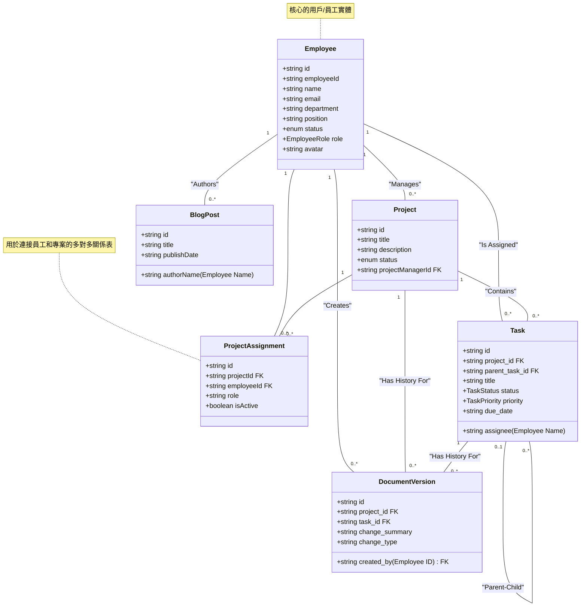

# Archon Task Manager

Archon Task Manager 是一個基於 Archon 專案結構的員工任務管理系統。它的核心功能是基於專案的存取控制，確保員工只能查看和管理他們被分配到的任務。應用程式提供多種任務視圖（清單、表格、看板、甘特圖），並為管理員提供數據驗證和管理功能。


## ✨ 主要功能

- **安全的身份驗證**: 使用 Supabase 進行安全的登入和註冊。
- **基於專案的存取控制**: 員工只能存取他們被分配到的專案和任務。
- **多種任務視圖**:
    - **清單視圖**: 簡潔的任務列表。
    - **表格視圖**: 可排序的詳細任務表格。
    - **看板視圖**: 可拖放的任務狀態看板。
    - **甘特圖**: 視覺化的專案時程表。
- **管理員面板**:
    - 用戶管理（編輯角色和狀態）。
    - 文件版本歷史記錄。
    - 系統管理員權限轉移。
- **主題切換**: 支援亮色和暗色模式。
- **響應式設計**: 在桌面和行動裝置上都能提供良好的用戶體驗。
- **無後端也能運行**: 如果未設定 Supabase，應用程式會自動使用模擬數據，方便快速預覽。

## 🚀 技術堆疊

- **前端**: React, TypeScript, Tailwind CSS
- **路由**: React Router
- **數據視覺化**: D3.js (用於甘特圖)
- **後端**: Supabase (PostgreSQL, 身份驗證, RLS)

## 🛠️ 開始使用

這個專案被設計為一個純前端應用，可以直接在瀏覽器中開啟 `index.html` 檔案。為了獲得完整的體驗（包括數據持久化和身份驗證），您需要將其連接到 Supabase 後端。

### 1. 運行模擬數據版本 (無需後端)

直接用瀏覽器開啟 `index.html` 檔案。應用程式會自動偵測到沒有後端配置，並加載預設的模擬數據。

### 2. 連接到 Supabase 後端 (推薦)

#### 步驟 1: 設定 Supabase 專案

1.  前往 [supabase.com](https://supabase.com/) 並建立一個新專案。
2.  儲存您的專案 **URL** 和 **anon (public) key**。
3.  在您的 Supabase 專案儀表板中，前往 **SQL Editor**。
4.  打開 `migration/complete_setup.sql` 檔案，複製其所有內容，然後貼到 Supabase SQL 編輯器中並執行。這個腳本將會設定好所有需要的資料表、角色和安全策略。

#### 步驟 2: 在應用程式中配置 Supabase

1.  在瀏覽器中運行應用程式。
2.  使用預設的管理員帳號登入 (如果使用模擬數據):
    - **Email**: `admin@archon.com`
    - **Password**: (任何密碼都可以)
3.  導航到 **Admin Panel** -> **Settings**。
4.  輸入您在步驟 1 中儲存的 Supabase **Project URL** 和 **Anon Key**。
5.  點擊 "Save and Reload"。頁面將會重新整理並連接到您的 Supabase 後端。
6.  現在，您可以註冊一個新帳號或使用您在 Supabase 中建立的任何用戶登入。您註冊的第一個用戶將自動成為 `system_admin`。

## 📁 專案結構

```
/
├── components/         # 可重用的 React 組件 (圖示、彈出視窗等)
├── hooks/              # 自定義 React Hooks (例如 useAuth)
├── pages/              # 應用程式的主要頁面組件
├── services/           # API 服務層 (處理與 Supabase 或模擬數據的通訊)
├── migration/          # 資料庫遷移腳本
│   └── complete_setup.sql
├── App.tsx             # 主要應用程式組件和路由設定
├── index.html          # HTML 進入點
├── index.tsx           # React 應用程式的根組件
├── types.ts            # 全域 TypeScript 類型定義
└── README.md           # 就是你現在在讀的這個檔案
```

## 📜 後端資料庫結構

`migration/complete_setup.sql` 腳本會建立以下資料庫結構:

- **ENUM 類型**: 用於定義固定的角色、狀態和優先級 (`employee_role`, `task_status`, `task_priority` 等)。
- **資料表**:
    - `profiles`: 儲存用戶資料，並與 Supabase 的 `auth.users` 表相關聯。
    - `archon_projects`: 儲存專案資訊。
    - `archon_project_assignments`: 將用戶與專案和角色連結起來。
    - `archon_tasks`: 儲存與專案相關的任務詳細資訊。
    - `archon_document_versions`: 用於審計追踪和記錄變更。
- **觸發器**: `handle_new_user` 函數會在 Supabase Auth 中有新用戶註冊時，自動在 `profiles` 表中建立對應的紀錄。
- **行級安全性 (RLS)**: 實施了嚴格的安全策略，以確保用戶只能存取他們被授權的數據（例如，只能看到自己參與的專案）。

這個專案展示了一個功能齊全、安全且可擴展的任務管理應用程式的完整架構。

## 📊 資料結構 (UML 類別圖)

為了讓團隊更清楚會員系統的資料結構，我們整理了以下的 UML 類別圖。這份圖表基於 `api.ts` 中的 Mock Data 和 `types.ts` 中的類型定義，清晰地展示了各個資料實體之間的欄位、類型和關聯性。

