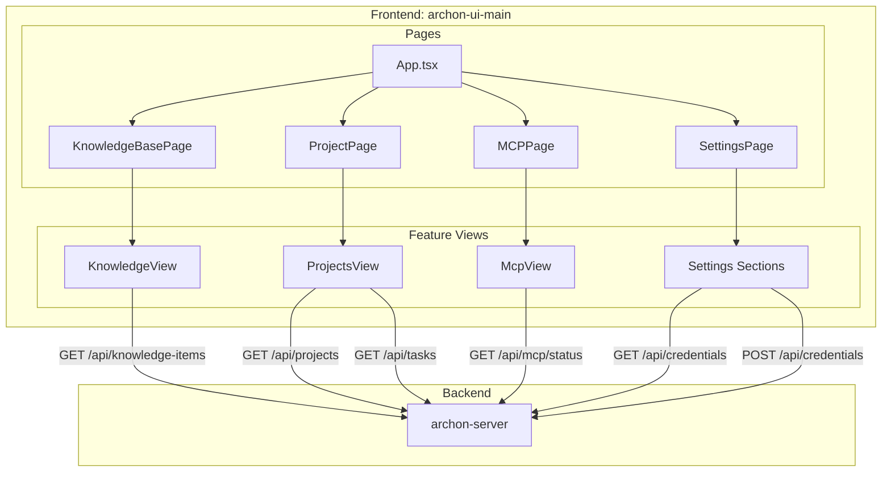
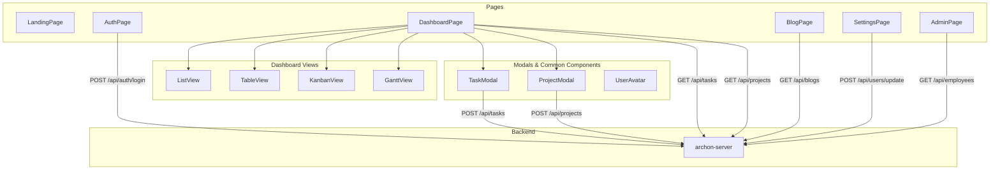
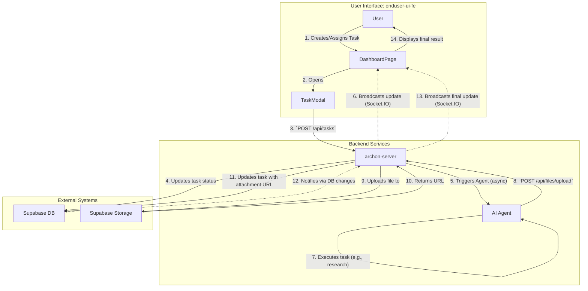

# Frontend Architecture Diagrams

This file contains the high-level component structure diagrams for the two frontend applications, including their backend connections and the human-computer collaboration workflow.

## 1. `archon-ui-main` (Admin UI) Component & API Structure

This diagram shows how the main pages of the Admin UI are composed of different feature views, and how these views interact with the `archon-server` backend.

## 2. `enduser-ui-fe` (End-User UI) Architecture & Workflow

This section contains two diagrams:
1.  A **Component Structure Diagram** showing the internal page and component composition.
2.  A **Human-Computer Collaboration Workflow** diagram illustrating the core interaction loop from task creation to AI completion.

### 2.1 Component Structure

### 2.2 Human-Computer Collaboration Workflow (Phase 3.8)

This diagram illustrates the core concept of human-computer collaboration using dotted lines to represent the sequence of events.

