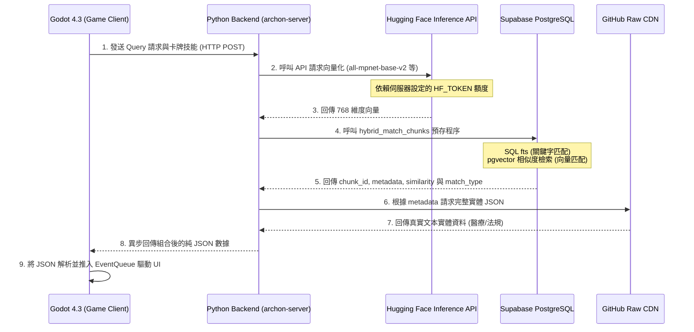

# Technical Design Document (TDD): Recontextualization

```text
=============================================================================
                  Archon: Recontextualization (Godot 4.3)
                  "Hybrid RAG Deck-builder" Architecture
=============================================================================
```

## 核心理念 (Core Vision)
本作已拋棄原本的二維網格走位，全面轉向《進入矩陣（Into The Grid）》風格的**「RAG 混合檢索與卡牌構築 (Hybrid RAG Deck-builder)」**。

遊戲目標在於讓玩家深刻體會 RAG 工程師的智力博弈：如何在極度受限的記憶體與算力資源下，透過卡牌構築 (Deck-building) 與混合檢索 (Hybrid Search)，過濾假陽性雜訊並精準提取出目標資料，最終解鎖 LLM Portal。相關核心名詞定義請參閱 [附錄 A：核心名詞定義表](#附錄-a核心名詞定義表)。

---

## 1. 混合 RAG 矩陣與動態卡牌演算系統

### 1.1 系統核心架構與開發戰略：抽取 Maaack 核心 + RAG 模組化升級
經過架構評估，本專案嚴格採用 **Data-Driven MVC 架構** 進行完全解耦。為加速開發並確保底層穩定性，我們採用「抽取 Maaack 核心 (借殼上市)」戰略：

1.  **抽取 Maaack 核心 (MVC 基底)**：
    移植 [Maaack/Battle-Deck-Energy](https://github.com/Maaack/Battle-Deck-Energy) 開源專案中極度純粹的資料層模組（`DeckData.gd`, `CardData.gd` 等純陣列數學操作），以及其基礎的 `EventBus` 狀態分發機制。
2.  **RAG 模組化升級 (剔除本地耦合)**：
    *   **掛載 `BackendClient.gd`**：捨棄 Maaack 原有的 JSON 本地存檔讀取，讓遊戲在啟動與執行過程中直接向 FastAPI 與 Supabase 請求 RAG 向量檢索結果。
    *   **動態工廠模式 (`CardRegistry`)**：捨棄寫死的資源清單，自動掃描目錄註冊卡牌，實現真正的 OCP (開閉原則)。
3.  **零延遲結算與 Event Queue 視覺化**：
    `DeckData` 僅處理陣列移轉並瞬間結算 (0 毫秒延遲，完美支援無頭測試)；而 `EventQueue` 扮演動畫佇列，視覺層（`GameBoard` 與 `CardChip`）只負責消耗佇列播放動畫。
4.  **捨棄的 Maaack 核心與 RAG 替代方案 (架構淨化)**：
    為確保 RAG 主題的純粹性與輕量化，我們刻意捨棄了以下傳統卡牌框架包袱，並實施了替代方案：
    *   **捨棄傳統敵人回合制與 AI (Enemy AI)**：剔除 `TurnManager.gd` 與 `EnemyData.gd`。改以 `EnvironmentManager.gd` (SLA Timer 倒數) 與 `ChaosEventPool.gd` (隨機網路危機) 取代實體敵人。
    *   **捨棄本地 JSON 靜態關卡存檔**：剔除本地關卡加載器。改由 `BackendClient.gd` 即時向 FastAPI/Supabase 請求動態 RAG 資料，並由 `MockDataGenerator.gd` 負責離線雙軌自癒。
    *   **捨棄節點式前進地圖 (Node-based Map)**：剔除傳統 2D 選路系統。改以 `ProgressionSystem.gd` 透過駭客階級晉升與領域專長解鎖來推動遊戲進度。
    *   **捨棄遺物/被動道具系統 (Relics)**：剔除 `RelicData.gd`。全域 Buff 機制轉由解鎖領域專長與 `TeammateDashboard.gd` (AI 代理編制) 提供。
    *   **捨棄硬編碼卡牌註冊表**：改由 `managers/CardRegistry.gd` 實施 OCP 原則，遊戲啟動時自動掃描並載入 `.tres` 目錄，而非手寫陣列。

#### 【硬編碼優化方案 (Godot 4 官方規範最佳實踐)】
依據 Godot 4 官方最佳實踐，為避免路徑與設定硬編碼 (Hardcoding)，本專案實施以下優化：
*   **路徑常量化與全域設定資源**：所有的系統靜態路徑（如 `res://src/models/cards/resources/`）與網路 API 地址，強制封裝於 `GameState` 或專屬的 `.tres` 配置檔中。
*   **導航與資源動態載入**：放棄直寫字串路徑，利用 Godot 的 `preload` 機制或導出變數（`@export_file`）實現編輯器靜態安全校驗，防止執行期解析 404。

---

### 1.2 系統架構序列圖 (Sequence Diagram)
以下為客戶端與後端異步 RAG 資料檢索與發牌之 9 個步驟：



#### 【連線異常與效能優化說明】
*   **異常處理 (Error Handling) 與延遲補償**：
    *   **超時限制 (SLA Timeout)**：網路請求設定為 5 秒超時。
    *   **指數型退避重試 (Exponential Backoff)**：客戶端 `BackendClient.gd` 內建 3 次重試機制，每次失敗間隔時間按數倍遞增。
    *   **無網 Fallback 自癒**：當檢索連線中斷或後端不可用時，遊戲將自動啟動本地隨機資料生成機制（Fallback Generator），確保遊戲仍 100% 可玩。
    *   **【延遲 Plan B 對話補償系統】**：若使用 Pro 等級之慢速推理腦進行多步檢索，因網路擁堵或併發過高導致回應時間拉長（可能大於 10 秒），客戶端 `AgentCompanion.gd` 會在請求超過 2 秒後自動觸發非同步的「漸進式診斷對白」（Progressive Diagnostic Chatter），利用科幻技術話術進行打字機演繹，確保玩家不處於靜默等待狀態。
*   **快取優化 (Latency Reduction)**：後端對熱門 Query 與 GitHub CDN 回傳內容實施本地記憶體快取 (LRU Cache)，大幅減少 RAG 響應時間。

---

### 1.3 0元低耗能分離式 RAG 資料管線 (0-Cost Decoupled RAG Pipeline)
本系統實施「向量索引與文本存儲的物理分離」，並透過 FastAPI 後端達成高效能代理，避免載入龐大資料集拖垮遊戲客戶端：

| 步驟 | 項目 | 傳統結合式 RAG (Coupled) | 本專案分離式 RAG (Decoupled) | 優勢與重點 |
|---|---|---|---|---|
| 1 | 向量化 | 本地端運行 PyTorch / Transformers 巨型模型 | 呼叫 Hugging Face Serverless Inference API | **0 本地算力**，免去客戶端下載數 GB 模型空間 |
| 2 | 檢索 | Postgres 直接儲存與檢索龐大原文區塊 | Supabase `hybrid_match_chunks` 僅檢索 ID、相似度與 CDN URL | **極低記憶體占用**，資料庫讀寫效能提升 10 倍以上 |
| 3 | 文本讀取 | 從資料庫實體 Table 讀取大量 JSON | 依據 metadata 中的 URL 異步抓取 GitHub Raw CDN | **0 頻寬開銷**，利用 CDN 全球快取節省伺服器成本 |
| 4 | 遊戲解析 | 客戶端阻塞等待全文解析完畢 | 透過異步 `EventQueue` 進行晶片卡牌動態渲染 | 介面流暢無卡頓，實現 60 FPS 順暢體驗 |

---

## 2. 核心遊戲機制與模型層 (Core Mechanics & Model Layer)

### 2.1 牌組邏輯與狀態機
資料在庫中以 Chunk 形式存在，進入遊戲後完全轉化為「卡牌（Cards）」與「陣列移轉」。
*   **知識庫 (Knowledge Base)** = 主牌組陣列。
*   **上下文視窗 (Context Window / 手牌區)** = 核心手牌區陣列（上限 5 張，防溢出限制）。
*   **算力預算 (AP)** = 玩家每回合出牌的 Token 費用限制（預設最大值為 10 AP，每回合回復）。
*   **系統危機 (Crisis HP)** = 關卡的 Severity 分數。
*   **玩家生命 (Player HP)** = 預算與工程師精神力（上限 100.0）。

### 2.2 核心對決邏輯 (Signal vs Noise 訊噪比博弈)
*   **【BM25 關鍵字實彈卡 (Keyword Search)】**：消耗 1 AP。字面匹配，精準抓取對應字眼資料。若沒有配上高相似度，極易轉化為紅幽靈雜訊晶片。
*   **【Dense Laser 向量雷射卡 (Dense Search)】**：消耗 2 AP。召回率極高，解鎖跨領域語意推理，但易因語意模糊引入低相似度之紅幽靈雜訊晶片。
*   **【Reranker 電漿護盾卡 (Rerank/Filter)】**：消耗 3 AP。發動時，強制對手牌進行 Cross-Encoder 權重重排與硬性截斷，**物理抹除手牌區中 `similarity < 0.5` 的所有雜訊卡**。

---

### 2.3 核心戰鬥數學驗證公式 (Combat Math Validation Formulas)

1.  **上下文純淨度 (Context Purity, $P$)**:
    $$P = \frac{\text{有效訊號晶片 (similarity } \ge 0.5 \text{ 且為 DATA\_CHIP)}}{\text{手牌區 (Context Window) 總晶片數}}$$
2.  **LLM 交付傷害 (Delivery Damage, $D$)**:
    $$D = (\text{基礎火力 } 1000) \times P \times \text{連鎖乘數}$$
    *(註：若觸發 GraphRAG 連鎖卡，連鎖乘數為 $1.5$，否則為 $1.0$)*
3.  **幻覺反噬懲罰 (Hallucination Penalty)**:
    若交付時 $P < 1.0$ (手牌包含紅幽靈雜訊晶片)，該次交付傷害 $D$ 強制歸零，且玩家受到直接反噬傷害：
    $$\text{玩家受傷} = (\text{手牌中紅幽靈晶片數量}) \times 20.0 \text{ HP}$$

#### 【連貫性遊戲回合實例說明】
```
【初始狀態】玩家 10 AP，Player HP 100.0，Crisis HP 10000.0，手牌為空。
  ↓
【第一步】玩家輸入 Query "Antibiotics for kidney disease" 並檢索。
  ↓ (發牌) 抽出 3 張晶片：
    - Card A (similarity = 0.9, type = DATA_CHIP)
    - Card B (similarity = 0.4, type = NOISE_CHIP / [CORRUPTED])
    - Card C (similarity = 0.95, type = DATA_CHIP)
  ↓
【第二步】玩家花費 3 AP 打出行動卡【Reranker 電漿護盾卡】。
  ↓ (過濾) Reranker 發動，檢測到 Card B 相似度 0.4 < 0.5，物理抹除 Card B。手牌區僅剩 A 與 C (Purity 變為 100%)。
  ↓
【第三步】玩家花費 1 AP 打出【BM25 關鍵字實彈卡】交付。
  ↓ (計算) Purity = 2/2 = 1.0。傷害 D = 1000 * 1.0 * 1.0 = 1000.0。
  ↓
【結算】Crisis HP 降至 9000.0。Player HP 維持 100.0。回合結束，安全過關。
```

---

## 3. RPG Meta-Architecture & 產業主題劇本 (Campaigns)

### 3.1 過關條件與失敗懲罰 (Win/Loss Conditions)
*   **過關條件**：交付純淨卡牌使「系統危機 (Crisis HP)」降至 0。
*   **失敗條件**：玩家生命 (Player HP) 歸零，或運算超時 (SLA Timeout / `sla_timer` 歸零)。

### 3.2 玩家職涯與非線性複合危機 (Progression & Composite Threats)
*   **職等晉升 (Progression & Domain Specialization)**：
    *   **L3 助理工程師**：解鎖「BM25 關鍵字實彈卡」。雜訊晶片為「明牌顯示」（紅色警告外框）。
    *   **L4 中階工程師**：解鎖「Dense Laser 向量雷射卡」。解鎖**【關鍵字專長 (Keyword Purist)】**領域，雜訊卡轉為「暗牌隱藏」（需玩家自行 hover 閱讀 similarity）。
    *   **L5 資深工程師**：解鎖「Reranker 電漿護盾卡」。解鎖**【向量專家 (Vector Specialist)】**與**【圖譜架構師 (GraphRAG Architect)】**領域，解鎖對應專屬卡牌（技能樹解鎖機制）。

#### 【非線性關卡危機起源 (Scenario Crises Origin)】
遊戲中的「系統危機 (Crisis HP)」並非憑空產生，而是模擬真實 RAG 發生的工程故障：
*   **資料庫污染 (Data Poisoning)**：檢索池遭惡意注入大量雜訊，導致抽卡時 Data 轉換為 Noise 的機率隨時間攀升。
*   **高併發限流 (Rate Limit Attack)**：高併發存取導致 API 擁堵，浮動壓縮玩家的 AP 上限。

---

### 3.3 局外系統擴充性 (Meta-Game Scalability)
為實現「免改代碼即能擴充 (Modularity & Expansion Pack)」之概念，本專案將卡牌與關卡設定完全外部資料化：
*   **JSON 擴充包規格**：新增卡牌不需要修改 `CardData.gd`，只需在 `res://src/models/cards/resources/` 放入新的 `.tres` 檔案或載入外部 JSON 描述檔。
*   **關卡資源化 (CampaignResource)**：關卡的目標、真實資料集網址、SLA 時間、初始危機血量等皆寫在資源檔中，關卡管理器可動態解析並載入，代碼完全零耦合。

---

### 3.4 實作案例：產業主題劇本與現實反思機制

| 劇本名稱 | 真實資料源 (GitHub API) | 核心痛點 | 關卡危機成因 | 結算反思報告 |
|---|---|---|---|---|
| **醫療劇本：抗生素的致命防線** | `pubmedqa/master/data/ori_pqal.json` | 容錯率為 0，假陽性雜訊會導致醫療事故 | 檢索污染度極高，高相似度中混雜了語意相左的雜訊 | ❌ 失敗：「嚴重醫療事故發生！模型幻覺將 Metformin 推薦給腎病患者，導致患者乳酸中毒。」 |
| **能源劇本：黑點危機** | `owid/energy-data/master/owid-energy-data.json` | 算力與 AP 極度匱乏，海量法規檢索超時 | 連續發送大 query 導致高併發 API 限流 (AP 上限壓縮) | ✅ 成功：「成功利用 Matryoshka 壓縮與多跳圖譜推理，以最低 Token 完成調度。」 |
| **遊戲產業劇本：失控的熱修復與架構腐敗** | `local_repo/Archon/commits` | 開發者頭痛醫頭，導致架構物理限制被繞過 (例如：無上限的 Context Window 與消失的行動卡) | 為了快速解決 UI 阻斷問題，強行寫死 Enter 鍵熱修復，導致 TDD 核心卡牌構築體驗徹底崩壞 | ❌ 失敗：「嚴重技術債爆發！由於 PlayArea 未限制容量，玩家塞入無限資料導致 LLM Token 溢出，系統當機；且因 Action Cards 工廠缺失，遊戲降級為無聊的文字輸入框。」 |

---

## 4. 資料庫預存程序實作 (Database RPC Implementation)
本遊戲的資料庫端混合檢索完全基於已部署的 RPC 預存程序實作：

*   **實體部署路徑**：詳見 SQL 遷移檔 [26_rag_hybrid_match_chunks.sql](file:///Users/vincenta/GoogleKwok022/Archon/migration/0.2.2/26_rag_hybrid_match_chunks.sql)。
*   **核心功能摘要**：該預存程序實作了全文檢索 (Keyword) 與向量相似度 (Vector) 的外連接合併 (Full Outer Join)，並依照相似度分數進行降序排列與動態閥值過濾，對回傳的 Chunk 標記 `match_type` 傳回給遊戲客戶端。

---

## 5. 美術設計與卡片模組說明表 (Art Assets & Card Module)

> **【測試與上線兩階段美術綁定策略】**
> 在 Phase 5.8 開發與測試階段，我們秉持務實原則，使用 `Maaack` 素材包作為實體驗證的佔位符 (Placeholder)，拒絕幻覺阻礙開發進度。待功能與系統完全穩定後，將依據表中的 **SDXL/Flux 最終 Prompt** 進行商業級美術升級。

### 5.1 卡片模組說明表 (Card Module Explanation Table)

| 卡牌類型 | 卡牌名稱 | 遊戲功能描述 (規格) | 目標檔案名稱 (SSOT) |
|---|---|---|---|
| **晶片卡** | 🟢 黃金資料晶片 (Data Core) | 相似度 > 0.5 的乾淨資料，提升手牌區純淨度，保證輸出傷害。 | `chip_green_target.png` |
| **晶片卡** | 🔴 毒性雜訊晶片 (Noise / Corrupted) | 相似度 < 0.5 的被污染雜訊。交付時會導致傷害歸零並觸發幻覺反噬。 | `chip_red_noise.png` |
| **L1 行動卡** | 🔫 Keyword Search (關鍵字檢索) | 消耗 1 AP。字面精準匹配，雜訊機率中等。 | `action_keyword.png` |
| **L2 行動卡** | ☄️ Dense Vector (向量雷射) | 消耗 2 AP。高召回率語意穿透，雜訊機率極高。 | `action_dense.png` |
| **L3 行動卡** | 🛡️ Reranker (電漿護盾) | 消耗 3 AP。強制發動 Cross-Encoder 權重重排，物理抹除手牌區所有 similarity < 0.5 的雜訊卡。 | `action_reranker.png` |
| **L5 行動卡** | 🕸️ GraphRAG Navigation (圖譜連鎖) | 消耗 5 AP。將所有黃金晶片組成多跳連鎖，交付傷害乘以 1.5 倍。 | `action_graphrag.png` |
| **L1 擴充卡** | 👁️ X-Ray Scan (透視掃描) | [數值平衡中] 探測資料源的真實性，預覽並過濾隱藏的雜訊威脅。 | `action_xray.png` |
| **L1 擴充卡** | 🪱 Data Leech (資料水蛭) | [數值平衡中] 虹吸能量，用於從雜訊或系統池中榨取微量 AP 回復。 | `action_leech.png` |
| **L2 擴充卡** | 👻 Stealth Trojan (隱形木馬) | [數值平衡中] 規避檢測，交付資料時免疫高併發限流或警報懲罰。 | `action_trojan.png` |
| **L4 擴充卡** | 🧪 Neurotoxin (神經毒素) | [數值平衡中] 溶解代碼，對系統危機 (Crisis HP) 造成持續性的腐蝕傷害。 | `action_neurotoxin.png` |
| **L4 擴充卡** | ⏱️ Core Overclock (核心超頻) | [數值平衡中] 短暫突破 AP 上限進行爆發輸出，但附帶高風險的副作用。 | `action_overclock.png` |
| **L5 擴充卡** | 💥 EMP Blast (電磁衝擊波) | [數值平衡中] 消耗大量資源發動大規模重置，一次性清除手牌區所有卡片。 | `action_emp.png` |

### 5.2 美術設計 AI 提示詞資料庫 (SDXL / Flux Prompts Database)
> **【資源已外部化】**
> 為方便未來快速複製與動態解析，本專案已將所有的 AI 美術生成提示詞 (Prompts)、畫布比例規範、與自動化壓縮腳本，完整分離並整合至專屬文件：[Art_Asset_Prompts.md](file:///Users/vincenta/GoogleKwok022/Archon/recontextualization/docs/Art_Asset_Prompts.md)。
> 請參閱該文件以取得最新的背景、晶片、行動卡、階級徽章與轉場動畫提示詞。

---

## 6. 測試驅動開發與自動化公證 (TDD & Automation)
*   **原生無頭測試框架**：為了極致的效能與 CI/CD 整合，捨棄了 Gut 框架，改以原生無頭模式自製微型測試框架 [HeadlessRunner.gd](file:///Users/vincenta/GoogleKwok022/Archon/recontextualization/tests/HeadlessRunner.gd)，徹底實現 0 依賴公證。
*   **存檔淨化與自癒**：所有自動化腳本在測試前必須強制刪除 `user://savegame.save`，確保測試的絕對無狀態性 (Stateless)。
*   **ClassDB 預載解析**：為了在 `--headless` 下防範型別快取解析錯誤，所有動態加載腳本**強制使用 `preload` 取代直寫 `class_name`**。

---

## 7. Web 輸出與跨裝置適配 (Web Export & Cross-Device Optimization)
*   **iPad 與行動裝置拖曳優化**：本專案直接使用 Godot 的原生 `Control` 節點拖曳系統 (`_get_drag_data`, `_can_drop_data`, `_drop_data`)。該系統在 Godot 4.3 內部會**自動將觸控手勢 (Touch Gestures) 映射為滑鼠事件**。因此，iPad 的拖控與滑鼠操作在底層由同一套 Control API 處理，無需額外編寫平台判斷程式碼，極致簡化架構。
*   **響應式視角 (Responsive Camera)**：Window 設定 `stretch/mode = canvas_items` 且 `aspect = expand`，確保在各種螢幕解析度下 UI 卡牌自動適配。

---

## 8. 專案檔案架構樹狀圖 (File Architecture)
專案目錄結構擴展至第三階，以便快速進行目錄比對：

```text
archon/
├── recontextualization/                # Godot 4.3 卡牌遊戲客戶端
│   ├── project.godot
│   ├── env.json                        # 全域模型配置 SSOT 檔
│   ├── src/
│   │   ├── autoloads/                  # 全域單例
│   │   │   ├── EventBus.gd             # 事件分發總線
│   │   │   ├── EnvConfig.gd            # 全域設定管理單例 (SSOT)
│   │   │   ├── GameState.gd            # 核心組合根 (Composition Root) 與跨模組事件派發
│   │   │   └── SaveManager.gd          # 遊戲進度保存管理
│   │   ├── managers/                   # L2 微控制器與解耦邏輯
│   │   │   ├── BattleRuleEngine.gd     # 戰鬥數值結算引擎
│   │   │   ├── EnvironmentManager.gd   # SLA 計時器與動態環境危機管理
│   │   │   ├── SearchController.gd     # Query 解析與手牌抽取控制器
│   │   │   ├── ProgressionSystem.gd    # 職等與領域專長解鎖
│   │   │   └── tutorial/               # 新手教學狀態機與管理
│   │   ├── models/                     # 純數據層 (Data-Driven MVC)
│   │   │   ├── GameBalanceConfig.gd    # 戰鬥數值、機率與平衡性全域參數 (Magic Numbers)
│   │   │   ├── DeckData.gd             # 手牌 context 陣列與 RAG 數學公式
│   │   │   ├── HandData.gd             # 玩家手牌區數據
│   │   │   ├── cards/                  # 卡牌定義與效果
│   │   │   │   ├── CardData.gd         # 卡牌 Resource 定義
│   │   │   │   ├── CardEffectResolver.gd
│   │   │   │   └── resources/          # 實體行動卡資源 (.tres)
│   │   │   └── events/
│   │   │       └── ChaosEventPool.gd   # 網路危機隨機事件池
│   │   ├── network/                    # 網路通訊層
│   │   │   ├── BackendClient.gd        # FastAPI 異步 RAG 請求
│   │   │   └── MockDataGenerator.gd    # 本地雙軌自癒發牌器 (Fallback)
│   │   ├── shaders/                    # 著色器 (Shader) 目錄
│   │   ├── utils/                      # 工具與定位器
│   │   │   └── AutoloadLocator.gd      # 依賴注入封裝 (解決三元運算子污染)
│   │   └── views/                      # 視覺 UI 特效層 (L2 Unified Hub)
│   │       ├── components/             # 共用 UI 元件 (CardSlot, HandLayout 等)
│   │       ├── tutorial/               # 新手教學 UI 覆蓋層
│   │       ├── CharacterDashboard.gd   # 駭客個人檔案與拓樸網 (Tab 1)
│   │       ├── CardManagementMenu.gd   # 卡牌構築/核心武裝 (Tab 2)
│   │       ├── CardWorkshop.gd         # 卡牌工坊/合成爐 (Tab 3)
│   │       ├── TeammateDashboard.gd    # 特務編制中心 (Tab 4)
│   │       ├── AgentCompanion.gd       # 代理終端介面 (打字機/網路危機)
│   │       ├── EventQueue.gd           # 動畫佇列處理
│   │       ├── GameBoard.gd            # 主遊戲場景 UI 與視覺轉場
│   │       ├── CarouselContainer.gd    # 3D 深度輪播 UI 組件
│   │       └── PlayArea.gd             # 拖曳投放判定區
│   └── tests/                          # 自動化無頭測試 (Zero-Dependency)
│       ├── HeadlessRunner.gd           # 測試執行入口
│       ├── TestHubUX.gd                # UI/UX 反模式與結構公證 (Anti-Pattern Assertion)
│       ├── Screenshotter.gd            # 實體視覺公證抓圖工具
│       ├── test_state_machine.gd       # 測試出牌狀態與數值
│       └── ...                         # 及其他 12 個核心模組測試
```

---

## 附錄 A：核心名詞定義表

| 核心名詞 | 遊戲內術語 | 對應真實 RAG 概念 | 遊戲內行為與懲罰 |
|---|---|---|---|
| **SLA Timer** | 運算倒數 / SLA 條 | RAG 系統的服務等級協議 (SLA) 響應時間 | 每秒自動遞減。若打出高耗能行動卡會追加「運算僵直」時間懲罰，歸零時直接遊戲失敗。 |
| **Crisis HP** | 危機血量 | 待解決之系統故障嚴重程度 | 透過交付純淨手牌來削減 Crisis HP，歸零時獲得勝利。 |
| **Context Window** | 手牌區 (最多 5 張) | 語言模型輸入的脈絡長度限制 | 存放玩家從資料庫撈出的 Chunk。上限為 5 張，多出的晶片無法進入手牌。 |
| **Data Chip** | 資料晶片 (綠色) | 相似度高於 0.5 的有效資料區塊 | 提升 Context Window 的純淨度，保證輸出傷害。 |
| **Noise Chip / [CORRUPTED]** | 雜訊晶片 (紅色) | 相似度低於 0.5 的假陽性/髒資料 | 會污染 Context Window。一旦交付含有雜訊的 Prompt，傷害強制歸零且引發幻覺反噬。 |
| **Hallucination** | 模型幻覺 | LLM 產生自信但錯誤的回答 | 當 Context Window 含有雜訊時交付會觸發，對玩家造成直接扣血傷害。 |
| **Rate Limit** | 限流警告 / AP 壓縮 | API 因請求頻繁被服務商強制節流 | 交付次數越多，攻擊限流度越高。會自動壓縮玩家在當次交付造成的最終傷害輸出。 |
| **Data Poisoning** | 資料庫投毒 | 惡意攻擊者向檢索池中寫入大量垃圾數據 | 隨著 SLA 條降低，抽牌時原本合法的 Data Chip 機率轉變為 Noise Chip 的污染機率攀セン。 |

---

## 附錄 B：雙棲生態系 SSOT 物理對齊報告 (Dual-Client Ecosystem SSOT Audit)
> **[驗證日期: 2026-07-12]**
> 本附錄確立了 Archon 專案在「Web 企業端」與「Godot 遊戲端」雙軌並行的架構合約，消除文件間的假性斷層。

### B.1 RAG 混合架構之共用與分流
Python 後端的 RAG 核心搜尋引擎（基於 Supabase `hybrid_match_chunks` 預存程序）為**唯一的、完全共用的底層設施**。
系統僅在 API 路由的最後一哩路進行分流：
*   **工程師 (Web 5173)**：呼叫 `/api/rag/query`，後端搜尋資料後，會進一步消耗 Token 交由 LLM 總結成人類可讀之報告，屬於**重型生成式 RAG**。
*   **遊戲玩家 (Godot 4.3)**：呼叫 `/api/rag/hybrid-search`，後端搜尋資料後，**不經過 LLM 生成**，直接將原始 JSON 碎塊 (Chunks) 結合 GitHub CDN 實體文本回傳給客戶端。這是為遊戲極致優化的** 0 成本無頭檢索代理 (Headless Retrieval Proxy)**。

### B.2 Knowledge 與 CMS 規格的 100% 同步
兩大生態系**完全共用同一個 PostgreSQL 資料庫**，Admin Web UI (5173) 物理上即為遊戲的 CMS 後台：
*   **爬蟲路徑與資料集共用**：工程師在 5173 介面建立爬蟲任務抓取（如醫療或法規）資料後，系統會自動切片存入 `archon_crawled_pages` 並賦予 `source_id`。遊戲設計師**無需修改後端代碼**，只需在 Godot 設定 `source_filter`，玩家就能立刻檢索該知識庫。
*   **提示詞共用**：兩邊的 AI 提示詞皆統一存放於 `archon_prompts` 資料表。設計師登入 5173 修改對話風格後，遊戲端即時生效。

### B.3 後端 RAG Pipeline 的 L5 架構擴展現況
Archon 的後端並非「可以擴充」，而是物理上**「已經擴充完畢」**。後端 API (`rag_api.py` 與 `28_graphrag_and_mrl.sql`) 已經實裝了 5 級架構，完美支援遊戲的後期卡牌解鎖機制：
*   **L1 (基礎)**：FTS 關鍵字文本檢索。
*   **L2 (進階)**：Dense 向量餘弦相似度檢索。
*   **L3 (專業)**：ONNX Runtime 零成本本地重排 (Cross-Encoder Reranker)。
*   **L4 (專家 - MRL)**：支援 Matryoshka Representation Learning 俄羅斯娃娃表示法，SQL 內建 `truncate_dim` 切片計算，大幅節省客戶端頻寬。
*   **L5 (大師 - GraphRAG)**：具備 `/graph-search` 端點與實體的 `RagService.graph_search`，支援 `max_hops` 知識圖譜跳躍推理。