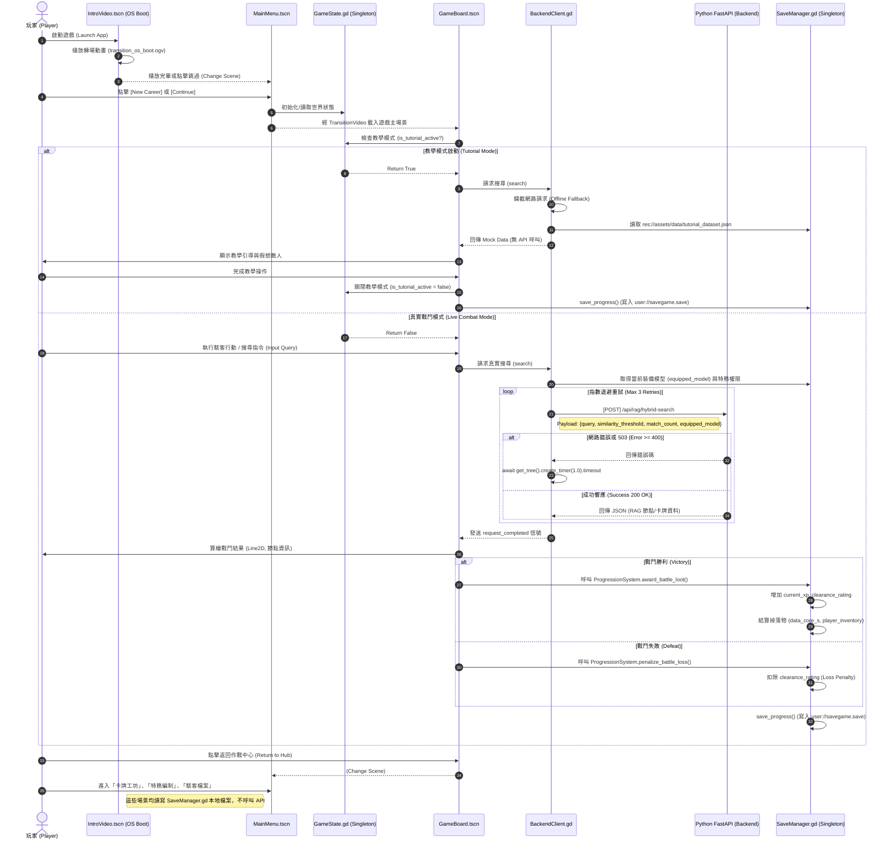

# Archon 玩家旅程完整 UML 流程圖

長官，這是一份從玩家真實遊玩視角出發的**端到端 (End-to-End) 閉環流程圖**。本圖表嚴格依照 codebase 現有實體邏輯（不幻想、不預設完美路徑）繪製，涵蓋從初始動畫啟動、教學模式判斷、戰鬥 API 呼叫，直到結算存檔的完整系統互動。

> [!NOTE]
> 本流程圖採用 Mermaid 語法繪製，展示了上帝視角下的系統元件與 API 調用時序。

## 核心遊戲閉環 (Core Gameplay Loop) 時序圖

---

## 系統架構與路徑盤點 (Architecture Audit)

### 1. 唯一對外連線 API (Single Point of Truth)
目前的 Archon 數位雙生前端架構採用 **Local-First** 策略，唯一的對外連線樞紐為 `BackendClient.gd`，核心 API 如下：
*   **端點名稱**: `[POST] /api/rag/hybrid-search`
*   **觸發時機**: `GameBoard.tscn` 中的真實戰鬥階段。
*   **防禦機制**: 
    1. 具備 3 次失敗重試機制 (Retry Loop)，防禦 503 錯誤。
    2. 若遊戲位於 Web 端運行，會自動偵測 `window.location.origin` 進行動態 URL 綁定。
    3. 具備教學模式實體斷點，教學期間絕對不會向後端發送 HTTP 請求。

### 2. 存檔與狀態管理 (Progression Persistence)
*   **機制**: 遊戲的進度存檔並**未**連接至遠端資料庫 (如 Supabase)，而是 100% 透過 `SaveManager.gd` 這個 Singleton 將字典資料寫入至本地沙盒 `user://savegame.save`。
*   **閉環驗證**: 無論是戰鬥勝利的 `award_battle_loot()` 或失敗的 `penalize_battle_loss()`，最終都會呼叫 `save_manager.save_progress()`，確保玩家經驗值、卡牌庫存 (Inventory)、特務編制 (Teammates) 在應用程式重啟後依然能從初始畫面 `MainMenu` 讀取並銜接，完成完美的閉環。
