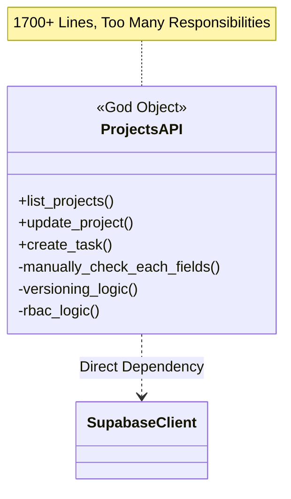
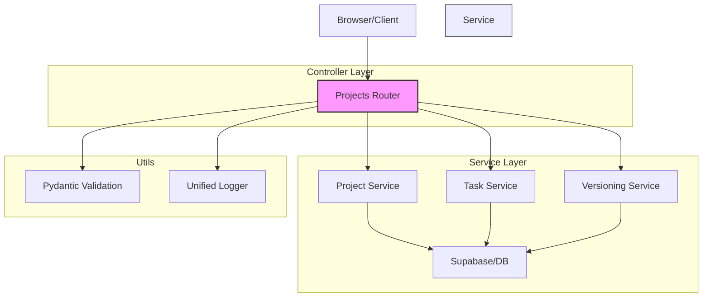

# 系統架構重構對比 (UML Comparison)

我們將目前的「胖控制器 (Fat Controller)」模式重構為「瘦控制器 + 服務層 (Lean Controller + Service Layer)」模式。

## 1. 原架構：上帝模式控制器 (God-mode Controller)
所有的邏輯（參數解析、權限檢查、版本紀錄、資料庫操作、錯誤處理）全部塞在一個檔案裡。

---

## 2. 新架構：層次分明 (Layered Service Pattern)
控制器只負責「翻譯」HTTP 請求，真正的商業邏輯封裝在專門的服務中。

### 關鍵效益對比 (Before vs After)

| 維度 | 舊架構 (Old) | 新架構 (New) | 效益 |
| :--- | :--- | :--- | :--- |
| **程式碼長度** | 1700+ 行 | 預計 700+ 行 | 易讀性提升，搜尋代碼變快 |
| **參數校驗** | 手動 `if-else` (100+行) | Pydantic `model_dump` (1行) | 減少人為疏失與重複代碼 |
| **商業邏輯** | 散落在各個 API 函式中 | 集中在 `Service` 類別中 | 邏輯可重複利用 (DRY) |
| **單元測試** | 極難測試 (需 Mock 整套 API) | 容易測試 (可單獨測試 Service) | 系統穩定度提升 |
| **職責分配** | 一個檔案做所有事 | 各司其職 | 符合 SOLID 原則之單一職責 |
