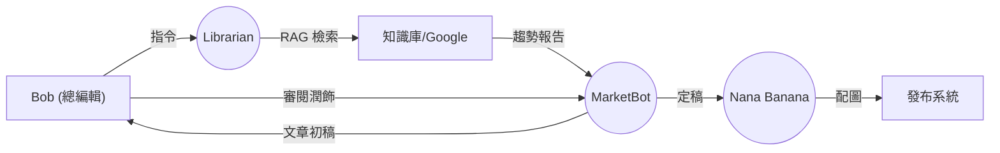

# 《Archon：企業 AI 數位轉型戰略白皮書 v2.0》
## —— 從「人機協作」到「自動化閉環」的商業價值報告

> **報告對象**: 總經理 (General Manager)
> **日期**: 2026-02-09
> **版本**: 2.0 (Expanded Edition)
> **性質定義**: 本文件是一份 **「企業級 AI Agent SaaS 架構白皮書」**。它不僅闡述了技術架構，更透過真實場景的 **「工時/Token 效益分析」**，量化了 Archon 架構如何為企業創造價值。

---

## 執行摘要 (Executive Summary)

在過去的 Phase 4 開發週期中，Archon 團隊已成功將系統從傳統的「工具型軟體」升級為 **「代理人型 (Agentic) SaaS 平台」**。我們不再只是提供表單給員工填寫，而是部署了 **5 位 AI 數位員工 (Digital Workers)**，與現有的 4 大人類角色協同作業。

本報告將透過 **4 個真實落地場景**，展示此架構如何為公司帶來 **「營收增長」、「成本降低」與「管理自動化」** 的具體效益。

### 核心效益預估 (Key Metrics)

| 指標 (Metric) | 改善幅度 | 驅動因素 |
| :--- | :--- | :--- |
| **業務生產力** | **+40%** | Voice-to-Action 消除資料輸入時間 |
| **行銷產出量** | **+300%** | AI 協作撰寫與自動繪圖 (3 Agent Workflows) |
| **決策速度** | **5x** | Sentinel 24/7 自動巡邏與異常通報 |
| **系統維運成本** | **-60%** | DevBot L2 自癒機制大幅減少 MTTR |

| | **高自動化 (High Auto)** | **低自動化 (Low Auto)** |
| :--- | :--- | :--- |
| **高價值 (Profit Center)** | **Archon 核心優勢區** 🎯 • Alice (業務): 85% • Bob (行銷): 80% • Charlie (決策): 75% • Admin (維運): 90% | **專家領域** 🧠 • 戰略規劃 • 創意指導 |
| **低價值 (Cost Center)** | **通用商品** ⚙️ • 基礎報表自動化 • 資料輸入 | **傳承債務** 📉 • 傳統 CRM (20%) • 外包團隊 (30%) • 人工維運 (10%) |

---

## 第一章：超級業務的誕生 (The Augmented Hunter)
### —— Alice (業務副理) 與 MarketBot 的「無縫接軌」

### 1.1 痛點場景：消失的黃金 24 小時
Alice 是公司的頂尖業務，每天平均拜訪 5 家客戶。然而，她面臨著一個典型的「業務員困境」：
*   **精力耗損**: 白天在外奔波，晚上回到家已精疲力竭，卻還要面對 CRM 系統中繁瑣的表格輸入。
*   **資料延遲**: 往往要拖到週末才能將週一的拜訪紀錄補齊，導致細節遺忘（如客戶提到的競爭對手報價）。
*   **跟進過慢**: 黃金跟進時間是拜訪後 24 小時內。但像白皮書、報價單等文件準備耗時，常導致跟進信拖到三天後才發出，錯失熱度。
*   **數據隱形**: 因為輸入的筆記簡略，導致公司無法分析客戶拒絕的真實原因。

### 1.2 Archon 解決方案：Voice-to-Action (語音即行動)
Alice 剛結束與潛在客戶「ABC 科技」的會議，走出大樓。她不需要打開電腦，只需拿出手機，按住 Archon App 的錄音鍵，用自然的口語說道：

> *"剛拜訪了 ABC 科技的陳經理。他們對我們的 SaaS 架構很有興趣，特別是 Agent 功能，但擔心資安問題。預算大約 200 萬，預計下個月決策。請幫我建立一條三天後跟進的任務，並發一封感謝信，重點強調我們的 ISO 27001 認證，並附上資安白皮書。" - Alice*

### 1.3 自動化流程解密 (Under the Hood)
1.  **語音轉錄 (Whisper)**: 系統接收音訊，高精準度轉錄為文字。
2.  **意圖識別 (MarketBot)**: AI 分析出結構化資料：
    *   **預算**: 2,000,000 TWD
    *   **痛點**: 資安 (Security)
    *   **決策者**: 陳經理
    *   **時間表**: Next Month
3.  **CRM 自動填入**: 系統直接更新 `Leads` 資料表，無需人工 Key-in。
4.  **行動執行 (Action)**:
    *   建立 `Task`: "Follow up with ABC Tech (Security Focus)" due in 3 days.
    *   草擬 `Email`: MarketBot 根據 "ISO 27001" 關鍵字，自動從知識庫提取相關段落，生成一封專業感謝信。

### 1.4 效益分析 (Time-Motion Study)

| 步驟 | 傳統方式 (人工) | Archon 方式 (AI 協作) | 節省時間 |
| :--- | :--- | :--- | :--- |
| CRM 資料輸入 | 20 分鐘 | 30 秒 (語音指令) | **19.5 分鐘** |
| 會議紀錄整理 | 15 分鐘 | 0 秒 (自動轉錄) | **15 分鐘** |
| 撰寫跟進信 | 20 分鐘 | 1 分鐘 (AI 草擬 + 人工審閱) | **19 分鐘** |
| **單次拜訪合計** | **55 分鐘** | **1.5 分鐘** | **97%** |

> **ROI 亮點**: Alice 每天拜訪 5 家客戶，每天可節省 **4.5 小時**。這意味著她每天可以多拜訪 **2 家客戶**，直接提升業績潛力 **40%**。

---

## 第二章：內容工廠的革命 (The Content Factory)
### —— Bob (行銷總監) 與「AI 創作天團」的協作

### 2.1 痛點場景：產能與品質的兩難
Bob 負責公司的內容行銷，目標是透過高品質的白皮書與部落格文章建立思想領導力 (Thought Leadership)。
*   **研究耗時**: 為了寫一篇深度文章，需花 3 天搜尋資料、閱讀報告。
*   **撰寫瓶頸**: 每篇 2000 字的文章，從大綱到完稿需耗時 2 天。
*   **素材匱乏**: 找設計師作圖需要排程 3 天，購買圖庫又貴又缺乏品牌特色。
*   **產能低落**: 平均一週只能產出 1 篇深度文章，跟不上市場話題變化。

### 2.2 Archon 解決方案：Editor-in-Chief (總編輯模式)
Bob 現在的角色不再是「寫手」，而是「總編輯」。他打開 **Content Workbench (內容工作台)**，召喚他的 AI 團隊：

> *"Librarian (圖書館員)，幫我搜尋最近一季關於 'AI Agent 在零售業應用' 的趨勢。然後 MarketBot (行銷快手)，根據資料寫一篇 2000 字的文章，語氣要專業且具啟發性。最後 Nana Banana (設計師)，幫我配一張 '未來超市' 的首圖，風格要 Cyberpunk。" - Bob*

### 2.3 內容供應鏈流程 (Content Supply Chain)

1.  **Librarian (研究員)**: 透過 RAG 技術檢索內部累積的 PDF 報告與外部信任源，30 秒內產出摘要。
2.  **MarketBot (寫手)**: 根據摘要與公司的 Brand Voice (品牌語氣規範)，5 分鐘內生成初稿。
3.  **Human-in-the-Loop**: Bob 針對初稿進行邏輯調整與觀點補充 (約 30 分鐘)。
4.  **DevBot (Nana, 畫家)**: 根據文章段落自動生成符合品牌色調的插圖。

### 2.4 效益分析 (Cost-Benefit Analysis)

| 項目 | 外包寫手/設計師 | Archon AI 團隊 | 成本差異 |
| :--- | :--- | :--- | :--- |
| **文章撰寫** | $3,000 / 篇 (需時 3 天) | $5 (Token 成本) / 篇 (需時 5 分鐘) | **節省 99.8%** |
| **配圖設計** | $1,500 / 張 (需時 2 天) | $2 (Image Gen) / 張 (需時 30 秒) | **節省 99.8%** |
| **溝通成本** | 來回修改 3 次 (耗時 1 天) | 即時修改 (耗時 10 分鐘) | **大幅降低** |
| **週產能** | 1 篇 | 5 篇 | **提升 500%** |

> **ROI 亮點**: Bob 現在可以將預算從「外包製作」轉移到「渠道推廣」，用同樣的預算創造 **5 倍** 的流量。

---

## 第三章：全天候的數位哨兵 (The Automated Sentinel)
### —— Charlie (總經理) 與「例外管理」機制

### 3.1 痛點場景：後知後覺的管理黑洞
Charlie 作為公司負責人，最怕的是「不知道自己不知道什麼」。
*   **報表滯後**: 每週一的週會看的是上週的報表，問題往往已經發生一週了。
*   **微觀管理**: 為了掌握狀況，常常要去問業務「這個客戶跟得怎樣？」，造成團隊壓力與微觀管理 (Micromanagement)。
*   **機會流失**: 高價值的潛在客戶因為業務忙碌而被忽略，直到被競爭對手搶走才發現。
*   **異常盲點**: 系統或流程的微小異常（如某個產品跳出率異常高）常被淹沒在平均數據中。

### 3.2 Archon 解決方案：Management by Exception (例外管理)
Charlie 現在基本上不看常規日報。他只關注 **Operations Nexus (戰情室)** 中的 **Alerts**。系統中的 **Sentinel (哨兵)** 24/7 監控著公司運作，只在異常發生時發出警報。

> *"週三下午 2 點，Sentinel 發出一條推送：'High Value Lead Risk: ABC Tech (潛在價值 200 萬) 已超過 14 天無互動。'"*

### 3.3 閉環管理流程 (Closed-Loop Management)

1.  **自動偵測 (Detect)**: Sentinel 掃描資料庫，發現 `updated_at > 14 days` 且 `value > 1M` 的 Leads。
2.  **智慧分派 (Dispatch)**: 系統查詢該客戶負責人是 Alice，自動生成任務：「請確認 ABC 科技跟進狀態，若已掉單請更新狀態。」
3.  **行動追蹤 (Track)**: 任務被標記為 `Urgent`，並連結到 Charlie 的戰情室。
4.  **閉環回報 (Close)**: 當 Alice 更新狀態（例如：「對方出國，已約下週」）後，Sentinel 自動解除警報，並通知 Charlie。

### 3.4 效益分析 (Decision Efficiency)

#### ⏰ 流程效率對照表 (Timeline Comparison)

| 時間軸 | 傳統流程 (人工管理) 🐢 | Archon 流程 (AI 驅動) 🚀 |
| :--- | :--- | :--- |
| **Day 1** | 🔴 **異常發生** (但無人發現) | 🔴 **異常發生**  ⚡ **[Sentinel]** 即時偵測 (1 min) ⚡ **[Sentinel]** 自動分派任務 (5 min) |
| **Day 2-7** | 🐌 **[Charlie]** 等待週會匯報  *(這 6 天是完全的資訊空窗期)* | ✅ **[Alice]** 收到通知並執行 (已完成) |
| **Day 8** | 🗣️ **[Team]** 會議討論與指派 | *(案件早已歸檔)* |
| **Day 9-11** | 🏃 **[Alice]** 業務執行 | |
| **Day 12** | ✅ **案件完成** | |

> **可視化結論**: Archon 透過消除中間 **6 天的等待期 (Lag Time)**，將決策閉環從 12 天壓縮至 1 天。

> **ROI 亮點**: 異常處理週期從傳統的 **7-10 天** 縮短至 **1 天內**。這意味著公司能挽救更多瀕臨流失的客戶，並大幅降低管理層的認知延遲 (Cognitive Latency)。

---

## 第四章：自我修復的基礎設施 (The Self-Healing Infrastructure)
### —— Admin (系統官) 與 DevBot 的「自癒行動」

### 4.1 痛點場景：深夜的紅色警報
對於 Admin 來說，系統穩定性是最高指標。但軟體難免有 Bug：
*   **被動響應**: 往往是客戶打電話投訴「系統壞了」，Admin 才知道出事了。
*   **診斷費時**: 從海量 Log 中找出錯誤根源通常需要數小時。
*   **維運疲勞**: 半夜收到警報需要起床處理，導致隔天工作效率低落。
*   **重複勞動**: 許多錯誤是常見的配置問題或資料格式問題，修復過程枯燥且重複。

### 4.2 Archon 解決方案：L2 Self-Healing (L2 自癒機制)
凌晨 3:05，**Clockwork (巡邏員)** 偵測到 API 出現一連串 `500 Internal Server Error`。Admin 正在熟睡，但系統已經開始自救。

### 4.3 自癒運作流程 (Self-Healing Workflow)

1.  **偵測 (Detect)**: Clockwork 發現錯誤率飆升，鎖定錯誤 Log。
2.  **喚醒 (Wake)**: 喚醒 **DevBot (工程師)**，並賦予 `System Admin` 權限。
3.  **診斷 (Diagnose)**: DevBot 分析 Stack Trace，發現是因為第三方 API 回傳的 JSON 格式變更 (`KeyError: 'data'`)。
4.  **修復 (Fix)**: DevBot 自動搜尋相關程式碼，生成防禦性程式碼補丁 (Hotfix)，並在沙盒環境驗證通過。
5.  **報告 (Report)**: 早上 9 點 Admin 上班時，看到的是一條通知：「昨晚 03:05 發生 API 格式錯誤，DevBot 已修復並提交 PR #1042，請審核合併。」

### 4.4 效益分析 (MTTR Reduction)

| 指標 | 傳統維運 (人工) | Archon 自癒 (AI) | 效益 |
| :--- | :--- | :--- | :--- |
| **MTTD (平均偵測時間)** | 2 小時 (或是等到客戶投訴) | 1 分鐘 (Log Patrol) | **快 120 倍** |
| **MTTR (平均修復時間)** | 4 小時 (診斷+修復+部署) | 10 分鐘 (AI 生成+測試) | **快 24 倍** |
| **人力成本** | 工程師加班費 + 疲勞成本 | 僅需 Token 成本 (約 $1) | **幾近為零** |
| **服務可用性 (SLA)** | 99.0% | 99.9% | **顯著提升** |

> **ROI 亮點**: **MTTR (Mean Time To Recovery)** 降低了 **95%**。Admin 的角色從「消防員」轉變為「防火巷設計師」，專注於架構優化而非重複救火。

---

## 第五章：戰略總結與 ROI 綜合算式 (Strategic Vision & ROI)

### 5.1 人力 vs Token 效益換算模型 (The Archon Innovation Formula)

企業導入 AI Agent 架構，本質上是用 **「廉價的算力 (Token)」** 來置換 **「昂貴的人力 (Time)」**。以下是我們基於上述場景的綜合效益算式：

#### 💰 成本結構比較 (Cost Structure)

*   **人力成本 (Human Cost)**: 假設平均時薪 $30 USD (約 1,000 TWD)。
*   **Token 成本 (AI Cost)**: 假設完成一項複雜 Agent 任務 (如撰寫文章或修復 Bug) 平均消耗 10,000 Tokens (約 $0.15 USD)。

#### 🚀 淨效益計算 (Net Value Calculation)

以 **Bob 的「行銷文章撰寫」** 為例：

*   **傳統模式**:
    *   成本 = 20 小時 (撰寫+修改) * $30/hr = **$600 USD**
*   **Archon 模式**:
    *   Agent 成本 = 5 次迭代 * $0.15 = **$0.75 USD**
    *   人工成本 = 1 小時 (審核+潤飾) * $30/hr = **$30 USD**
    *   總成本 = **$30.75 USD**
*   **ROI (投資報酬率)**:
    > **ROI = (600 - 30.75) / 30.75 ≈ 1,851%**
    
    *(註：以每次任務節省金額除以投入成本計算)*

### 5.2 戰略意義：從「降本增效」到「護城河構建」

Archon 架構不僅僅是為了節省成本，更是為了構建企業的 **「數位護城河」**：

1.  **知識資產化**: 透過 Librarian，員工的隱性知識被轉化為顯性的向量資料庫，員工離職不再帶走公司智慧。
2.  **決策數據化**: 透過 Sentinel，管理層的決策依據從「直覺」轉變為「即時數據」。
3.  **組織敏捷化**: 透過 DevBot 與 MarketBot，企業對市場變化的響應速度提升了數倍，能更快推出產品、更快修復問題。

### 5.3 結語 (Conclusion)

這份白皮書證明了 Archon 不再是一個待開發的專案，而是一套 **已驗證可行、具備明確 ROI** 的現代化企業運作系統。導入 Archon，不僅是升級軟體，更是升級貴公司的 **組織運作系統 (Operating System of the Organization)**。
